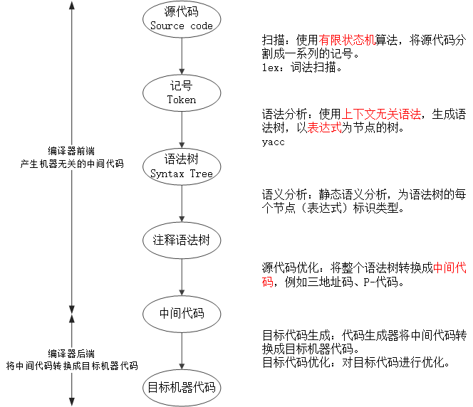
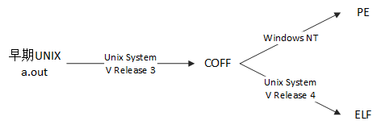
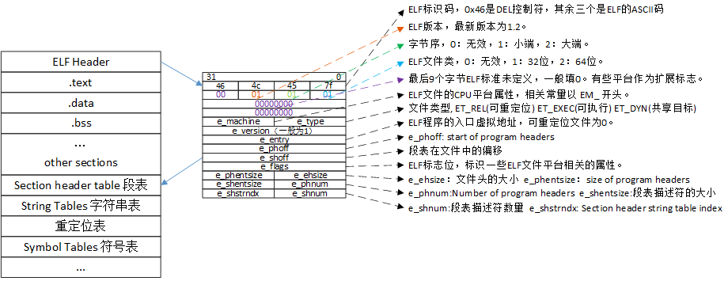
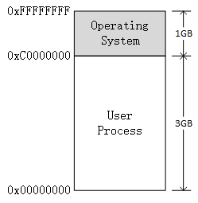

<h1 id=file_notes>
    程序员的自我修养——链接、装载与库
</h1>

<h2 id=ch_01>
    温故而知新
</h2>

* 站在程序员的角度看计算机：中央处理器CPU、内存和IO控制芯片。
* 计算机科学领域的任何问题都可以通过增加一个间接的中间层来解决。
* 操作系统：充分利用CPU。裸机、多道程序、分时系统、多任务系统。
* 虚拟内存与MMU：段页式内存管理方法。
* 多进程与多线程：创建、调度与同步（进程/线程安全）。

<h2 id=ch_02>
    编译和链接
</h2>

从源代码文件到可执行文件需要四步，本书重点介绍编译和链接两个部分。
* 预处理 Prepressing
* `编译 Compilation`
* 汇编 Assembly
* `链接 Linking`


<h3 id=compilation>编译</h3>

将高级语言翻译成机器语言。经编译产生的目标代码，其外部`符号`的地址还未确定，需要链接器`重定位`后，才能够执行。
* 扫描 Scanner
* 语法分析 Parser
* 语义分析 Semantic Analyzer
* 源代码优化 Source Code Optimizer
* 目标代码生成 Code Generator
* 目标代码优化 Final Target COde



<h3 id=linking>链接</h3>

* 符号 Symbol：在链接中，统一将函数和变量统称为符号。函数名或变量名就是`符号名`。
* 重定位 Relocation：重新计算各个符号的地址的过程。每个要被修正的地方叫一个`重定位入口`。

链接的主要过程：
* 地址和空间分配，Address and Storage Allocation
* 符号决议，Symbol Resolution
* 重定位，Relocation

静态链接的方法：
* 函数调用：调用目标函数指令的目标地址暂时搁置，待链接器确定目标函数的地址，并修改所有调用目标函数的指令。
* 变量引用：将变量的地址设置为0，待链接器确定变量的地址，并修改所有引用变量的指令。


<h2 id=ch_03>目标文件有什么</h2>

目标文件：源代码经编译后但未进行链接的中间文件
* Windows:  .o
* Linux: .obj

<h3 id=ch_3.1>目标文件(可执行文件)的格式</h3>

可执行文件、静态库(.a/.lib)、动态库(.so/.dll)以及目标文件(.o/.obj)都按照可执行文件的格式来存储。

可执行文件格式一览表：

<table>
    <tr><th>平台</th><th>格式</th><th>缩写</th></tr>
    <tr>
        <td>Windows</td>
        <td>Portable Executable</td>
        <td>PE</td>
    </tr>
    <tr>
        <td>Linux</td>
        <td>Executable Linkable Format</td>
        <td>ELF</td>
    </tr>
    <tr>
        <td>Intel/Microsoft</td>
        <td>Object Module Format</td>
        <td>OMF</td>
    </tr>
    <tr>
        <td>Unix System V Release 3</td>
        <td>Common file format</td>
        <td>COFF</td>
    </tr>
    <tr>
        <td>Unix</td>
        <td>a.out</td>
        <td></td>
    </tr>
    <tr>
        <td>MS-DOS</td>
        <td>.COM</td>
        <td></td>
    </tr>
</table>

ELF文件类型：
* 可重定位文件，`relocatable` file，例如 .o 文件。
* 可执行文件，`executable` file。
* 共享目标文件，`shared object` file，例如 .so 文件。
* 核心转储文件，core dump file。

可执行文件格式的发展：



<h3 id=ch_3.2>目标文件是什么样的</h3>

目标文件由文件头和若干个段（section）组成，不同的段存储着不同的内容。

<table>
    <tr><th>存储位置</th><th>说明</th></tr>
    <tr>
        <td>文件头</td>
        <td>描述了整个文件的文件属性。</td>
    </tr>
    <tr>
        <td>.text</td>
        <td>代码段，存放代码编译后生成的机器指令。</td>
    </tr>
    <tr>
        <td>.data</td>
        <td>数据段，初始化的全局变量和局部静态变量。</td>
    </tr>
    <tr>
        <td>.bss</td>
        <td>block start by symbol，为未初始化的全局变量和局部静态变量预留位置，不占存储空间。</td>
    </tr>
    <tr>
        <td>段表</td>
        <td>描述文件中各个段的数组，包含段在文件中的偏移地址及段的属性。</td>
    </tr>
</table>

分段（指令和数据分开存储）的优点：
* 便于权限控制，防止指令（只读）被无意或有意修改。
* 提高程序的局部性，提升CPU的缓存命中率。
* 指令等只读数据可共享，节省存储空间。

<h3 id=ch_3.3>挖掘SimpleSection.o</h3>

以示例代码[SimpleSection.c](code/SimpleSection.c)编译出来的目标文件作为分析对象，深入挖掘目标文件的每一个字节。

<h4>编译</h4>

```shell
# 这将会得到SimpleSection.o
gcc -c SimpleSection.c
```

<h4>查看目标文件各个段的基本信息</h4>

```shell
objdump -h SimpleSection.o
# 查看ELF文件的代码段、数据段和BSS段的长度
size SimpleSection.o
```

输出的信息包括：
1. 段名
2. 大小
3. VMA：虚拟地址
4. LMA：加载地址
5. 偏移：段在文件中的位置
6. 对齐：2**2 表示4字节对齐（2^2）
7. 段属性
   1. CONTENTS：该段在文件中存在，BSS段无此属性。
   2. ALLOC：
   3. LOAD：
   4. RELOC：
   5. READONLY：
   6. CODE：指令
   7. DATA：数据

<h4>查看目标文件各个段的数据</h4>

```shell
objdump -s SimpleSection.o
# -d 选项可以将包含指令的段反汇编。
```

代码中`初始化的局部静态变量`static_var和`初始化的全局变量`global_init_var存放在`.data`段中。`未初始化的局部静态变量`static_var2和`未初始化的全局变量`global_uninit_var存放在`.bss`段中。

如果显式的给变量赋值为0，有可能会被优化到`.bss`段中。

备注：
1. 在输出的内容中，最左面一列是偏移量，中间四列是十六进程内容，最右面一列是ASCII码。
2. 字节序

<h4>将二进制文件作为目标文件的一个段</h4>

```shell
objcopy -I binary -O elf32-i386 -B i386 image.jpg image.o
```

[objcopy使用说明](bin.md#objcopy)。

<h4>自定义段</h4>

使用gcc的扩展机制，可将指定的代码或数据放到指定的段中。

```c
// 将变量放入到FOO段
__attribute__((section("FOO"))) int global = 42;
// 将函数放入到BAR段
__attribute__((section("BAR"))) void foo() {

}
```

<h3 id=ch_3.4>ELF文件结构描述</h3>

下图是ELF文件的总体结构。ELF文件主要由以下部分组成：
* [文件头](#elf_header)
* [段表](#elf_section_header_table)
* [重定位表](#elf_relocation_table)
* [字符串表](#elf_string_table)
* [符号表](#elf_symbol_table)



<h4 id=elf_header>文件头</h4>

文件头是最重要的结构之一，上图有指明文件头各个成员的意义。文件头主要包含以下信息：
* ELF魔数
* 数据存储方式：大端 or 小端
* 版本
* ELF重定位类型
  * ET_REL 可重定位文件（.o）
  * ET_EXEC 可执行文件
  * ET_DYN 共享目标文件（.so）
* 入口地址
* *`段表的位置和长度`*
* [e_shstrndx](#Elf32_Ehr-e_shstrndx) 段表字符串表在段表中的下标
* 段的数量
* ...

<h4 id=elf_section_header_table>段表</h4>

段表是除文件头外最重要的结构。段表描述了其余各个段的信息，也就是段表确定了ELF文件的结构。

查看指令：
* [readelf -S](bin.md#readelf-S) 
* [objdump -h](bin.md#objdump-h)

段表包含的主要信息：
* sh_name 段名在[字符串表](#elf_string_table)中的偏移
* sh_type 段的类型
  * SHT_NULL 无效段
  * SHT_PROGBITS 程序段，例如代码段和数据段
  * SHT_SYMTAB 符号表
  * SHT_STRTAB 字符串表
  * SHT_RELA 重定位表，包含重定位信息。
  * SHT_HASH 哈希表
  * SHT_DYNAMIC 动态链接信息
  * SHT_NOBITS 此段无内容，例如 .bss
  * SHT_REL 该段包含重定位信息
  * SHT_SHLIB 保留
  * SHT_DNYSYM 动态链接的符号表
* sh_flags 段的标志位（可同时有多个标志）
  * SHF_WRITE 该段在进程中可写
  * SHF_ALLOC 该段在进程空间中要分配空间
  * SHF_EXECINSTR 该段在进程空间中可被执行
* sh_addr 段虚拟地址
* sh_offset 如果段存在，则表示在文件中的偏移。
* sh_size 段的长度
* sh_link sh_info 段的链接信息
* sh_addralign 段地址对齐，2的指数倍。
* sh_entsize （固定大小）项的长度

<h4 id=elf_relocation_table>重定位表</h4>

段类型为 SHT_REL 的段称为`重定位表`，包含了重定位信息。每个需要重定位的代码段或数据段，都有一个对应的重定位表。例如 .data 段的重定位表是 .rel.data。

sh_link表示符号表的下标。sh_info表示作用于哪一个段，例如.rel.text作用于.text段，而.text在段表的下标（索引）是1，则sh_info=1。

<h4 id=elf_string_table>字符串表</h4>

字符串的保存方式：将所有的字符串收集起来并存放在一个段中，使用字符串在表中的偏移来引用字符串。

常见的段名：
* .strtab，字符串表，保存普通的字符串，比如符号的名字。
* .shstrtab，段表字符串表，保存段表中用到的字符串，例如段名。

<p id=Elf32_Ehr-e_shstrndx></p> 

e_shstrndx 是`Section header string table index`的缩写，表示`段表字符串表`在段表中的下标。

不难得出，只要分析了[ELF文件头](#elf_header)，就可以得到段表和段表字符串表的位置，从而解析整个ELF文件。

<p id=elf_symbol_table></p>

<h3 id=ch_3.5>链接的接口——符号</h3>

有关符号的一些基本概念：
* 符号：函数或变量。
* 符号名：函数名或变量名。
* 符号值：函数地址，或变量的取值。
* 符号表：记录了目标文件中所`用到`的所有符号。

符号的类型：
1. 定义在本目标文件的全局符号，可以被其他目标文件引用。
2. 在本目标文件中引用的全局符号，但没有定义在本目标文件。
3. 段名
4. 局部符号，只在编译单元内部可见。对链接没有作用。
5. 行号信息，即目标文件指令与源代码中代码行的对应关系。

主要内容：
* [ELF符号表结构](#elf_symbol_table)
* [特殊符号](#special_symbol)
* [名称修饰和函数签名](#name_decoration_and_function_signature)
* [extern "C"](#extern_c)
* [弱符号和强符号](#weak_and_strong_symbol)

<h4 id=elf_symbol_table>ELF符号表结构</h4>

查看符号表的指令：
* nm object_file
* readelf -s object_file
* objdump -t object_file

ELF文件中的符号表往往是一个段，段名一般叫`.symtab`。符号表是一个`Elf32_sym`结构数组，下表为0的元素为无效的未定义符号。

Elf32_sym成员：
* st_name：符号名，字符串表的下标。
* st_size：符号大小。
* st_shndx：符号所在的段。
  * 符号所在的段在段表中的下标。
  * SHN_ABS：该符号包含了一个绝对的值，例如文件名的符号。
  * SHN_COMMON：该符号是一个“COMMON块”类型的符号，例如未初始化的全局符号定义。
  * SHN_UNDEF：符号未定义，该符号在本文件中被引用，但是定义在其他文件。
* st_info：符号类型和绑定信息
  * 高28位表示符号绑定信息（Symbol Binding）
    * STB_LOCAL：局部符号，对目标文件的外部不可见。
    * STB_GLOBAL：全局符号，外部可见。
    * STB_WEAK：若引用。
  * 低4位表示符号的类型（Symbol Type）
    * STT_NOTYPE：未知类型符号
    * STT_OBJECT：该符号是一个数据对象，比如变量、数组。
    * STT_FUNC：该符号是函数或其他可执行代码。
    * STT_SECTION：该符号是一个段，一定是STB_LOCAL。
    * STT_FILE：目标文件对应的源文件名，一定是STB_LOCAL，st_shndx一定是SHN_ABS。
* st_value：符号值
  * 目标文件
    * SHN_ABS / SHN_UNDEF：st_value没有用。
    * SHN_COMMON：表示该符号的对齐属性。
    * 段的下标：st_value表示该符号在段中的偏移位置。
  * 可执行文件
    * st_value表示符号的虚拟地址。

<h4 id=special_symbol>特殊符号</h4>

链接器在链接脚本会定义一些符号，可以在程序中声明并使用，这些符号称之为`特殊符号`。注意，链接之后，这些符号才会存在。

常见的特殊符号：
* __executable_state：程序的起始地址（程序最开始的地址）。
* __etext或_etext或etext：代码段的结束地址。
* _edata或edata：数据段的结束地址。
* _end或end：程序结束地址。

<h4 id=name_decoration_and_function_signature>
    名称修饰和函数签名
</h4>

* 名称修饰：源代码中的函数名和变量名，转换成目标文件中对应的符号名的过程，称为名称修饰。
* 函数签名：包含了一个函数的所有信息，包括函数名、参数类型、所在的类和名称空间，以及其他信息。用于识别不同的函数。

名称修饰用于解决目标文件之间符号冲突的问题。早期的汇编库，符号名与对应的函数名或变量名是一样的，为了避免C程序与库冲突，C程序在编译后，全局变量和函数名对应的符号，会在最前方添加一个下划线，作为符号名。

后来由于环境发生变化，冲突不是那么明显，LInux下的gcc编译器，默认情况下去掉了符号名前加下划线，但Windows下的编译器依然保持这种传统。

gcc也可以通过选项来打开或关闭。
* -fleading-underscore
* -fno-leading-underscore

C++ 有类、继承、虚拟机制、重载、名称空间，他们使得名称修饰更加的复杂。binutils提供了一个`c++filt`的工具可以用来解析被修饰过的名称。

Visual C++的名称修饰规则没有对外公开。Microsoft提供了一个UnDecorateSymbolName()的API，可以将修饰后名称转换成函数签名。

<h4 id=extern_c>extern "C"</h4>

C++用来声明或定义一个C的符号的关键字：`extern "C"`。这会使C++的名称修饰机制失效。

用法：
```c
extern "C" {
    int func(int);
    int var;
}
```
或者：
```c
extern "C" int func(int);
extern "C" int var;
```

如果C++使用C语言的头文件，则需要使用`extern "C"`关键字(否则经C++名称修饰后，无法与C库链接)，但是C语言又不支持。可以使用C++的宏`__cplusplus`。

```c
#ifdef __cplusplus
extern "C" {
#endif
/* code */
#ifdef __cplusplus
}
#endif
```

<h4 id=weak_and_strong_symbol>弱符号和强符号</h4>

`弱符号`和`强符号`是针对定义来说，默认情况下，函数和初始化的全局变量为强符号，未初始化的全局变量为弱符号。可通过gcc的`__ttribute__((weak))`来定义一个强符号为弱符号。

规则：
1. 不允许强符号被多次定义，否则链接报错。
2. 若符号同时存在强符号和弱符号，则选择弱符号。
3. 如果都是弱符号，则选择占用空间最大的。

强引用和弱引用：
* 强引用：链接时，没有找到符号的定义，则报未定义错误。
* 弱引用：链接时，没有找到符号的定义，则不会报错，链接器默认其为0，或一个特殊值。

可以使用`__attribute__((weakref))`来声明一个引用为弱引用。

应用场景：
* 库中定义的`弱符号`可以被用户定义的`强符号`所覆盖，从而使得程序可以使用自定义版本的库函数。
* 对某些模块的引用定义为`弱引用`。与模块一起链接的时候，模块可以正常使用。去掉模块之后，也可以正常链接，只是没有对应的功能。

<h3 id=ch_3.6>调试信息</h3>

目标文件还可以保存调试信息，gcc编译时加上`-g`选项即可。ELF文件采用一个叫`DWARF(Debug With Arbitrary Record Format)`的标准的调试信息格式。

调试信息占用很大的空间，可以使用 strip 命令去掉ELF文件中的调试信息。

<h2 id=ch_04>静态链接</h2>

链接的核心内容：静态链接，如何将多个目标文件链接起来，组成一个可执行文件。

<h3 id=space_and_address_allocate>空间与地址分配</h3>

链接器将多个目标文件的段合并到输出文件的方法，即链接器为目标文件分配地址和空间的方法：
* 按序叠加：将输入的目标文件按照次序叠加起来
  * 简单，但是会照成很多零散的段，照成空间的浪费。
* 相似段合并：将相同性质的段合并到一起。
  * 主要采取这种方法

空间和地址的含义：
1. 输出的可执行文件的空间
2. 转载后虚拟地址中的虚拟地址空间

现代的链接器主要采用一种两步链接的方法：
1. 空间与地址分配：获取所有输入目标文件的段信息，并合并输出，计算输出文件中各个段的位置和长度。
2. 符号解析与重定位：使用第1步收集的信息，读取输入文件中段的数据、重定位信息，并进行符号解析和重定位、调整代码中的地址。

链接之后，可执行文件使用程序在进程中的虚拟地址（VMA），各个段的起始地址已经确定。在链接之前，由于空间还没有被分配，所以VMA都是0。在Linux下，ELF可执行文件默认从地址0x08048000开始分配。

符号地址的确定：段的基地址确定之后，根据符号在段中的偏移，即可确定符号的地址。

<h3 id=symbol_resolution_and_relocation>符合解析和重定位</h3>

地址和空间分配完成之后，就进入了符号解析和重定位。
* 符号解析：定义在外部的符号，通过符号解析来找到符号的定义。
* 重定位：对于定义在外部的符号，编译器会用一个临时值来代替符号值，待符号解析之后，再用真实值代替。

<h4 id=relocation_table>重定位表</h4>

ELF使用重定位表来保存重定位相关的信息，对于每一个需要重定位的段，都有一个相对应的重定位表。例如.text需要重定位，则对应.ref.text；.data需要重定位，则对应.rel.data。可以使用指令[objdump -r](bin.md#objdump-r)查看目标文件的重定位表。

对于Intel x86系列处理器来说，重定位表是Elf32_Rel结构的数组，每个数组元素对应一个重定位入口(每个要被重定位的地方叫一个重定位入口)。

```c
typedef struct {
    Elf32_Addr r_offset;
    Elf32_Word r_info;
};
```

r_offset：重定位入口的偏移
* 可重定位文件：要修正的位置的第一个字节相对于段起始的偏移。
* 可执行文件或共享对象文件：要修正的位置的第一次字节的虚拟地址。
r_info：重定位入口的类型和符号
* 低8位：重定位入口的类型
* 高24位：重定位入口的符号在符号表的下标。


<h4 id=symbol_resolution>符号解析</h4>

每个重定位入口都是对一个符号的引用，当链接需要对某一个符号进行重定位时，就需要确定这个符号的目标地址。这时候链接器就会去查找所有输入目标文件的符号表组成的全局符号表，找到相应的符号后进行重定位。

<h4 id=instruction_modification>指令修正方式</h4>

* 绝对寻址修正：
* 先对寻址修正：

<h4 id=common_block>COMMON块</h4>

为了支持弱符号机制，现代的编译器和链接器引入了COMMON块的机制，当不同的目标文件中相同的符号所需要的COMMON块空间大小不一致时，以最大的那块为准。

COMMON块仅仅是针对弱符号而言，如果有一个符号是强符号，则最终占用的空间与强符合相同。

出现COMMON块机制的根本原因是链接器不支持符号类型，即链接器无法判断各个符号的类型是否一致。

未初始化的局部静态变量在BSS段分配空间，编译器为什么不将未初始化的全局变量在BSS段分配空间？
* 未初始化的全局变量默认是弱符号，编译器在编译时无法确定其大小。链接完成之后，最终在输出文件的BSS段为其分配空间。

可以使用gcc的`-fno-common`选项，把未初始化的全局变量不以COMMON块的形式处理，也可以使用`__attribute__((nocommon))`扩展，这相当于定义了一个强符号。
```c
int global __attribute__((nocommon));
```

<h3 id=c++_related_issues>C++相关问题</h3>

由于C++支持的各种语言特性，使得它背后的数据结构异常复杂。主要有三个问题需要考虑：
* C++重复代码消除
* 全局构造和析构
* C++程序的二进制兼容性

<h4>重复代码消除</h4>

C++会在很多时候产生重复代码，例如模板、外部内联函数和虚函数表。以模板举例，不同的编译单元同时实例化成相同类型的时候，必然会产生重复代码。最简单的方法是全部保留，但是会有以下缺点：
* 空间浪费
* 地址较易出错，例如指向同一个函数的指针不相等。
* 运行效率降低，重复代码会降低指令的局部性。

解决方法：每个实例化对象都放在同一个段中，并且段名包含类型信息。当有相同类型的实例化对象时，会产生相同名字的段，则链接器可以识别出来并合并。

由于不同的编译单元可能选择了不同的编译器版本或编译选项，照成段名相同但是内容不同。这时链接器会选择其中一个并给出警告信息。

函数级别链接：当目标文件非常大时，将整个目标文件链接进来，有相当一部分的函数没有使用到，这会照成空间的浪费。借鉴上面的思路，将每个函数放在一个单独的段中，只链接需要的函数。开启的选项：
* -ffunction-sections 将每个函数保持到独立的段中
* -fdata-sections 将每个变量保持到独立的段中

优点：
* 减小输出文件的长度
* 减少空间浪费

缺点：
* 减慢编译和链接的过程
* 重定位过程因段数目增加而变得非常复杂
* 目标文件会增大

<h4>全局构造与析构</h4>

C++的全局对象的构造函数在main函数之前被执行，析构函数在min函数之后被执行。为了实现类似的特性，ELF定义了两个特殊的段：
* .init 包含了进程的初始化代码，在main函数被调用之前，glibc的初始化部分安排执行这个段中的代码。
* .finit 包含了进程的终止代码，当main函数正常退出时，glibc会安排执行这个段中的代码。

<h4>C++与ABI</h4>

ABI, Application Binary Interface，把符号修饰标准、变量内存布局、函数调用方式等这些与与可执行代码二进制兼容性相关的内容称为ABI。

API与ABI：
* API：往往指源代码级别的接口，更关注与函数签名。
* ABI：指二进制层面的接口，ABI的兼容程度比API更为严格。

影响ABI的因素：
* 硬件
* 编程语言
* 编译器
* 链接器
* 操作系统
* etc...

由于C++的一些复杂特性，导致其ABI兼容性不好，或者说，相比C语言，兼容起来更加复杂。不仅不同编译器编译的二进制代码不兼容，有时候同一个编译器的不同版本编译出来的代码也不兼容。

ABI兼容的意义：
* 库厂商可能只会提供二进制给客户。
* 系统中的某些库可能已经停止维护。
* 系统中已经存在的静态库或动态库被多个应用程序使用。
* 一个程序由多个公司或多个部门一起开发

目前的C++二进制兼容标准：
* 微软的VISUAL C++
* GNU阵营的GCC（Intel Itanium C++ ABI标准）

<h3 id=static_library_link>静态库链接</h3>

为了方便程序使用操作系统提供的API，语言库通常会将操作系统的API进行封装，并以库的方式提供给开发者。库分为静态库和动态库两种类型。

静态库：可以简单的看成一组目标文件的集合，即很多目标文件经过压缩打包后形成的一个文件，这可以方便文件的传输、管理和组织。

查看静态库包含的目标文件：[ar -t](bin.md#ar-t)

解压静态库：[ar -x](bin.md#ar-x)

查询函数所在的目标文件：[objdump -t](bin.md#objdump-t)加上文本查找工具grep。

与静态库链接的过程：ld会自动寻找所有需要的符号及它们所在的目标文件，将这些目标文件从静态库中解压出来，最终链接在一起成为一个可执行文件。

有两点要注意：
1. 可能需要不止一个静态库。
2. 目标文件之间也有可能存在依赖。

一般来说，静态库里面一个目标文件只包含一个函数，这是为了避免将很多没用的函数一起链接进输出文件，避免浪费空间。

<h3 id=ch_4.6>链接过程控制</h3>

一般情况下，使用默认的链接规则对目标文件进行链接。但是对于一些有特殊要求的程序，因为一些特殊的限制，需要指定输出文件各个段的虚拟地址、段的名称、段存放顺序等。

链接器控制链接过程的方法：
* 使用命令行给链接器指定参数，例如ld的-o、-e选项。
* 将链接指令存放在目标文件中，编译器经常会使用这种方法。
* 使用链接控制脚本。这是最灵活，最为强大的链接控制方法。
  * 查看默认的链接脚本：ld -verbos
  * 指定链接脚本：ld -T 或者 gcc 后添加脚本文件名，会自动识别。

链接脚本的作用：
* 控制输入段如何变成输出段
  * 那些输入段要合并到一个输出段
  * 那些输出段要丢弃
* 指定输出段的名字、转载地址、属性等

<h4>ld链接脚本语法简介</h4>

* 链接脚本由一系列语句组成，语句分为`命令语句`和`赋值语句`。
* 语句之间必须使用分号作为分隔符，`命令语句`可以使用换行作为分隔符。
* 可以使用C语言类似的表达式和运算符操作符，例如+、-、*、/、+=、-=、*=等，&、|、>>、<<等位操作符。
* 使用 `/* */`作为注释。
* 脚本中使用到的文件名、格式名或段名等，如果包含分隔符（例如分号），必须使用双引号将该名字全称引用起来。如果名字包含引号，无法处理。

赋值语句：`name = value;`
* `.` 表示当前虚拟地址

命令语句：由一个关键字和紧随其后的参数组成。
* 其中SECTIONS命令语句最复杂，还包含了一些赋值语句和SECTIONS语句所特有的映射规则，这是链接脚本的核心部分。

<table>
  <tr><th>命令语句</th><th>说明</th></tr>
  <tr>
    <td>ENTRY( symbol )</td>
    <td>指定符号 symbol 的值为入口地址。</td>
  </tr>
  <tr>
    <td>STARTUP( filename )</td>
    <td>将文件 filename 作为链接过程中的第一个输入文件。</td>
  </tr>
  <tr>
    <td>SEARCH_DIR( path )</td>
    <td>将路径 path 加入到ld链接器的库查找目录，与"-Lpath"有相同的作用。</td>
  </tr>
  <tr>
    <td>INPUT( file, file, ...)<br>INPUT( file file ... )</td>
    <td>将指定文件作为链接过程中的输入文件。</td>
  </tr>
  <tr>
    <td>INCLUE filename</td>
    <td>将指定文件包含进本链接脚本，类似于#include预处理。</td>
  </tr>
  <tr>
    <td>PROVIDE( symbol )</td>
    <td>在链接脚本中定义某个符号，该符号可以在程序中被引用。</td>
  </tr>
</table>

SECTIONS命令的基本格式：

```
SECTIONS
{
  ...
  secname : { contents }
}
```

* secname：输出段的段名，secname后必须有一个空格。后面紧跟冒号和一对大括号。
  * 段名必须符合输出文件的格式要求。
  * 如果使用`/DISCARD/`作为输出段名，那么符合条件的段将被丢弃。
* contents：描述了一套规则和条件，符合这种条件的输入段将合并到输出段中。

条件的写法：`filename(sections)`
```
file1.o(.data)  输入文件中名为file1.o的文件中叫.data的段符合条件
file1.o(.data .rodata) 输入文件中名为file1.o的文件中叫.data或.rodata的段符合条件
file.o  省略后面的小括号和段名，表示file1.o的所有段都符合条件。
*(.data) 输入文件中名字为.data的段符合条件。还可以使用?、[]等规则。
[a-z]*(.text*[A-Z]) 输入文件以小写字母开头，切段名以.text开头，以大写字母结尾。
```

<h3 id=ch_4.7>BFD库</h3>

BFD库，Binary File Descriptor library，是binutils项目的子项目，目标是希望通过一种统一的接口来处理不同的目标文件格式。

实现的大致原理：BFD把目标文件抽象成一个统一的模型，使得BFD库的程序只要通过操作这个抽象的目标文件模型就可以实现操作所有BFD支持的目标文件格式。即通过BFD库来操作目标文件，而不是直接操作目标文件。

<h2 id=ch5>Windows PE/COFF</h2>

*待填坑*

<h2 id=ch6>可执行文件的转载与进程</h2>

<h3 id=process_virtual_address_space>进程虚拟地址空间</h3>

程序和进程的区别：
* 程序（可执行文件）：静态的概念，一个文件，包含指令和数据。
* 进程：动态的概念，程序运行的一个过程。

进程虚拟地址空间的大小由CPU的位数决定
* 32位：0x00000000 ~ 0xFFFFFFFF 总共4GB
* 64位：0x0000000000000000 ~ 0xFFFFFFFFFFFFFFFF 总共 17179869184GB

以32位平台为例，在Linux系统下，最高的1GB被OS占用，进程只能使用低3GB的虚拟空间。Windows默认预留给操作系统的是2GB，不过可以修改启动配置文件Boot.ini，加上`/3G`参数，就可以和Linux的分布一样。

进程只能使用操作系统分配的地址空间，如果访问了未经允许的地址空间，会被操作系统强制杀死，并报错“Secmentation fault”（Windows：进程因非法操作需要关闭）。



在32位CPU下，可以通过PAE（Physical Address Extension）来访问大于4GB的物理内存空间（注意：不是虚拟地址空间）。自从Intel将地址总线扩展为36位之后，修改了页映射方式，新的映射方法可以访问到更多的物理内存。

一种常见的实现方法：OS提供一个窗口映射的方法，应用程序在不同的时间，映射不同的物理内存到此窗口，从而实现访问大于4GB的物理内存空间。Linux一般通过mmap()系统调用实现。

解决内存不够用的根本方法：使用64位的CPU和操作系统。

<h3 id=ch_6.2>转载的方式</h3>

必须将程序运行所需要的指令和数据装入内存，进程才可以运行。

装载方法：
* 静态装载：将程序所需要的指令和数据全部装入内存。
  * 非常的简单
  * 非常浪费内存资源，受限于硬件与金钱，很难无限制增加内存。
* 动态装载：利用程序的局部性原理，只装载使用到的模块。
  * [覆盖装入](#overlay_loading)
  * [页映射](#paging_loading)

<h4 id=overlay_loading>覆盖装入</h4>

将程序分为一个个模块，将模块按照它们之间的调用依赖关系组织成树状结构。有一个非常小的模块`覆盖管理器`，来管理模块何时驻留内存，何时应该被替换掉。

覆盖管理器需要保证两点：
* 树状结构中从任何一个模块到树的根，叫做调用路径。当模块被调用时，整个调用路径上的模块都必须在内存。
* 禁止跨树间调用。即任何一个模块的A子树的模块，禁止调用B子树的模块。

这种方法不是很灵活，受限于程序的结构。当程序非常庞大时，覆盖装入很难胜任。

<h4 id=paging_loading>页映射</h4>

页映射是虚拟存储机制的一部分，它随着虚拟存储的发明而诞生。目前几乎所有主流的操作系统都是按照页映射的方法装载程序。

页映射将程序和内存中的数据和指令按照“页”为单位划分成若干个页，之后所有装载和操作的单位就是页。

当需要程序第`i`页中的指令或数据时，发现第`i`页不在内存中，OS就会在内存中选择一个空闲的页，然后将第`i`页装入。如果内存中没有空闲页，OS就会在内存中选择一个页换出，并将第`i`页放入换出的页中。

选择页换出的算法有很多，例如FIFO 先进先出算法、LUR 最少使用算法。

<h3 id=ch_6.3>从操作系统角度看可执行文件的装载</h3>

从操作系统的角度看，装载可执行文件意味着创建一个新进程。创建一个新进程，并加载对应的可执行文件并执行，OS需要完成三件事情：
* 创建一个独立的虚拟地址空间。
  * 实际上是创建映射函数所需要的相应的数据结构，即分配一个页目录。
* 读取可执行文件头，建立虚拟空间与可执行文件的映射关系。
  * 这种映射关系是保存在操作系统内部的一个数据结构
  * Linux中将进程虚拟地址的一个段叫VMA。
* 将CPU的指令寄存器设置为可执行文件的入口地址，启动运行。
  * 在操作系统层面涉及内核堆栈和用户堆栈的切换，CPU运行权限的切换。

上述步骤完成之后，程序实际上还没有装入内存。当进程开始运行的时候，发现是一个空页面，会产生一个`页错误`，会按照以下步骤处理：
1. CPU控制权转交给OS，运行页错误处理例程。
2. 查询装载过程中第二步建立的数据结构，找到空页面所在的VMA，计算出相应的页面在可执行文件中的偏移。
3. 在物理内存中分配一个页面，将进程中该虚拟页与物理页建立映射关系。
4. 控制权还回给进程，在也错误的位置继续执行。

<h3 id=ch_6.4>进程虚存空间分布</h3>

<h4 id=ch_linking_view_and_execute_view>ELF文件链接视图和执行视图</h4>

ELF将一个或多个属性类似的`Section`，划分到同一个`Segment`。装载可执行文件时，一个`Segment`对应一个VMA，这样可以减少VMA的数量，减少页面内部碎片，从而节省内存空间。

划分的依据一般有以下三种：
* 以代码段为代表的权限为`可读可执行`的Section。
* 以数据段和BSS段为代表的权限为`可读可写`的Section。
* 以只读数据段为代表的权限为`只读`的Section。

链接器在链接目标文件的时候，也会把权限属性相同的段尽可能的分配在同一空间。

Segemnt和Section是从不同的角度对ELF文件进行了划分。从Section的角度看，就是ELF的链接视图，从Segment的角度看就是执行视图。所以谈ELF装载时，`段`指Segment，其他情况指Section。

描述Segment的结构叫程序头，它描述了ELF文件该如何被操作系统映射到进程的虚拟地址空间。可以使用指令[readelf -l](bin.md#readelf-l)查看可执行文件的程序头表。

由于目标文件不需要转载，所以没有此结构。

程序头表是结构体`Elf32_Phdr`数组，此结构体各个成员的含义如下表所示：

<table>
  <tr><th>类型</th><th>成员</th><th>含义</th></tr>
  <tr>
    <td>Elf32_Word</td>
    <td>p_type</td>
    <td>Segment的类型，常见的有LOAD、DYNAMIC、INTERP。</td>
  </tr>
  <tr>
    <td>Elf32_Off</td>
    <td>p_offset</td>
    <td>Segment在文件中的偏移。</td>
  </tr>
  <tr>
    <td>Elf32_Addr</td>
    <td>p_vaddr</td>
    <td>Segment的第一个字节在进程虚拟地址空间的起始位置，程序头表所有LOAD类型的元素，按照p_vaddr从小到大排列。</td>
  </tr>
  <tr>
    <td>Elf32_Addr</td>
    <td>p_paddr</td>
    <td>Segment的物理装载地址，即LMA（Load Memory Address）。一般情况下与p_vaddr相等。</td>
  </tr>
  <tr>
    <td>Elf32_Word</td>
    <td>p_filesz</td>
    <td>Segment在ELF文件中所占空间的长度，可能为0。</td>
  </tr>
  <tr>
    <td>Elf32_Word</td>
    <td>p_memse</td>
    <td>Segment在进程虚拟地址中所占用的长度，也可能是0。</td>
  </tr>
  <tr>
    <td>Elf32_Word</td>
    <td>p_flags</td>
    <td>Segment的权限，比如R 可读，W 可写，X 可执行。</td>
  </tr>
  <tr>
    <td>Elf32_Word</td>
    <td>p_align</td>
    <td>Segment的对齐属性，实际对齐字节等于2的p_align次方。</td>
  </tr>
</table>

Tips：对于load类型的segment来说，p_memsz不能小于p_filesz，但是可以大于p_filesz。多余的部分填充为0，留给BSS段使用。这也是数据段和BSS段的唯一区别：数据段从文件初始化内容，而BSS段的内容全部初始化为0。

<h4 id=heap_and_stack>堆和栈</h4>

Linux也通过VMA来管理进程的堆和栈（实际上所有的内存空间都是通过VMA来管理的）。通过查看文件`/proc/[pid]/maps`，来查看进程的VMA。

下列是树莓派上的一个实例。第一列是VMA的地址范围。第二列是权限（p表示私有，Copy on Write；S表示共享）。第三列是VMA对于的Segment在文件中的偏移，第四列是文件所在设备的主设备号和次设备号。第五列是文件的文件节点号。第六列是文件的路径。

```
[root@pi3b upload]# cat /proc/21027/maps
00010000-00c4c000 r-xp 00000000 b3:04 14376      /usr/bin/rclone
00c50000-01a84000 r--p 00c40000 b3:04 14376      /usr/bin/rclone
01a90000-01b00000 rw-p 01a80000 b3:04 14376      /usr/bin/rclone
01b00000-01b16000 rw-p 00000000 00:00 0 
03000000-13000000 rw-p 00000000 00:00 0 
13000000-23400000 ---p 00000000 00:00 0 
a6adf000-a7cf1000 rw-p 00000000 00:00 0 
a7cf1000-b6eef000 ---p 00000000 00:00 0 
b6eef000-b6f2f000 rw-p 00000000 00:00 0 
bed6c000-bed8d000 rw-p 00000000 00:00 0          [stack]
beef1000-beef2000 r-xp 00000000 00:00 0          [sigpage]
ffff0000-ffff1000 r-xp 00000000 00:00 0          [vectors]
[root@pi3b upload]# 
```

VMA与Segment不完全对应，一个VMA可以映射到某个文件的一个区域，也可以没有映射到任何一个文件。即以上的stack、sigpage、vertors（为啥没有heap？还有一些没有名字），也叫做匿名虚拟内存（Anonymous Virtual Memeory Area）。

现代的操作系统为了安全起见，用了随机地址空间分布的技术，即栈和堆的首地址会有一个小的随机偏移量。

注意，vectors已经处于内核空间了，这是为啥呢？

当通过malloc分配内存时，是从堆中分配的。进程总共的虚拟地址空间是4GB，那么从堆中最多可以分配多少内存呢？书中有给出一个小程序[max_heap.c](code/max_heap.c)。64位WLS1 Ubuntu的运行结果是113G，64位CentOS7.7虚拟机的结果是10G。

书中的程序在64位下运行有一个小问题，具体可以看[这里](layout_err.md#P168)。