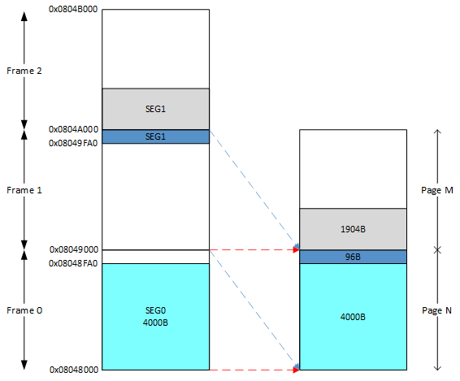

<h1 id=file_notes>
    程序员的自我修养——链接、装载与库
</h1>

主要知识点：
1. 编译 源文件 -> 目标文件
   1. 编译的过程：词法分析，语法分析，语义分析，中间代码生成，目标代码生成与优化
   2. 链接器
2. 目标文件（ELF）文件格式 目标文件
   1. 文件头
   2. 段表
   3. 符号
3. 静态链接 目标文件 -> 可执行文件
   1. 空间与地址分配
   2. 符号解析与重定位
   3. COMMON块
   4. 链接过程控制
4. 装载 可执行文件
   1. 装载的方式：静态 动态
   2. 进程虚存空间分布

<h2 id=ch_01>
    温故而知新
</h2>

* 站在程序员的角度看计算机：中央处理器CPU、内存和IO控制芯片。
* 计算机科学领域的任何问题都可以通过增加一个间接的中间层来解决。
* 操作系统：充分利用CPU。裸机、多道程序、分时系统、多任务系统。
* 虚拟内存与MMU：段页式内存管理方法。
* 多进程与多线程：创建、调度与同步（进程/线程安全）。

<h2 id=ch_02>
    编译和链接
</h2>

从源代码文件到可执行文件需要四步，本书重点介绍编译和链接两个部分。
* 预处理 Prepressing
* `编译 Compilation`
* 汇编 Assembly
* `链接 Linking`


<h3 id=compilation>编译</h3>

将高级语言翻译成机器语言。经编译产生的目标代码，其外部`符号`的地址还未确定，需要链接器`重定位`后，才能够执行。
* 扫描 Scanner
* 语法分析 Parser
* 语义分析 Semantic Analyzer
* 源代码优化 Source Code Optimizer
* 目标代码生成 Code Generator
* 目标代码优化 Final Target COde


<h3 id=linking>链接</h3>

* 符号 Symbol：在链接中，统一将函数和变量统称为符号。函数名或变量名就是`符号名`。
* 重定位 Relocation：重新计算各个符号的地址的过程。每个要被修正的地方叫一个`重定位入口`。

链接的主要过程：
* 地址和空间分配，Address and Storage Allocation
* 符号决议，Symbol Resolution
* 重定位，Relocation

静态链接的方法：
* 函数调用：调用目标函数指令的目标地址暂时搁置，待链接器确定目标函数的地址，并修改所有调用目标函数的指令。
* 变量引用：将变量的地址设置为0，待链接器确定变量的地址，并修改所有引用变量的指令。


<h2 id=ch_03>目标文件有什么</h2>

目标文件：源代码经编译后但未进行链接的中间文件
* Windows:  .o
* Linux: .obj

<h3 id=ch_3.1>目标文件(可执行文件)的格式</h3>

可执行文件、静态库(.a/.lib)、动态库(.so/.dll)以及目标文件(.o/.obj)都按照可执行文件的格式来存储。

可执行文件格式一览表：

<table>
    <tr><th>平台</th><th>格式</th><th>缩写</th></tr>
    <tr>
        <td>Windows</td>
        <td>Portable Executable</td>
        <td>PE</td>
    </tr>
    <tr>
        <td>Linux</td>
        <td>Executable Linkable Format</td>
        <td>ELF</td>
    </tr>
    <tr>
        <td>Intel/Microsoft</td>
        <td>Object Module Format</td>
        <td>OMF</td>
    </tr>
    <tr>
        <td>Unix System V Release 3</td>
        <td>Common file format</td>
        <td>COFF</td>
    </tr>
    <tr>
        <td>Unix</td>
        <td>a.out</td>
        <td></td>
    </tr>
    <tr>
        <td>MS-DOS</td>
        <td>.COM</td>
        <td></td>
    </tr>
</table>

ELF文件类型：
* 可重定位文件，`relocatable` file，例如 .o 文件。
* 可执行文件，`executable` file。
* 共享目标文件，`shared object` file，例如 .so 文件。
* 核心转储文件，core dump file。

可执行文件格式的发展：


<h3 id=ch_3.2>目标文件是什么样的</h3>

目标文件由文件头和若干个段（section）组成，不同的段存储着不同的内容。

<table>
    <tr><th>存储位置</th><th>说明</th></tr>
    <tr>
        <td>文件头</td>
        <td>描述了整个文件的文件属性。</td>
    </tr>
    <tr>
        <td>.text</td>
        <td>代码段，存放代码编译后生成的机器指令。</td>
    </tr>
    <tr>
        <td>.data</td>
        <td>数据段，初始化的全局变量和局部静态变量。</td>
    </tr>
    <tr>
        <td>.bss</td>
        <td>block start by symbol，为未初始化的全局变量和局部静态变量预留位置，不占存储空间。</td>
    </tr>
    <tr>
        <td>段表</td>
        <td>描述文件中各个段的数组，包含段在文件中的偏移地址及段的属性。</td>
    </tr>
</table>

分段（指令和数据分开存储）的优点：
* 便于权限控制，防止指令（只读）被无意或有意修改。
* 提高程序的局部性，提升CPU的缓存命中率。
* 指令等只读数据可共享，节省存储空间。

<h3 id=ch_3.3>挖掘SimpleSection.o</h3>

以示例代码[SimpleSection.c](code/SimpleSection.c)编译出来的目标文件作为分析对象，深入挖掘目标文件的每一个字节。

<h4>编译</h4>

```shell
# 这将会得到SimpleSection.o
gcc -c SimpleSection.c
```

<h4>查看目标文件各个段的基本信息</h4>

```shell
objdump -h SimpleSection.o
# 查看ELF文件的代码段、数据段和BSS段的长度
size SimpleSection.o
```

输出的信息包括：
1. 段名
2. 大小
3. VMA：虚拟地址
4. LMA：加载地址
5. 偏移：段在文件中的位置
6. 对齐：2**2 表示4字节对齐（2^2）
7. 段属性
   1. CONTENTS：该段在文件中存在，BSS段无此属性。
   2. ALLOC：
   3. LOAD：
   4. RELOC：
   5. READONLY：
   6. CODE：指令
   7. DATA：数据

<h4>查看目标文件各个段的数据</h4>

```shell
objdump -s SimpleSection.o
# -d 选项可以将包含指令的段反汇编。
```

代码中`初始化的局部静态变量`static_var和`初始化的全局变量`global_init_var存放在`.data`段中。`未初始化的局部静态变量`static_var2和`未初始化的全局变量`global_uninit_var存放在`.bss`段中。

如果显式的给变量赋值为0，有可能会被优化到`.bss`段中。

备注：
1. 在输出的内容中，最左面一列是偏移量，中间四列是十六进程内容，最右面一列是ASCII码。
2. 字节序

<h4>将二进制文件作为目标文件的一个段</h4>

```shell
objcopy -I binary -O elf32-i386 -B i386 image.jpg image.o
```

[objcopy使用说明](bin.md#objcopy)。

<h4>自定义段</h4>

使用gcc的扩展机制，可将指定的代码或数据放到指定的段中。

```c
// 将变量放入到FOO段
__attribute__((section("FOO"))) int global = 42;
// 将函数放入到BAR段
__attribute__((section("BAR"))) void foo() {

}
```

<h3 id=ch_3.4>ELF文件结构描述</h3>

下图是ELF文件的总体结构。ELF文件主要由以下部分组成：
* [文件头](#elf_header)
* [段表](#elf_section_header_table)
* [重定位表](#elf_relocation_table)
* [字符串表](#elf_string_table)
* [符号表](#elf_symbol_table)


<h4 id=elf_header>文件头</h4>

文件头是最重要的结构之一，上图有指明文件头各个成员的意义。文件头主要包含以下信息：
* ELF魔数
* 数据存储方式：大端 or 小端
* 版本
* ELF重定位类型
  * ET_REL 可重定位文件（.o）
  * ET_EXEC 可执行文件
  * ET_DYN 共享目标文件（.so）
* 入口地址
* *`段表的位置和长度`*
* [e_shstrndx](#Elf32_Ehr-e_shstrndx) 段表字符串表在段表中的下标
* 段的数量
* ...

<h4 id=elf_section_header_table>段表</h4>

段表是除文件头外最重要的结构。段表描述了其余各个段的信息，也就是段表确定了ELF文件的结构。

查看指令：
* [readelf -S](bin.md#readelf-S) 
* [objdump -h](bin.md#objdump-h)

段表包含的主要信息：
* sh_name 段名在[字符串表](#elf_string_table)中的偏移
* sh_type 段的类型
  * SHT_NULL 无效段
  * SHT_PROGBITS 程序段，例如代码段和数据段
  * SHT_SYMTAB 符号表
  * SHT_STRTAB 字符串表
  * SHT_RELA 重定位表，包含重定位信息。
  * SHT_HASH 哈希表
  * SHT_DYNAMIC 动态链接信息
  * SHT_NOBITS 此段无内容，例如 .bss
  * SHT_REL 该段包含重定位信息
  * SHT_SHLIB 保留
  * SHT_DNYSYM 动态链接的符号表
* sh_flags 段的标志位（可同时有多个标志）
  * SHF_WRITE 该段在进程中可写
  * SHF_ALLOC 该段在进程空间中要分配空间
  * SHF_EXECINSTR 该段在进程空间中可被执行
* sh_addr 段虚拟地址
* sh_offset 如果段存在，则表示在文件中的偏移。
* sh_size 段的长度
* sh_link sh_info 段的链接信息
* sh_addralign 段地址对齐，2的指数倍。
* sh_entsize （固定大小）项的长度

<h4 id=elf_relocation_table>重定位表</h4>

段类型为 SHT_REL 的段称为`重定位表`，包含了重定位信息。每个需要重定位的代码段或数据段，都有一个对应的重定位表。例如 .data 段的重定位表是 .rel.data。

sh_link表示符号表的下标。sh_info表示作用于哪一个段，例如.rel.text作用于.text段，而.text在段表的下标（索引）是1，则sh_info=1。

<h4 id=elf_string_table>字符串表</h4>

字符串的保存方式：将所有的字符串收集起来并存放在一个段中，使用字符串在表中的偏移来引用字符串。

常见的段名：
* .strtab，字符串表，保存普通的字符串，比如符号的名字。
* .shstrtab，段表字符串表，保存段表中用到的字符串，例如段名。

<p id=Elf32_Ehr-e_shstrndx></p> 

e_shstrndx 是`Section header string table index`的缩写，表示`段表字符串表`在段表中的下标。

不难得出，只要分析了[ELF文件头](#elf_header)，就可以得到段表和段表字符串表的位置，从而解析整个ELF文件。

<p id=elf_symbol_table></p>

<h3 id=ch_3.5>链接的接口——符号</h3>

有关符号的一些基本概念：
* 符号：函数或变量。
* 符号名：函数名或变量名。
* 符号值：函数地址，或变量的取值。
* 符号表：记录了目标文件中所`用到`的所有符号。

符号的类型：
1. 定义在本目标文件的全局符号，可以被其他目标文件引用。
2. 在本目标文件中引用的全局符号，但没有定义在本目标文件。
3. 段名
4. 局部符号，只在编译单元内部可见。对链接没有作用。
5. 行号信息，即目标文件指令与源代码中代码行的对应关系。

主要内容：
* [ELF符号表结构](#elf_symbol_table)
* [特殊符号](#special_symbol)
* [名称修饰和函数签名](#name_decoration_and_function_signature)
* [extern "C"](#extern_c)
* [弱符号和强符号](#weak_and_strong_symbol)

<h4 id=elf_symbol_table>ELF符号表结构</h4>

查看符号表的指令：
* nm object_file
* readelf -s object_file
* objdump -t object_file

ELF文件中的符号表往往是一个段，段名一般叫`.symtab`。符号表是一个`Elf32_sym`结构数组，下表为0的元素为无效的未定义符号。

Elf32_sym成员：
* st_name：符号名，字符串表的下标。
* st_size：符号大小。
* st_shndx：符号所在的段。
  * 符号所在的段在段表中的下标。
  * SHN_ABS：该符号包含了一个绝对的值，例如文件名的符号。
  * SHN_COMMON：该符号是一个“COMMON块”类型的符号，例如未初始化的全局符号定义。
  * SHN_UNDEF：符号未定义，该符号在本文件中被引用，但是定义在其他文件。
* st_info：符号类型和绑定信息
  * 高28位表示符号绑定信息（Symbol Binding）
    * STB_LOCAL：局部符号，对目标文件的外部不可见。
    * STB_GLOBAL：全局符号，外部可见。
    * STB_WEAK：若引用。
  * 低4位表示符号的类型（Symbol Type）
    * STT_NOTYPE：未知类型符号
    * STT_OBJECT：该符号是一个数据对象，比如变量、数组。
    * STT_FUNC：该符号是函数或其他可执行代码。
    * STT_SECTION：该符号是一个段，一定是STB_LOCAL。
    * STT_FILE：目标文件对应的源文件名，一定是STB_LOCAL，st_shndx一定是SHN_ABS。
* st_value：符号值
  * 目标文件
    * SHN_ABS / SHN_UNDEF：st_value没有用。
    * SHN_COMMON：表示该符号的对齐属性。
    * 段的下标：st_value表示该符号在段中的偏移位置。
  * 可执行文件
    * st_value表示符号的虚拟地址。

<h4 id=special_symbol>特殊符号</h4>

链接器在链接脚本会定义一些符号，可以在程序中声明并使用，这些符号称之为`特殊符号`。注意，链接之后，这些符号才会存在。

常见的特殊符号：
* __executable_state：程序的起始地址（程序最开始的地址）。
* __etext或_etext或etext：代码段的结束地址。
* _edata或edata：数据段的结束地址。
* _end或end：程序结束地址。

<h4 id=name_decoration_and_function_signature>
    名称修饰和函数签名
</h4>

* 名称修饰：源代码中的函数名和变量名，转换成目标文件中对应的符号名的过程，称为名称修饰。
* 函数签名：包含了一个函数的所有信息，包括函数名、参数类型、所在的类和名称空间，以及其他信息。用于识别不同的函数。

名称修饰用于解决目标文件之间符号冲突的问题。早期的汇编库，符号名与对应的函数名或变量名是一样的，为了避免C程序与库冲突，C程序在编译后，全局变量和函数名对应的符号，会在最前方添加一个下划线，作为符号名。

后来由于环境发生变化，冲突不是那么明显，LInux下的gcc编译器，默认情况下去掉了符号名前加下划线，但Windows下的编译器依然保持这种传统。

gcc也可以通过选项来打开或关闭。
* -fleading-underscore
* -fno-leading-underscore

C++ 有类、继承、虚拟机制、重载、名称空间，他们使得名称修饰更加的复杂。binutils提供了一个`c++filt`的工具可以用来解析被修饰过的名称。

Visual C++的名称修饰规则没有对外公开。Microsoft提供了一个UnDecorateSymbolName()的API，可以将修饰后名称转换成函数签名。

<h4 id=extern_c>extern "C"</h4>

C++用来声明或定义一个C的符号的关键字：`extern "C"`。这会使C++的名称修饰机制失效。

用法：
```c
extern "C" {
    int func(int);
    int var;
}
```
或者：
```c
extern "C" int func(int);
extern "C" int var;
```

如果C++使用C语言的头文件，则需要使用`extern "C"`关键字(否则经C++名称修饰后，无法与C库链接)，但是C语言又不支持。可以使用C++的宏`__cplusplus`。

```c
#ifdef __cplusplus
extern "C" {
#endif
/* code */
#ifdef __cplusplus
}
#endif
```

<h4 id=weak_and_strong_symbol>弱符号和强符号</h4>

`弱符号`和`强符号`是针对定义来说，默认情况下，函数和初始化的全局变量为强符号，未初始化的全局变量为弱符号。可通过gcc的`__ttribute__((weak))`来定义一个强符号为弱符号。

规则：
1. 不允许强符号被多次定义，否则链接报错。
2. 若符号同时存在强符号和弱符号，则选择弱符号。
3. 如果都是弱符号，则选择占用空间最大的。

强引用和弱引用：
* 强引用：链接时，没有找到符号的定义，则报未定义错误。
* 弱引用：链接时，没有找到符号的定义，则不会报错，链接器默认其为0，或一个特殊值。

可以使用`__attribute__((weakref))`来声明一个引用为弱引用。

应用场景：
* 库中定义的`弱符号`可以被用户定义的`强符号`所覆盖，从而使得程序可以使用自定义版本的库函数。
* 对某些模块的引用定义为`弱引用`。与模块一起链接的时候，模块可以正常使用。去掉模块之后，也可以正常链接，只是没有对应的功能。

<h3 id=ch_3.6>调试信息</h3>

目标文件还可以保存调试信息，gcc编译时加上`-g`选项即可。ELF文件采用一个叫`DWARF(Debug With Arbitrary Record Format)`的标准的调试信息格式。

调试信息占用很大的空间，可以使用 strip 命令去掉ELF文件中的调试信息。

<h2 id=ch_04>静态链接</h2>

链接的核心内容：静态链接，如何将多个目标文件链接起来，组成一个可执行文件。

<h3 id=space_and_address_allocate>空间与地址分配</h3>

链接器将多个目标文件的段合并到输出文件的方法，即链接器为目标文件分配地址和空间的方法：
* 按序叠加：将输入的目标文件按照次序叠加起来
  * 简单，但是会照成很多零散的段，照成空间的浪费。
* 相似段合并：将相同性质的段合并到一起。
  * 主要采取这种方法

空间和地址的含义：
1. 输出的可执行文件的空间
2. 转载后虚拟地址中的虚拟地址空间

现代的链接器主要采用一种两步链接的方法：
1. 空间与地址分配：获取所有输入目标文件的段信息，并合并输出，计算输出文件中各个段的位置和长度。
2. 符号解析与重定位：使用第1步收集的信息，读取输入文件中段的数据、重定位信息，并进行符号解析和重定位、调整代码中的地址。

链接之后，可执行文件使用程序在进程中的虚拟地址（VMA），各个段的起始地址已经确定。在链接之前，由于空间还没有被分配，所以VMA都是0。在Linux下，ELF可执行文件默认从地址0x08048000开始分配。

符号地址的确定：段的基地址确定之后，根据符号在段中的偏移，即可确定符号的地址。

<h3 id=symbol_resolution_and_relocation>符合解析和重定位</h3>

地址和空间分配完成之后，就进入了符号解析和重定位。
* 符号解析：定义在外部的符号，通过符号解析来找到符号的定义。
* 重定位：对于定义在外部的符号，编译器会用一个临时值来代替符号值，待符号解析之后，再用真实值代替。

<h4 id=relocation_table>重定位表</h4>

ELF使用重定位表来保存重定位相关的信息，对于每一个需要重定位的段，都有一个相对应的重定位表。例如.text需要重定位，则对应.ref.text；.data需要重定位，则对应.rel.data。可以使用指令[objdump -r](bin.md#objdump-r)查看目标文件的重定位表。

对于Intel x86系列处理器来说，重定位表是Elf32_Rel结构的数组，每个数组元素对应一个重定位入口(每个要被重定位的地方叫一个重定位入口)。

```c
typedef struct {
    Elf32_Addr r_offset;
    Elf32_Word r_info;
};
```

r_offset：重定位入口的偏移
* 可重定位文件：要修正的位置的第一个字节相对于段起始的偏移。
* 可执行文件或共享对象文件：要修正的位置的第一次字节的虚拟地址。
r_info：重定位入口的类型和符号
* 低8位：重定位入口的类型
* 高24位：重定位入口的符号在符号表的下标。


<h4 id=symbol_resolution>符号解析</h4>

每个重定位入口都是对一个符号的引用，当链接需要对某一个符号进行重定位时，就需要确定这个符号的目标地址。这时候链接器就会去查找所有输入目标文件的符号表组成的全局符号表，找到相应的符号后进行重定位。

<h4 id=instruction_modification>指令修正方式</h4>

* 绝对寻址修正：
* 先对寻址修正：

<h4 id=common_block>COMMON块</h4>

为了支持弱符号机制，现代的编译器和链接器引入了COMMON块的机制，当不同的目标文件中相同的符号所需要的COMMON块空间大小不一致时，以最大的那块为准。

COMMON块仅仅是针对弱符号而言，如果有一个符号是强符号，则最终占用的空间与强符合相同。

出现COMMON块机制的根本原因是链接器不支持符号类型，即链接器无法判断各个符号的类型是否一致。

未初始化的局部静态变量在BSS段分配空间，编译器为什么不将未初始化的全局变量在BSS段分配空间？
* 未初始化的全局变量默认是弱符号，编译器在编译时无法确定其大小。链接完成之后，最终在输出文件的BSS段为其分配空间。

可以使用gcc的`-fno-common`选项，把未初始化的全局变量不以COMMON块的形式处理，也可以使用`__attribute__((nocommon))`扩展，这相当于定义了一个强符号。
```c
int global __attribute__((nocommon));
```

<h3 id=c++_related_issues>C++相关问题</h3>

由于C++支持的各种语言特性，使得它背后的数据结构异常复杂。主要有三个问题需要考虑：
* C++重复代码消除
* 全局构造和析构
* C++程序的二进制兼容性

<h4>重复代码消除</h4>

C++会在很多时候产生重复代码，例如模板、外部内联函数和虚函数表。以模板举例，不同的编译单元同时实例化成相同类型的时候，必然会产生重复代码。最简单的方法是全部保留，但是会有以下缺点：
* 空间浪费
* 地址较易出错，例如指向同一个函数的指针不相等。
* 运行效率降低，重复代码会降低指令的局部性。

解决方法：每个实例化对象都放在同一个段中，并且段名包含类型信息。当有相同类型的实例化对象时，会产生相同名字的段，则链接器可以识别出来并合并。

由于不同的编译单元可能选择了不同的编译器版本或编译选项，照成段名相同但是内容不同。这时链接器会选择其中一个并给出警告信息。

函数级别链接：当目标文件非常大时，将整个目标文件链接进来，有相当一部分的函数没有使用到，这会照成空间的浪费。借鉴上面的思路，将每个函数放在一个单独的段中，只链接需要的函数。开启的选项：
* -ffunction-sections 将每个函数保持到独立的段中
* -fdata-sections 将每个变量保持到独立的段中

优点：
* 减小输出文件的长度
* 减少空间浪费

缺点：
* 减慢编译和链接的过程
* 重定位过程因段数目增加而变得非常复杂
* 目标文件会增大

<h4>全局构造与析构</h4>

C++的全局对象的构造函数在main函数之前被执行，析构函数在min函数之后被执行。为了实现类似的特性，ELF定义了两个特殊的段：
* .init 包含了进程的初始化代码，在main函数被调用之前，glibc的初始化部分安排执行这个段中的代码。
* .finit 包含了进程的终止代码，当main函数正常退出时，glibc会安排执行这个段中的代码。

<h4>C++与ABI</h4>

ABI, Application Binary Interface，把符号修饰标准、变量内存布局、函数调用方式等这些与与可执行代码二进制兼容性相关的内容称为ABI。

API与ABI：
* API：往往指源代码级别的接口，更关注与函数签名。
* ABI：指二进制层面的接口，ABI的兼容程度比API更为严格。

影响ABI的因素：
* 硬件
* 编程语言
* 编译器
* 链接器
* 操作系统
* etc...

由于C++的一些复杂特性，导致其ABI兼容性不好，或者说，相比C语言，兼容起来更加复杂。不仅不同编译器编译的二进制代码不兼容，有时候同一个编译器的不同版本编译出来的代码也不兼容。

ABI兼容的意义：
* 库厂商可能只会提供二进制给客户。
* 系统中的某些库可能已经停止维护。
* 系统中已经存在的静态库或动态库被多个应用程序使用。
* 一个程序由多个公司或多个部门一起开发

目前的C++二进制兼容标准：
* 微软的VISUAL C++
* GNU阵营的GCC（Intel Itanium C++ ABI标准）

<h3 id=static_library_link>静态库链接</h3>

为了方便程序使用操作系统提供的API，语言库通常会将操作系统的API进行封装，并以库的方式提供给开发者。库分为静态库和动态库两种类型。

静态库：可以简单的看成一组目标文件的集合，即很多目标文件经过压缩打包后形成的一个文件，这可以方便文件的传输、管理和组织。

查看静态库包含的目标文件：[ar -t](bin.md#ar-t)

解压静态库：[ar -x](bin.md#ar-x)

查询函数所在的目标文件：[objdump -t](bin.md#objdump-t)加上文本查找工具grep。

与静态库链接的过程：ld会自动寻找所有需要的符号及它们所在的目标文件，将这些目标文件从静态库中解压出来，最终链接在一起成为一个可执行文件。

有两点要注意：
1. 可能需要不止一个静态库。
2. 目标文件之间也有可能存在依赖。

一般来说，静态库里面一个目标文件只包含一个函数，这是为了避免将很多没用的函数一起链接进输出文件，避免浪费空间。

<h3 id=ch_4.6>链接过程控制</h3>

一般情况下，使用默认的链接规则对目标文件进行链接。但是对于一些有特殊要求的程序，因为一些特殊的限制，需要指定输出文件各个段的虚拟地址、段的名称、段存放顺序等。

链接器控制链接过程的方法：
* 使用命令行给链接器指定参数，例如ld的-o、-e选项。
* 将链接指令存放在目标文件中，编译器经常会使用这种方法。
* 使用链接控制脚本。这是最灵活，最为强大的链接控制方法。
  * 查看默认的链接脚本：ld -verbos
  * 指定链接脚本：ld -T 或者 gcc 后添加脚本文件名，会自动识别。

链接脚本的作用：
* 控制输入段如何变成输出段
  * 那些输入段要合并到一个输出段
  * 那些输出段要丢弃
* 指定输出段的名字、转载地址、属性等

<h4>ld链接脚本语法简介</h4>

* 链接脚本由一系列语句组成，语句分为`命令语句`和`赋值语句`。
* 语句之间必须使用分号作为分隔符，`命令语句`可以使用换行作为分隔符。
* 可以使用C语言类似的表达式和运算符操作符，例如+、-、*、/、+=、-=、*=等，&、|、>>、<<等位操作符。
* 使用 `/* */`作为注释。
* 脚本中使用到的文件名、格式名或段名等，如果包含分隔符（例如分号），必须使用双引号将该名字全称引用起来。如果名字包含引号，无法处理。

赋值语句：`name = value;`
* `.` 表示当前虚拟地址

命令语句：由一个关键字和紧随其后的参数组成。
* 其中SECTIONS命令语句最复杂，还包含了一些赋值语句和SECTIONS语句所特有的映射规则，这是链接脚本的核心部分。

<table>
  <tr><th>命令语句</th><th>说明</th></tr>
  <tr>
    <td>ENTRY( symbol )</td>
    <td>指定符号 symbol 的值为入口地址。</td>
  </tr>
  <tr>
    <td>STARTUP( filename )</td>
    <td>将文件 filename 作为链接过程中的第一个输入文件。</td>
  </tr>
  <tr>
    <td>SEARCH_DIR( path )</td>
    <td>将路径 path 加入到ld链接器的库查找目录，与"-Lpath"有相同的作用。</td>
  </tr>
  <tr>
    <td>INPUT( file, file, ...)<br>INPUT( file file ... )</td>
    <td>将指定文件作为链接过程中的输入文件。</td>
  </tr>
  <tr>
    <td>INCLUE filename</td>
    <td>将指定文件包含进本链接脚本，类似于#include预处理。</td>
  </tr>
  <tr>
    <td>PROVIDE( symbol )</td>
    <td>在链接脚本中定义某个符号，该符号可以在程序中被引用。</td>
  </tr>
</table>

SECTIONS命令的基本格式：

```
SECTIONS
{
  ...
  secname : { contents }
}
```

* secname：输出段的段名，secname后必须有一个空格。后面紧跟冒号和一对大括号。
  * 段名必须符合输出文件的格式要求。
  * 如果使用`/DISCARD/`作为输出段名，那么符合条件的段将被丢弃。
* contents：描述了一套规则和条件，符合这种条件的输入段将合并到输出段中。

条件的写法：`filename(sections)`
```
file1.o(.data)  输入文件中名为file1.o的文件中叫.data的段符合条件
file1.o(.data .rodata) 输入文件中名为file1.o的文件中叫.data或.rodata的段符合条件
file.o  省略后面的小括号和段名，表示file1.o的所有段都符合条件。
*(.data) 输入文件中名字为.data的段符合条件。还可以使用?、[]等规则。
[a-z]*(.text*[A-Z]) 输入文件以小写字母开头，切段名以.text开头，以大写字母结尾。
```

<h3 id=ch_4.7>BFD库</h3>

BFD库，Binary File Descriptor library，是binutils项目的子项目，目标是希望通过一种统一的接口来处理不同的目标文件格式。

实现的大致原理：BFD把目标文件抽象成一个统一的模型，使得BFD库的程序只要通过操作这个抽象的目标文件模型就可以实现操作所有BFD支持的目标文件格式。即通过BFD库来操作目标文件，而不是直接操作目标文件。

<h2 id=ch5>Windows PE/COFF</h2>

*待填坑*

<h2 id=ch6>可执行文件的转载与进程</h2>

<h3 id=process_virtual_address_space>进程虚拟地址空间</h3>

程序和进程的区别：
* 程序（可执行文件）：静态的概念，一个文件，包含指令和数据。
* 进程：动态的概念，程序运行的一个过程。

进程虚拟地址空间的大小由CPU的位数决定
* 32位：0x00000000 ~ 0xFFFFFFFF 总共4GB
* 64位：0x0000000000000000 ~ 0xFFFFFFFFFFFFFFFF 总共 17179869184GB

以32位平台为例，在Linux系统下，最高的1GB被OS占用，进程只能使用低3GB的虚拟空间。Windows默认预留给操作系统的是2GB，不过可以修改启动配置文件Boot.ini，加上`/3G`参数，就可以和Linux的分布一样。

进程只能使用操作系统分配的地址空间，如果访问了未经允许的地址空间，会被操作系统强制杀死，并报错“Secmentation fault”（Windows：进程因非法操作需要关闭）。


在32位CPU下，可以通过PAE（Physical Address Extension）来访问大于4GB的物理内存空间（注意：不是虚拟地址空间）。自从Intel将地址总线扩展为36位之后，修改了页映射方式，新的映射方法可以访问到更多的物理内存。

一种常见的实现方法：OS提供一个窗口映射的方法，应用程序在不同的时间，映射不同的物理内存到此窗口，从而实现访问大于4GB的物理内存空间。Linux一般通过mmap()系统调用实现。

解决内存不够用的根本方法：使用64位的CPU和操作系统。

<h3 id=ch_6.2>转载的方式</h3>

必须将程序运行所需要的指令和数据装入内存，进程才可以运行。

装载方法：
* 静态装载：将程序所需要的指令和数据全部装入内存。
  * 非常的简单
  * 非常浪费内存资源，受限于硬件与金钱，很难无限制增加内存。
* 动态装载：利用程序的局部性原理，只装载使用到的模块。
  * [覆盖装入](#overlay_loading)
  * [页映射](#paging_loading)

<h4 id=overlay_loading>覆盖装入</h4>

将程序分为一个个模块，将模块按照它们之间的调用依赖关系组织成树状结构。有一个非常小的模块`覆盖管理器`，来管理模块何时驻留内存，何时应该被替换掉。

覆盖管理器需要保证两点：
* 树状结构中从任何一个模块到树的根，叫做调用路径。当模块被调用时，整个调用路径上的模块都必须在内存。
* 禁止跨树间调用。即任何一个模块的A子树的模块，禁止调用B子树的模块。

这种方法不是很灵活，受限于程序的结构。当程序非常庞大时，覆盖装入很难胜任。

<h4 id=paging_loading>页映射</h4>

页映射是虚拟存储机制的一部分，它随着虚拟存储的发明而诞生。目前几乎所有主流的操作系统都是按照页映射的方法装载程序。

页映射将程序和内存中的数据和指令按照“页”为单位划分成若干个页，之后所有装载和操作的单位就是页。

当需要程序第`i`页中的指令或数据时，发现第`i`页不在内存中，OS就会在内存中选择一个空闲的页，然后将第`i`页装入。如果内存中没有空闲页，OS就会在内存中选择一个页换出，并将第`i`页放入换出的页中。

选择页换出的算法有很多，例如FIFO 先进先出算法、LUR 最少使用算法。

<h3 id=ch_6.3>从操作系统角度看可执行文件的装载</h3>

从操作系统的角度看，装载可执行文件意味着创建一个新进程。创建一个新进程，并加载对应的可执行文件并执行，OS需要完成三件事情：
* 创建一个独立的虚拟地址空间。
  * 实际上是创建映射函数所需要的相应的数据结构，即分配一个页目录。
* 读取可执行文件头，建立虚拟空间与可执行文件的映射关系。
  * 这种映射关系是保存在操作系统内部的一个数据结构
  * Linux中将进程虚拟地址的一个段叫VMA。
* 将CPU的指令寄存器设置为可执行文件的入口地址，启动运行。
  * 在操作系统层面涉及内核堆栈和用户堆栈的切换，CPU运行权限的切换。

上述步骤完成之后，程序实际上还没有装入内存。当进程开始运行的时候，发现是一个空页面，会产生一个`页错误`，会按照以下步骤处理：
1. CPU控制权转交给OS，运行页错误处理例程。
2. 查询装载过程中第二步建立的数据结构，找到空页面所在的VMA，计算出相应的页面在可执行文件中的偏移。
3. 在物理内存中分配一个页面，将进程中该虚拟页与物理页建立映射关系。
4. 控制权还回给进程，在也错误的位置继续执行。

<h3 id=ch_6.4>进程虚存空间分布</h3>

<h4 id=ch_linking_view_and_execute_view>ELF文件链接视图和执行视图</h4>

ELF将一个或多个属性类似的`Section`，划分到同一个`Segment`。装载可执行文件时，一个`Segment`对应一个VMA，这样可以减少VMA的数量，减少页面内部碎片，从而节省内存空间。

划分的依据一般有以下三种：
* 以代码段为代表的权限为`可读可执行`的Section。
* 以数据段和BSS段为代表的权限为`可读可写`的Section。
* 以只读数据段为代表的权限为`只读`的Section。

链接器在链接目标文件的时候，也会把权限属性相同的段尽可能的分配在同一空间。

Segemnt和Section是从不同的角度对ELF文件进行了划分。从Section的角度看，就是ELF的链接视图，从Segment的角度看就是执行视图。所以谈ELF装载时，`段`指Segment，其他情况指Section。

描述Segment的结构叫程序头，它描述了ELF文件该如何被操作系统映射到进程的虚拟地址空间。可以使用指令[readelf -l](bin.md#readelf-l)查看可执行文件的程序头表。

由于目标文件不需要转载，所以没有此结构。

程序头表是结构体`Elf32_Phdr`数组，此结构体各个成员的含义如下表所示：

<table>
  <tr><th>类型</th><th>成员</th><th>含义</th></tr>
  <tr>
    <td>Elf32_Word</td>
    <td>p_type</td>
    <td>Segment的类型，常见的有LOAD、DYNAMIC、INTERP。</td>
  </tr>
  <tr>
    <td>Elf32_Off</td>
    <td>p_offset</td>
    <td>Segment在文件中的偏移。</td>
  </tr>
  <tr>
    <td>Elf32_Addr</td>
    <td>p_vaddr</td>
    <td>Segment的第一个字节在进程虚拟地址空间的起始位置，程序头表所有LOAD类型的元素，按照p_vaddr从小到大排列。</td>
  </tr>
  <tr>
    <td>Elf32_Addr</td>
    <td>p_paddr</td>
    <td>Segment的物理装载地址，即LMA（Load Memory Address）。一般情况下与p_vaddr相等。</td>
  </tr>
  <tr>
    <td>Elf32_Word</td>
    <td>p_filesz</td>
    <td>Segment在ELF文件中所占空间的长度，可能为0。</td>
  </tr>
  <tr>
    <td>Elf32_Word</td>
    <td>p_memse</td>
    <td>Segment在进程虚拟地址中所占用的长度，也可能是0。</td>
  </tr>
  <tr>
    <td>Elf32_Word</td>
    <td>p_flags</td>
    <td>Segment的权限，比如R 可读，W 可写，X 可执行。</td>
  </tr>
  <tr>
    <td>Elf32_Word</td>
    <td>p_align</td>
    <td>Segment的对齐属性，实际对齐字节等于2的p_align次方。</td>
  </tr>
</table>

Tips：对于load类型的segment来说，p_memsz不能小于p_filesz，但是可以大于p_filesz。多余的部分填充为0，留给BSS段使用。这也是数据段和BSS段的唯一区别：数据段从文件初始化内容，而BSS段的内容全部初始化为0。

<h4 id=heap_and_stack>堆和栈</h4>

Linux也通过VMA来管理进程的堆和栈（实际上所有的内存空间都是通过VMA来管理的）。通过查看文件`/proc/[pid]/maps`，来查看进程的VMA。

下列是树莓派上的一个实例。第一列是VMA的地址范围。第二列是权限（p表示私有，Copy on Write；S表示共享）。第三列是VMA对于的Segment在文件中的偏移，第四列是文件所在设备的主设备号和次设备号。第五列是文件的文件节点号。第六列是文件的路径。

```
[root@pi3b upload]# cat /proc/21027/maps
00010000-00c4c000 r-xp 00000000 b3:04 14376      /usr/bin/rclone
00c50000-01a84000 r--p 00c40000 b3:04 14376      /usr/bin/rclone
01a90000-01b00000 rw-p 01a80000 b3:04 14376      /usr/bin/rclone
01b00000-01b16000 rw-p 00000000 00:00 0 
03000000-13000000 rw-p 00000000 00:00 0 
13000000-23400000 ---p 00000000 00:00 0 
a6adf000-a7cf1000 rw-p 00000000 00:00 0 
a7cf1000-b6eef000 ---p 00000000 00:00 0 
b6eef000-b6f2f000 rw-p 00000000 00:00 0 
bed6c000-bed8d000 rw-p 00000000 00:00 0          [stack]
beef1000-beef2000 r-xp 00000000 00:00 0          [sigpage]
ffff0000-ffff1000 r-xp 00000000 00:00 0          [vectors]
[root@pi3b upload]# 
```

VMA与Segment不完全对应，一个VMA可以映射到某个文件的一个区域，也可以没有映射到任何一个文件。即以上的stack、sigpage、vertors（为啥没有heap？还有一些没有名字），也叫做匿名虚拟内存（Anonymous Virtual Memeory Area）。

现代的操作系统为了安全起见，用了随机地址空间分布的技术，即栈和堆的首地址会有一个小的随机偏移量。

注意，vectors已经处于内核空间了，这是为啥呢？

当通过malloc分配内存时，是从堆中分配的。进程总共的虚拟地址空间是4GB，那么从堆中最多可以分配多少内存呢？书中有给出一个小程序[max_heap.c](code/max_heap.c)。64位WLS1 Ubuntu的运行结果是113G，64位CentOS7.7虚拟机的结果是10G。

书中的程序在64位下运行有一个小问题，具体可以看[这里](layout_err.md#P168)。

<h4 id=ch_6.4.4>段地址对齐</h4>

在装载过程中，页是最小的映射单位。由于地址对齐的存在，如果一个段最后一页不足4096字节，势必会照成物理内存空间的浪费。为了解决这个问题，UNIX让各个段接壤部分共享一个物理页面，然后将该物理页面分别映射两次。

例如SEG0的长度为4000字节，SEG1的长度为2000字节。装载示意图如下所示。`Frame 0`和`Frame 1`同时映射到`Page N`。`Frame 0`包含`SEG0`的全部内容，`Frame 1`包含`SEG1`的前96个字节。`SEG1`剩余的1904个字节则在`SEG2`中，会映射到其他的`Page`。

从图中可以看出，为了保证两次映射不冲突，0x08049000~0x08049FA0的地址没有被使用。



<h3 id=ch_6.5>Linux内核装载ELF过程简介</h3>

用户层面：调用fork()创建一个新进程，新进程调用exec函数族执行指定的elf文件。exec函数族最终会调用内核的sys_execve()。

sys_execve()：此函数先查找文件是否存在，如果存在，则读取文件的前128个字节，然后调用search_binary_handle()去搜索和匹配合适的可执行文件装载处理过程。elf文件的装载处理过程是`load_elf_binary()`，脚本文件的装载处理过程是load_script()。

load_elf_binary()
1. 检查elf文件的有效性
2. 寻找动态链接的.interp段，设置动态链接器路径
3. 根据ELF文件的程序头表，对ELF文件进行装载。
4. 初始化ELF进程环境。
5. 将系统调用的返回地址修改成ELF可执行文件的入口点。
   1. 静态ELF可执行文件：文件头e_entry所指的地址。
   2. 动态ELF可执行文件：动态链接器。

当sys_execve()系统调用从内核态返回用户态时，EIP寄存器直接跳转到了ELF程序的入口地址，于是新的程序开始执行，ELF文件装载完毕。

<h3 id=ch_6.6>Windows PE的装载</h3>

*待填坑*

<h2 id=ch_7>动态链接</h2>

<h3 id=ch_7.1>为什么要动态链接</h3>

静态链接的缺点：
* 浪费内存和磁盘空间：一些公共部分的模块，在每个程序中都存在一份拷贝。
* 不利于程序开发和发布：一个模块有非常微小的修改，就要重新编译整个程序，并将整个程序分发给用户。

动态链接：把程序按照模块拆分成各个相对独立的部分，在程序`运行时`才将他们链接在一起形成一个完整的程序。因为动态链接涉及到多个文件的装载，所以需要操作系统的支持。在Linux下，ELF动态链接文件被称为动态共享文件（Dynamic Shared Object），文件名一般以`.so`结尾。

显然，动态链接解决了静态链接的两个问题（一个模块在多个程序中只有一份拷贝，只升级有修改的模块即可）。同时动态链接也提高了程序的可扩展性和兼容性。
* 可扩展性：动态链接可以在运行时动态选择加载模块，常被用于制作插件。
* 兼容性：不同的系统提供有相同符号的动态链接库，则程序无需编辑，即可在新系统上运行（实际情况没有这么简单）。

动态链接库的确定：
1. 库升级之后，新库和旧库之间的接口不兼容。
2. 程序在每次装载时都要重新链接，会带来一些性能上的损失。不过可以通过延迟绑定等方法优化。

<h2 id=ch_7.2>简单的动态链接例子</h2>

* gcc 可以使用 `-shared`选项产生共享对象文件。
* 共享对象文件需要参与可执行文件的链接。
  * 可执行文件对于共享对象中的符号的引用，不重定位，标记为一个动态链接的符号。
* 共享对象文件的VMA默认从0开始，因为装载地址在编译时无法确定。
* 共享对象文件是由`动态链接器（ld.so）`装载的。

<h3 id=ch_7.3>地址无关代码</h3>

<h4 id=ch_7.3.1>固定装载地址的困扰</h4>

由于指令和数据可能包含一些绝对地址的引用，所以在链接的时候就要确定共享对象文件的装载地址。有以下两种方法：

方法一：
静态共享库：将程序的各种模块统一交给操作系统来管理，操作系统在某个特定的地址划分出一些地址块，为哪些已知的模块预留足够的空间。

静态共享库的问题：
* 地址冲突：不同模块的装载地址不能一样。
* 升级必须保证共享库中全局函数和变量地址的不变。
  * 升级增加的内容也有限，因为分配给静态库的地址空间有限。

方法二：
共享对象在编译时不能假设自己在进程虚拟地址空间中的位置。即共享对象可以在任意地址加载。

可执行文件往往是第一个加载的文件，所以可以假设装载位置。

<h4 id=ch_7.3.2>装载时重定位</h4>

共享对象为了支持在任意地址装载，在链接时，所有的绝对地址不进行重定位；而是在装载时进行重定位。

数据在进程之间是不共享的，而指令在进程之间是共享的。对于同一个共享对象，在不同的进程其装载地址可能不同。所以数据可以使用装载时重定位，指令不能使用装载时重定位的方法，否则就失去了共享指令节省内存的优点。

<h4 id=ch_7.3.3>地址无关代码</h4>

解决共享对象指令中对绝地地址重定位的问题：指令部分在装载时不需要因为装载地址的改变而改变。

实现方法：把指令中需要修改的部分分离出来，跟数据部分放在一起。这样指令部分可以保持不变，而数据部分每一个进程都有一个副本。

这种方法被称为`地址无关代码（PIC，Position-independent code）`，gcc的`-fPIC`选项。

模块中各种地址的引用方法，一般有4种：
1. 模块内部的函数调用、跳转等。
2. 模块内部数据访问，比如模块中定义的全局变量、静态变量。
3. 模块外部的函数调用、跳转等。
4. 模块外部的数据访问，比如其他模块中定义的全局变量。

第`1`种以相对地址调用，或者基于寄存器的相对调用，`无需重定位`。第`2`种可以基于PC的相对寻址，因为指令与它要访问的模块内部数据之间的相对位置是固定的。

第`3`种和第`4`种显然是需要重定位的，ELF的解决方法是：在数据段建立一个指向这些变量或函数的指针数组，也被称为`全局偏移表（Global Offset Table，GOT）`。当引用变量或调用函数时，通过GOT中相对应的项间接引用。

由于GOT存储在数据段，每个进程都有一份副本。同时GOT可以通过基于PC的寻址来找到对应的项。GOT每个项对应一个４字节的地址（32位），动态链接器在装载共享对象文件的时候会查找每个变量所在的地址，然后填充GOT中的各个项，确保每个指针所指向的地址正确。

`-fpic`与`-fPIC`类似，不过`-fpic`产生的代码较小，而且较快。但是`-fpic`在某些平台上会有一些限制，而`-fPIC`没有限制。所以绝大部分情况下使用`-fPIC`来产生地址无关代码。

如何区分一个共享对象文件是否位PIC：以下指令有任何输出，则不是PIC，否则是PIC。
```
readelf -d foo.so | grep TEXTREL
```

PIE：地址无关可执行文件，Position-Independent Executetable。-fPIE 或 -fpie。

<h4 id=ch7.3.4>共享模块的全局变量问题</h4>

```c
extern int global;
int foo()
{
  global = 1;
}
```

假设`global`定义在共享对象文件中，而上面的代码段是可执行文件的一部分。由于可执行文件没有类似于PIC的机制，在链接时必须确定`global`变量的地址，所以可执行文件会在.bss段为`global`变量创建一个副本。同时`global`变量在共享对象文件中也有一个副本，这显然是不行的。

解决方法：ELF共享对象文件在编译时，默认都把定义在模块内部的全局变量当作定义在其他模块的全局变量，即通过GOT来现实变量的访问。当共享库被装载时，
* 如果全局变量在可执行文件中拥有副本，那么GOT相应的地址指向可执行文件的副本。
* 如果全局变量在可执行文件中没有副本，那么GOT相应的地址指向模块内部的副本。

如果上面的代码段是共享对象文件的一部分，那么一定按照跨模块引用的方式来产生代码。

<ch4 id=ch_7.3.5>数据段地址无关性</ch4>

由于数据段在每个进程都有一个独立的副本，所以可以使用装载时重定位的方法来解决。对于绝对地址引用，编译器和链接器就会产生一个重定位表。

<h3 id=ch_7.4>延迟绑定（PLT）</h3>

动态链接相比静态链接，在性能上有些损失，主要体现在以下两个方面：
1. 跨模块的数据引用或函数调用，会利用GOT进行复杂的定位或间接跳转。
2. 程序开始执行时，动态链接器会装载所有需要的动态库，然后进行符号查找地址重定位等工作。这势必会减慢程序的启动速度。

延迟绑定用来解决上面的第二个问题。程序在运行过程中，有很多函数实际上并没有使用到，对这些函数进行重定位是一种浪费。

延迟绑定（Lazy Binding）：当函数子第一次被用到时才进行绑定（符号查找、重定位等），如果没有用到则不绑定。

延迟绑定使用PLT（Procedure Linkage Table）来实现。PLT在函数调用和GOT之间，增加了一层间接跳转，用于符号查找和重定位。

使用到的数据结构：
* .plt段: 此段包含若干个函数，用于实现符号查找和重定位。
  * .plt 函数：跳转到符号查找函数 _dl_runtime_resolve()。
  * function@plt 函数: function是函数名。模块调用的每个外部函数，都会生成一个类似的函数。例如模块调用了外部的bar()函数，则会生成 bar@plt 函数。
* .got.plt段: 保存函数引用的地址。.got用于保存全局引用的地址。.got.plt的前三项比较特殊：
  * 第一项：.dynamic 段的地址。
  * 第二项：本模块的ID，动态链接器装载时初始化。
  * 第三项：_dl_runtime_resolve()的地址，此函数用于查找符号和重定位，动态链接器装载时初始化。
  * 其余项分别对应每个外部函数的引用。

下图是利用PLT实现延迟绑定的示意图，左边主要是ELF文件的结构示意，右边是bar@plt函数的主要汇编代码，箭头代表函数调用或者跳转。

当调用外部函数bar()，会跳转到bar@plt，紧接着会跳转到`bar@GOT`（.got.plt中对应bar()函数的项）。

第一次调用时，`bar@GOT`存储着`bar@plt`第二条指令的地址。这样又跳转到了`bar@plt`，紧接着跳转到.plt，最终调用函数`_dl_runtime_resolve()`，对bar()函数进行重定位，并修改`bar@GOT`的值，指向bar()函数的真实地址。

第二次调用时，由于`bar@GOT`已经指向了真实的地址，所以无需重定位，直接完成了函数调用。


<h3 id=ch_7.5>动态链接相关结构</h3>

在动态链接情况下，可执行文件转载完毕之后，操作系统会继续装载一个叫做`动态链接器`的文件，并将控制权转交给动态链接器。动态链接器会装载所有依赖的共享对象文件。当所有的动态链接工作完成之后，动态链接器会将控制权转交给可执行文件，程序开始正式执行。

<h4 id=ch_7.5.1>.interp段</h4>

存储了可执行文件需要的动态链接器的路径。注意：只有可执行文件才有这个段。

查询指令：[readelf -l elf_file | grep interpreter](bin.md#readelf-l)

<h4 id=ch_7.5.2>.dynamic段</h4>

保存了动态链接所需要的基本信息，这个段是结构体`Elf32_Dyn`数组，此结构体由一个类型值加上一个附加的数值或指针，对于不同的类型，后面附加的数值或者指针有者不同的含义。

```c
typedef struct {
  Elf32_Sword d_tag;
  union {
    Elf32_Word d_val;
    Elf32_Addr d_ptr;
  } d_un;
} Elf32_Dyn;
```

常见的类型值及其含义：

<table>
  <tr><th>d_tag类型</th><th>d_un的含义</th></tr>
  <tr><td>DT_SYMTAB</td>
      <td><a href=#ch_7.5.3>动态符号表</a>的地址，d_ptr表示 .dynsym 的地址。</td></tr>
  <tr><td>DT_STRTAB</td>
      <td>动态符号字符串表，d_ptt表示 .dynstr 的地址。</td></tr>
  <tr><td>DT_STRSZ</td>
      <td>动态符号字符串表大小，d_val表示大小。</td></tr>
  <tr><td>DT_HASH</td>
      <td>动态链接哈希表地址，d_ptr 表示 .hash 的地址。</td></tr>
  <tr><td>DT_SONAME</td>
      <td>本共享对象的SO-NAME。</td></tr>
  <tr><td>DT_RPATH</td>
      <td>动态链接共享对象搜索路径。</td></tr>
  <tr><td>DT_INIT</td>
      <td>初始化代码地址。</td></tr>
  <tr><td>DT_FINIT</td>
      <td>结束代码地址。</td></tr>
  <tr><td>DT_NEED</td>
      <td>依赖的共享对象文件，d_ptr表示所依赖的共享对象文件名。</td></tr>
  <tr><td>DT_REL<br>DT_RELA</td>
      <td>动态链接重定位表地址。</td></tr>
  <tr><td>DT_RELENT<br>DT_RELAENT</td>
      <td>动态重读位表入口地址。</td></tr>
</table>

查看.dynamic段的指令：[readelf -d](bin.md#readelf-d)

查看共享库或可执行文件依赖的共享库：[ldd](bin.md#ldd)

<h4 id=ch_7.5.3>动态符号表</h4>

动态链接最关键的还是所依赖的符号和相关文件信息。

动态符号表`.dynsym`保存了模块之间的符号导入导出关系，动态符号表与[符号表.symtab](#ch_3.5)非常的类似。
* 导入：对其他模块符号的引用。
* 导出：定义在本模块的符号。

查看动态符号表的指令：[readelf -s](bin.md#readelf-s)

其他辅助的表：
* 保存符号名的表：动态符号字符串表 .dynstr，Dynamic String Table。
* hash表，用于加快符号的查找速度。

<h4 id=ch_7.5.4>动态链接重定位表</h4>

动态连接的情况下，要在运行时重定位，确定导入符号的地址。共享库一般使用PIC的技术编译，所以代码段无需重定位，只需重定位数据段和.got即可。

与静态链接时的重定位类似，.rel.text是代码段的重定位表，.rel.data是数据段的重定位表。在动态链接的情况下，`.rel.dyn`是`数据段`和`.got`的重定位表（完成对数据的修正），`.rel.plt`是`.got.plt`的重定位表（完成对函数引用的修正）。

查看动态链接重定位表的指令：[readelf -r](bin.md#readelf-r)

（动态链接）重定位表中的`重定位类型`表示重定位时有不同的地址计算方法。有很多种，不做过多了解。稍微麻烦的是`R_386_RELATIVE`，即`基址重置（Rebasing）`，对应数据段中对绝对地址的引用。

考虑以下代码段，在编译时，共享对象的地址从0开始，所以p的取值是a相对于地址0的偏移量。装载之后，由于共享对象的基址不再是0，所以p的取值要加上共享对象的基址。

```c
static int a;
static int *p = &a;
```

需要注意的是，如果不以PIC的方法来编译，那么导入函数的重定位入口可能出现在`.rel.dyn`中。

<h4 id=ch_7.5.5>动态链接时进程堆栈初始化信息</h4>

当操作系统将控制权交给动态链接器的时候，会通过堆栈传递`辅助信息数组（Auxiliary Vectory）`，此数组是`Elf32_auxv结构体数组`。

```c
typedef struct
{
  uint32_t a_type;
  union
  {
    uint32_t a_val;
  } a_un;
} Elf32_auxv_t;
```

常见的类型及含义如下表：

<table>
  <tr><th>a_type定义</th><th>a_type值</th><th>a_val含义</th></tr>
  <tr>
    <td>AT_NULL</td>
    <td>0</td>
    <td>表示辅助信息数组结束。</td>
  </tr><tr>
    <td>AT_EXEFD</td>
    <td>2</td>
    <td>可执行文件的句柄。执行可执行文件时，操作系统会打开此文件。动态链接器可使用操作系统的文件读写操作来访问可执行文件。</td>
  </tr><tr>
    <td>AT_PHDR</td>
    <td>3</td>
    <td>可执行文件程序头表在进程中的地址。动态链接器也可以直接访问进程的VMA来访问可执行文件。</td>
  </tr><tr>
    <td>AT_PHENT</td>
    <td>4</td>
    <td>可执行文件中程序头表中每一个入口的大小。</td>
  </tr><tr>
    <td>AT_PHNUM</td>
    <td>5</td>
    <td>可执行文件中程序头表中入口的数量。</td>
  </tr><tr>
    <td>AT_BASE</td>
    <td>7</td>
    <td>动态链接器本身的装载地址。</td>
  </tr><tr>
    <td>AT_ENTRY</td>
    <td>9</td>
    <td>可执行文件入口地址，即启动地址。</td>
  </tr>
</table>

示例程序：[print_stack.c](code/print_stack.c)。相比书中的示例，增加了对64位的支持。

<h3 id=ch_7.6>动态链接器的步骤和实现</h3>

动态链接基本上可以分为三步：
1. [启动动态链接器](#ch_7.6.1)
2. [装载依赖的共享对象](#ch_7.6.2)
3. [重定位和初始化](#ch_7.6.3)

<h4 id=ch_7.6.1>动态链接器自举</h4>

动态链接器本身也是一个共享对象，相对于一般的共享对象，有以下限制：
1. 动态链接器不能依赖其他任何共享对象。
2. 动态链接器本身所需要的全局和静态变量的重定位工作由它本身完成。

对于第一个限制，可以人为的控制，不使用任何库。对于第二个限制，使用一段非常巧妙的`自举`代码来完成。

自举代码的限制（以下操作需要重定位，没有完成自举之前，无法操作）：
1. 不能使用全局和静态变量。
2. 不能调用函数，动态链接器本身的函数也不行。

自举的主要流程：
1. 找到自己的GOT。
2. 根据GOT第一项得到.dynamic的地址
3. 根据.dynamic段的信息，获取动态链接器本身的重定位表和符号表等，从而得到重定位入口。
4. 完成重定位。

<h4 id=ch_7.6.2>装载共享对象</h4>

动态链接器自举完成之后，将可执行文件和动态链接器的符号表都合并到`全局符号表`。同时，根据可执行文件.dynamic段中，DT_NEEDED项，找出可执行文件依赖的所有共享对象，并将共享对象的名字放入到`装载集合`中。

遍历装载集合，打开共享对象并装载到进程的虚拟空间，将共享对象的符号表合并到全局符号表。如果共享对象还依赖其他的共享对象，依赖的共享对象名字也会加入到装载集合中。

如果将共享对象的依赖看做一个图，常见的遍历方法是广度优先。

<b>符号的优先级</b>

如果两个不同的共享对象定义了同一个符号，而可执行文件同时依赖于这两个共享对象，那么先加载的符号会覆盖后加载的符号。

即：当一个符号需要被加入到全局符号表时，如果相同的符号名已经存在，那么后加入的符号被忽略。这种现象被称为共享对象`全局符号介入`。

所以当程序使用大量共享对象时应该非常小心符号名的重名问题。

<b>全局符号介入与地址无关代码</b>

由于全局符号介入的存在，共享对象对于模块内函数的调用，不能简单的当作是相对地址调用。如果函数被全局介入到其他模块，那么相对地址调用需要重定位，这与地址无关代码相违背。

所以模块的内部函数调用，需要当作模块外部符号处理。为了提高调用的速度，可以使用static关键字修饰函数，告诉编译器，此函数不会被外部模块调用，使用相对地址调用。

<h4 id=ch_7.6.3>重定位和初始化</h4>

共享对象加载完毕之后，动态链接器开始重新遍历可执行文件和每个共享对象的重定位表，将他们的GOT/PLT中的每个需要重定位的位置进行修正。

重定位完成之后，如果某个共享对象由.init段，那么动态链接器会执行.init段中的代码，实现共享对象特有的初始化过程。如果有.finit段，那么进程退出的时候会执行。可执行文件中的.init和.finit由程序初始化部分代码执行（不是动态链接器）。

以上操作完成之后，动态链接器将执行权转交给可执行文件，并开始执行。

<h4 id=ch_7.6.4>Linux动态链接器实现</h4>

Linux的动态链接器是/lib/ld-linux.so.2，实际上是指向/lib/ld-x.y.z.so的一个软链接器。动态链接器是一个非常特殊的共享文件，它还可以直接执行。Linux的动态链接器是Glibc的一部分，源码位于elf目录下面，源码解析：略。

备注：Linux在启动ELF文件的时候，如果有.interp段，则启动此段指定的文件。如果没有.interp段，则控制权交给ELF入口地址（e_entry）。

有关动态链接器的其他信息：
1. 动态链接器本身是`静态链接`的。
2. 动态链接器不一定是PIC，但是PIC会简单一些。实际上确实是PIC。
3. 动态链接器的装载地址是0x00000000。内核在装载的时候，会选择一个合适的地址。

<h3 id=ch_7.7>显式运行时链接</h3>

显式运行时链接，Explicit Run-time linking，让程序自己在运行时控制加载指定的模块，并且可以在不需要该模块时将其卸载。

运行时链接的优点：
1. 使得程序的模块组织变得很灵活。
2. 减少程序的启动时间和内存使用。
3. 无需重启即可实现模块的增加删除更新。

动态库与共享文件从文件格式看，是没有区别的。主要区别在于：
1. 共享文件是在程序启动之前，由动态链接器负责装载、重定位，对程序来说是透明的。
2. 动态库是程序主动使用动态链接器提供的API来完成操作。

动态链接器提供的API实现在/lib/libdl.so.2，声明和相关变量被定义在<dlfcn.h>。
1. [dlopen()](#ch_7.7.1)
2. [dlsym()](#ch_7.7.2)
3. [dlerror()](#ch_7.7.3)
4. [dlclose()](#ch_7.7.4)

<h4 id=ch_7.7.1>dlopen()</h4>

dlopen()函数用来打开一个动态库，并将其加载到进程的地址空间，完成初始化过程（执行.init段中的代码）。

函数原型：
```c
void *dlopen(const char *filename, int flag);
```

**形参说明**

*filename*: 被加载动态库的路径。
1. 绝对路径：直接打开动态库。
2. 相对路径：以一定的顺序去查找该动态库文件
   1. 查找环境变量 LD_LIBRARY_PATH 指定的一系列目录
   2. 查找由/etc/ld.so.cache里面所指定的共享库路径
   3. /lib、/usr/lib
3. NULL：返回全局符号表的句柄。

*flag*: 符号的解析方式。
1. RTLD_LAZY：延迟绑定，如果发现了符号未绑定的错误，将会难以处理。
2. RTLD_NOW：加载时即完成所有函数的绑定工作，会导致加载动态库的速度变慢。
3. RTLD_GLOBAL：加载模块的全局符号合并到进程的全局符号表，后加载的模块也可以使用这些符号。

RTLD_NOW与RTLD_LAZY互斥，推荐使用RTLD_NOW。如果引用了未定义的符号，可以立即获取相应的错误信息。否则未绑定的错误将在加载后发现，很难处理。

**返回值**

被加载模块的句柄，可以被其他的函数使用
1. 加载失败，返回NULL
2. 如果模块已经通过dlopen()加载，那么返回同一个句柄。
3. 如果模块之间有依赖关系，必须手动加载被依赖的模块。

<h4 id=ch_7.7.2>dlsym()</h4>

寻找需要的符号。

**函数原型**

```c
void *dlsym(void *handle, char *symbol);
```

**形参说明**

*handle*：dlopen()的返回值。

*symbol*：要查找的符号的名字，以"\0"结尾的字符串。

**返回值**

如果找到了相应的符号，则返回该符号的值；没有则返回NULL。

对于不同类型的符号，其返回值的意义是不一样的：
* 函数：返回函数的地址。
* 变量：返回变量的地址。
* 常量：返回常量的值。

注意：如果常量的值是NULL或0，则需要通过[dlerror()](#ch_7.7.3)函数来判断符号是否查找成功。

**符号优先级**

`装载序列`：当多个同名符号冲突时，先装入的符号优先。

无论是动态链接器装载的模块，还是dlopen()装载的模块，动态链接器在进行符号解析和重定位时，都是采用装载序列。

使用dlsym()查找符号时，有两种不同的情况：
1. 查找全局符号表：使用`装载序列`。
2. 查找dlopen()打开的共享对象：使用`依赖序列`。

`依赖序列`：以dlopen()打开的共享对象为根节点，对它所有依赖的共享对象进行广度优先遍历，直到找到符号为止。

<h4 id=ch_7.7.3>dlerror()</h4>

每次调用dlopen() dlsym() dlclose() 之后，都可以调用dlerror()来判断上一次调用是否成功。

**函数原型**

```c
char *dlerror();
```

**返回值**

调用成功返回NULL，否则返回相应的错误信息。

<h4 id=ch_7.7.4>dlclose()</h4>

将一个已经加载的模块卸载。系统对每个模块会维持一个加载计数器。dlopen()加载一个模块时，计数器加1；dlclose()卸载一个模块时，计数器减1。只有当计数器的值减少到0，模块才被真正的卸载掉。

卸载过程：
1. 执行.finit段的代码
2. 将符号从符号表中去除
3. 取消进程空间与模块的映射关系
4. 关闭模块文件

**函数原型**

```c
int dlcose(void *handle);
```

**形参说明**

*hanlde*：dlopen()的返回值。

**返回值**

成功返回0，出错返回非0。具体的错误信息可以调用dlerror()函数。

<h4 id=ch7.7.5>运行时装载的演示程序</h4>

*暂时看不懂，待填坑*

<h2 id=ch_8>Linux共享库的组织</h2>

这一章主要介绍共享库的管理问题。

<h3 id=ch_8.1>共享库版本</h3>

<h4 id=ch_8.1.1>共享库兼容性</h4>

共享库的更新大致可以分为两类：
* 兼容更新：更新只是在原有的共享库基础上添加一些内容，所有原有的接口都保持不变。
* 不兼容更新：更新改变了原有的接口，使用该共享库原有接口的程序可能不能运行或运行不正常。

这里的接口指的是二进制接口（ABI）。

要破坏一个共享库的ABI兼容性非常容易，而保持ABI兼容则非常的困难。

导致Ｃ语言的共享库ABI不兼容的主要原因：
* 导出函数的行为发生变化。
* 导出函数被删除。
* 导出数据的结构发生变化。
* 导出函数的接口发生变化。

<h4 id=ch_8.1.2>共享库版本命名</h4>

Linux规定共享库的文件命名规则必须如下：
```
libname.so.x.y.z
```

解释如下：
* *lib*：固定前缀
* *name*：共享库的名字
* *so*：固定后缀
* *x*：主版本号，重大升级，不同主版本号的库之间是不兼容的。
  * 程序更改相应的部分，并重新编译
  * 或者保留旧的版本库。
* *y*：次版本号，增量升级，增加一些新的符号接口，且保持原来的符号不变。
  * 高的次版本号兼容低的次版本号，程序无需修改即可在高次版本号正常运行。
* *z*：发布版本号，库的错误修正、性能改进等，不添加新的接口，也不对接口进行更改。

注意，还是有一部分的库没有遵守这个规定，比如Glibc，使用 libc-x.y.z.so的命名方式。

参考资料：[Library Interface Versioning in Solaris and Linux](http://www.usenix.org/publications/library/proceedings/als00/2000papers/papers/full_papers/browndavid/browndavid_html/)

<h4 id=ch_8.1.3>SO-NAME</h4>

显然，共享库的主版本号和次版本号决定了一个共享库的接口。为了区分不同版本的共享库，程序需要记录共享库的`名字`和`主版本号`。

SO-NAME：共享库的名字去掉次版本号和发布版本号，只保留主版本号。例如libfoo.so.2.6.1的SO-NAME是libfoo.so.2。

在共享库的同目录下，会创建一个名为SO-NAME的软链接，指向主版本号相同，次版本号和发布版本号最新的共享库。

当程序编译、链接、运行时，不使用动态库的详细名字，而使用SO-NAME。库的次版本号和发布版本号变动，不会影响SO-NAME。只需更改软链接，即可指向最新的版本，无需重新编译程序。

如果库的主版本号发生变化，会导致系统中存在多个SO-NAME，并不会影响原有程序的正常运行。

Linux提供了一个工具`ldconfig`，会遍历所有默认的库目录，更新所有的软链接，指向最新版本的共享库。

libXXX.so.x.y.z中的`XXX`称为共享库的`链接名`。在编译时，使用`-lXXX`的选项，编译器会在系统中查找最新版本的`libXXX.so.x`，并记录到程序中。如果链接器使用了`-static`选项，会查找`libXXX.a`；默认情况或使用了`-Bdynamic`选项，会查找最新版本的`libXXX.so.x.y.z`。

<h3 id=ch_8.2>符号版本</h3>

基于SO-NAME的机制，还存在一个`次版本号交会问题`。因为次版本号只向下兼容，而不向上兼容。如果软件使用了高次版本的符号，而系统中只存在低次版本的共享库，那么会发生重定位错误。

解决方法：基于符号的版本机制，让每个导出和导入的符号都有一个相关联的版本号。

<h4 id=ch_8.2.2>Solaris中的符号版本机制</h4>

基于符号的版本机制最早是1995年Sun在Solaris2.5上实现的，增加了`版本机制`和`范围机制`。

**版本机制** 定义一些符号的集合，集合本身也有名字。集合包含一些指定的符号，也可以包含另外一个集合。

**范围机制** 在集合中可以指定那些符号是全局的，那些符号是局部的。外部的程序或共享库无法访问局部符号，这样可以控制共享库导出的符号。

实例：

```
// 指定了两个全局符号
SUNW_1.1 {
  global:
  pop;
  push;
};
// 指定了两个全局符号，将剩余的符号都指定为局部符号
SUNWprivate {
  global:
  __pop;
  __push;
  local:
  *;
};
// 共享库升级之后，在现有基础上添加符号
SUNW_1.2 {
  global:
  swap;
} SUWN_1.1;
```

有了符号版本机制之后，在链接时，程序会记录所依赖的符号版本。注意：不是记录最新的，而是记录所依赖的最小的。当程序运行时，会检查系统中共享库的符号版本。如果满足要求，则运行；否则阻止程序运行。

<h4 id=ch_8.2.3>Linux中的符号版本机制</h4>

Linux下主要使用符号版本机制的是Glibc的二十多个共享库。GCC对Solaris的符号版本主要有两个扩展：
1. 除了在符号版本脚本中指定符号的版本，还可以使用一个叫做`.symver`的汇编宏指令来指定符号的版本。可以是GAS汇编中，也可以是嵌入汇编。
```c
asm(".symver add, add@VERS_1.1");
int add(int a, int b)
{
  return a+b;
}
```
2. 允许多个版本的同一个符号存在同一个共享库中。如果程序使用了旧版本的printf，则会链接到old_printf。如果使用了新版本的printf，则会链接到new_printf。这是为了避免仅更改了一个符号的接口含义而升级主版本号。
```c
asm(".symver old_printf, printf@VERS_1.1");
asm(".symver new_printf, printf@VERS_1.2");
int old_printf() { ... }
int new_printf() { ... }
```

ld在链接共享库时，可以使用`--version-script`选项，指定符号版本脚本。gcc可以使用`-Xlinker`参数加`--version-script`，把选项传递给ld。例如：
```shell
gcc -shared -fPIC lib.c -Xlinker --version-script lib.ver -o lib.so
```

<h3 id=ch_8.3>共享库系统路径</h3>

`FHS(File Hierarchy Standard)`标准，规定了一个系统中的系统文件应该如何存放。

FHS规定，一个系统中主要有三个存放共享库的位置：
1. /lib 系统最关键和基础的共享库。
2. /usr/lib 非系统运行时所需要的关键性的共享库，主要是一些开发时需要用到的共享库。
3. /usr/local/lib 与操作系统本身并不十分相关的库，主要是一些第三方的应用程序库。

<h3 id=ch_8.4>共享库查找过程</h3>

任何一个动态链接模块所依赖的动态共享库记录在.dynamic段，由DT_NEED类型的项表示。

如果DT_NEED保存的是绝对路径，那么动态链接器就按照这个路径查找。

如果DT_NEED保存的是相对路径，那么动态链接器按照以下顺序查找：
* 环境变量 LD_LIBRARY_PATH 指定的路径
* /etc/ld.so.cache 指定的SO-NAME缓存
* /usrlib /lib

动态链接库本来是查找/etc/ld.so.conf文件里面指定的路径，但是遍历每个目录太慢了。所以ldconfig在安装共享库的时候，会将所有的SO-NAME收集起来，存放在/etc/ld.so.cache。

<h3 id=ch_8.5>环境变量</h3>

* [LD_LIBRARY_PATH](#ENV_LD_LIBRARY_PATH)
* [LD_PRELOAD](#ENV_LD_PRELOAD)
* [LD_DEBUG](#ENV_LD_DEBUG)

<h4 id=ENV_LD_LIBRARY_PATH>LD_LIBRARY_PATH</h4>

此环境变量由若干个路径组成，路径之间由冒号隔开。默认为空，如果为进程设置了LD_LIBRARY_PATH，启动进程时，动态链接器首先会在LD_LIBRARY_PATH指定的目录中查找动态库。也会影响gcc编译时查找动态库的路径，相当于`-L`。

用以下指令启动程序，与更改LD_LIBRARY_PATH等效：

```
/lib/ld-linux.so.2 -library-path /path1:/path2 /path/to/program
```

注意：LD_LIBRARY_PATH对于共享库的开发和测试来说非常方便，但是不应该被滥用。随意修改LD_LIBRARY_PATH并导出至全局范围，可能会引起其他程序的奔溃。

<h4 id=ENV_LD_PRELOAD>LD_PRELOAD</h4>

LD_PRELOAD会指定一些预先装载的动态库或目标文件。动态链接器在按照固定的规则搜索动态库之前，会装载这些动态库或目标文件，无论可执行文件是否依赖他们。

由于全局符号介入机制的存在，先加载的符号，会覆盖后面加载的同名符号。这样可以很方便的替换标准库中的函数。但是，不能滥用，发布的程序不应该依赖LD_PRELOAD。

/etc/ld.so.preload的作用与LD_PRELOAD一样。

<h4 id=ENV_LD_DEBUG>LD_DEBUG</h4>

LD_DEBUG用来打开动态链接器的调试信息。设置此环境变量之后，动态链接器在运行时会打印各种有用的信息，便于开发和调试共享库。

使用方法：

```shell
LD_DEBUG=value /path/to/program
```

`value`有以下可能的取值：

<table>
  <tr><th>取值</th><th>说明</th></tr>
  <tr><td>bindings</td>
      <td>显示动态链接的符号绑定过程。</td></tr>
  <tr><td>libs</td>
      <td>显示共享库的查找过程。</td></tr>
  <tr><td>versions</td>
      <td>显示符号的版本依赖关系。</td></tr>
  <tr><td>reloc</td>
      <td>显示重定位过程。</td></tr>
  <tr><td>symbols</td>
      <td>显示符号表查找过程。</td></tr>
  <tr><td>statistics</td>
      <td>显示动态链接过程中的各种统计信息。</td></tr>
  <tr><td>all</td>
      <td>显示以上所有信息。</td></tr>
  <tr><td>help</td>
      <td>显示上面的各种可选值的帮助信息。</td></tr>
</table>

<h3 id=ch_8.6>共享库的创建和安装</h3>

<h4 id=ch_8.6.1>共享库的创建</h4>

gcc的几个关键参数：
* -shared 输出的文件是共享库类型。
* -fPIC 使用地址无关代码技术来产生输出文件。
* -Wl,-soname,my-soname 将选项`-soname my-soname`传递给链接器，指定共享库的SO-NAME。
  * 如果不指定SO-NAME，那么ldconfig在更新软链接时，对该共享库没有作用。
* -Wl,-S 清除编译出来的共享库或可执行文件的调试符号信息。
* -Wl,-s 清除编译出来的共享库或可执行文件的所有符号信息。
  * 在编译完成之后，也可以使用strip工具清除符号信息。
  * 在调试阶段，不建议清除符号信息。
* -Wl,-rpath /path1:/path2 指定`可执行文件`的共享库查找路径，只对此文件有效。
* -Wl,-export-dynamic 将可执行文件的所有全局符号导出到动态符号表，避免共享库反向查找可执行文件的全局符号失败。

一个小问题：清除符号信息后，是如何进行符号查找的？

<h4 id=ch_8.6.3>共享库的安装</h4>

如果有root权限，将共享库放入到某个标准的共享库目录，运行ldconfig程序即可。

如果没有root权限，可以使用以下指令，在共享库的目录，生成SO-NAME软链接。并告诉编译器如何查找共享库。
```shell
ldconfig -n shared_library_path
```

编译时指定共享库查找位置的方法：
1. -L 和 -l 参数
2. -rpath 参数
3. LD_LIBRARY_PATH 环境变量

<h4 id=ch_8.6.4>共享库构造和析构函数</h4>

在函数声明的时候，加上`__attribute__((constructor))`属性，即指定该函数为共享库的构造函数。类似的，`__attribute__((destructor))`指定为析构函数。

```c
void __attribute__((constructor(n))) init_function1(void);
void __attribute__((destructor(m))) finit_function2(void);
```

几点说明：
1. 构造函数在执行main函数之前，或dlopen()返回之前被执行。
2. 析构函数在main函数执行完毕之后执行，或调用exit时执行，或dlclose()返回之前被执行。
3. 这是GCC对C语言语法的扩展，在其他编译器上不适用。
4. 不能使用 -nostartfiles 和 -nostdlib 选项。
5. 如果有多个构造或析构函数，其执行顺序是不确定的。可以通过指定优先级来确定。如上述例子中的n和m。
   1. 对于构造函数来说，数字小的先执行。
   2. 对于析构函数来说，数字大的先执行。

<h4 id=ch_8.6.5>共享库脚本</h4>

共享库还可以是符合一定格式的链接脚本文件，可以把几个现有的共享库通过一定的方式组合起来。语法与LD链接脚本类似。

例如，`libfoo.so`的内容如下所示：
```
GROUP( /lib/libc.so.6 /lib/libm.so.2)
```


<h2 id=ch9>Windows下的动态链接</h2>

**待填坑**

<h2 id=ch_10>内存</h2>

<h3 id=ch_10.1>程序的内存布局</h3>

Linux程序典型的内存布局如下图所示：


在32位系统里，程序有4GB（2^32）的直接寻址空间。但并非所有地址空间程序都可以使用，某些地址空间用于特殊用途。
1. 最高1GB（0xC0000000 ~ 0xFFFFFFFF）预留给内核使用。Windows一般预留2GB。
2. 栈在用户空间的最高地址分配，数兆大小，向下生长。用于维护函数的调用。
3. 动态链接库映射区，用于映射装载动态库。
4. 堆，内存的动态分配区。通常位于栈的下方，也有可能没有统一的存储区域。
5. 可执行文件映射区，包括只读的代码段，和可读可写的数据段。
6. 保留区，内存中受到保护而禁止访问的内存区域的总称。

栈区和堆区在程序运行时起到了关键的作用，接下来会详细介绍这两个区域。

<h3 id=ch_10.2>栈与调用惯例</h3>

<h4 id=ch_10.2.1>什么是栈</h4>

栈的定义：栈是一个特殊的容器，用户可以将数据压入栈中（压栈，push），也可以将已压入栈中的数据弹出（出栈，pop）。先入栈的数据后出栈（FILO）。

在程序的内存空间里，栈是一个具有以上属性的内存区域。一般来说，栈是向下生长的。在i386中，栈顶由esp寄存器来定位。压栈使得esp寄存器减小。出栈使得esp寄存器增大。

栈最重要的作用是保存函数调用所需要维护的信息，通常被称为`栈帧`，或`活动记录`。活动记录通常包含以下信息：
* 函数的返回地址和参数。
* 函数的非静态局部变量，以及编译器自动生成的临时变量。
* 上下文信息：函数调用前后需保持不变的寄存器。

下图是活动记录的示意图。图中的`esp`寄存器始终指向栈顶，随着函数的执行，会不断的变化。`ebp`寄存器固定在图中所示的位置，可以用来定位活动记录中的各个数据。
> 可以使用`-fomit-frame-pointer`取消ebp寄存器。好处：增加一个ebp通用寄存器。坏处：帧上寻址速度变慢，无法准确定位函数的调用轨迹。


参数和返回地址是由函数调用方完成压栈，i386下总是这样调用函数的：
1. 将全部或部分参数压栈（参数也有可能通过寄存器传递）
2. 将当前指令的下一条指令的地址压入栈中（返回地址）
3. 跳转到函数体

函数体的标准开头：
1. push ebp（函数返回时要恢复之前的ebp）
2. mov ebp, esp （esp = ebp）
3. sub esp, XXX （分配XXX字节的临时空间，可选）
4. push XXX（保存名为XXX的寄存器，可重复多个，保证寄存器在调用前后不变）

函数结尾和开头，正好是相反的。

Hook技术：在函数的开头插入一些空指令（占位符）。如果需要替换某些函数，只需将函数开头的占位符，替换成跳转到其他函数的指令即可。

<h4 id=ch_10.2.2>调用惯例</h4>

调用惯例：函数调用方和被调用方对于函数如何调用的约定。

双方遵守同样的调用惯例，函数才能被准确的调用。调用惯例主要有三个方面：
1. 参数的传递顺序和方式
   * 顺序：从左至右，从右至左
   * 方式：寄存器，栈
2. 栈的维护方式：压入栈中的参数是调用方弹出，还是被调用方弹出。
3. 名字修饰的策略（符号修饰）

下表列出了几种主要的函数调用惯例：

<table>
  <tr><th>调用惯例</th><th>出栈方（函数参数）</th>
  <th>参数传递</th><th>名字修饰</th></tr>
  <tr>
    <td>cdel</td><td>函数调用方</td>
    <td>从右至左的顺序压参数入栈</td>
    <td>下划线+函数名</td>
  </tr>
  <tr>
    <td>stdcall</td>
    <td>函数本身</td>
    <td>从右至左的顺序压参数入栈</td>
    <td>下划线+函数名+@+参数的字节数</td>
  </tr>
  <tr>
    <td>fastcall</td>
    <td>函数本身</td>
    <td>头两个DWORD类型或者占更少字节的参数被放入寄存器，<br>剩余的参数按从右至左的顺序压入栈。</td>
    <td>@+函数名+@+参数的字节数</td>
  </tr>
  <tr>
    <td>pascal</td>
    <td>函数本身</td>
    <td>从左至右的顺序压参数入栈</td>
    <td>比较复杂，参考pascal文档。</td>
  </tr>
  <tr>
    <td>naked call</td>
    <td colspan="3">部分编译器提供，不提供任何保护寄存器的代码。</td>
  </tr>
  <tr>
    <td>thiscall</td>
    <td colspan="3">C++专有的调用惯例，用于类成员函数的调用，不同的编译器有不同的特点。<br>
                    VC：this指针存放在ecx寄存器，参数从右到左压栈。<br>
                    gcc：与cdecl一致，this指针看作函数的第一个参数。</td>
  </tr>
</table>

注：C++有更为复杂的符号修饰机制。

一个完整的函数声明：
```c
void __cdecl foo(int a, int b);
// __cdecl 是非标准关键字，在不同的编译器有不同的写法。
// gcc 是 __attribute__((cdecl))
```
