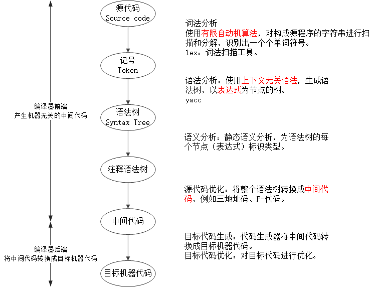

<h1 id=file_notes>
    程序员的自我修养——链接、装载与库
</h1>

<h2 id=ch_01>
    温故而知新
</h2>

* 站在程序员的角度看计算机：中央处理器CPU、内存和IO控制芯片。
* 计算机科学领域的任何问题都可以通过增加一个间接的中间层来解决。
* 操作系统：充分利用CPU。裸机、多道程序、分时系统、多任务系统。
* 虚拟内存与MMU：段页式内存管理方法。
* 多进程与多线程：创建、调度与同步（进程/线程安全）。

<h2 id=ch_02>
    编译和链接
</h2>

从源代码文件到可执行文件需要四步，本书重点介绍编译和链接两个部分。
* 预处理 Prepressing
* `编译 Compilation`
* 汇编 Assembly
* `链接 Linking`

编译：将高级语言翻译成机器语言。
* 扫描 Scanner
* 语法分析 Parser
* 语义分析 Semantic Analyzer
* 源代码优化 Source Code Optimizer
* 目标代码生成 Code Generator
* 目标代码优化 Final Target COde

经编译产生的目标代码，其外部`符号`的地址还未确定，需要链接器器`重定位`后，才能够执行。

* 符号 Symbol：在链接中，统一将函数和变量统称为符号。函数名或变量名就是`符号名`。
* 重定位 Relocation：重新计算各个符号的地址的过程。每个要被修正的地方叫一个`重定位入口`。

链接的主要过程：
* 地址和空间分配，Address and Storage Allocation
* 符号决议，Symbol Resolution
* 重定位，Relocation

