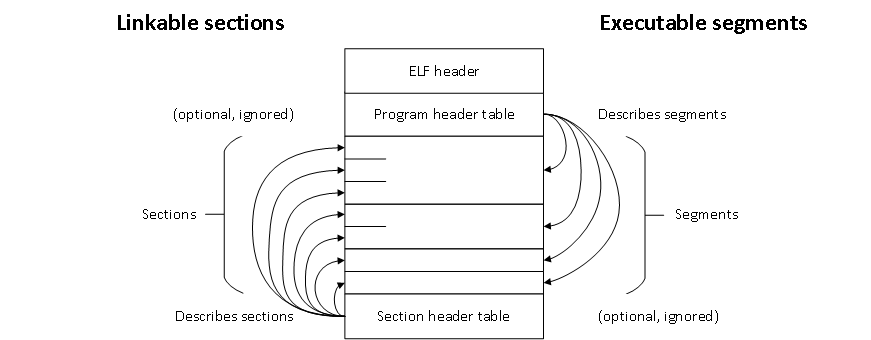
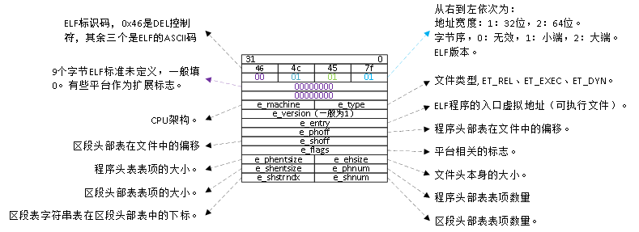
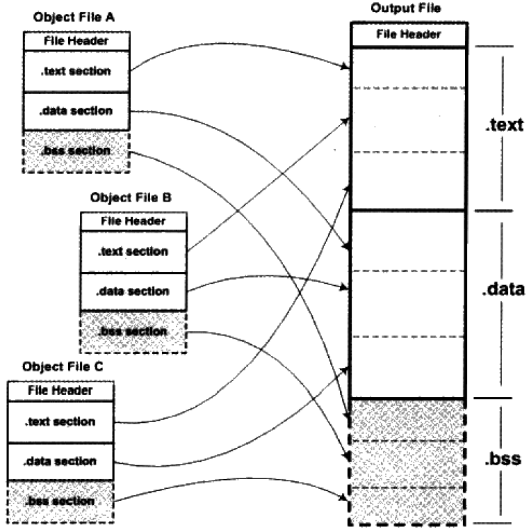
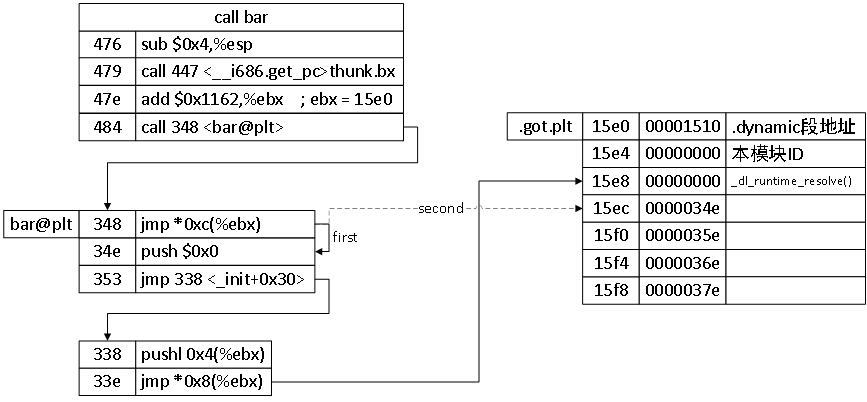

这里总结了《程序员的自我修养——链接、转载与库》、《链接器和加载器》的主要内容，包括ELF文件格式、静态链接、动态链接、程序的加载、动态库等（基于Linux平台），不包括Windows平台的知识点。显然，这是一份大纲，更加详细的内容，还请异步阅读原书。

对比两本书，其实内容差不多。就相关知识的全面性而言，《自我修养》稍微欠缺，《链接器和加载器》更为全面。但是《自我修养》比较容易上手阅读，知识递进很有层次，比较容易理解。《链接器和加载器》的内容跳转很大，章与章之间没有层次（可能是我太菜，无法理解）。比如前两章，第一章 链接和加载，第二章 体系结构的问题，直接把我整懵逼了，说的都是啥啊。个人建议先阅读《自我修养》，然后再阅读《链接器和加载器》，这样比较容易理解。

祭上书籍封面：

电子版下载链接：https://share.pkemb.com/books/


## 程序生命周期

先来看看程序的生命周期，之后会按照图示的顺序依次介绍。


## 编译

编译的过程大致可以分为5步，更详细的内容可以参考龙书。

1. 词法分析
2. 语法分析
3. 中间代码生成
4. 中间代码优化
5. 目标代码生成


## ELF文件格式

在正式介绍链接、库、加载之前，首先来看看ELF文件的格式，这是后面内容的基础。ELF格式是在`UNIX System V`中引入的，用来支持`C++`和动态链接。现在ELF被广泛用于Linux、BSD等类UNIX系统。以下是常见的目标文件格式，有关这些格式的说明，可以参考《链接器和加载器》第3章。
* 空目标文件格式：MS-DOS的COM文件
* 代码区段：UNIX的a.out文件
* 重定位：MS-DOS的EXE文件
* 可重定位的a.out格式
* UNIX的ELF格式
* IBM 360目标格式
* 微软PE格式
* Intel/Microsoft的OMF文件格式

### ELF 文件类型

ELF将文件分为4类，下表对比了不同类型之间的差异。

| 类型 | 链接 | 加载 | 说明 |
| - | - | - | - |
| 可重定位文件 | Y | N | 由编译器和汇编器创建，运行前需要被链接器处理。 |
| 可执行文件 | N | Y | 完成了所有的重定位工作和符号解析（除共享库符号）。 |
| 共享目标文件 | Y | Y | 即包括链接器需要的符号信息，也包括运行时可以直接执行的代码。 |
| 核心转储文件 | - | - | - |

编译器、汇编器和链接器将ELF文件看作是`Section header table`描述的一系列逻辑区段（`section`）的集合；加载器将ELF文件看作是`Program header table`描述的一系列段（`segment`）的集合。一个段通常由多个区段组合。可重定位文件有`Section header table`，可执行文件有`Program header table`，共享目标文件两者都有。



### ELF 文件头

ELF文件都以ELF文件头开始，在32位机器上通过结构体`Elf32_Ehdr`来描述。重点关注`e_shoff`和`e_phoff`，通过这两个字段可以寻找到区段头部表和程序头部表，从而可以定位到其余所有的区段和段。

readelf -h elffile



### ELF可重定位文件

可重定位文件可以看作是一系列在区段头部表（Section header table）中被定义的区段的集合。区段头部表是一个以`Elf32_Shdr`结构体为元素的数组，数组中的每一个元素对应一个段。

readelf -S objfile.o \
objdump -h

| 字段 | 说明 |
| - | - |
| sh_name | 区段名，存储在区段`.shstrtab`的偏移。 |
| sh_type | [区段类型](#区段类型) |
| sh_flags | [区段标志位](#区段标志位) |
| sh_addr | 可加载区段在进程地址空间中的虚拟地址，不可加载区段为0。|
| sh_offset | 区段在文件中的偏移。区段不在文件中则为0。 |
| sh_size | 区段的长度。 |
| sh_link | 段链接信息，存储的是相关信息的区段号。|
| sh_info | 区段更多的信息。|
| sh_addralign | 段地址对齐，2的指数倍。|
| sh_entsize | 区段为一个表时，表项的大小。|

#### 区段类型

区段常见的类型有：

| 类型 | 说明 |
| - | - |
| SHT_PROGBITS | 程序内容，包括代码、数据和调试器信息。|
| SHT_NOBITS | 在文件中没有分配空间，在程序加载时分配空间，例如.bss区段。|
| SHT_SYMTAB / SHT_DNYSYM | [符号表](#符号表)。SHT_SYMBAT包含所有的符号，SHT_DNYSYM包含动态链接的符号，会被加载到内存。<br> readelf -s <br> objdump -t |
| SHT_STRTAB | 字符串表。 |
| SHT_REL / SHT_RELA | 重定位表，包含重定位信息。<br> objdump -r <br> objdump -R |
| SHT_DYNAMIC | 动态链接信息。<br> readelf -d |
| SHT_HASH | 哈希表。 |

#### 区段标志位

区段标志位表示该区段在进程虚拟地址空间中的属性。

| 标志 | 说明 |
| - | - |
| SHF_WRITE | 在进程空间中可写。 |
| SHF_ALLOC | 在进程空间中要分配空间。|
| SHF_EXECINSTR | 在进程空间中可以被执行。|

可重定位文件一般有如下区段：
* .text，正文段，具有ALLOC+EXECINSTR属性的PROGBITS类型区段。
* .data，数据段，具有ALLOC+WRITE属性的PROGBITS类型区段。
* .rodata，只读数据段，具有ALLOC属性的PROGBITS类型区段。
* .bss，具有ALLOC+WRITE属性的NOBITS类型区段。
* .rel.text, .rel.data, .rel.rodata，REL或RELA类型区段，包含对应区段的重定位信息。
* .init和.finit，具有ALLOC+EXECINSTR属性的PROGBITS类型区段，对C++来说时必须的。
* .symtab，符号表，SYMTAB类型的区段。
* .dnysym，动态链接符号表，具有ALLOC属性的DNYSYM类型区段。
* .strtab，字符串表，STRTAB类型的区段，通常保存符号的字符串。
* .shstrtab，段表字符串表，通常存储段名字符串。
* .dnystr，ALLOC属性的STRTAB类型区段，通常保存动态链接符号的字符串。
* .got
* .plt
* .line
* .comment
* .interp

### ELF可执行文件

程序头部表是一个以`Elf32_Phdr`结构体为元素的数组，定义了要被映射的段。可执行文件通常只有少数几种段，例如可读可执行的代码段，可读可写的数据段，只读的只读数据段。将可加载的区段合并到合适的段，可以加快映射的速度。

readelf -l execfile

| 字段 | 说明 |
| - | - |
| p_type | 段的类型。LOAD、DYNAMIC、INTERP等。 |
| p_offset | 段在文件中的偏移。 |
| p_vaddr | 段在进程虚拟地址空间的起始地址。|
| p_paddr | 物理装载地址。|
| p_filesz | 段在文件中所占空间的大小。|
| p_memsz | 段在虚拟地址空间中所占用的长度。|
| p_flags | 段的权限，RWX。|
| p_align | 对齐，2的指数幂。|

### ELF共享目标文件

ELF第三种文件类型是共享目标文件，它包含了可重定位文件和可执行文件的所有东西。也就是说，共享目标文件既可以参与链接，也可以被加载到内容中执行。

### 符号表

符号表是`Elf32_Sym`结构体数组，段名一般叫`.symtab`，每个表项定义了一个符号。

readelf -s \
objdump -t \
objdump -T

* st_name：符号名，字符串表的下标。
* st_size：符号大小。
* st_shndx：符号所在的段。
  * 符号所在的段在段表中的下标。
  * SHN_ABS：该符号包含了一个绝对的值，例如文件名的符号。
  * SHN_COMMON：该符号是一个“COMMON块”类型的符号，例如未初始化的全局符号定义。
  * SHN_UNDEF：符号未定义，该符号在本文件中被引用，但是定义在其他文件。
* st_info：符号类型和绑定信息
  * 高28位表示符号绑定信息（Symbol Binding）
    * STB_LOCAL：局部符号，对目标文件的外部不可见。
    * STB_GLOBAL：全局符号，外部可见。
    * STB_WEAK：若引用。
  * 低4位表示符号的类型（Symbol Type）
    * STT_NOTYPE：未知类型符号
    * STT_OBJECT：该符号是一个数据对象，比如变量、数组。
    * STT_FUNC：该符号是函数或其他可执行代码。
    * STT_SECTION：该符号是一个段，一定是STB_LOCAL。
    * STT_FILE：目标文件对应的源文件名，一定是STB_LOCAL，st_shndx一定是SHN_ABS。
* st_value：符号值
  * 目标文件
    * SHN_UNDEF：st_value没有用。
    * SHN_COMMON：表示该符号的对齐属性。
    * 段的下标：st_value表示该符号在段中的偏移位置。
  * 可执行文件
    * st_value表示符号的虚拟地址。

## (静态)链接和重定位

> 参考：
> 《链接器和加载器》第4章，《程序员的自我修养》第4章。

对于链接器而言，链接的整个过程将多个输入目标文件加工合并成一个输出文件。对于静态链接而言，主要过程分为两步：

1. 空间与地址分配：相似段合并，分配空间，收集符号定义和引用，构建全局符号表。
2. 符号解析与重定位：读取输入文件中段的数据、重定位信息，并且进行符号解析与重定位、调整代码中的地址等。

### 空间与地址分配

链接器的首要任务是分配空间，只有分配了空间，链接器才可以继续进行后续的符号解析与重定位。这里的空间与地址，有两重含义，其一是输出的可执行文件的空间，其二是装载后的虚拟地址中的虚拟地址空间。对于有实际数据的段（例如.data），两个都要分配。而.bss段只要分配第二个。实际上更加关心虚拟地址空间的分配，因为这关系到虚拟地址的计算。

对于有多个段的目标文件，一般会将输入文件中所有相同性质的段合并到一起，例如输入文件.text段合并到输出的文件的.text段。如下图所示。

所有带有ALLOC标志的区段都要分配虚拟地址空间，一般按照区段头部表的排列顺序依次分配，因为区段的排列顺序一般是代码段、数据段、bss段。当然，空间分配还要考虑区段的对齐属性，以及页对齐。



#### 符号地址的确定

空间分配完成之后，各个段的虚拟地址就确定了。而符号在段内的偏移是固定的，所以符号的地址就可以确定了。

### 符号解析和重定位

在完成空间分配之后，就进入到了符号解析和重定位，这是链接最关键的步骤。编译时，编译器会将需要重定位的符号收集到对应区段的重定位表。链接器会根据重定位表确定需要重定位的符号，然后查找所有输入目标文件符号表组成的全局符号表，确定符号的地址，然后根据指令修正方式修正指令。

#### 重定位表

重定位表包含相应区段的重定位信息。如果.text段需要重定位，则对应的重定位表是.rel.text。重定位表是`Elf32_Rel`结构体数组，每一个项都定义了一个重定位入口。

objdump -r \
readelf -r

| 字段 | 说明 |
| - | - |
| r_offset | 可重定位文件：要修正的位置的第一个字节相对于段起始的偏移。<br>可执行文件或共享库文件：要修正的位置的第一个字节的虚拟地址。|
| r_info | 低8位：重定位入口的类型。<br>高24位：重定位入口的符号在符号表的下标。|

#### 指令修正

TODO: 与系统的指令集有关，比较复杂。可以阅读《自我修养》第109页。

### 链接的其他细节

* 弱符号和强符号
  * 弱符号可以在多个目标文件中定义，占用空间以最大的那个为准。
  * 强符号会覆盖弱符号。
  * 典型的弱符号是未初始化的全局变量，其符号类型是SHN_COMMON。
* 符号修饰
  * C++为了支持类、继承、重载、命名空间等特性，会对符号进行修饰。
  * 可以使用`c++filt`查看修饰之前的符号。
* 重复代码消除
  * 例如C++模板，将每个实例化放置在单独的段，从而识别出不同目标文件的相同实例化。
  * 函数级别链接，将每个函数/变量放置在一个单独的段，`ffunntion-sections`，`-fdata-sections`。
* 全局构造和析构
  * 构造函数放置在`.init`段，在`main()`函数之前执行。
  * 析构函数放置在`.finit`段，在`main()`函数之后执行。
* ABI
  * Application Binary Interface
  * 包含符号修饰、变量内存布局、函数调用方式等二进制兼容性相关的内容。
  * ABI兼容非常难做到。例如，同时链接A公司用A编译器编译的库和B公司用B编译器编译的库。

### 链接过程控制

在一些特殊的场景下，比如内核、bootloader，由于一些特殊的限制，需要指定输出文件中段的名称、段的虚拟地址、段的摆放顺序等，这就需要我们控制整个链接的过程，常见的有三种方法，主要介绍第三种方法。
1. 命令行参数
2. 链接指令存放在目标文件
3. 链接控制脚本

使用指令`ld -verbose`可以查看默认的链接控制脚本，使用`-T link.lds`选项指定自定义的链接控制脚本。下面是一个链接控制脚本的例子，有关链接控制脚本的更多语法信息，请阅读[GNU linker官方文档](https://sourceware.org/binutils/docs/ld/Scripts.html)。

```ld
ENTRY(nomain)

SECTIONS
{
  . = 0x08048000 + SIZEOF_HEADERS
  tinytext : { *(.text) *(.data) *(.rodata) }
  /DISCARD/ : { *(.comment) }
}
```

举例：`little kernel`创建APP的宏。

## 动态链接

动态链接是指链接推迟到了运行时再进行，其基本思想是将程序拆分分为多个独立的模块，在运行时再链接为一个完整的程序。由于动态链接涉及运行时的链接及多个文件的装载，所以这需要操作系统的支持。在Linux系统，ELF动态链接文件被称为动态共享文件（Dynamic Shared Objects），一般以.so结尾。

### 为什么需要动态链接？

其实静态链接的缺点就是引入动态链接的原因：
* 浪费内存和磁盘空间：对于一些公共库，在每个程序都存在一份拷贝，浪费了宝贵的内存空间。
* 不利于程序升级：如果引用的第三方库升级了，那么程序需要重新编译，并升级一个很大的程序包。
* 程序兼容性不强，需要针对平台分别开发、分别编译。

动态链接也是有缺点的：
* 程序的加载地址变得不确定了，对重定位提出了更高的要求。
* 程序启动变慢了
* 平台上的库与程序引用的库版本不一致，导致程序无法运行。

### 地址无关代码

当加载动态库时，首先会遇到加载地址的问题。为了防止共享对象的地址冲突，加载地址需要满足以下两个条件：
1. 动态库在编译时不能假定其加载地址。
2. 同一个动态库在不同进程的加载地址可能是不同的。

第一个限制可以通过`装载时重定位`来解决。即链接时对所有绝对地址的引用不作重定位，而把这一步退迟到装载时再完成。为了支持`装载时重定位`，编译选项需要加上`-shared`。

动态共享库的一大特点是多个进程共享同一份代码，每个进程都有自己的数据副本。由于共享库在不同进程的加载地址是不同的，所以重定位后指令的修改结果是不同的，导致指令部分无法在进程之间共享。这可以通过`地址无关代码`来解决，其解决的思路是将指令要修改的部分分离出来，与数据放在一起。为了产生地址无关代码，编译选项需要加上`-fPIC`。

考虑4种不同的地址引用方式：
1. 调用模块内部的函数。
2. 访问模块内部的数据。
3. 调用模块外部的函数。
4. 访问模块外部的数据。

对于第一种情况，函数之间的相关位置都是固定的，所以无需重定位，相对地址调用即可。

第二种情况，与第一种情况类似。通过PC指令寻址来访问数据。

第三种情况，ELF创建了一个名为`GOT`的全局偏移表，表中存储了指向模块外部函数的指针。当调用外部函数时，先定位`GOT`表获取函数指针，再调用函数。由于`GOT`表是模块内部的数据，寻址方法与第二种情况一样。

第四种情况与第三种情况也是类似的。

`GOT`表一般存储在区段`.got`中。显然，`.got`在加载时需要经过重定位，这部分工作由动态链接器来完成。我们可以通过动态重定位表（objdump R）来确定`GOT`中每个表项对应的符号，它们的重定位类型一般是`GLOB_DAT`。

从下面的示例可以看出，`.got`有四个表项，可以从重定位表看出每个表项对应的符号。

```
[pk@localhost ~]$ objdump -R pic.so

DYNAMIC RELOCATION RECORDS
OFFSET   TYPE              VALUE
000015d0 R_386_GLOB_DAT    __gmon_start__
000015d4 R_386_GLOB_DAT    _Jv_RegisterClasses
000015d8 R_386_GLOB_DAT    b
000015dc R_386_GLOB_DAT    __cxa_finalize

[pk@localhost ~]$ readelf -S pic.so
There are 26 section headers, starting at offset 0x7b4:

Section Headers:
  [Nr] Name              Type            Addr     Off    Size   ES Flg Lk Inf Al
  [19] .got              PROGBITS        000015d0 0005d0 000010 04  WA  0   0  4
```

### 延迟绑定

动态链接的程序需要在运行时完成链接，并完成GOT的定位，这导致程序的运行速度必定会减慢。考虑到很多函数在程序执行完毕时都不会被用到，对这些函数进行链接就是一种浪费。ELF使用延迟绑定来解决这个问题，其基本思想是函数第一次被用到时才进行绑定，如果没有用到则不进行绑定。

下面是延迟绑定的示意图。左边是三个代码块，右边是`.got.plt`存储的数据。当调用`bar()`函数时，实际调用的是`bar@plt`。



### 动态链接的数据结构

#### .interp

`.interp`段存储了动态链接器的路径。动态链接器负责装载动态库，并完成动态库的重定位。

```
$ readelf -l /bin/ls | grep interpreter
  [Requesting program interpreter: /lib64/ld-linux-x86-64.so.2]
```

#### .dynamic

`.dynamic`段存储了动态链接器所需要的基本信息，它是结构体`Elf32_Dyn`数组，结构体定义如下。由一个类型值加上一个附加的数值或指针。

```c
typedef struct {
  Elf32_Sword d_tag;
  union {
    Elf32_Word d_val;
    Elf32_Addr d_ptr;
  } d_un;
} Elf32_Dyn;
```

```
readelf -d lib.so
```

常见的类型值如下：

| d_tag类型 | d_un的含义 |
| - | - |
| DT_SYMTAB | 动态链接符号表的地址`.dynsym`的地址。 |
| DT_STRTAB | 动态链接字符串表`.dynstr`的地址。 |
| DT_STRSZ | 动态链接字符串表的大小，d_val表示大小。 |
| DT_HASH | 动态链接哈希表的地址。 |
| DT_SONAME | 本共享对象的SO-NAME。 |
| DT_RPATH | 动态链接共享对象搜索路径。 |
| DT_INIT | 初始化代码地址。 |
| DT_FINIT | 结束代码地址。 |
| DT_NEED | 依赖的共享对象文件，`d_ptr`表示所依赖的共享对象文件名。 |
| DT_REL<br>DT_RELA | 动态链接重定位表地址。 |
| DT_RELENT<br>DT_RELAENT | 动态重读位表入口地址。 |

#### 动态符号表

动态符号表`.dynsym`存储了动态链接所需要的符号信息，而普通的符号表`.symtab`包含了所有的符号信息。`.dynsym`的符号名存储在表`.dynstr`。

```
readelf -d lib.so
```

#### 动态链接重定位表

```
readelf -r lib.so
```

动态链接需要在运行时修正`GOT`表和数据段的绝对引用，`.rel.dyn`修正`.got`和数据段，`.rel.plt`修正`.got.plt`。下面是`.rel.dyn`和`.got`的一个示例。`GLOB_DAT`是一种比较简单的重定位类型，直接填上对应符号的地址即可。

```
Relocation section '.rel.dyn' at offset 0x2c0 contains 5 entries:
 Offset     Info    Type            Sym.Value  Sym. Name
000015d0  00000106 R_386_GLOB_DAT    00000000   __gmon_start__
000015d4  00000206 R_386_GLOB_DAT    00000000   _Jv_RegisterClasses
000015d8  00000306 R_386_GLOB_DAT    00000000   b
000015dc  00000506 R_386_GLOB_DAT    00000000   __cxa_finalize

Contents of section .got:
 15d0 00000000 00000000 00000000 00000000  ................
```

<h4 id=ch_7.5.5>动态链接时进程堆栈初始化信息</h4>

当操作系统将控制权交给动态链接器的时候，会通过堆栈传递`辅助信息数组（Auxiliary Vectory）`，此数组是`Elf32_auxv结构体数组`。

```c
typedef struct
{
  uint32_t a_type;
  union
  {
    uint32_t a_val;
  } a_un;
} Elf32_auxv_t;
```

常见的类型及含义如下表：

| a_type定义 | a_type值 | a_val含义 |
| - | -| - |
| AT_NULL | 0 | 表示辅助信息数组结束。 |
| AT_EXEFD | 2 | 可执行文件的句柄。执行可执行文件时，操作系统会打开此文件。动态链接器可使用操作系统的文件读写操作来访问可执行文件。 |
| AT_PHDR | 3 | 程序头表在进程中的地址。动态链接器也可以直接访问进程的VMA来访问可执行文件。 |
| AT_PHENT | 4 | 程序头表每个表项的大小。 |
| AT_PHNUM | 5 | 程序头表表项的数量。 |
| AT_BASE | 7 | 动态链接器本身的装载地址。 |
| AT_ENTRY | 9 | 可执行文件入口地址。 |

示例程序：[print_stack.c](code/print_stack.c)。相比书中的示例，增加了对64位的支持。

### 动态链接的步骤

动态链接基本上分为三步：
* 启动动态链接器
* 装载所有需要的共享对象
* 重定位和初始化

#### 动态链接器自举

动态链接器本身也是一个共享对象，相对于一般的共享对象，有以下限制：
1. 动态链接器不能依赖其他任何共享对象。
2. 动态链接器本身所需要的全局和静态变量的重定位工作由它本身完成。

对于第一个限制，可以人为的控制，不使用任何库。对于第二个限制，使用一段非常巧妙的`自举`代码来完成。

自举代码的限制（以下操作需要重定位，没有完成自举之前，无法操作）：
1. 不能使用全局和静态变量。
2. 不能调用函数，动态链接器本身的函数也不行。

自举的主要流程：
1. 找到自己的GOT。
2. 根据GOT第一项得到.dynamic的地址
3. 根据.dynamic段的信息，获取动态链接器本身的重定位表和符号表等，从而得到重定位入口。
4. 完成重定位。

#### 装载共享对象

动态链接器自举完成之后，将可执行文件和动态链接器的符号表都合并到`全局符号表`。同时，根据可执行文件`.dynamic`段中的`DT_NEEDED`项，找出可执行文件依赖的所有共享对象，并将共享对象的名字放入到`装载集合`中。

遍历装载集合，打开共享对象并装载到进程的虚拟空间，将共享对象的符号表合并到全局符号表。如果共享对象还依赖其他的共享对象，依赖的共享对象名字也会加入到装载集合中。

<b>全局符号介入</b>

考虑到不同的共享对象可能定义了同一个符号。当一个符号需要被加入到全局符号表时，如果相同的符号名已经存在，那么后加入的符号被忽略。这种现象被称为共享对象`全局符号介入`。所以当程序使用大量共享对象时应该非常小心符号名的重名问题。

<b>全局符号介入与地址无关代码</b>

由于全局符号介入的存在，共享对象对于模块内函数的调用，不能简单的当作是相对地址调用。如果函数被全局介入到其他模块，那么相对地址调用需要重定位，这与地址无关代码相违背。

所以模块的内部函数调用，需要当作模块外部符号处理。为了提高调用的速度，可以使用static关键字修饰函数，告诉编译器，此函数不会被外部模块调用，使用相对地址调用。

演示：将[pic.c](code/pic/pic.c)中的`bar()`函数添加`static`修饰，然后查看反汇编代码。

#### 重定位和初始化

共享对象加载完毕之后，动态链接器开始重新遍历可执行文件和每个共享对象的重定位表，将他们的GOT/PLT中的每个需要重定位的位置进行修正。

重定位完成之后，如果某个共享对象有.init段，那么动态链接器会执行.init段中的代码，实现共享对象特有的初始化过程。如果有.finit段，那么进程退出的时候会执行。

以上操作完成之后，动态链接器将执行权转交给可执行文件，并开始执行。

演示：使用`LD_DEBUG=libs`执行一个程序。

### 显示动态链接

## 库

* 静态库
* 静态共享库
* 动态共享库

## 加载

## 学习资料

https://paper.seebug.org/papers/Archive/refs/elf/