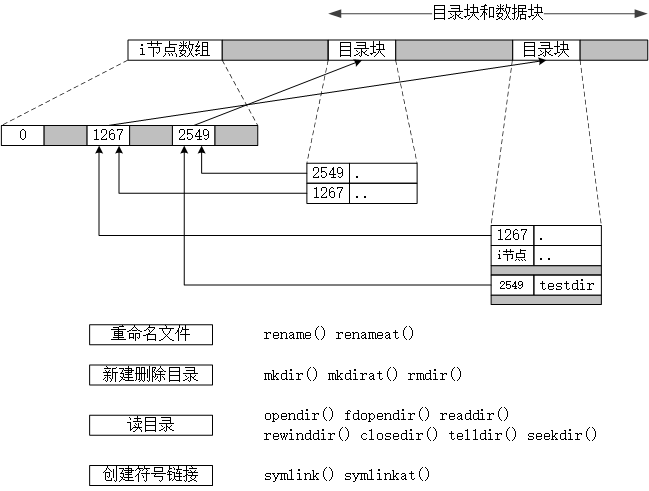

# UNIX环境高级编程

> 简介
> 待填坑

# 第01章 UNIX基础知识

> 本章从程序员的角度快速浏览`UNIX`，对书中引用的一些术语和概念进行简要的说明并给出示例。在以后的示例中，将对这些概念做更详细的说明。对于初涉UNIX环境的程序员，本章还简要介绍了`UNIX`提供的各种服务。

*待填坑*

# 第02章 UNIX标准及实现

> 本章首先回顾过去`25`年人们在`UNIX`标准化方面做出的种种努力，然后讨论这些`UNIX`编程标准对本书所列举的各种UNIX操作系统实现的影响。所有标准化工作的一个重要部分是对每种实现必须定义的各种限制进行说明，所以我们将说明这些限制以及确定它们值得各种方法。

*待填坑*

# 第03章 文件I/O

> 本章开始讨论`UNIX`系统，说明可用的文件`I/O`函数————打开文件、读文件、写文件等。`UNIX`系统中的大多数文件`I/O`只需用到`5`个函数：`open`、`read`、`write`、`lseek`以及`close`。然后说明不同缓冲长度对`read`和`write`函数的影响。

## 文件描述符

```c
内核通过文件描述符引用文件。
文件描述符是一个非负整数，介于 0 ~ OPEN_MAX-1 之间。

标准输入：0   STDIN_FILENO
标准输出：1   STDOUT_FILENO
标准错误：2   STDERR_FILENO
注：建议使用宏而不是常数。
```

## 函数open和openat

```c
int open(const char *path, int oflag, ... /* mode_t mode */);
int openat(int fd, const char *path, int oflag, ... /* mode_t mode */);

头文件：fcntl.h
功能：打开或创建一个文件
返回值：
    若成功，返回最小的，没有使用的文件描述符；
    若出错，返回-1。
形参说明：
    path：打开或创建文件的名字
    oflag：说明此函数的多个选项，
           用一个或多个常量进行位或运算构成，具体见下表。
    mode：最后一个参数，可选参数，仅创建文件时才使用，指定创建文件的权限。
    fd：把openat函数和open函数区分开，有三种可能：
        (1) path是绝对路径，openat 等同于 open。
        (2) path是相对路径，开始地址是 fd 指向的目录。
        (3) path是相对路径，fd 参数具有特殊值 AT_FDCWD，开始地址是 当前工作目录。
示例代码：
char path[] = "test_file.txt";
```

| 类别 | 选项 |
| - | - |
| 打开文件的用途 | O_RDONLY O_WRONLY O_RDWR O_EXEC O_SEARCH |
| 常用标志 | O_CREAT O_EXCL O_CLOEXEC O_DIRECTORY |
| 针对特殊文件 | O_NOFOLLOE O_NONBLOCK O_NOCTTY O_TTY_INIT |
| 文件偏移量 | O_APPEND O_TRUNC |
| 同步选项 | O_SYNC O_DSYNC O_RSYNC |

| 序号 | flag | 说明 | 备注 |
| - | - | - | - |
| 1 | O_RDONLY | 只读打开 |  |
| 2 | O_WRONLY | 只写打开 | |
| 3 | O_RDWR | 读、写打开 |  |
| 4 | O_EXEC | 只执行打开 | |
| 5 | O_SEARCH | 只搜索打开，应用于目录，支持的系统较少。 | 1~5互斥，只能指定一个 |
| 6 | O_APPEND | 每次写时都追加到文件的尾端。 |  |
| 7 | O_CLOEXEC | 把FD_CLOEXEC常量设置为文件描述符标志。 | 执行时关闭。 |
| 8 | O_CREAT | 若此文件不存在则创建它。 | 使用此选项时，需要指明 open/openat 函数的最后一个参数。 |
| 9 | O_DIRECTORY | 如果path引用的不是目录，则出错。 |  |
| 10 | O_EXCL | 如果同时指定了O_CREAT，而文件存在，则出错。 | 用此可以测试一个文件是否存在，如果不存在则创建。并且测试和创建是一个原子操作。 |

## 函数create

```c
int creat(const char *path, mode_t mode)

头文件：fcntl.h
功能：创建一个新文件。
返回值：
    若成功，返回为只写打开的文件描述符。
    若出错，返回-1。
形参说明：
    path：创建文件的名字。
    mode：新文件的访问权限位。
示例代码：
    open函数可以替代creat函数。
    creat(path, mode); <==> open(path, O_WRONLY | O_CREAT | O_TRUNC, mode);

    以读写方式创建一个文件：
    open(path, O_RDWR | O_CREAT | O_TRUNC, mode);
```

## 函数close

```c
int close(int fd);

头文件：unistd.h
功能：
    关闭一个打开的文件。

返回值：若成功，返回0；若失败，返回-1。
形参说明：
    fd：文件描述符。
注：
1、当一个进程终止时，将 自动 关闭它所有的打开文件。
   可以不显式调用此函数关闭。
2、关闭一个文件时，还将释放该进程加在该文件上的所有记录锁。
示例代码：
    close(STDOUT_FILENO);
```

## 函数lseek

```c
头文件：
功能：
返回值：
形参说明：
示例代码：
```

## 函数read

```c
头文件：
功能：
返回值：
形参说明：
示例代码：
```

## 函数write

```c
头文件：
功能：
返回值：
形参说明：
示例代码：
```

## I/O的效率

## 文件I/O的数据结构

## 原子操作

## 函数dup和dup2

```c
头文件：
功能：
返回值：
形参说明：
示例代码：
```

# 第04章 文件和目录

> 本章将描述文件系统的其他特性和文件的性质。我们将从`stat`函数开始，逐个说明`stat`结构的每一个成员以了解文件的所有属性。

## 函数stat、fstat、fstatat、lstat

```c
int stat(const char *pathname, struct stat *buf);
int fstat(int fd, struct stat *buf);
int lstat(const char *pathname, struct stat *buf);
int fstatat(int fd, const char *pathname, struct stat *buf, int flag);

头文件：sys/stat.h
功能：获取文件的信息结构。
返回值：若成功返回0，出错返回-1。
说明：
    stat()获取文件pathname的信息结构；
    如果文件是符号链接，lstat()将返回符号链接本身的信息，而不是指向的文件。
    fstat()返回在描述符fd上打开的文件的信息结构。

    fstatat() 返回相对于当前打开目录(fd)的路径名的信息结构。
    flag参数：AT_SYMLINK_NOFOLLOW被置位，返回符号链接本身的信息，而不是指向的文件。
    (1)pathname是绝对路径，忽略fd参数。
    (2)pathname是相对路径，开始地址是 fd 指向的目录。
    (3)pathname是相对路径，fd 参数等于 AT_FDCWD，开始地址是 当前工作目录。
```

示例代码：[lstat.c](code/ch04/test_lstat.c)

## 文件类型

下表列出了UNIX系统的文件类型。文件类型存储在`stat`结构体中的`st_mode`成员中，可用下表中的宏`S_ISxxx()`来测试文件类型。将`st_mode`与宏`S_IFMT`位与，然后和宏`S_IFxxx`比较，也可以得到文件类型。即：

```c
#define S_ISDIR(mode)    (((mode) & S_IFMT) == S_IFDIR)
```

| 文件类型 | 说明 | 宏 |
| - | - | - |
| 普通文件 regular file | 最常用的文件类型，包含了某种形式的数据。 | S_ISREG() S_IFREG |
| 目录文件 directory file | 包含了其他文件的名字以及指向这些文件有关信息的指针。 | S_ISDIR() S_IFDIR |
| 块特殊文件 block special file | 提供对设备带缓冲的访问，每次访问以固定长度进行。 | S_ISBLK() S_IFBLK |
| 字符特殊文件 character special file | 提供对设备不带缓冲的访问，每次访问长度可变。 | S_ISCHR() S_IFCHR |
| FIFO | 用于进程间通信，有时也称为命名管道。 | S_ISFIFO() S_IFFIFO |
| 套接字 socket | 用于进程间的网络通信。 | S_ISSOCK() S_IFSOCK |
| 符号链接 symbolic link | 指向另一个文件。 | S_ISLNK() S_IFLNK |

```c
示例代码：
    struct stat sta = {0};
    /* init stat from file */
    if (S_ISREG(sta.st_mode))
        printf("regular file\n");
```

## 设置用户ID (SUID) 和设置组ID (SGID)

与<font color="red"><b>进程</b></font>相关的ID。通常，<font color="red">有效用户ID</font>等于<font color="red">实际用户ID</font>；<font color="blue">有效组ID</font>等于<font color="blue">实际组ID</font>。

| ID | 说明 |
| - | - |
| <font color="red">实际用户ID</font>、<font color="blue">实际组ID</font> | 实际上是谁，在登录时取自口令文件中的登录项</td>
| <font color="red">有效用户ID</font>、<font color="blue">有效组ID</font>、附属组ID | 用于文件访问检查 |
| <font color="red">保存的设置用户ID</font> | 有效用户ID的副本 |
| <font color="blue">保存的设置组ID</font> | 有效组ID的副本 |

与<font color="red"><b>文件</b></font>相关的ID

文件所有者：`stat` 结构中的 `st_uid` \
文件所属组：`stat` 结构中的 `st_gid`

当执行一个文件时，(进程的)有效用户ID等于(登录用户的)实际用户ID。也就是说，与文件没有关系。如果文件的`设置用户ID（SUID）`置位，那么，(进程的)有效用户ID等于文件的所有者。

有效组ID也是类似的。

SUID 和 SGID 存储在 stat 结构体中的 st_mode 成员中。可用宏 S_ISUID() S_ISGID() 测试。

## 文件访问权限

`st_mode`包含了对文件的访问权限位，可用以下宏来测试。
| st_mode屏蔽位 | 含义 | st_mode屏蔽位 | 含义 | st_mode屏蔽位 | 含义 |
| - | - | - | - | - | - |
| S_IRUSR | 用户读 | S_IWUSR | 用户写 | S_IXUSR | 用户执行 |
| S_IRGRP | 组读 | S_IWGRP | 组写 | S_IXGRP | 组执行 |
| S_IROTH | 其他读 | S_IWOTH | 其他写 | S_IXOTH | 其他执行 |

文件访问权限的规则：
1) 打开任一类型的文件，对该名字中包含的每一个目录，以及当前工作目录，都要有执行权限。
> 目录的读权限：获取该目录中所有文件名的列表 \
> 目录的执行权限：可通过该目录访问一个文件 \
> 如果PATH变量指定了一个不具有执行权限的目录，shell不会在此目录下寻找可执行文件
2) 文件的读权限：打开文件进行读操作。
> 与open 函数的 O_RDONLY 和 O_RDWR 标志有关。
3) 文件的写权限：打开文件进行写操作。
> 与open函数的 O_WRONLY 和 O_RDWR标志有关。
4) open 函数指定 O_TRUNC 标志时，必须具有写权限。
5) 在目录中创建一个文件，对所在目录必须有写权限和执行权限
6) 删除一个文件，对所在目录必须有写权限和执行权限，对文件本身不需要读写权限。
7) exec执行某个文件，必须有执行权限，且是一个普通文件。

文件权限的测试： \
进程打开、创建、删除一个文件时，内核会进行权限的测试。
测试过程涉及到文件的所有者(`st_uid`)、文件的所属组(`st_gid`)，
以及进程的`有效用户ID`和`有效组ID`。
1) 如果进程的`有效用户ID`是root，允许访问（忽略了文件的权限位）
2) 如果进程的`有效用户ID`和文件的`st_uid`相同，如果所有者适当的访问权限位打开，则允许访问。否则拒绝访问。
3) 如果进程的`有效组ID`和文件的`st_gid`相同，如果所属组适当的访问权限位打开，允许访问，否则拒绝。
4) 若其他用户的适当权限位被设置，允许访问，否则拒绝。
> 注：如果（2）测试失败，则（3）和（4）不会测试；其他类似。 \
> 适当的访问权限是指：若进程为读而打开该文件，则用户读位应为1。其他类似。

## 新文件和目录的所有权

新文件（目录）的所有者是进程的有效用户ID。 \
新文件（目录）的组ID可以是下列之一： \
1) 进程的有效组ID
2) 所在目录的组ID（可以做到向下传递权限）
> 对于Linux来说，如果目录的设置组ID位（`SGID`）被设置，则是(2)；否则(1)。

<h2 id=ch_4.7>
函数 access 和 faccessat
</h2>

```c
int access(const char *pathname, int mode);
int faccessat(int fd, const char *pathname, int mode, int flag);

头文件：unistd.h
功能：以进程的实际用户ID和实际组ID来测试访问权限。
      open()函数使用有效用户ID和有效组ID来测试。
返回值：成功(有权限)返回0，出错(没有权限)返回-1。
形参说明：
    pathname：测试文件的文件名
    mode：测试的权限，详细见下表。
    flag：更改 faccessat()的行为，如果取值为 AT_EACCESS，
          访问检查用进程的有效用户ID和有效组ID。
    fd：
        (1)pathname 为绝对路径，忽略此参数。
        (2)pathname 为相对路径，fd 指出起始目录。
        (3)pathname 为相对路径，fd 取值为 AT_FDCWD，起始目录为当前工作目录。
```

形参`mode`指明需要测试的权限，按以下常量位或：

| mode | 说明 | 头文件 |
| - | - | - |
| R_OK | 测试读权限 | unistd.h |
| W_OK | 测试写权限 | unistd.h |
| X_OK | 测试执行权限 | unistd.h |
| F_OK | 测试文件是否存在 | unistd.h |

示例代码：[test_access.c](code/ch04/test_access.c]

## 函数 umask

```c
mode_t umask(mode_t cmask);

头文件：sys/stat.h
功能：为进程设置文件模式创建屏蔽字，并返回之前的值。
返回值：之前的文件模式创建屏蔽字。
说明：
    cmask：由 S_IRUSER S_IWUSR 等常量按位或构成。
           umask 中为1的位，新建文件对应的权限一定被关闭。
```

> 在shell中，可用umask命令查看或设置文件模式创建屏蔽字。

示例代码：[test_umask.c](code/ch04/test_umask.c]

## 函数 chmod、fchmod、fchmodat

```c
int chmod(const char *pathname, mode_t mode);
int fchmod(int fd, mode_t mode);
int fchmodat(int fd, const char *pathname, mode_t mode, int flag);

头文件：sys/stat.h
功能：更改现有文件的访问权限。
返回值：成功返回0，出错返回-1。
形参说明：
    pathname：文件名。
    mode：新的访问权限。下图所示常量的按位或。
    flag：取值为 AT_SYMLINK_NOFOLLOW时，不会跟随符号链接。

区别：
fchmod() 对已打开的文件进行操作。
fchmodat()：
           (1) pathname 为绝对路径，忽略fd参数。
           (2) pathname 为相对路径，fd 指出起始目录。
           (3) pathname 为相对路径，fd 取值为 AT_FDCWD，起始目录为当前工作目录。
```
> 为了改变一个文件的权限位，进程的`有效用户ID`必须等于`文件的所有者ID`或`root`。

| mode | 说明 |
| - | - |
| S_ISUID | 执行时设置用户ID |
| S_ISGID | 执行时设置组ID |
| S_ISVTX | 保存正文（粘着位） |
|  |  |
| S_IRWXU | 用户读、写和执行 |
| S_IRUSR | 用户读 |
| S_IWUSR | 用户写 |
| S_IXUSR | 用户执行 |
|  |  |
| S_IRWXG | 组读、写和执行 |
| S_IRGRP | 组读 |
| S_IWGRP | 组写 |
| S_IXGRP | 组执行 |
|  |  |
| S_IRWXO | 其他读、写和执行 |
| S_IROTH | 其他读 |
| S_IWOTH | 其他写 |
| S_IXOTH | 其他执行 |

`chmod()`将在下列条件自动清除两个权限位：
1) Solaris等系统，试图设置普通文件的S_ISVTX权限位，而没有root权限，那么S_ISVTX将会自动关闭。
2) 如果新文件的组ID不等于进程的有效组ID或者进程的附属组ID中的一个，而且进程没有root权限，那么S_ISGID会被自动关闭。
> 新创建文件的组ID可能是父目录的组ID。

## 粘着位

S_ISVTX，`粘着位`（sticky bit），也称为`保存正文位`（saved-text bit）。对于设置了`粘着位`的可执行文件或目录，有以下效果：
* 可执行文件
> 程序第一次被执行，在其终止时，程序正文部分的一个副本仍被保存在交换区。这使得下次执行该程序时能够较快的将其载入内存。
* 目录
> 只有对该目录有写权限，并且满足下列条件之一，才能删除或重命名该目录下的文件：
> * 拥有此文件
> * 拥有此目录
> * 是超级用户
>
> 典型应用：/tmp 目录。任何一个用户都可以在此目录创建文件，但是不能删除或重命名属于其他人的文件。

## 函数 chown、fchown、fchownat 和 lchown

```c
int chown(const char *pathname, uid_t owner, gid_t group);
int fchown(int fd, uid_t owner, git_t group);
int fchownat(int fd, const char *pathname, uid_t owner, git_t group, int flag);
int lchown(const char *pathname, uid_t owner, git_t group);

头文件：unistd.h
功能：更改文件的用户ID和组ID。
      若owner/group对应的取值为-1，表示不更改。
形参说明：
    pathname：文件名。
    owner：用户ID，若为-1，表示不更改。
    group：组ID，若为-1，表示不更改。

区别：
    fchown()在一个已打开的文件上操作，所以不能改变符号链接的uid/gid。
    lchown()更改符号链接本身的uid/gid。
    fchownat()：
        (1) pathname 是绝对路径，忽略参数fd。
        (2) pathname 是相对路径，fd参数指出起始目录。
        (3) pathname 是相对路径，fd参数是AT_FDCWD，起始目录是当前工作目录。
        flag：若设置了AT_SYMLINK_NOFOLLOW位，表示更改符号链接本身的uid/gid。
```

若_POSIX_CHOWN_RESTRICTED对指定的文件生效，则：
1) 只有超级用户进程能更改该文件的用户ID
2) 普通进程可以更改属于自己的文件的gid，但只能更改到进程的有效组ID或附属组ID。

非超级用户进程调用成功返回时，文件的设置用户ID位(`SUID`)设置组ID位(`SGID`)将被清除。

## 文件长度

* stat 结构成员 st_size 表示以字节为单位的文件长度。
> * st_size 只对普通文件、目录文件和符号链接有意义。
> * 普通文件：长度可以为0，在开始读取时，将得到文件结束标志（EOF）。
> * 目录文件：通常是一个数（16或512）的整数倍。
> * 符号链接：在文件名中的实际字节数。
> * 部分系统对管道也定义了文件长度，表示可从管道中读取的字节数。
* st_blksize：对文件IO较合适的块长度。
* st_blocks：所分配的实际512字节块块数。
> 并不是所有系统都是512B，此值是不可移植的。
* 文件中的空洞：设置的偏移量超过文件尾端，并写入某些数据后照成的。

查看文件大小的命令
* ls -l 以字节为单位
* du -s 以块为单位，一般情况下一块是512B
* wc -c 计算文件中的字符数

## 文件截断

```c
int truncate(const char *pathname, off_t length);
int ftruncate(int fd, off_t length);

头文件：unistd.h
功能：将文件的长度截断为length。
      如果length=0，可以在打开文件时指定 O_TRUNC 选项。
形参说明：
    pathname：
    fd：
    length：
说明：
length < old_length 文件缩小，超过 length 的部分将不可访问
length > old_length 文件增加，old_length 和 length 之间的数据读为0。
                    很有可能创建了一个空洞。
```

## 文件系统

<h3>磁盘、分区和文件系统</h3>

<div style="text-align:center">
	
</div>

* 磁盘
> * 磁盘可以有多个分区，每个分区有不同的文件系统。
> * 在一个分区中，有多个柱面。每个柱面，包含i节点数组、数据块、目录块。
* 数据块
> * 文件存储数据的地方
> * 一个文件可以有多个数据块
> * 一个数据块只能被一个文件所拥有
* 目录块
> * 存储目录文件数据的地方
> * 由`目录项`构成，`目录项`包含i节点编号和文件名
> * i节点编号可以理解为指向某个i节点，此i节点即为此目录下的文件。
> * 指向的i节点与目录块必须在同一个分区。
> * 有两个特殊的目录项：`.` 和 `..`。
* i节点
> * 包含了文件的大部分信息：文件类型、文件访问权限位、文件长度、指向文件数据块的指针。
> * 链接计数(st_nlink)：指向此i节点的目录项。减为0，才会删除该文件。

>> 由以上内容可以推出：
任何一个叶目录（不含任何文件）的链接计数总是2，
（1）命名该目录的目录项
（2）该目录中的 . 目录

<h3>UFS文件系统</h3>

<div style="text-align:center">
	
</div>

## 函数link、linkat、unlink、unlinkat和remove

```c
int link(const char *existingpath, const char *newpath);
int linkat(int efd, const char* existingpath, int nfd, const char*newpath, int flag);

头文件：unistd.h
功能：创建一个指向现有文件的链接。
      创建一个新目录项newpath，引用现有文件existingpath。
      existingpath所引用文件的链接计数加1。
      如果newpath已经存在，则返回出错。
返回值：成功返回0，出错返回-1。
形参说明：
    existingpath：现有目录项。
    newpath：新目录项。
    efd：
        (1) existingpath为绝对路径，忽略efd。
        (2) existingpath为相对路径，efd指明起始目录。
        (3) existingpath为相对路径，efd为AT_FDCWD，起始目录为当前工作目录。
    nfd：与efd类似。
    flag：(假设 existingpath 是个符号链接，且指向toppath)
        设置了 AT_SYMLINK_FOLLOW 标志
            newpath => toppath
            existingpath -> toppath
        没有设置 AT_SYMLINK_FOLLOW 标志
            newpath => existingpath -> toppath
        => 硬链接，两个文件的inode相同
        -> 软链接，两个文件的inode不同
限制：
(1) 无法跨文件系统
(2) 只有root可以创建指向目录的硬链接
```

```c
int unlink(const char* pathname);
int unlinkat(int fd, const char* pathname, int flag);

头文件：unistd.h
功能：删除目录项，并将由pathname所引用文件的链接计数减1。
      如果出错，不对该文件做任何更改。
返回值：成功返回0，出错返回-1。
形参说明：
    pathname：
        注：如果是符号链接，则删除符号链接本身，而不是指向的文件。
    fd：略
    flag：AT_REMOVEDIR 标志被设置时，unlinkat() 可以类似于rmdir()一样删除目录。
         否则和unlink()执行同样的操作。
权限要求：
对包含该目录项的目录具有写和执行权限。
如果目录设置了粘着位(S_ISVTX)，还要具备下列条件之一：
拥有该文件；或拥有该目录；或具有超级用户权限。
```

> 删除一个文件（inode）的条件：
> * 打开该文件的进程个数为0
> * 指向该文件(inode)的目录项为0，即链接计数为0

```c
int remove(const char *pathname);

头文件：stdio.h
功能：对于文件，remove() 的功能与 unlink() 相同
     对于目录，remove() 的功能与 redir() 相同
返回值：成功返回0，出错返回-1。
说明：
    此函数由 ISO C 说明。
    绝大多数非UNIX系统不支持文件链接。
```

## 函数 rename 和 renameat

```c
int rename(const char *oldname, const char *newname);
int renameat(int oldfd, const char *oldname, int newfd, const char *newname);

头文件：stdio.h
功能：对文件或目录重命名。
      ISO C对文件定义了rename() 函数，POSIX.1扩展了此标准，使其包含了目录和符号链接。
形参说明：
    oldname：
    newname：
    oldfd：
    newfd：
权限要求：
    对包含oldname及包含newname的目录具有写和执行权限。
```

* oldname是文件或符号链接
> 如果 newname 存在，`必须`不是一个目录。先将 newname 删除，然后将oldname重命名为 newname。
* oldname 是目录
> 如果 newname存在，`必须`是一个空目录。先将 newname 删除，然后将oldname重命名为 newname。 \
> newname 不能包含 oldname 作为路径前缀。不能将 /usr/foo 重命名为 /usr/foo/testdir。
* 如果 oldname 或 newname 引用符号链接，则处理的是符号链接本身，而不是引用的文件。
* 不能对 . 和 .. 重命名。
* 如果 oldname 和 newname 相同，不做任何更改，直接成功返回。

## 符号链接

* 符号链接是对一个文件的间接指针.
* 符号链接文件本身，只是存储了目标文件的路径。
* 使用以名字引用文件的函数时，应当了解该函数是否跟随符号链接到达它所链接的文件。
> 注意：可以创建一个符号链接，指向一个不存在的文件。如果使用跟随符号链接的函数访问此符号链接，将会出错。
* 使用符号链接可能会在文件系统中引用循环。大多数查找路径名的函数在这种情况发生时都将出错返回，errno等于ELOOP。

跟随符号链接：access() chdir() chmod() chown() creat() exec() link() open() opendir() pathconf() stat() truncate()

不跟随符号链接：lchown() lstat() readlink() remove() rename() unlink()

## 创建和读取符号链接

```c
int symlink(const char *actualpath, const char *sympath);
int symlinkat(const char *actualpath, int fd, const char *sympath);

头文件：unistd.h
功能：创建一个指向actualpath的新目录项sympath。
返回值：成功返回0，出错返回-1。
形参说明：
    actualpath：
    sympath：
    fd：
    (1) sympath是绝对路径，忽略此参数。
    (2) sympath是相对路径，fd 指出起始目录。
    (3) sympath是相对路径，fd 等于 AT_FDCWD，起始目录是当前工作目录。
说明：
    在创建此符号链接时，并不要求actualpath已经存在。
```

```c
ssize_t readlink(const char *pathname, char *buf, size_t bufsize)
ssize_t readlinkat(int fd, const char *pathname, char *buf, size_t bufsize)

头文件：unistd.h
功能：打开符号链接本身，并读该链接中的名字。
返回值：若成功，返回读取的字节数；若出错，返回-1。
形参说明：
    pathname：
    buf：返回读取到的名字，不以null字节终止。
    bufsize：buf的长度。
    fd：略。
```

## 文件的时间

每个文件维护3个时间字段，际精度依赖于文件系统的实现。

| 字段 | 说明 | 例子| ls选项 |
| - | - | - | - |
| st_atime | 文件数据的最后访问时间 | read | -u |
| st_mtime | 文件数据的最后修改时间 | write | 默认 |
| st_ctime | i节点状态的最后更改时间 | chmod() chown() | -c |

* 注意 st_mtime 和 st_ctime 的区别。
> i节点和文件数据是分开存放的。
* 系统并不维护对i节点的最后一次访问时间，
> access() 和 stat() 不更改以上任何一个时间。
* 当修改一个文件(目录)的时候，还有可能会影响其父目录的时间。

## 函数futimens、utimensat和utimes

```c
int futimens(int fd, const struct timespec times[2]);
int utimensat(int fd, const char *path, const struct timespec times[2], int flag);

头文件：sys/stat.h
功能：更改一个文件的访问和修改时间。
返回值：成功返回0，出错返回-1。
形参说明：
    times[0]：返回时间
    times[1]：修改时间
    (1) times为空指针，st_atim和st_mtim都设置为当前时间。
    (2) times非空指针，tv_nsec=UTIME_NOW，相应的时间戳设置为当前时间。
    (3) tv_nsec 的值为 UTIME_OMIT，相应的时间戳不变。
    (4) tv_nsec 既不是 UTIME_NOW ，也不是 UTIME_OMIT，
        相应的时间戳设置为相应的 tv_sec tv_nsec。
权限要求：
    如果要更改文件的时间，则进程的有效ID要等于文件的所有者ID，
    需要有写权限。
    或者进程具有root权限。
```

两个函数的区别：
* futimens()需要打开文件来更改，utimensat()使用文件名更改。
> utimensat()函数的fd参数：略。
* futimens()无法更改符号链接本身的时间，utimensat()可以通过flag参数来控制。
> flag如果设置了AT_SYMLINK_NOFOLLOW标志，则符号链接本身的时间会被修改。默认的行为是跟随符号链接，并把文件的时间改成符号链接的时间。

```c
int utimes(const char *pathname, const struct timeval times[2]);

头文件：sys/time.h
功能：更改一个文件的访问和修改时间。
返回值：成功返回0，出错返回-1。
形参说明：
    pathname：
    times：两个时间戳用秒和微秒表示。
    struct timeval {
        time_t tv_sec;   /* second */
        long   tv_usec;  /* microseconds */
    }
```

***注意：不能对状态更改时间t_ctim指定一个值，调用这些函数时，st_ctim会自动更新。***

## 函数mkdir、mkdirat和rmdir

```c
int mkdir(const char *pathname, mode_t mode);
int mkdirat(int fd, const char *pathname, mode_t mode);

头文件：sys/stat.h
返回值：成功返回0，出错返回-1。
功能：创建一个新的空目录，. 和 .. 目录项是自动创建的。
形参说明：
    pathname：
    mode：文件访问权限，由文件模式创建屏蔽字(umask)修改。
          对目录通常至少要设置一个执行权限位，
          以访问该目录中的文件名。
    fd：略。
新目录的UID和GID：
    UID：进程的有效用户ID。
    GID：进程的有效组ID或父目录的组ID。
```

```c
int rmdir(const char *name);

头文件：unistd.h
返回值：成功返回0，出错返回-1。
功能：删除一个空目录，只包含 . 和 .. 的目录。
形参说明：
    pathname：
说明：
    此函数使目录的链接计数成为0，
    如果没有其他进程打开此目录，则释放此目录占用的空间。

    否则，删除最后一个链接，删除目录项.和..，在此目录中不能新建文件。
```

## 读目录

* 对某个目录具有访问权限的任一用户都可以读该目录。
* 只有内核能够写目录。
* 对目录的写、执行权限，只是代表能在此目录中新建、删除文件，不代表写目录本身。

> 由于各个平台，目录的格式各不相同，为了简化读目录的过程，UNIX包含了一套与目录有关的例程，是 POSIX.1的一部分。

```c
头文件：dirent.h

打开目录（从文件名或文件描述符）：
DIR *opendir(const char *pathname);
DIR *fdopendir(int fd);
    返回值：若成功返回指针，出错返回NULL。

读取一个目录项：
struct dirent *readdir(DIR *dp);
    返回值：成功返回指针；在目录尾或出错返回NULL。

复位目录项偏移量：
void rewinddir(DIR *dp);

关闭打开的目录：
int closedir(DIR *dp);
    返回值：成功返回0，出错返回-1。

获取目录偏移量：
long telldir(DIR *dp);
    返回值：

void seekdir(DIR *dp, long loc);
```

struct dirent结构体至少包含以下两个成员：
```c
struct dirent {
    ino_t d_ino;       /* i-node number */
    char  d_name[]     /* null-terminated filename */
}
d_name的大小没有指定，但是必须保证能包含NAME_MAX个字节。
```

## 函数chdir、fchdir和getcwd

* 当前工作目录：`进程`的一个属性，是所有相对路径名的起点
* 用户的起始目录：`登录名`的一个属性，/etc/passwd文件的第6个字段

```c
int chdir(const char *pathname);
int fchdir(int fd);

头文件：unistd.h
返回值：成功返回0，出错返回-1。
功能：
    更改当前的工作目录，chdir()跟随符号链接。
注意：
    当前工作目录是进程的属性，
    chdir/fchdir 只会影响当前的进程。
    所以 cd 命令内建在 shell 中。
```

```c
char *getcwd(char *buf, size_t size);

头文件：unistd.h
返回值：若成功返回buf，出错返回NULL。
功能：获取当前的工作目录完整的绝对路径名。
形参说明：
    buf：返回路径名。
    size：buf的长度。
注意：
    buf必须有足够大的长度，
    来容纳绝对路径名再加上一个NULL字符，
    否则返回NULL。
```
回到当前工作目录的方法：
* getcwd 获取绝对路径，随后利用chdir跳转回来
* open当前目录，随后利用 fchdir 跳转回来。

*可以尝试看一下pwd的源码*

示例代码：[test_getcwd.c](code/ch04/test_getcwd.c]

## 设备特殊文件

* 文件系统所在的存储设备都由主、次设备号表示，设备号使用数据类型 dev_t 表示。主设备号标识设备驱动程序，次设备号标识特定的子设备。
* 通常可以使用 major 访问主设备号，minor 访问次设备号。
* 系统中与每个文件名关联的 st_dev 是文件系统的设备号，该文件系统包含了文件名和i节点。
* 只有字符特殊设备和块特殊设备才有 st_rdev，此值包含实际设备的设备号。

# 第05章 标准I/O库

> 简介

*待填坑*

# 第07章 进程环境

> 本章中将学习：当程序执行时，其main函数是如何被调用的；命令行参数是如何传递给新程序的；典型的存储空间布局是什么样式；如何分配另外的存储空间；进程如何使用环境变量；进程的各种不同终止方式等。另外，还将说明longjmp和setjmp函数以及它们与栈的交互作用。本章结束之前，还将查看进程的资源限制。

## main函数

* 函数原型：`int main(int argc, char *argv[])`。
* argc 是命令行参数的个数，argv是指向参数的各个指针所构成的数组。
* mian函数在调用之前，内核会调用一个特殊的启动例程。
* 启动例程从内核取得命令行参数和环境变量值。

## 进程终止

进程终止的8种方法：
1) 从 mian 返回；
2) 调用 exit；
3) 调用 _exit 或 _Exit；
4) 最后一个线程从其启动例程返回；
5) 从最后一个线程调用 pthread_exit；
6) 调用 abort；
7) 接到一个信号；
8) 最后一个线程对取消请求做出响应。

<h3 id=func_exit>
    退出函数
</h3>

| 所属标准 | 函数原型 | 头文件 | 说明 |
| - | - | - | - |
| ISO C | void exit(int status); | stdlib.h | 先执行一些清理动作，再调用 _Exit() 或 _exit |
| ISO C | void _Exit(int status) | stdlib.h | 立即进入内核 |
| POSIX.1 | void _exit(int status) | unistd.h | 立即进入内核 |

形参`status`被称为`终止状态`。main()函数返回一个整型值与用该值调用 exit 是等价的。

<h3 id=func_atexit>
    函数atexit
</h3>

```c
int atexit(void (*func)(void));

头文件：stdlib.h
返回值：成功返回0，出错返回非0。
功能：登记终止处理程序。
```

关于`终止处理程序`的一些说明：
* 终止处理程序由 exit() 自动调用；
* 一个进程最多支持32个终止处理程序（可能有扩展）；
* exit 调用的顺序与登记的顺序相反。
* 同一个函数被登记多次，也会执行多次。

## 一个C程序是如何启动和终止的

* 内核使程序执行的唯一方法是调用一个 exec 函数。
* 进程自愿终止的唯一方法是显式或隐式地调用_exit或_Exit。

<div style="text-align:center">
	
</div>

## 命令行参数

当执行一个程序时，调用exec的进程可将命令行参数传递给该新程序
* argv[0] 通常是程序名
* ISO C和POSIX.1都要求 argv[argc]是一个空指针
* 如果创建一个符号链接指向某一个程序。当执行符号链接时，argv[0]将会是符号链接的名字。busybox等工具的实现方式。

## 环境表

* 全局变量`environ`包含了环境表的地址。
```c
extern char **environ;
```
* 需要显示的使用 extern 声明此变量
* 按照惯例，环境变量由`name=value`这样的字符串组成。
* 通常使用 `getenv()` 和 `setenv()` 来访问特定的环境变量。
* 如果要查看所有的环境变量，则必须使用 environ 变量。

示例代码：[test_environ.c](code/ch07/test_environ.c)

## C程序的存储空间布局

C程序由下列几部分组成：
* 正文段，包含CPU执行的机器指令。可共享，只读。
* 初始化数据段，简称为数据段。
* 未初始化数据段bss（block start by symbol）。
* 栈，自动变量以及每次函数调用时所需保存的信息都放在此段中。
* 堆，通常在堆中进行动态存储分配。
* size命令可以查看程序文件的正文段、数据段和bss段的长度（字节为单位）

<div style="text-align:center">
	
</div>

## 共享库

优点：
* 共享库使得可执行文件不再需要包含公用的库函数。
* 减少了每个可执行文件的长度。
* 可以用库函数的新版本代替老版本而无需对使用该库的程序重新编译。
缺点：
* 增加了一些运行时间开销。

* gcc默认使用共享库，可使用 -static 选项阻止。
* 可以使用命令 objdump -x program | grep NEEDED 查看程序所需要的共享库。

## 存储空间分配

* malloc：分配指定字节数的存储区，初始值不确定。
* calloc：为指定数量、指定长度的对象分配存储空间。初始值为0。
* realloc：增加或减少以前分配的长度。当增加长度时，新增区域内的初始值不确定。
* free：释放以上函数分配的空间。

```c
头文件：stdlib.h
void *malloc(size_t size);
void *calloc(size_t nobj, size_t size);
void *realloc(void *ptr, size_t newsize);
    返回值：成功返回非空指针，失败返回NULL
void free(void *ptr);
```

* 返回的指针一定是适当对齐的，适用于任何数据结构。
* realloc的最后一个参数是存储区的新长度，而不是新、旧存储区长度之差。
* free释放的存储空间，通常被送入可用存储区池，可被再次分配。
* 大部分的实现不会减少进程的存储空间，释放的空间不返回给内核，而是保持在malloc池中。
* 大部分实现分配的存储空间比要求的大，额外的空间用来存放管理信息。

致命错误：
* 在动态分配的缓冲区前或后进行写操作。
* 释放一个已经释放了的块。
* 调用 free 时所用的指针不是3个alloc函数的返回值。
* 忘记调用free，造成内存泄漏。

## 环境变量

环境变量是`name=value`形式的字符串。内核不查看这些字符串，完全由应用程序解释。

```c
char *getenv(const char *name);

头文件：stdlib.h
返回值：指向与name关联的value的指针；若未找到，返回NULL。
功能：获取环境变量name的值。
```

常见环境变量：HOME LANG PATH PWD SHELL TZ等。

```c
头文件：stdlib.h

int putenv(char *str);
    返回值：成功返回0，出错返回-1。
    功能：设置环境变量。
int setenv(const char *name, const char *value, int rewrite);
    返回值：成功返回0，出错返回非0。
    功能：设置环境变量。
int unsetenv(const char *name);
    返回值：成功返回0，出错返回非0。
    功能：删除环境变量name。
```

* putenv 取形式为 name=value的字符串。如果name已经存在，则先删除其原来的定义。
  * putenv不会为str分配存储空间，直接将 str 放入环境表中。
  * 如果str是局部变量，很有可能会出错。
* setenv 将name设置为value。如果name已经存在：
  * rewrite = 0 ：不删除现有定义，value不更新，不出错。
  * rewrite = 1 ：删除现有定义。
  * setenv会复制name和value，并分配新的存储空间。
* unsetenv 删除name的定义，即使不存在也不算出错。

示例代码：[test_getenv.c](code/ch07/test_environ.c)

## 函数setjmp和longjmp

* 非局部goto，在栈上跳过若干调用帧，返回到当前`函数调用路径`上的某一个函数。
* 通常用于处理发生在很深层嵌套函数调用中的出错情况。

```c
#include <setjmp.h>
int setjmp(jmp_buf env);
    返回值：直接调用返回0；从longjmp返回，则为非0。
void longjmp(jmp_buf env, int val);

形参说明：
    env：存放在调用longjmp时能用来恢复栈状态的所有信息，通常定义为全局变量。
    val：setjmp的返回值。通过不同的值，可以判断出在不同的位置返回。
使用说明：
    在希望返回到的位置调用setjmp()，相当于设置一个锚点。
    在希望返回的位置，调用longjmp()，跳过多个栈帧。
```

longjmp()对变量取值的影响：
* 全局变量、静态变量（static）、易失变量（volatile）不受影响，在longjmp之后，它们的值是最近所呈现的值。
* 自动变量（局部变量）和寄存器变量（register）的值是不确定的。
* `声明自动变量的函数返回后，不能再引用这些自动变量。`

## 函数getrlimit和setrlimit

每个进程都有一些资源限制，其中一些可以使用getrlimit函数查询，setrlimit函数更改。

```c
#include <sys/resource.h>
int getrlimit(int resource, struct rlimit *rlptr);
int setrlimit(int resource, const struct rlimit *rlptr);

返回值：成功返回0，出错返回非0。
形参说明：
    resource：
    rlptr：

struct rlimit {
    rlim_t rlim_cur;    /* soft limit: current limit */
    rlim_t rlim_max;    /* hard limit: maximum value for rlim_cur */
};
```

一些说明：
* 任何一个进程可以将软限制值更改为小于或等于硬限制值。
* 任何一个进程可以降低硬限制值，但不能小于软限制值。
* 只有超级用户可以提高硬限制值。
* 资源限制影响到调用进程并由其之进程继承。
  * 所以bash内置ulimit命令，cshell内置limit命令。
* 常量 RLIM_INFINITY 指定了一个无限量的限制。

| 资源 | 说明 |
| - | - |
| RLIMIT_AS | 进程总的可用存储空间的最大长度（字节）。这影响到sbrk函数和mmap函数。 |
| RLIMIT_CORE | core文件的最大字节数，若其值为0则阻止创建core文件。 |
| RLIMIT_CPU | CPU时间的最大值（秒），当超过其软限制时，向该进程发送SIGXCPU信号。 |
| RLIMIT_DATA | 数据段的最大字节长度。初始化数据、非初始化及堆的总和。 |
| RLIMIT_FSIZE | 可以创建的文件的最大字节长度。当超过此软限制时，则向该进程发送SIGXFSZ信号。 |
| RLIMIT_MEMLOCK | 一个进程使用mlock能够锁定在存储空间中的最大字节长度。 |
| RLIMIT_MSGQUEUE | 进程为POSIX消息队列可分配的最大存储字节数。 |
| RLIMIT_NICE | nice值可设置的最大限制。 |
| RLIMIT_NOFILE | 每个进程能打开的最多文件数。更改此限制将影响到sysconf函数在参数_SC_OPEN_MAX中返回的值。 |
| RLIMIT_NPROC | 每个实际用户ID可拥有的最大子进程数。更改此限制将影响到sysconf函数在参数_SC_CHILD_MAX中的返回值。 |
| RLIMIT_NPTS | 用户可同时打开的伪终端的最大数量。 |
| RLIMIT_RSS | 最大驻内存集字节长度（resident set size in bytes, RSS）。如果可用的物理内存非常少，则内核将从进程处取回超过RSS的部分。 |
| RLIMIT_SBSIZE | 在任一给定时刻，一个用户可以占用的套接字缓冲区的最大长度（字节）。 |
| RLIMIT_SIGPENDING | 一个进程可排队的信号最大数量。这个限制是sigqueue函数实施的。 |
| RLIMIT_STACK | 栈的最大字节长度。 |
| RLIMIT_SWAP | 用户可消耗的交换空间的最大字节数。 |
| RLIMIT_VMEM | 这是RLIMIT_AS的同义词。 |

# 第08章 进程控制

> 本章介绍UNIX系统的进程控制，包括创建新进程、执行程序和进程终止。

## 进程标识

| 标识 | 获取函数 | 说明 |
| - | - | - |
| 进程ID | pid_t getpid(void); | 非负，唯一，可复用。<br>ID为0的进程通常是调度进程，运行在内核，是内核的一部分。<br>ID为1的进程通常是init进程，负责在自举内核后启动一个UNIX系统。<br>init进程决不会终止，是一个普通的用户进程。 |
| 父进程ID | pid_t getppid(void); | 调用进程的父进程ID。 |
| 实际用户ID | uid_t getuid(void); | 调用进程的实际用户ID |
| 有效用户ID | uid_t geteuid(void); | 调用进程的有效用户ID。 |
| 实际组ID | gid_t getgid(void); | 调用进程的实际组ID。 |
| 有效组ID | gid_t getegid(void); | 调用进程的有效组ID。 |

注：
* 使用以上函数需要包含头文件 unistd.h
* 都没有出错返回。

示例代码：[test_getpid.c](code/ch08/test_getpid.c]

## 函数 fork

```c
pid_t fork(void);

头文件：unistd.h
功能：创建一个新进程。
返回值：父进程返回子进程的ID，子进程返回0。若出错返回-1。
```

* 子进程和父进程继续制定fork()之后的指令。
* 子进程是父进程的副本。
> 子进程和父进程共享正文段；子进程获得父进程数据空间、堆和栈的副本（不是共享），采用写时复制（CoW）的技术。
* 子进程和父进程的执行先后顺序是不确定的。如需同步，需要某种形式的进程间通信。
* 父进程所有打开的文件描述符都被复制到子进程中，并且共享同一个文件表项。所以文件偏移量也是共享的。

*注意理解书中的例程，fork与 I/O 函数之间的交互关系。*
* 在fork之前，输出一串字符（含换行符）到缓冲区。
* 如果是行缓冲，会立即flush，不会复制到子进程。
* 如果是全缓冲，会复制一份到子进程。那么，父进程和子进程都会输出一份。

fort的两种常见用法：
1) 一个父进程希望复制自己，使父进程和子进程同时执行不同的代码段。如网络服务进程。
2) 一个进程要执行一个不同的程序，子进程在 fork 返回后立即执行 exec。如shell。

子进程继承了父进程的绝大部分属性，但有以下不同：
* 子进程的 tms_utims tms_stime tms_cutime tms_ustime设置为0。
* 子进程不继承父进程设置的文件锁。
* 子进程的未处理闹钟被清楚。
* 子进程的未处理信号集设置为空集。

示例代码：[test_fork.c](code/ch08/test_fork.c)

## 函数vfork

* 调用序列与 fork() 相同，但是语义不同。
* SUSv4中删除了此函数，可移植的程序不应该使用这个函数。
* vfork函数用于创建一个新进程，目的是 exec 一个新程序。
* vfork 不将父进程的地址空间完全复制到子进程中。
* vfork 保证子进程先运行，子进程调用exec或exit后，父进程才可以运行。
* 子进程在调用exec或exit之前，子进程运行在父进程的地址空间。
* 注意书中的例子，调用 _exit 而不是 exit。

## 函数exit

进程的5种正常退出方式：
1) main函数中调用 return。
2) 调用 exit 函数。此函数由 ISO C定义，其操作包括调用终止处理程序（atexit登记）、冲洗标准IO流。但是不处理文件描述符、多进程以及作业控制。
3) 调用 _exit 或 _Exit 函数。_Exit 由 ISO C说明，目的是为了提供一种无需运行终止处理程序或信号处理程序而终止的方法。是否冲洗标准IO，取决于实现。UNIX系统中，_Exit 与 _exit 是同义的，不冲洗。_exit 由 exit 调用，处理UNIX特定的细节。
4) 进程的最后一个线程在其启动例程中执行 return 语句。但是线程的返回值不作为进程的返回值。
5) 进程的最后一个线程调用 pthread_exit 函数。

3种异常退出:
1) 调用 abort，产生 SIGABRT 信号。
2) 进程接收到某些信号时。
3) 最后一个线程对“取消”（cancellation）请求作出响应。

无论进程以何种方式退出，最终都会执行内核中的一段代码，为相应进程关闭所有打开的描述符，释放使用的存储器。

子进程通知父进程，它是如何终止的：
* 正常终止：退出状态作为参数传递给exit函数。最后调用 _exit 时，内核将退出状态转换成终止状态。
* 异常终止：内核（不是进程）产生一个指示其异常终止原因的终止状态。
* 父进程可通过 wait 或 waitpid 获取终止状态。
> * 退出状态：传递给3个终止函数的参数，或 main 的返回值。
> * 终止状态：异常终止时，内核（不是进程）产生一个指示其异常终止原因的终止状态。
* 父进程可以对终止的子进程做一些善后处理。
> 一个已终止、但是其父进程尚未对其进行善后处理（获取终止子进程的有关信息、释放它仍占用的资源）的进程被称为僵尸进程。（内核会在进程退出时关闭打开的文件、释放使用的存储区）

父进程先于子进程退出：
* 如果父进程在子进程之前退出，则子进程将由init进程收养。
> 收养的过程：如果一个进程退出，则内核检查所有进程，判断其是否为退出进程的子进程。如果是，将父进程该为 init。
> init 的子进程不会变成僵尸进程。

## 函数wait和waitpid

当一个进程终止时（正常或异常）时，内核会向其父进程发送`SIGCHLD`信号，父进程可以忽略，或者执行信号处理程序。默认情况下是忽略。

```c
pid_t wait(int *status);
pid_t waitpid(pid_t pid, int *status, int options);

头文件：sys/wait.h
返回值：成功返回进程ID，出错返回0或-1。
功能：获取子进程的终止状态。
形参说明：
    state：子进程的终止状态。如果不关心，可以设置为NULL。
    pid：
    options：
```

调用 wait 或 waitpid 时，可能会发生：
* wait等待在其调用后第一个终止的进程，并返回进程ID。
* 所有子进程都还在运行，则阻塞。
> 由于接收到SIGCHLD信号而调用wait，会立即返回。如果在随机时间点调用，进程可能会阻塞。
* 如果一个子进程终止，正等待父进程获取其终止状态，则取得该子进程的终止状态并立即返回。
* 如果没有子进程，立即出错返回（-1）。

wait和 waitpid的不同：
* 在一个进程终止前，wait使调用者阻塞；waitpid有一个选项，可使调用者不阻塞。
* waitpid可以不等待在其调用后第一个终止的进程。它有若干个选项，可以控制它等待的进程。

进程的终止状态：
* 通过参数 status 返回.
* 如果不关心进程的终止状态，可将此参数设为NULL。
* status 每位的含义，由实现定义。可以用以下的宏来查看：

| 宏 | 说明 |
| - | - |
| WIFEXITED(status) | 若为正常终止子进程返回的状态，则为真。对于这种情况可执行 WEXITSTATUS(status)，获取子进程传送给exit或_exit参数的低8位。 |
| WIFSIGNALED(status) | 若为异常终止子进程返回的状态，则为真（接到一个不捕捉的信号）。对于这种情况，WTERMSIG(status)，获取使子进程终止的信号编号。<br>另外，有些实现（非SUS）定义宏WCOREDUMP(status)，若已产生终止进程的core文件，则它返回真。 |
| WIFSTOPPED(status) | 若为当前暂停子进程的返回的状态，则为真。对于这种情况，可执行WSTOPSIG(status)，获取子进程暂停的信号编号。 |
| WIFCONTINUED(status) | 若在作业控制暂停后已经继续的子进程返回了状态，则为真（POSIX.1的XSI扩展；仅用于waitpid）。 |

waitpid相对于wait，可以等待一个特定的进程。waitpid函数中pid参数的作用：

| 取值 | 作用 |
| - | - |
| pid == -1 | 等待任一子进程。此种情况下，waitpid与wait等效。 |
| pid > 0 | 等待进程ID与pid相等的子进程。 |
| pid == 0 | 等待组进程ID等于调用进程组ID的任一子进程。 |
| pid < -1 | 等待组进程ID等于pid绝对值的任一进程。 |

注：如果指定的进程或进程组不存在，或pid指定的进程不是调用进程的子进程，可能出错。

options参数：

| 常量 | 说明 |
| - | - |
| WCONTINUED | 若实现作业控制，那么由pid指定的任一子进程在停止后已经继续，但其状态尚未报告，则返回其状态。 |
| WNOHANG | 若由pid指定的子进程并不是立即可用的，则waitpid不阻塞，此时其返回值为0。 |
| WUNTRACED | 若某实现支持作业控制，而由pid指定的任一子进程已处于停止状态，并且其状态自停止以来还未报告过，则返回其状态。WIFSTOPPED宏确定返回值是否对应于一个停止的子进程。 |

使父进程变为 init 进程的技巧：调用两次 fork。在 first child 调用 fork，则 second child 的父进程变为 init 。

示例代码：[test_wait.c](code/ch08/test_wait.c) [test_waitpid.c](code/ch08/test_waitpid.c)

## 函数 waitid

类似于waitpid，但是提供了更多的灵活性。

```c
int waitid(idtype_t idtype, id_t id, siginfo_t *infop, int options);

头文件：sys/wait.h
返回值：成功返回0，出错返回-1。(不是返回子进程ID)
功能：获取进程终止状态。
形参说明：
    idtype 决定等待的进程，与 id 配合使用。
    infop 包含了造成子进程状态改变有关信号的详细信息。
```

idtype的取值如下表：

| 常量 | 说明 |
| - | - |
| P_PID | 等待一特定进程，id包含要等待子进程的进程ID。 |
| P_PGID | 等待一特定进程组中的任一子进程，id包含要等待子进程的进程组ID。 |
| P_ALL | 等待任一子进程，忽略id。 |

options参数是下表参数按位或运算得到：

| 常量 | 说明 |
| - | - |
| WCONTINUED | 等待一进程，它以前曾被停止，此后又继续，但其状态尚未报告。 |
| WEXITED | 等待已退出的进程。 |
| WNOHANG | 如无可用的子进程退出状态，立即返回而非阻塞。 |
| WNOWAIT | 不破坏子进程退出状态，该子进程退出状态可由后续的wait、waitid或waitpid调用取得。 |
| WSTOPPED | 等待一进程，它已经停止，但其状态尚未报告。 |

*注：WCONTINUED、WEXITED、WATOPPED之一必须指定。*

示例代码：[test_waitid.c](code/ch08/test_waitid.c)

## 函数 wait3 和 wait4

比 wait / waitpid / waitid 的功能多一个：可以返回`终止进程`及其`所有子进程`使用的资源概况。资源统计信息包括 用户CPU时间总量，系统CPU时间总量，缺页次数，接收到信号的次数等。

```c
pid_t wait3(int *status, int options, struct rusage *rusage);
pid_t wait4(pid_t pid, int *status, int options, struct rusage *rusage);

头文件：sys/types.h
       sys/wait.h
       sys/time.h
       sys/resource.h
返回值：成功返回进程id，出错返回-1。
形参说明：
    pid：参考 waitpid()。
    status：参考wait()或waitpid()。
    options：参考 waitpid()或waitid()。
    rusage：进程的资源使用概况。
```

wait3可以对标 wait，wait4可以对标 waitpid。

```c
struct rusage {
    struct timeval ru_utime; /* user time used */
    struct timeval ru_stime; /* system time used */
    long ru_maxrss;
    #define ru_first ru_ixrss
    long ru_ixrss; /* XXX: 0 */
    long ru_idrss; /* XXX: sum of rm_asrss */
    long ru_isrss; /* XXX: 0 */
    long ru_minflt; /* any page faults not requiring I/O */
    long ru_majflt; /* any page faults requiring I/O */
    long ru_nswap; /* swaps */
    long ru_inblock; /* block input operations */
    long ru_oublock; /* block output operations */
    long ru_msgsnd; /* messages sent */
    long ru_msgrcv; /* messages received */
    long ru_nsignals; /* signals received */
    long ru_nvcsw; /* voluntary context switches */
    long ru_nivcsw; /* involuntary ” */
    #define ru_last ru_nivcsw
};
```

## 竞争条件

竞争条件：当多个进程都企图对共享数据进行某种处理，而最后的结果又取决于`进程的运行顺序`。

例如，fork之后，以某种逻辑显示或隐式地依赖于父进程先运行，还是子进程先运行。

为了避免竞争条件，在多个进程之间需要有某种形式的信号发送和接收的方法。在UNIX中，可以使用信号机制。

## 函数exec

* 用来执行另外一个程序，新程序从其main函数开始执行。
* exec只是用磁盘上的一个新程序替换了当前的正文段、数据段、堆段和栈段。
* 因为exec不创建新进程，所以进程ID不会发生变化。

```c
#include <unistd.h>

int execl(const char *pathname, const char *arg0, ... /* (char*)0 */);
int execv(const char *pathname, char *const argv[]);
int execle(const char *pathname, const char *arg, ... /* (char *)0, char *const envp[] */);
int execve(const char *pathname, char *const argv[], char *const envp[]);
int execlp(const char *filename, const char *arg0, ... /* (char*)0 */);
int execvp(const char *filename, char *const argv[]);
int fexecve(int fd, char *const argv[], char *const envp[]);

返回值：出错返回-1，成功 不返回 。
```

七个函数之间的区别：
* 前四个函数取路径名作为参数，后两个函数取文件名作为参数，最后一个取文件描述符作为参数。
> * 如果filename中包含/，则视为路径名。否则在PATH指定的目录中查找。
* 参数表的传递不同，l 表示 list，v 表示 vector。
> * execl/execlp/execle要求将新程序的每个命令行参数都说明为一个单独的参数，参数表以空指针结尾。
> * execv/execve/execvp/fexecve要求先构造一个指向各参数的指针数组，该数组地址作为参数。
* 向新程序传递环境表的方式不同。
> * 以e结尾的函数execle/execve/fexecve可以传递一个指针数组，指定环境变量。
> * 其他的函数，execl/execv/execlp/execvp，继承调用进程的 environ 变量。

利用函数中的字母记忆：
* p 取filename作为参数，并且用PATH环境变量寻找可执行文件。
* l 取一个参数表，与 v 互斥。
* v 取一个向量。
* e 取 envp[] 数组，而不使用当前环境。

新程序从调用进程继承的属性
* 进程ID和父进程ID。
* 实际用户ID和实际组ID
* 附属组ID，进程组ID
* 回话ID，控制终端
* 闹钟尚预留的时间
* 当前工作目录，根目录
* 文件模式创建屏蔽字
* 文件锁
* 进程信号屏蔽
* 未处理信号
* 资源限制
* nice值
* tms_utime tms_stime tms_cutime tms_cstime

对文件描述符的处理：若设置了FD_CLOEXEC标志位，则关闭；否则打开。默认保持描述符打开。

进程的有效ID：取决于程序文件的SUID是否设置。如果设置了，有效ID变为程序文件所有者ID。否则不变。有效组ID类似。

示例代码：[test_exec.c](code/ch08/test_exec.c]

## 更改用户ID和更改组ID

三种ID：
* 实际用户/组ID  ruid rgid
* 有效用户/组ID  euid egid
* 保存的设置用户/组ID  resuid resgid

```c
#include <unistd.h>
int setuid(uid_t uid);
int setgid(gid_t gid);

返回值：成功返回0，出错返回-1。
```

更改用户ID的规则：
* 若进程具有root权限，setuid将`实际用户ID`、`有效用户ID`、`保存的设置用户ID`都设置为`uid`。
* 若进程没有root权限，但是uid等于`实际用户ID`或`保存的设置用户ID`，则将有效用户ID设置为uid。
> 将实际用户ID或保存的设置用户ID传递给有效用户ID。
* 若都不满足，则将errno设置为 EPERM，并返回-1。
* 保存的设置用户ID是exec从有效用户ID复制的。
* 程序文件设置了SUID位时，exec会将有效ID更改为文件的UID。否则euid不变。

总结：
* 实际用户ID
  * root通过setuid()设置为任意ID。
* 有效用户ID
  * root通过setuid设置为任意ID。
  * 普通用户从实际用户ID，或保存的设置用户ID获取。
  * 程序文件设置了SUID位时，exec设置为程序文件的UID。
* 保存的设置用户ID
  * root通过setuid()设置为任意ID。
  * exec从有效用户ID复制。

```c
#include <unistd.h>

int setreuid(uid_t ruid, uid_t euid);
int setregid(gid_t rgid, gid_t egid);
返回值：成功返回0，出错返回-1。
```

规则：一个非特权用户总是能够交换实际用户ID和有效用户ID。

```c
#include <unistd.h>

int seteuid(uid_t uid);
int setegid(gid_t gid);
返回值：成功返回0，出错返回-1。
```

## 解释器文件

解释器文件，interpreter file，文本文件，起始行的格式如下：
```
#! pathname [option argument]
```

* 解释器文件：文本文件，起始行以`#!`开头。
* 解释器：解释器文件第一行的 pathname，通常为绝对路径。
* exec系统调用，会识别解释器文件。
* exec实际上执行的是解释器(pathname)，而不是解释器文件。

例子：假设解释器文件`interpreter.file`的文件内容为：
```
#! /path/to/interpreter arg1 arg2
...
```
按以下命令执行解释器文件：
```
interpreter.file arga argb
```
相当于执行以下命令：
```
/path/to/interpreter arg1 arg2 interpreter.file arga argb
```

部分解释器提供`-f`选项，表示从文件读取程序。例如 awk。

解释器的优缺点：
* 内核增加了额外的开销。
* 可以隐藏程序文件是脚本的事实。
* 解释器文件在效率方面提供了好处。
* 解释器文件让我们可以使用`/bin/sh`以外的其他shell来编写shell脚本。

## 函数 system

```c
#include <stdlib.h>

int system(const char *cmdstrings);
```

可以很方便的在程序中执行一个命令字符串。其对操作系统的依赖很强。

system 在其实现中调用了 fork exec waitpid，因此有三种返回值：
* fork失败或waitpid返回出EINTR之外的出错，则system返回-1，并且设置errno。
* 如果exec失败，则其返回值如同shell执行exit(127)。
* 三个函数都执行成功，那么system的返回值是shell的终止状态。

使用 system 的优点：system进行了所需的各种出错处理以及各种信号处理。

一个安全漏洞：设置了SUID的程序，调用了system函数，其权限在fork和exec之后仍被保持下来。
* 以特殊权限运行的程序，应当使用 fork exec，并且在fork之后，exec之前改回普通权限。
* SUID和SGID的程序，绝对不能调用system函数。
```
假如普通用户user执行程序文件suid_test，所有者是root，suid置位。
此时：
ruid: user
euid: root

假如suid_test调用system函数执行程序program，默认情况下，exec不改变ruid和euid，所以特权会被继承下来。
```

示例代码：[test_system.c](code/ch08/test_system.c)

## 进程会计

*待填坑，实在没看懂说啥。*

## 用户标识

```c
#include <unistd.h>

char *getlogin(void);

功能：获取运行该程序用户的登录名。
      如果进程没有连接到用户登录时所用的终端，则函数会失败。
```

示例代码：[test_getlogin.c](code/ch08/test_getlogin.c)

## 进程调度

nice值越小，优先级越高。nice取值在-NZERO ~ NZERO-1之间。默认取值是0。NZERO的典型取值是20。

```c
#include <unistd.h>
int nice(int incr);

返回值：若成功，返回新的nice值。出错，返回-1。
功能：incr 被增加到调用进程的 nice 值上。
      如果incr过大或者过小，将会被自动调整到合理取值。
      具有root权限才可以降低nice值。
      所以普通进程降低nice值的操作是不可逆的（Linux）。
```

注意：由于-1可能是调用成功的返回值。所以，调用之前要清除errno。如果返回-1，同时检查errno的取值是否为0。

```c
#include <sys/resource.h>

int getpriority(int which, id_t who);
返回值：成功返回 -NZERO ~ NZERO-1；出错返回-1。
形参说明：
    which参数控制who参数是如何解释的。
    who参数选择感兴趣的一个或多个进程。

    which 的可能取值有 PRIO_PROCESS PRIO_PGRP PRIO_USER。

int setpriority(int which, id_t who, int value);
返回值：成功返回0，出错返回-1。
功能：为进程、进程组和属于特定用户ID的所有进程设置优先级。
形参说明：
    which：与getpriority相同。
    who：与getpriority相同。
    value：新的nice值，而非增量。
```

子进程是否继承父进程的nice值取决于实现。Linux子进程从父进程中继承nice值。

测试代码：[test_nice.c](code/ch08/test_nice.c)

## 进程时间

* 墙上时钟时间：又称为时钟时间，是进程运行的时间总量。
* 用户CPU时间：执行用户指令所用的时间量。
* 系统CPU时间：执行内核程序所用的时间量。

```c
#include <sys/times.h>

clock_t times(struct tms *buf);

功能：获取进程自己，以及终止子进程的三个时间。
返回值：成功：返回流逝的墙上时钟时间；
       出错：返回-1。

struct tms {
    clock_t tms_utime;      /* user CPU time */
    clock_t tms_stime;      /* system CPU time */
    clock_t tms_cutime;     /* user CPU time, terminated children */
    clock_t tms_cstime;     /* systme CPU time, terminated children */
};
```

说明：
* 返回的时间均以时钟滴答数为单位，都用_SC_CLK_TCK转换成秒数。
> 由  sysconf 函数返回的每秒时钟滴答数。
* 返回的时间不能使用其绝对值，需使用其相对值。
> 调用times保存返回值。过一段时间再次调用times。新返回值减去就返回值即可。

TODO: 可以尝试阅读`time`命令的实现。

# 第09章 进程关系

> 本章将更详细地说明进程组以及POSIX.1引入的会话的概念。还将介绍登录shell（登录时所调用的）和所有从登录shell启动的进程之间的关系。

## 终端登录

*待填坑*

## 网络登录

*待填坑*

## 进程组

* 进程组是一个或多个进程的集合，通常是在同一个作业中结合起来的。
* 每个进程除了有一个进程ID之外，还属于一个进程组。
* 同一进程组中的各进程接收来自同一终端的各种信号。
* 每个进程组有一个唯一的ID：进程组ID。

```c
#include <unistd.h>

pid_t getpgrp(void);
功能：返回调用进程的进程组ID。

pid_t getpgid(pid_t pid);
返回值：返回进程pid的进程组ID。出错返回-1。
注：getpgid(0) 等同于 getpgrp()。
```

* 每个进程组有一个组长进程，组长进程的进程组ID等于其PID。
* 组长进程可以创建进程组、创建该组中的进程，然后终止。
* 进程组的存在，与组长进程是否终止无关。只要进程组中有一个进程存在，该进程组就存在。
* 进程组的生命期：从进程组创建开始，到其中最后一个进程离开为止。
* 进程组的最后一个进程可以终止，也可以转移到另外一个进程组。

```c
#include <unistd.h>

int setpgid(pid_t pid, pid_t pgid);
返回值：成功返回0，出错返回-1。
功能：加入一个现有的进程组，或者创建一个进程组。
形参说明：
    将pid进程的进程组ID设置为pgid。
    pid == pgid : pid指定的进程变成进程组组长。
    pid == 0    : 使用调用者的 pid。
    pgid == 0   : 由pid指定的进程ID用作进程组ID。

注：
1 一个进程只能为自己或自己的子进程设置进程组ID
2 子进程调用了exec后，父进程不能更改子进程的进程组ID。
```

* waitpid 函数可被用来等待指定进程组中的一个进程终止。

## 会话

会话，session，是一个或多个`进程组`的集合。

```c
#include <unistd.h>

pid_t setsid(void);
返回值：成功返回进程组ID；若出错返回-1。
功能：如果调用此函数的进程不是进程组组长，则创建一个新会话。
      如果调用进程是进程组组长，则返回出错。
```

创建新会话的动作：
* 调用进程变成新会话的会话首进程。该进程是会话中的唯一进程。
* 调用进程成为一个新进程组的组长，pgid = pid。
* 该进程没有控制终端，如果调用之前有，也会被切断联系。

技巧：防止调用出错，通常调用fork，父进程结束，子进程继续。

```c
#include <unistd.h>

pid_t getsid(pid_t pid);
返回值：成功，返回会话首进程的进程组ID；出错返回-1。
功能：返回会话首进程的进程组ID。
形参说明：
    pid == 0: 返回调用进程的会话首进程的进程组ID。
    pid 不属于调用者所在的会话，将会返回出错。（某些实现）
```

## 控制终端

会话和进程组的一些特性：
* 一个会话可以有一个控制终端。通常是终端设备或伪终端设备。
* 建立与控制终端连接的`会话首进程`被称为`控制进程`。
* 一个会话中的进程组，可被分为一个前台进程组，一个或多个后台进程组。
* 如果一个会话有一个控制终端，则它有一个前台进程组，其余为后台进程组。
* 在终端键入的任何输入，以及中断信号、退出信号，都会被发送到前台进程组。
* 终端的挂断信号，会被发送到控制进程。

保证程序能与控制终端对话的方法是open文件 /dev/tty 。

*关于getpass，终端回显被关闭的部分，没看懂。*

## 函数tcgetpgrp、tcsetpgrp、tcgetsid

```c
#include <unistd.h>

pid_t tcgetpgrp(int fd);
返回值：返回前台进程组ID。若出错，返回-1。

int tcsetpgrp(int fd, pid_t pgrpid);
返回值：成功返回0，出错返回-1。
功能：将前台进程组ID设置为pgrpid。

形参说明：
    fd：该会话的控制终端。
    pgrpid：前台进程组ID。
```

```c
#include <termios.h>

pid_t tcgetsid(int fd);
功能：返回会话首进程的进程组ID；出错返回-1。
形参fd：控制TTY的文件描述符。
```

## 作业控制

作业，即进程组。作业控制允许在一个终端上启动多个作业，控制哪一个作业可以访问终端，以及哪一些作业在后台运行。

支持作业控制的条件：
* 支持作业控制的shell
* 内核中的终端驱动程序必须支持作业控制
* 内核必须提供对某些作业控制信号的支持

从用户的角度看作业控制：用户可以在前台或后台启动一个作业。
* 在后台启动作业，只需在命令的结尾加上`&`。
* 启动后台作业时，shell会返回一个作业标识符，并打印一个或多个进程ID。
* 使用命令 `fg %作业编号` 可将作业从后台切换到前台。
* 当后台作业完成并键入回车时，shell通知作业已经完成。
* 有3个特殊字符可使终端产生信号，并发送至前台进程组：
> * 中断字符产生SIGINT，一般是Delete或Ctrl+C
> * 退出字符产生SIGQUIT，一般是Ctrl+\
> * 挂起字符产生SIGTSTP，一般是Ctrl+Z

终端IO与前后台作业：
* 只有前台作业接收终端输入。
* 后台作业尝试读取终端，会收到信号SIGTTIN，并且shell会通知用户。
* 只有前台进程可以输出到终端。
* 后台进程尝试输出到终端，会收到信号SIGTTOU，并且shell会通知用户。
  > 用户收到通知后，可用命令fg，将作业转为前台。

## shell执行程序

shell是如何执行程序的，以及这与进程组、控制终端和会话等概念的关系。

*暂时没看太懂，待填坑。*

## 孤儿进程组

*待填坑*

## FreeBSD实现

*待填坑*

# 第10章 信号

> 本章先对信号机制进行综述，并说明每种信号的一般用法。然后分析早期实现的问题。在分析存在的问题之后再说明解决这些问题的方法。

## 信号概念

* 信号是软中断，提供了一种处理异步事件的方法。
* 每个信号都有一个名字，以SIG开头。
* 信号被定义为一个`正整数`，即信号编号。可通过`kill -l`命令查看。
* 不存在编号为0的信号，POSIX.1将0称为空信号。

产生信号的条件：
* 当用户按某些终端键时，引发终端产生的信号。
> Delete, Ctrl+C, Ctrl+D
* 硬件异常产生信号，除数为0，无效的内存引用等。
* 进程调用kill函数将任意的信号值发送给另一个进程或进程组。
* 进程调用kill命令将信号发送给其他进程。
* 当检测到某种软条件发生时。

信号出现时的处理方式：
* 忽略此信号
> * SIGKILL 和 SIGSTOP不能被忽略。
> * 忽略硬件异常产生的信号，则进程的运行行为是未定义的。
* 捕捉信号，调用一个指定的用户函数。
* 执行系统默认动作。绝大多数信号的默认动作是终止进程。

常用信号及其产生条件：

| 信号 | 产生条件 |
| - | - |
| SIGABRT | 调用abort()函数产生此信号，进程异常终止。 |
| SIGALRM | 用alarm函数设置的定时器超时时，产生此信号。 |
| SIGBUS | 指示一个实现定义的硬件故障。 |
| SIGCHLD | 在一个进程终止或停止时，SIGCHLD信号被送给父进程。<br>注意，还有一个类似的信号SIGCLD（无H），具有不同的语义。 |
| SIGCONT | 此作业控制信号发送给需要继续运行，但当前处于停止状态的进程。 |
| SIGILL | 进程执行一条硬件非法指令。 |
| SIGINT | 用户按中断键时，终端驱动程序产生此信号并发送至前台进程组中的每一个进程。 |
| SIGKILL | 不能被捕捉或忽略，向系统管理员提供了一种可以杀死任一进程的可靠方法。 |
| SIGPIPE | 在管道的读进程已终止时写管道，则产生此信号。 |
| SIGQUIT | 当用户在终端上按退出键时，终端驱动程序产生此信号并发送给前台进程组中的所有进程。 |
| SIGSEGV | 进程进行了一次无效的内存引用。sementation violation。 |
| SIGSTOP | 不能被捕获或忽略。用于停止一个进程。 |
| SIGSYS | 无效的系统调用。 |
| SIGTSTP | 交互停止信号。用户在终端上按挂起键时，终端驱动程序产生此信号。 |
| SIGTTIN | 后台进程组尝试读终端时，终端驱动程序产生此信号。 |
| SIGTTOU | 后台进程组尝试写终端时，终端驱动程序产生此信号。 |

## 函数signal

```c
#include <signal.h>
typedef void Sigfunc(int);
Sigfunc *signal(int signo, Sigfunc *func);
返回值：若成功，返回以前的信号处理方式；出错返回SIG_ERR。
功能：指定信号signo的处理方式func。
形参说明：
    signo：信号名。
    func：
        常量 SIG_IGN：忽略此信号。
        常量 SIG_DFL：系统默认动作。
        信号处理函数的地址：调用该函数
注意：
    signal的语义与实现有关，所以最好使用sigaction函数代替signal。
```

信号处理程序：返回值为void，带一个int类型的形参，其值为当前处理的信号。

signal需要改变信号的处理方式，才能确定型号的当前处理方式。而sigaction没有此限制。

exec调用：
* 将原先设置为要捕捉的信号都更改为默认动作。因为信号捕捉函数的地址在新程序中很可能无效。
fork调用：
* 子进程继承父进程的信号处理方式。因为信号捕捉函数的地址在子进程中是有意义的。

示例代码：[test_signal.c](code/ch10/test_signal.c)

## 不可靠信号

在早期的UNIX实现中，信号是不可靠的，有以下几个问题：
* 信号可能会丢失。信号发生了，但是进程可能一直不知道。
* 对信号的控制能力很差。只能捕获或忽略信号，不能阻塞信号。
> 阻塞信号：不要忽略该信号，在其发生时记住它，然后在进程做好了准备时再通知它。
* 进程每次接到信号对其进行处理时，随即将该信号动作重置为默认值。
* 在进程不希望某种信号发生时，它不能关闭该信号。进程能做的一切就是忽略该信号。

## 中断的系统调用

如果进程在执行一个`低速系统调用`而阻塞期间捕捉到一个信号，则该系统调用就被中断不再继续执行。该系统调用返回出错，其errno设置为EINTR。

低速系统调用：可能会使进程永远阻塞的一类系统调用。
包括：
* 如果某类型文件的数据不存在，则读操作可能会使调用者永远阻塞。
* 如果数据不能被相同类型的文件立即接受，则写操作可能会使调用者永远阻塞。
* 在某种条件发生之前打开某些类型文件，可能会发生阻塞。
* pause()函数和wait() 函数。
* 某些ioctl操作。
* 某些进程间通信函数。

注意：读写磁盘的文件可能暂时阻塞调用者，除非发生硬件错误，IO操作总会很快完成。

如果write/read已经处理了部分数据，但此时被中断，有两种不同的语义：
1. 该系统调用失败，并将errno设置为EINTR。
2. 该系统调用成功返回，返回值是已经处理的数据量。

POSIX.1 选择的第2种。

出错处理：必须显式地处理出错返回。比如重启，或者其他什么的。

自动重启的系统调用：ioctl read readv write writev wait waitpid

sigaction可以控制信号的SA_RESTART标志，来决定被此信号中断的系统调用是否自动重启。

而对于signal建立的信号处理程序，是否自动重启，不同的实现不一样。Linux会自动重启。

## 可重入函数

* 重入：函数没有执行完成，由于外部的因素或内部调用，又一次进入该函数执行。
* 可重入：函数被重入后不会产生任何不良后果。

可重入函数的特点：
* 不使用任何（局部）静态或全局的非const变量。
* 不返回任何（局部）静态或全局的非const变量的指针。
* 仅依赖于调用方提供的参数
* 不依赖任何单个资源的锁。
* 不调用任何不可重入的函数。

可重入函数，又被称为`异步信号安全`。

可重入函数列表：见书。

常见不可重入函数：
* getpwnam
* malloc / free
* 标准IO函数，printf等。
* longjmp siglongjmp

由于每个`线程`只有一个errno，信号处理程序很有可能改变errno。所以应当在信号处理程序的开始保存errno，结束后恢复。

在信号处理程序中调用一个非可重入函数，则其结果是不可预知的。

## SIGCLD语义

SIGCHLD
* BSD的一个信号，POSIX.1采用此信号。
* 子进程状态改变后产生此信号，父进程需要调用一个wait函数以检测发生了什么。

SIGCLD（无H）
* System V的一个信号
* 如果SIGCLD设置为SIG_IGN，则调用进程的子进程将不产生僵尸进程。
* * 子进程在终止时，其状态将被丢弃。
* * 如果此时调用一个wait函数，则会一直阻塞，直到最后一个子进程终止，wait返回-1。
* * 注意：这与其默认动作（SIG_DFL）“忽略”不同。
* 如果将SIGCLD设置为捕捉，则内核立即检查是否有子进程准备好被等待，如果有，则立即调用SIGCLD处理程序。
* * 在[不可靠信号](#ch_10.4)一节中提到，调用信号处理程序时，会设置为默认动作。
* * 如果在信号处理程序的开头，又一次设置SIGCLD，则可能会造成SIGCLD处理程序调用多次。
* * 解决方法：调用wait函数后，再调用signal设置信号处理程序。

注意：同一个处理程序，使用不同的语义，可能会无法工作。所以务必了解所用系统SIGCHLD的语义。

## 可靠信号术语和语义

* `信号产生`：造成信号的事件发生。
  * 事件可以是硬件异常、软件条件、终端产生的信号、调用kill函数。
* `递送`：信号产生后，内核在进程表中以某种形式设置一个标志。
* `未决`：信号产生和递送之间的时间间隔。
* 进程可以选用`阻塞信号递送`。
  * 如果进程产生了一个阻塞信号，并且该信号的动作是系统默认动作或捕捉，则该进程将信号保持为`未决`状态。
  * 直到解除信号的阻塞，或者对信号的动作改为忽略。
* 内核在递送一个信号的时候，才决定对信号的处理方式。
  * 也就是说，在信号递送之前，可以随意的更改对信号的动作。
* `信号排队`：如果信号在被解除阻塞之前产生多次
  * 只递送一次：不对信号进行排队。
  * 递送多次：对信号进行排队。信号排队属于POSIX.1实时扩展，不是所有系统都支持。
* 多个信号同时递送给一个进程
  * POSIX.1没有规定这些信号的递送顺序。
  * POSIX.1建议，先递送与进程状态有关的信号。

## 函数kill和raise

```c
int kill(pid_t pid, int signo);
头文件：signal.h
功能：将信号发送给进程或进程组。
返回值：成功返回0，出错返回-1。

int raise(int signo);
功能：向进程自身发送信号。

kill(getpid(), signo); 等同于 raise(signo);
```

参数pid的说明如下：
* pid  > 0 : 将信号发送给进程ID为pid的进程。
* pid == 0 : 将信号发送给同一进程组的所有进程，如果有权限的话。
* pid  < 0 : 将信号发送给进程组ID等于|pid|，而且有权限向其发送信号的所有进程。
* pid == -1: 将信号发送给有权限发送的所有进程。
* 注：以上的`所有进程`均不含系统进程集中的进程，记录init进程。

kill(pid, 0);
* 仍执行正常的错误检查，但是不发送信号
* 常被用于检测进程是否存在。
* 如果进程不存在，则返回-1，errno设置为ESRCH。
* 注意，此测试不是原子操作。

调用kill为调用进程发送信号，而且此信号是不被阻塞的：
* 在kill返回之前，某个信号被传送至该进程。
* 这个信号，可能是signo，或者其他某个未决信号。

## 函数alarm和pause

```c
unsigned int alarm(unsigned int seconds);
头文件：unistd.h
返回值：0或以前设置的闹钟时间的剩余时间（单位：s）
功能：设置一个定时器，在将来的某个时刻，定时器会超时。
      定时器超时时，产生SIGALRM信号。其默认动作是终止进程。
seconds：产生信号SIGALRM需要的时间，单位：s。
```

注意点：
* 一个进程只有一个闹钟时间。
* 如果闹钟还未超时，又一次调用alarm，剩余时间作为返回值返回。闹钟时间被新值代替。
* 参数为0，则取消以前的闹钟时间，剩余时间作为返回值返回。
* 务必在调用alarm之前注册信号处理程序。

```c
int pause(void);
头文件：unistd.h
返回值：-1，errno设置为EINTR。
功能：使进程挂起直至捕捉到一个信号。
注意：执行了信号处理程序，并返回之后，pause()才返回。
```

*好好理解书中的示例*

[示例一：sleep1](code/ch10/sleep1.c)
* 更改了之前的alarm的设置，如果有的话。
  * 解决方法：检查alarm的返回值。
  * 小于本次调用alarm的参数，等待已有闹钟超时即可。
  * 大于本次调用alarm的参数，sleep1返回之前，重置闹钟。
* 修改了SIGALRM的设置。
  * 保存signal的返回值，在sleep1返回之前，重置原配置。
* alarm和pause之间有一个竞争条件：在一个繁忙的系统中，调用pause之前，alarm已经超时并调用信号处理程序。
  * 解决方法1：使用setjmp
  * 解决方法2：使用sigprocmask和sigsuspend

[示例二：sleep2](code/ch10/sleep2.c)

* 问题：涉及与其他信号的交互。
* 如果SIGALRM中断了某个其他信号处理程序，则调用longjmp会提早终止该信号处理程序。
* [test_sleep2.c](code/ch10/test_sleep2.c)的调用栈如下：
* 调用栈向上增长，左边是事件。
* 在5s钟内键入Ctrl+C，并且保证 sig_int() 执行的时间大于5s。
* 当定时器超时之后，sig_alrm()调用longjmp()，直接跳过了sig_int()的栈帧。


*思考：如何在编程中避免这一点？*

alarm还可以对可能阻塞的操作设置时间上限：
* 原理：利用alarm产生的信号，中断阻塞的系统调用。
* 注意alarm和系统调用之间的竞争。
* 对自动重启的系统调用，此方法无效。
* 也可以使用longjmp，但还是存在与其他信号交互的问题。

## 信号集

信号集：`sigset_t`，能表示多个信号的数据结构。

信号集处理函数：

| 函数原型 | 功能 | 返回值 |
| - | - | - |
| int sigemptyset(sigset_t *set); | 清除所有信号 | 成功返回0，出错返回-1 |
| int sigfillset(sigset_t *set); | 添加所有信号 | 成功返回0，出错返回-1 |
| int sigaddset(sigset_t *set, int signo); | 添加信号 | 成功返回0，出错返回-1 |
| int sigdelset(sigset_t *set, int signo); | 删除信号 | 成功返回0，出错返回-1 |
| int sigismember(sigset_t *set, int signo)l | 测试信号 | 若真返回1，若假返回0 |

注：
* 程序在使用信号集之前，务必使用sigemptyset()或sigfillset()初始化信号集。
* 若信号无效，而返回出错，并设置errno=EINVAL。

## 函数sigprocmask

信号屏蔽字：当前阻塞而不能递送给该进程的`信号集`。

```c
int sigprocmask(int how, cosnt sigset_t *set, sigset_t *oset);
头文件：signal.h
返回值：成功返回0，出错返回-1。
功能：检测、更改进程的信号屏蔽字。
```

形参说明：
* `oset`返回进程当前的信号屏蔽字，可以为空。
* 如果`set`为空，`how`将没有意义。
* `how`决定`set`参数如何解释，如下表：

| how | set | 说明 |
| - | - | - |
| SIG_BLOCK | 希望阻塞的附加信号 | 新的信号屏蔽字是当前信号屏蔽字和set的并集 |
| SIG_UNBLOCK | 希望解除阻塞的信号 | 新的信号屏蔽字是当前信号屏蔽字和set补集的交集 |
| SIG_SETMASK | 该进程新的信号屏蔽字 | 该进程新的信号屏蔽字 |

注：
* 调用sigprocmask后如果有处于未决、未阻塞的信号，在sigprocmask返回之前，至少将其中一个信号递送给进程。
* sigprocmask仅为单线程进程定义，多线程进程有其他的函数。

## 函数sigpending

```c
int sigpending(sigset_t *set);
头文件：signal.h
返回值：成功返回0，出错返回-1。
功能：返回调用进程阻塞，并且不能递送的信号集。
```

注意：
* sigpending()返回的信号集一定处于未决状态。
* sigprocmask()第三个参数返回的信号集，不一定处于未决状态。

## 函数sigaction

```c
int sigaction(int signo, const struct sigaction *act, struct sigaction oact);
头文件：signal.h
返回值：成功返回0，出错返回-1。
功能：检查、修改与指定信号相关联的处理动作。用于取代早期的signal函数。
形参说明：
    act：非空表示修改信号signo的动作。可以为空。
    ocat：非空表示获取信号signo的上一个动作。可以为空。
```

sigaction结构体：

```c
struct sigaction {
    void (*sa_handler)(int signo);
    void (*sa_sigaction)(int signo, siginfo_t *info, void* context);
    sigset_t sa_mask;
    int sa_flags;
};
```

* sa_handler: 包含一个信号处理程序的地址。
* sa_sigaction: 一个替代的信号处理程序，`info`是信号产生的原因，`context`是进程上下文。
> sa_handler 与 sa_sigaction 互斥，由sa_flags决定使用哪一个。
* sa_mask: 一个信号集，在调用信号处理程序之前，被加入到进程的信号屏蔽字；返回时恢复到原来的值。
* sa_flags: 指定对信号进行处理的各个选项。
> * SA_INTERRUPT 中断的系统调用不自动重启
> * SA_RESTSRT 中断的系统调用自动重启
> * SA_SIGINFO 使用 sa_sigaction，而不是sa_handler。
> * SA_NOCLDWAIT 终止的子进程不产生僵尸进程，内核丢弃终止状态。即早期的SIGCLD语义。

结构体 siginfo_t 包含了信号产生原因的有关信息：

```c
struct siginfo_t {
    int          si_signo;   /* signal number */
    int          si_errno;   /* if nonzero, errno value from errno.h */
    int          si_code;    /* additional info (depends on signal) */
    pid_t        si_pid;     /* sending process id */
    uid_t        si_uid;     /* sending process real user id */
    void        *si_addr;    /* address that caused the fault */
    int          si_status;  /* exit value or signal number */
    union sigval si_value;   /* application-specific value */
};

union sigval {
    int sival_int;
    void *sival_ptr;
};
```

* si_value: 应用程序在传递信号时，传递一个整型或者一个指针。
* SIGCHLD会设置 si_pid、si_status、si_uid。
* SIGBUS、SIGILL、SIGFPE、SIGSEGV会设置si_addr、si_errno。
  * si_addr包含造成故障的根源地址，可能不准确。
  * si_errno包含错误编号，对应于信号产生的条件，并由实现定义。
* si_code包含一些额外的信息，不同的信号取值不同，可由实现定义额外的值。
  * 具体请看[test_sigaction.c](code/ch10/test_sigaction.c)。

最后一个形参`context`可被强制转换为`ucontext_t`结构类型，该结构标识信号传递时进程的上下文。至少包含以下字段：

```c
struct ucontext_t {
    ucontext_t *uc_link;     /* pointer to context resumed when this context returens */
    sigset_t    uc_sigmask;  /* signals blocked when this context is active */
    stack_t     uc_stack;    /* stack used by this context */
    mcontext_t  uc_mcontext; /* machine-specific representation of saved context */
};

/* uc_stack字段描述了当前上下文使用的栈，至少包含以下字段 */
struct stack_t {
    void  *ss_sp;     /* stack base or pointer */
    size_t ss_size;   /* stack size */
    int    ss_flags;  /* flags */
};
```

几个注意的点：
* 除非特殊地要求老的不可靠语义，应当使用sigaction。
* sigaction()默认不重启被中断的系统调用，除非说明了SA_RESTART标志。

## 函数sigsetjmp和siglongjmp

当调用信号处理程序时，当前信号被自动加入到进程的信号屏蔽字。如果调用longjmp，而不是直接返回，信号屏蔽字可能不会恢复，取决于实现。在信号处理程序中进行非局部返回，应该使用siglongjmp。

```c
#include <setjmp.h>
int sigsetjmp(sigjmp_buf env, int savemask);
返回值：直接调用返回0；从siglongjmp调用返回，返回非0。
void siglongjmp(sigjmp_buf env, int val);
```

* savemask 非0，表示sigsetjmp在env中保存进程的当前信号屏蔽字。
* siglongjmp 从env中恢复保存的信号屏蔽字。

注意点：
* env必须被sigsetjmp初始化之后，才能调用siglongjmp。
* 可通过设置全局变量的方式，调用sigsetjmp之后设置全局变量，调用siglongjmp之前检测全局变量。

## 函数sigsuspend

信号屏蔽字的作用：
* 阻塞指定信号，保护不被信号中断的代码临界区。
* 解除指定信号的阻塞，等待指定的信号发生。

对于第二个作用，一个不太正确的实现方法是：sigprocmask解除阻塞后，立即调用pause。这存在一个隐藏的竞争条件，信号可能在sigprocmask之后，pause之前被发送到进程。对pause而言，这个信号就好像从来没有发生过一样。

解决方法：在一个原子操作中先恢复信号屏蔽字，然后使进程休眠。

```c
int sigsuspend(const sigset_t *sigmask);
头文件：signal.h
返回值：-1，并将errno设置为EINTR。
功能：进程的信号屏蔽字设置为sigmask指向的值，并挂起进程。
     捕捉到一个信号，并从信号处理程序返回，则sigsuspend返回。
     并且信号屏蔽字设置为调用sigsuspend之前的值。
```

示例：
* 保护临界区代码。
* 等待一个信号处理程序设置一个全局变量。
  * 全局变量最好使用`sig_atomic_t`类型。
* 用信号实现父、子进程之间的同步。
  * SIGUSR1用于父进程通知子进程，SIGSUR2用于子进程通知父进程。代码见 [test_sigsuspend.c](code/ch10/test_sigsuspend.c)。

如果希望在等待信号的时候，调用其他系统函数，并没有一个很好的解决方法。如果可以使用多线程，可以专门安排一个线程处理信号。

## 函数abort

```c
void abort(void);
头文件：stdlib.h
返回值：此函数不会返回。
功能：向调用进程发送SIGABRT信号，并使进程异常终止。
```

其他的一些细节：
* abort()不会理会进程对SIGABRT的阻塞和忽略。
* 进程捕捉SIGABRT的意图：在进程终止之前由其执行所需的清理操作。
* 信号处理程序返回之后，abort()仍然不会返回到其调用者。
* 信号处理程序不返回的方法是调用exit、_exit、_Exit、longjmp、siglongjmp。
* POSIX.1要求冲洗所有打开的标准I/O流，ISO C没有强制要求。

示例代码：
* POSIX.1 的[abort()](code/ch10/abort.c) 实现。
* 示例代码：[test_abort.c](code/ch10/test_abort.c)
  * 不从SIGABRT的处理程序返回，而是调用siglongjmp，验证调用进程是否会异常。

## 函数system

POSIX.1要求system()忽略SIGINT、SIGQUIT，阻塞SIGCHLD。理由如下：
* 阻塞SIGCHLD：system函数需要需要获取子进程的终止状态，并将其作为返回值。否则，system创建的子进程结束时，system的调用者可能会误以为自己创建的子进程结束了。
* 忽略SIGINT、SIGQUIT：这两个信号只应该发送给正在运行的程序。

符号信号要求的实现：[system.c](code/ch10/system.c)

system的返回值：
从实现来看，system的返回值是-1（出错）或wait返回的status，详情可以参考[第8.6节](../08/notes.md#ch_8.6)。

注：WIFEXITED(status)为真，且WEXITSTATUS(status)为0，表示执行成功。

wait返回的status有以下取值：
* normal termination, WIFEXITED
  * bit15-8: exit status(0-255), shell return value
  * bit7-0 : 0
* killed by signal, WIFSIGNALED
  * bit7   : core dumped flag
  * bit6-0 : termination signal (!=0)
* stopped by signal, WIFSTOPPED
  * bit15-8: stop signal
  * bit7-0 : 0x7F
* Continued by signal, WIFCONTINUED
  * bit15-0: 0xFFFF

注意：
* 使用system函数的程序，一定要正确地解释返回值。
* 如果直接调用fork exec 和 wait，则终止状态与调用system是不同的。

## 函数sleep、nanosleep和clock_nanosleep

```c
unsigned int sleep(unsined int seconds);
头文件：unistd.h
返回值：0或未休眠完的秒数
功能：使调用进程被挂起直到满足下面两个条件之一：
      1. 已经过了seconds所指定的墙上时钟时间。
      2. 调用进程捕捉到一个函数并从信号处理程序返回。
```

注：可以使用alarm()实现sleep()函数，但不是必要的，因为这两个函数之间可能相互影响。一般使用nanosleep()实现sleep()。

```c
int nanosleep(const struct timespec *reqtp, struct timespec *remtp);
头文件：time.h
返回值：若休眠到要求的时间，返回0；若出错，返回-1。
功能：与sleep()类似，但是提供了纳秒级别的精度。
形参说明：
    reqtp: 需要休眠的时间长度。
    remtp: 未休眠完的时间长度，可以为NULL。
```

注意：
* 如果系统不支持精确到纳秒，要求的时间就会取整。
* 结构体[struct timespec](../04/type.md#struct_timespec)的定义。

```c
int clock_nanosleep(clockid_t clock_id, int flags,
                    cont struct timepsec *reqtp, struct timespec *remtp);
头文件：time.h
返回值：若休眠到要求的时间，返回0；若出错，返回错误码。
功能：使用相对于特定时钟的延迟时间来挂起调用进程。
形参说明：
    clock_id: 指定了计算延迟时间基于的时钟。
              CLOCK_REALTIME              实时系统时间
              CLOCK_MONOTONIC             不带负跳数的实时系统时间
              CLOCK_PROCESS_CPUTIME_ID    调用进程的CPU时间
              CLOCK_THREAD_CPUTIME_ID     调用线程的CPU时间
    flags: 控制延迟是相对的还是绝对的。
           0: 休眠时间是相对的，例如希望休眠的时间长度。
           TIMER_ABSTIME: 休眠时间是绝对的，例如希望休眠到某个特定的时间。
```

注：
* 使用绝对时间时，remtp参数没有使用。
* 调用 clock_nanosleep(CLOCK_REALTIME, 0, reqtp, remtp) 和调用 nanosleep(reqtp, remtp) 的效果是相同的，除了出错返回。
* 相对休眠时间会导致实际休眠时间比要求的长，绝对休眠时间好一些。

## 函数sigqueue

在大部分UNIX系统不对信号排队，在POSIX.1的实时扩展中，有些系统开始增加对信号排队的支持。

使用信号排队必须做以下几个操作：
* 使用sigaction()函数安装信号处理程序时指定SA_SIGINFO标志。
* 在 sigaction结构的sa_sigaction成员中提供信号处理程序。
* 使用sigqueue函数发送信号。

```C
int sigqueue(pid_t pid, int signo, const union sigval value);
头文件：signal.h
返回值：成功返回0，出错返回-1。
```

注意：
* sigqueue 只能把信号发送给单个进程。
* 信号不能被无限排队，最大值是SIGQUEUE_MAX。

用于应用程序的独立信号集：SIGRTMIN ~ SIGRTMAX 之间，包括这两个限制值。

示例代码：[test_sigqueue.c](code/ch10/test_sigqueue.c)

## 作业控制信号

以下六个信号与作业控制有关：

| 信号 | 说明 | 产生条件 |
| - | - | - |
| SIGCHLD | 子进程已停止或终止。 |  |
| SIGCONT | 如何进程已停止，则使其继续运行。 | 通知shell在前台或后台恢复运行一个作业时，shell向该作业的所有进程发送此信号。 |
| SIGSTOP | 停止信号（不能被忽略或捕捉。 |  |
| SIGTSTP | 交互式停止信号。 | 输入Ctrl+Z时，此信号送至前台进程组的所有进程。 |
| SIGTTIN | 后台进程组成员读控制终端。 |  |
| SIGTTOU | 后天进程组成员写控制终端。 |  |

注：
* 作业控制信号之间有某些交互。
  * 产生停止信号（SIGTSTP、SIGSTOP、SIGTTIN、SIGTTOU）中的任何一个时，未决的SIGCONT信号就被丢弃。
  * 产生SIGCONT信号时，未决的停止信号就被丢弃。

## 信号名和编号

信号编号和信号名之间的映射方法：

1. 使用数组 sys_siglist，数组下标是信号编号，数组中的元素是指向信号名字符串的指针。

```c
extern char *sys_siglist[];
```

2. psignal函数可移植地打印与信号编号对应的字符串，与perror类似。
```c

void psignal(int signo, const char *msg);
头文件：signal.h
功能：打印msg和信号说明到标准错误。
```

3. 在sigaction信号处理程序中，打印siginfo结构。

```c
void psiginfo(const siginfo_t *info, const char *msg);
头文件：signal.h
功能：打印msg和siginfo_t的说明到标准错误。
```

4. strsignal只获取信号的字符描述部分，与strerror类似。

```c
char *strsignal(int signo);
头文件：string.h
返回值：指向描述该信号的字符串的指针。若信号不存在，不同的实现行为不一样。
```

5. 一对信号编号和信号名的映射函数，在交互式程序中有用。

```c
int sig2str(int signo, char *str);
int str2sig(const char *str, int *signop);
头文件：signal.h
返回值：成功返回0，出错返回-1。
注意：
    信号转字符串，必须提供足够大的缓冲区，包括NULL字节。建议使用常量SIG2STR_MAX。
    转换之后的信号不带SIG。例如SIGKILL翻译为KILL。

    字符串转信号，需提供不带SIG的信号名称，或十进制信号编号的字符串。
```

示例代码：[test_signo.c](code/ch10/test_signo.c)

# 第11章 线程

> 本章将进一步深入理解进程，了解如何使用多个`控制线程`（或者简单的说就是`线程`）在单进程环境中执行多个任务。一个进程中的所有线程都可以访问该进程的组成部件，如文件描述符和内存。


## 线程概念

* 典型的UNIX进程可以看做只有一个控制线程。
* 多个控制线程可以使进程在同一时刻完成多件事情。

引入线程的优点：
* 简化处理异步事件的代码。
* 进程之间的共享非常复杂，而线程之间可以自动共享某些数据。
* 提供整个程序的吞吐量。
* 改善响应时间。

注意：多线程与多处理器/多核没有必然的联系，单核处理器也可以提供多线程。

线程执行环境所必须的信息：
* 线程ID
* 一组寄存器值
* 栈
* 调度优先级和策略
* 信号屏蔽字
* errno变量
* 线程私有数据

进程的所有信息对该进程的所有线程都是共享的，包括
* 可执行程序代码
* 程序的全局变量
* 堆内存
* 栈
* 文件描述符

线程接口
* 也称为`pthread`，或`POSIX线程`
* 测试宏：_POSIX_THREAD

## 线程标识

线程ID：tid
* 只在线程所属进程的上下文中才有意义。
* 数据类型：`pthread_t`
* `pthread_t`可能是结构，或者是整数，取决于实现。
* 没有一种可移植的方式打印线程ID。

```c
int pthread_equal(pthread_t tid1, pthread_t tid2);
功能：比较两个线程ID是否相等。
头文件：pthread.h
返回值：相等返回非0数值，否则返回0。

pthread_t pthread_self(void);
功能：获取自身的线程ID。
头文件：pthread.h
返回值：调用线程的线程ID。
```

## 线程创建

在创建多个线程之前，程序的行为与传统的进程并没有什么区别。

```c
int pthread_create(pthrad_t *tidp,
                   const pthreat_attr_t *attr,
                   void *(*start_rtn)(void*),
                   void *arg);
功能：创建一个新的线程。
头文件：pthread.h
返回值：成功返回0，出错返回错误编号。
形参说明：
    tidp: 新创建线程的线程ID（成功返回时）。
    attr：设置线程各种不同的属性。如果为NULL，则属性去默认值。
    start_rtn：线程运行的函数，此函数只有一个无类型指针参数。
    arg：传递给线程运行函数的参数。
```

注：
* 如果需要传递一个以上的参数，需要将参数放入到一个结构中。
* 新创建线程和现有线程的运行顺序是不确定的。
* 新线程会继承调用线程的浮点环境和信号屏蔽字，但挂起信号集会被清除。
* 每个线程都会提供errno的副本，与使用errno的现有函数兼容。
* pthread函数在调用失败时通常返回errno。
* Linux2.4使用单独的进程实现每个线程，很难与POSIX线程的行为匹配。
* Linux2.6使用Native POSIX线程库（NPTL），支持单进程中有多个线程的模型。

## 线程终止

与进程终止的关系：
* 进程中的任意线程调用了exit、_Exit、_exit，则整个进程终止。
* 如果信号的默认动作是终止进程，则发送到线程的信号会终止进程。

单个线程在不终止进程的情况下退出：
* 从启动例程返回，返回值是线程的退出码。
* 被同一进程的其他线程取消。
* 调用pthread_exit。

```c
void pthread_exit(void *rval_ptr);
头文件：pthread.h
功能：终止线程的控制流。

void pthread_join(void **rval_ptr);
功能：获取指定线程的返回值，或传递给pthread_exit的参数。
返回值：成功返回0，出错返回错误编号。
rval_ptr：可以为空，这样只等待指定线程退出，不获取进程的终止状态。
```

注：
* pthread_join会让调用进程阻塞，知道指定进程退出或被取消。
* 如果线程被取消，rval_ptr指定的内存单位被设置为PTHREAD_CANCELED。
* pthread_exit传递一个复杂的结构体，要保证函数返回后结构体所用内存依旧有效。
> 可以使用malloc或全局变量来保证内存依旧有效。

```c
int pthread_cancel(pthread_t tid);
功能：请求取消同一进程中的其他线程。并不等待线程终止，仅仅提出请求。
返回值：成功返回0，出错返回错误编号。
等同于pthread_exit(tid, (void*)PTHREAD_CANCELED);
```

```c
void pthread_cleanup_push(void (*rtn)(void*), void *arg);
功能：注册线程清理处理程序，可以注册多个。执行顺序与注册顺序相反。

void pthread_cleanup_pop(int execute);
功能：删除上次pthread_cleanup_push建立的清理处理程序。
     如果execute为0，则清理处理程序不被调用。
```

注：
* 清理处理程序调用的时机：
  * 调用pthread_exit时
  * 响应取消请求时
  * 用非0参数调用pthread_cleanup_pop时
* 这两个函数可能实现为宏，所以必须在与线程相同的作用域中以匹配对的形式使用。

```c
int pthread_detach(pthread_t tid);
功能：分离线程，使线程处于分离状态。
返回值：成功返回0，出错返回-1。

通常情况下，线程的终止状态会保存直到对该线程调用pthread_join。
分离状态下，线程终止时会立即回收线程的底层存储资源。
分离状态下对线程调用pthread_join的行为是未定义的。
```

进程控制原语与线程控制原语的比较：

| 进程原语 | 线程原语 | 描述 |
| - | - | - |
| fork | pthread_create | 创建新的控制流 |
| exit | pthread_exit | 从现有的控制流退出 |
| waitpid | pthread_join | 从控制流中得到退出状态 |
| atexit | pthread_cleanup_push | 注册在退出控制流时调用的函数 |
| getpid | pthread_self | 获取控制流的ID |
| abort | pthread_cancel | 请求控制流的非正常退出 |

## 线程同步

当多个控制线程共享同样的内存时，需要同步，确保每个线程看到一致的数据视图。
* 一个线程修改变量，其他线程同时读取或修改时。
  * 当变量修改需要多于一个存储器访问周期时，如果读、写周期交叉，就有可能出现数据不一致。
* 修改某一个值，并基于新的值做出某些决定。
  * 修改和判断并非原子操作。
* 如果数据总是以`顺序一致`出现的，就不需要额外的同步。
  * 顺序一致：当多个线程观察不到数据的不一致时，那么操作就是顺序一致的。

线程同步的方式：
* [互斥量](#mutex)
* [读写锁](#rwlock)
* [条件变量](#cond)
* [自旋锁](#spin)
* [屏障](#barrier)

<h3 id=mutex>
    互斥量
</h3>

`互斥量`本质上是一把锁
* 在访问数据前对互斥量进行加锁，访问结束后解锁。
* 互斥量加锁之后，试图再次加锁的线程会被阻塞，直到互斥量解锁，并成功加锁。
* 同一时刻只有一个线程可以对互斥量成功加锁。
* 所有线程的数据访问模式都设计成一样的（访问前加锁，访问后解锁），互斥机制才能正常工作。

数据类型：pthread_mutex_t

互斥量原语：

```c
int pthread_mutex_init(pthread_mutex_t *mutex, pthread_mutexattr_t *attr);
功能：初始化信号量。如果是静态分配，也可以设置为常量PTHREAD_MUTEX_INITIALIZER。
      如果attr为空，则初始化为默认属性。

int pthread_mutex_destrory(pthread_mutex_t *mutex);
功能：销毁信号量。如果信号量是动态分配的，在释放内存之前，需要调用此函数。

int pthread_mutex_unlock(pthread_mutex_t *mutex);
功能：对互斥解锁。

int pthred_mutex_lock(pthread_mutex_t *mutex);
功能：对互斥量加锁，如果互斥量已经加锁，则调用线程将被阻塞到互斥量被解锁。

int pthread_mutex_trylock(pthread_mutex_t *mutex);
功能：尝试对互斥量加锁。如果加锁失败，则不阻塞进程，返回EBUSY。

int pthread_mutex_timedlock(pthread_mutex_t *mutex, const struct timespec *tsptr);
功能：对互斥量加锁，如果在指定的时间之前还没有加锁成功，则返回ETIMEOUT。
     tsptr指定愿意等待的绝对时间。
```

死锁产生的条件：
* 互斥：资源只能被一个进（线）程占有。
* 不可剥夺：资源只能主动释放。
* 请求与保持：进（线）程已经占有了资源，但又提出了新的资源请求。
* 循环等待：进（线）程占有的资源被其他进（线）程请求。

互斥量可能造成死锁的情况：
* 线程对互斥量加锁两次。
* 线程A占有互斥量1，并请求处于加锁状态的互斥量2。线程B占有互斥量2，并请求互斥量1。

避免死锁的方法：
* 仔细控制互斥量加锁的顺序。
  * 例如需要两个互斥量时，总是以相同的顺序加锁。
  * 如果程序的结构比较复杂，这种方法就比较困难。
* 使用trylock。如果无法加锁成功，则释放已占有的锁，过一段时间再试。

在多线程软件设计时，在满足锁需求的情况下，在复杂性和性能之间找到平衡
* 锁的粒度太粗，会出现很多线程阻塞等待相同的锁，不能改善并发性。
* 锁的粒度太细，过多的锁开销会使系统性能受到影响。

<h3 id=rwlock>
    读写锁
</h3>

读写锁与互斥量类似，适用于读远大于写的情况。有三种状态：写加锁、读加锁、不加锁
* 一次只有一个线程可以占有写模式的读写锁。
  * 写加锁状态时，所有试图加锁的线程都会被阻塞，直到写锁被释放。
* 多个线程可以同时占有读模式的读写锁。
  * 读加锁状态时，读模式进行加锁的线程可以得到访问。写模式加锁的线程会被阻塞，直到所有的读锁释放。
* 处于读模式状态时，某个线程试图以写模式加锁，系统**可能**会阻塞后续的读模式加锁，避免写模式请求一直得不到响应。

读写锁也叫做共享互斥锁
* `读模式`可以说成`共享模式`
* `写模式`可以说成`互斥模式`

数据类型：pthread_rwlock_t

读写锁原语：

```c
int pthread_rwlock_init(pthread_rwlock_t *rwlock,
                        const pthread_rwlockattr_t *attr);
功能：初始化读写锁，在使用读写锁之前，必须初始化。
      如果是静态分配，可以使用常量PTHREAD_RWLOCK_INITIALIZER初始化。
      attr填NULL表示使用默认的属性。

int pthread_rwlock_destroy(pthread_rwlock_t *rwlock);
功能：销毁读写锁。如果读写锁是动态分配的，在释放内存之前，必须调用此函数。

int pthread_rwlock_unlock(pthread_rwlock_t *rwlock);
功能：释放读写锁，无论是读模式加锁还是写模式加锁。

int pthread_rwlock_rdlock(pthread_rwlock_t *rwlock);
功能：读模式下加锁。
注意：实现可能会限制读锁的共享次数。

int pthread_rwlock_wrlock(pthread_rwlock_t *rwlock);
功能：写模式下加锁。

/* 条件版本 */
int pthread_rwlock_tryrdlock(pthread_rwlock_t *rwlock);
int pthread_rwlock_trywrlock(pthread_rwlock_t *rwlock);
功能：尝试获取锁，获取失败则返回EBUSY，不会阻塞线程。

/* 超时版本 */
int pthread_rwlock_timedrdlock(pthread_rwlock_t *rwlock,
                               const struct timespec *tsptr);
int pthread_rwlock_timedwrlock(pthread_rwlock_t *rwlock,
                               const struct timespec *tsptr);
功能：超过指定时间还没有获取到锁，则返回ETIMEOUT。
注意：tsptr指定的是绝对时间，而不是相对时间。
```

<h3 id=cond>
    条件变量
</h3>

条件变量允许线程以无竞争的方式等待特定的条件发生。工作原理如下：
* 进入等待条件之前，必须先获取互斥量；进程进入睡眠之后释放互斥量。
* 通知条件发生之前，必须先获取互斥量；通知完毕之后释放互斥量。

通过互斥量对条件的保护，关闭了条件检查和线程进入休眠状态等待条件改变这两个操作之间的时间通道。

数据类型：pthread_cond_t

条件变量原语：

```c
int pthread_cond_init(pthread_cond_t *cond, const pthread_condattr_t *attr);
功能：初始化条件变量。如果是静态分配，可以使用PTHREAD_COND_INITIALIZER初始化。
      attr为NULL表示使用默认属性。

int pthread_cond_destroy(pthread_cond_t *cond);
功能：销毁条件变量。

/* 等待条件变量 */
/* 在调用之前，必须锁住互斥量。线程睡眠之后会释放信号量。 */
/* 返回之后，互斥量会再次被锁住。 */
int pthread_cond_wait(pthread_cond_t *cond, pthread_mutex_t *mutex);
功能：等待条件变量变为真。

int pthread_cond_timedwait(pthread_cond_t *cond, pthread_mutex_t *mutex,
                           const struct timespec *tsptr);
功能：在指定的时间内等待条件变量变为真。如果超时，返回ETIMEOUT。
      tsptr指定一个绝对时间，而不是相对时间。

/* 通知条件发生 */
int pthread_cond_signal(pthread_cond_t *cond);
功能：通知线程条件已经满足，至少能唤醒一个等待该条件的线程。

int pthread_cond_broadcast(pthread_cond_t *cond);
功能：唤醒等待该条件的所有的进程。
```

<h3 id=spin>
    自旋锁
</h3>

通过忙等使线程处于阻塞的状态，适用于锁被持有的时间短、不希望在重新调度上花费太多的成本。

自旋锁适用于非抢占式的调度算法。

数据类型：pthread_spinlock_t

自旋锁原语：

```c
int phtread_spin_init(pthread_spinlock_t *lock, int phared);
功能：初始化自旋锁。pshared表示进程共享属性。
      PTHREAD_PROCESS_SHARED  自旋锁可以被属于不同进程的线程获取
      PTHREAD_PROCESS_PRIVATE 自旋锁只能被属于同一个进程的线程获取

int pthread_spin_destroy(pthread_spinlock_t *lock);
功能：销毁自旋锁。

int pthread_spin_lock(pthread_spinlock_t *lock);
功能：锁定自旋锁。
      线程在锁定自旋锁的情况下调用此函数，其行为是未定义的。
      可能永久自旋，也有可能返回EDEADLK。

int pthread_spin_trylock(pthread_spinlock_t *lock);
功能：尝试锁定自旋锁。如果不能锁定，立即返回EBUSY。

int pthread_spin_unlock(pthread_spinlock_t *lock);
功能：解锁自旋锁。
      如果对未锁定的自旋锁调用此接口，其行为是未定义的。
```

<h3 id=barrier>
    屏障
</h3>

是用户协调多个线程并行工作的同步机制。屏障允许每个线程等待，知道所有的合作线程都到达某一点，然后从该点继续执行。

数据类型：pthread_barrier_t

屏障原语：

```c
int pthread_barrier_init(pthread_barrier_t *barrier,
                         const pthread_barrierattr_t *attr,
                         unsigned int count);
功能：初始化屏障，attr指定屏障的属性，如果为NULL表示使用默认属性。
      count表示在所有线程继续运行之前，必须到达屏障的线程数目。

int pthread_barrier_destroy(pthread_barrier_t *barrier);
功能：反初始化屏障。

int pthread_barrier_wait(pthread_brrier_t *barrier);
功能：线程已完成工作，等待其他线程到达。
     最后一个线程调用此函数，就满足了屏障计数，所有的线程都被唤醒。
      如果返回PTHREAD_BARRIER_SERIAL_THREAD表示可以作为主线程。

      到达了屏障计数值之后，屏障可以被重用。
```

# 第12章 线程控制

> 本章将讲解控制线程行为方面的详细内容，介绍线程属性和同步原语属性接下来还将介绍同一进程中的多个线程之间如何保持数据的私有性。最后讨论基于进程的系统调用如何与线程进行交互。

## 线程限制

为了增强应用程序在不同的操作系统实现之间的可移植性，SUS定义了一些与线程操作有关的限制：

| 限制名称 | 描述 | name参数 |
| - | - | - |
| PTHREAD_DESTRUCTOR_ITERATIONS | 线程退出时操作系统实现试图销毁线程特定数据的最大次数。 | _SC_THREAD_DESTRUCTOR_ITERATIONS |
| PTHREAD_KEYS_MAX | 进程可以创建的键的最大数目。 | _SC_THREAD_KEYS_MAX |
| PTHREAD_STACK_MIN | 一个线程的栈可用的最小字节数 | _SC_THREAD_STACK_MIN |
| PTHREAD_THREADS_MAX | 进程可以创建的最大线程数 | _SC_THREAD_THREADS_MAX |

## 线程属性

pthread通过设置每个对象关联的不同属性来细调对象的行为。通常，管理这些属性的接口都遵循相同的模式：
* `对象`与它自己类型的`属性对象`进行关联。一个`属性对象`可以代表多个属性。`属性对象`对应用程序来说是`不透明`的。
* 初始化函数：把属性对象设置为默认值。
* 销毁函数：销毁属性对象，释放初始化函数申请的资源。
* get函数：每个属性都有一个从属性对象中获取属性值的函数。
* set函数：每个属性都有一个设置属性值的函数。

线程属性：pthread_attr_t

线程属性操作原语：

```c
int pthread_attr_init(pthread_attr_t *attr);
功能：初始化线程属性，attr包含了操作系统实现支持的所有线程属性的默认值

int pthread_attr_destroy(pthread_attr_t *attr);
功能：反初始化线程属性，如果init有动态内存分配，还会负责释放它们。
如果返回失败，可能会有少量的内存泄漏，并且没有任何的补救措施。
```

线程属性对象支持的属性：
* [detachstate](#detachstate) 线程的分离状态属性
* [stackaddr](#stack) 线程栈的最低地址
* [stacksize](#stack) 线程栈的最小长度
* [guardsize](#guardsize) 线程栈末尾的警戒缓冲区大小（字节数）

<h3 id=detachstate>
    detachstate线程属性
</h3>

分离线程：操作系统在线程退出时回收它所占用的资源，无法获取线程的退出状态。

```c
int pthread_attr_getdetachstate(const pthread_attr_t *attr, int *detachstate);
功能：获取线程属性的分离状态属性。

int pthread_attr_setdetachstate(pthread_attr_t *attr, int detachstate);
功能：设置线程属性的分离状态属性。
PTHREAD_CREATE_DETACHED：以分离状态启动线程
PTHREAD_CREATE_JOINABLE：正常启动线程，可以获取线程的终止状态。
```

<h3 id=stack>
    线程栈属性
</h3>

线程栈属性分为栈的最低地址和栈的大小。

对于支持POSIX的系统来说，可能不支持栈属性。可在编译时测试宏_POSIX_THREAD_ATTR_STACKADDR和_POSIX_THREAD_ATTR_STACKSIZE。或运行时使用sysconf函数，_SC_THREAD_ATTR_STACKADDR、_SC_THREAD_ATTR_STACKSIZE。

```c
int pthread_attr_getstack(const pthread_attr_t *attr, void **stackaddr, size_t *stacksize);
功能：获取栈的最低地址和大小。

int pthread_attr_setstack(pthread_attr_t *attr, void *stackaddr, size_t stacksize);
功能：设置栈的最低地址和大小。

注：
1. stackaddr 是最低地址，但不一定是开始地址。
2. 设置stackaddr属性会导致guardsize属性失效。

int pthread_attr_getstacksize(const pthread_attr_t *attr, size_t *stacksize);
功能：获取栈的大小

int pthread_attr_setstacksize(pthread_attr_t *attr, size_t stacksize);
功能：设置栈的大小。

注：
1. 只设置栈的大小，可以不用自己处理栈的分配。
2. stacksize不能小于PTHREAD_STACK_MIN。
```

<h3 id=guardsize>
    guardsize线程属性
</h3>

guardsize控制线程末尾之后用以避免栈溢出的扩展内存的大小
* 默认值是系统页的大小
* 可以设置为0
* 如果修改了线程属性stackaddr，会使得此属性失效。
* 修改guardsize，系统可能会取为页大小的整数倍。
* 栈溢出到警戒区域时，会收到信号。

```c
int pthread_attr_getguardsize(const pthread_attr_t *attr, size_t *guardsize);
功能：获取guardsize

int pthread_attr_setguardsize(const pthread_attr_t *attr, size_t guardsize);
功能：设置guardsize。系统可能会取为页大小的整数倍。
```

## 排版错误记录