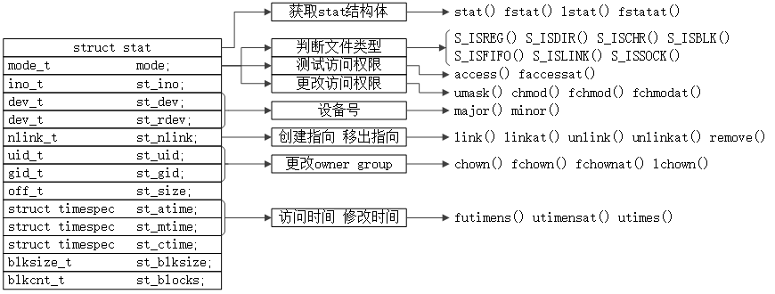
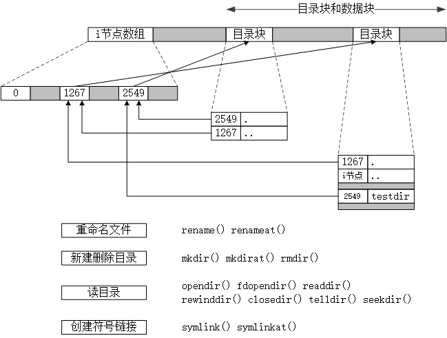

# 第03章 文件I/O

| 类别 | 函数 |
| - | - |
| 基本操作 | open creat close write read |
| 原子读写 | pwrite pread |
| 描述符复制 | dup dup2 |
| 缓冲区同步 | sync fsync fdatasync |
| 属性控制 | fcntl ioctl |

# 第04章 文件和目录

## 结构体stat

```c
struct stat{
    mode_t            st_mode;   /* file type & mode (permission) */
    ino_t             st_ino;    /* i-note number (servial number) */
    dev_t             st_dev;    /* device number (file system) */
    dev_t             st_rdev;   /* device number for special files */
    nlink_t           st_nlink;  /* number of links */
    uid_t             st_uid;    /* user ID of owner */
    gid_t             st_gid;    /* group ID of owner */
    off_t             st_size;   /* size in bytes, for regular files */
    struct timespec   st_atime;  /* time of last access */
    struct timespec   st_mtime;  /* time of last modification */
    struct timespec   st_ctime;  /* time of last file status change */
    blkszie_t         st_blksize;/* best I/O block size */
    blkcnt_t          st_blocks; /* bumber of disk blocks allocated */
};
```

## stat结构体成员及其相关的函数

<div style="text-align:center">
	
	<p>stat结构体成员及其对应的函数</p>
</div>

<table>
    <tr>
        <th>结构体(成员)</th><th>说明</th><th>分类</th><th>函数</th>
    </tr><tr>
        <td>struct stat;</td>
        <td>stat结构体</td>
        <td>获取stat结构体</td>
        <td>stat() fstat() lstat() fstatat()</td>
    </tr><tr>
        <td rowspan="3">mode_t st_mode;</td>
        <td rowspan="3">文件类型和访问权限</td>
        <td>判断文件类型</td>
        <td>S_ISREG() S_ISDIR() S_ISCHR() S_ISBLK() S_ISFIFO() S_ISLINK() S_ISSOCK()</td>
    </tr><tr>
        <td>测试访问权限</td>
        <td>access() faccessat()</td>
    </tr><tr>
        <td>更改访问权限</td>
        <td>umask() chmod() fchmod() fchmodat()</td>
    </tr><tr>
        <td rowspan="2">ino_t st_ino;</td>
        <td rowspan="2">i节点编号，stat结构体绝大部分信息来自i节点。</td>
        <td>创建指向i节点</td>
        <td>link() linkat()</td>
    </tr><tr>
        <td>删除指向i节点</td>
        <td>unlink() unlinkat()</td>
    </tr><tr>
        <td>dev_t st_dev;</td>
        <td>文件系统的设备号。</td>
        <td rowspan="2">获取主次设备号</td>
        <td rowspan="2">major() minor()</td>
    </tr><tr>
        <td>dev_t st_rdev;</td>
        <td>针对特殊文件的设备号</td>
    </tr><tr>
        <td>nlink_t st_nlink;</td>
        <td>链接计数，指向 st_ino 的目录项的个数。</td>
        <th>\</th>
        <th>\</th>
    </tr><tr>
        <td>uid_t st_uid;</td>
        <td>用户ID</td>
        <td rowspan="2">更改所有者、所有组</td>
        <td rowspan="2">chown() fchown() fchownat() lchown()</td>
    </tr><tr>
        <td>gid_t st_gid;</td>
        <td>组ID</td>
    </tr><tr>
        <td>off_t st_size;</td>
        <td>以字节为单位的文件长度，只对普通文件、目录、符号链接有效。</td>
        <td>文件截断</td>
        <td>truncate() ftruncate()</td>
    </tr><tr>
        <td>struct timespec st_atime;</td>
        <td>文件数据的最后修改时间。</td>
        <td rowspan="2">修改 atime mtime</td>
        <td rowspan="2">futimens() utimensat() utimes()</td>
    </tr><tr>
        <td>struct timespec st_mtime;</td>
        <td>文件数据的最后修改时间。</td>
    </tr><tr>
        <td>struct timespec st_ctime;</td>
        <td>文件属性的最后修改时间。</td>
        <th>\</th>
        <th>\</th>
    </tr><tr>
        <td>blksize_t st_blksize;</td>
        <td>best I/O block size.</td>
        <th>\</th>
        <th>\</th>
    </tr><tr>
        <td>blkcnt_t st_blocks;</td>
        <td>number of disk blocks allocated.</td>
        <th>\</th>
        <th>\</th>
    </tr>
</table>

## 与目录块有关的函数

| 分类 | 函数 |
| - | - |
| 重命名文件 | rename() renameat() |
| 新建删除目录 | mkdir() mkdirat() rmdir() |
| 读目录 | opendir() fdopendir() readdir() |
| 读目录 | rewinddir() closedir() relldir() seekdir() |
| 创建符号链接 | symlink() symlinkat() |

## UFS文件系统

<div style="text-align:center">
	
</div>

## 结构体timespec

至少包含以下两个字段：

```c
struct timespec {
    time_t tv_sec;
    long   tv_nsec;
};
```

# 第07章 进程环境

| 序号 | 函数原型 | 头文件 | 说明 |
| - | - | - | - |
| 1 | void exit(int status); | stdlib.h | ISO C |
| 2 | void _Exit(int status); | stdlib.h | POSIX.1 |
| 3 | void _exit(int status); | unistd.h | POSIX.1 |
| 4 | int atexit(void (*func)(void)); | stdlib.h | \ |
| 5 | void *malloc(size_t size); | stdlib.h | \ |
| 6 | void *calloc(size_t nobj, size_t size); | stdlib.h | \ |
| 7 | void *realloc(void *ptr, size_t newsize); | stdlib.h | newsize 是新存储区的长度，不是新、就存储区长度之差。 |
| 8 | void free(void *ptr); | stdlib.h | \ |
| 9 | char *getenv(const char *name); | stdlib.h | 获取环境变量 |
| 10 | int putenv(char *ptr); | stdlib.h | 设置环境变量 |
| 11 | int setenv(const char *name, const char*value, int rewrite); | stdlib.h | 设置环境变量 |
| 12 | int unsetenv(const char *name); | stdlib.h | 删除环境变量name |
| 13 | int setjmp(jmp_buf env); | setjmp.h | \ |
| 14 | void longjmp(jmp_buf env, int val); | setjmp.h | \ |
| 15 | int getrlimit(int resource, struct rlimit *rlptr); | sys/resource.h | \ |
| 16 | int setrlimit(int resource const struct rlimit *rlptr); | sys/resource.h | \ |

# 第08章 进程控制

| 序号 | 函数原型 | 头文件 | 说明 |
| - | - | - | - |
| 1 | pid_t getpid(void); | unistd.h | 获取调用进程的进程ID。 |
| 2 | pid_t getppid(void); | unistd.h | 获取调用进程的父进程ID。 |
| 3 | uid_t getuid(void); | unistd.h | 获取调用进程的用户ID。 |
| 4 | uid_t geteuid(void); | unistd.h | 获取调用进程的有效用户ID。 |
| 5 | gid_t getgid(void); | unistd.h | 获取调用进程的组ID。 |
| 6 | gid_t getegid(void); | unistd.h | 获取调用进程的有效组ID。 |
| 7 | pid_t fork(void); | unistd.h | 创建一个新进程。 |
| 8 | pid_t vfork(void); | unistd.h | 创建一个新进程。 |
| 9 | void exit(int status); | stdlib.h | / |
| 10 | pid_t wait(int *status); | sys/wait.h | 获取子进程的终止状态。 |
| 11 | pid_t waitpid(pid_t pid, int *status, int options); | sys/wait.h | 获取子进程的终止状态。 |
| 12 | int waitid(idtype_t idtype, id_t id, siginfo_t *infop, int options); | sys/wait.h | / |
| 13 | pid_t wait3(int *status, int options, struct rusage *rusage); | sys/types.h<br>sys/wait.><br>sys/time.h<br>sys/resource.h | / |
| 14 | pid_t wait4(pid_t pid, int *status, int options, struct rusage *rusage); | sys/types.h<br>sys/wait.h <br>sys/time.h<br>sys/resource.h | / |
| 15 | int execl(const char *pathname, const char *arg0, ... /* (char*)0 */); | unistd.h | / |
| 16 | int execv(const char *pathname, char *const argv[]); | unistd.h | / |
| 17 | int execle(const char *pathname, const char *arg, ... /* (char *)0, char *const envp[] */); | unistd.h | / |
| 18 | int execve(const char *pathname, char *const argv[], char *const envp[]); | unistd.h | / |
| 19 | int execlp(const char *filename, const char *arg0, ... /* (char*)0 */); | unistd.h | / |
| 20 | int execvp(const char *filename, char *const argv[]); | unistd.h | / |
| 21 | int fexecve(int fd, char *const argv[], char *const envp[]); | unistd.h | / |
| 22 | int setuid(uid_t uid); | unistd.h | 更改ruid euid resuid |
| 23 | int setgid(git_t gid); | unistd.h | 更改rgid egid resgid |
| 24 | int setreuid(uid_t ruid, uid_t euid); | unistd.h | 交换用户ID和有效用户ID |
| 25 | int setregid(gid_t rgid, gid_t egid); | unistd.h | 交换组ID和有效组ID |
| 26 | int seteuid(uid_t uid); | unistd.h | 更改有效用户ID |
| 27 | int setegid(gid_t gid); | unistd.h | 更改有效组ID |
| 28 | int system(const char *cmdstring); | stdlib.h | 在程序中执行一个命令字符串。 |
| 29 | char *getlogin(void); | unistd.h | 说获取登录名。 |
| 30 | int nice(int incr); | unistd.h | 设置进程的nice值。 |
| 31 | int getpriority(int which, id_t who); | sys/resource.h | 获取进程的nice值。 |
| 32 | int setpriority(int which, id_t who, int value); | sys/resource.h | 设置进程的nice值。 |

# 第09章 进程关系

| 序号 | 函数原型 | 头文件 | 说明 |
| - | - | - | - |
| 1 | pid_t getpgrp(void); | unistd.h | 返回调用进程的进程组ID。 |
| 2 | pid_t getpgid(pid_t pid); | unistd.h | 返回进程组ID。 |
| 3 | int setpgid(pid_t pid, pid_t pgid); | unistd.h | 加入一个现有进程组，或创建一个新进程组。 |
| 4 | pid_t setsid(void); | unistd.h | 建立一个新会话。 |
| 5 | pid_t getsid(pid_t pid); | unistd.h | 获取会话首进程的进程组ID。 |
| 6 | pid_t tcgetpgrp(int fd); | unistd.h | 获取前台进程组ID。 |
| 7 | int tcsetpgrp(int fd, pid_t pgrpid); | unistd.h | 设置前台进程组ID。 |
| 8 | pid_t tcgetsid(int fd); | termios.h | 获取会话首进程的进程组ID。 |

# 第10章 信号

| 序号 | 函数原型 | 头文件 | 说明 |
| - | - | - | - |
| 1 | void (*signal(int signo, void (*func)(int)))(int); | signal.h | 设置信号处理程序。 |
| 2 | int kill(pid_t pid, int signo); | signal.g | 向进程或进程组发送信号。 |
| 3 | int raise(int signo); | signal.h | 向调用进程发送信号。 |
| 4 | unsigned int alarm(unsigned int seconds); | unistd.h | 设置闹钟时间，并返回之前的剩余时间。 |
| 5 | int alarm(void); | unistd.h | 使进程挂起直至捕捉到一个信号。 |
| 6 | int sigemptyset(sigset_t *set); | signal.h | 删除所有信号。 |
| 7 | int sigfillset(sigset_t *set); | signal.h | 添加所有信号。 |
| 8 | int sigaddset(sigset_t *set, int signo); | signal.h | 添加信号。 |
| 9 | int sigdelset(sigset_t *set, int signo); | signal.h | 删除信号。 |
| 10 | int sigismember(sigset_t *set, int signo); | signal.h | 测试信号。 |
| 11 | int sigprocmask(int how, const sigset_t *set, sigset_t *oset); | signal.h | 检测、更改进程的信号屏蔽字。 |
| 12 | int sigpending(sigset_t *set); | signal.h | 返回进程阻塞、并处于未决状态的信号集。 |
| 13 | int sigaction(int signo, const struct sigaction *act, struct sigaction *oact); | signal.h | 检查、修改与指定信号相关联的处理动作。 |
| 14 | int sigsetjmp(sigjmp_buf env, int savemask); | setjmp.h | \ |
| 15 | void siglongjmp(sigjmp_buf env, int val); | setjmp.h | \ |
| 16 | int sigsuspend(const sigset_t *sigmask); | signal.h | 等待信号发生，并恢复信号屏蔽字。 |
| 17 | void abort(); | stdlib.h | 使调用进程异常终止。 |
| 18 | unsigned int sleep(unsigned int seconds); | unistd.h | 挂起调用进程，直到时间超时或被信号中断。 |
| 19 | int nanosleep(const struct timespec *reqtp, struct timespec *remtp); | time.h | 提供纳秒的时间进度。如果系统不支持，则会取整。 |
| 20 | int clock_nanosleep(clockid_t clock_id, int flags, const struct timespec *reqtp, struct timespec *remtp); | time.h | 针对特定时钟挂起进程。 |
| 21 | int sigqueue(pid_t pid, int signo, union sigal value); | signal.h | 向进程发送一个可排队的信号。 |
| 22 | void psignal(int signo, char *msg); | signal.h | 输出msg和信号说明到标准错误。 |
| 23 | void psiginfo(const siginfo_t *info, const char *msg); | signal.h | 输出msg和siginfo_t说明到标准错误。 |
| 24 | char *strsignal(int signo); | string.h | 获取信号的说明字符串。 |
| 25 | int sig2str(int singo, char *str); | signal.h | 将信号编号转换为不带SIG前缀的信号名。 |
| 26 | int str2sig(const char *str, int *signop); | signal.h | 将不带SIG前缀的信号名，或十进制信号编号的字符串，转换为信号编号。 |

# 第11章 线程

| 序号 | 函数原型 | 头文件 | 说明 |
| - | - | - | - |
| 1 | int pthread_equal(pthread_t tid1, pthread_t tid2); | pthread.h | 比较两个线程ID是否相等 |
| 2 | pthread_t pthread_self(void); | pthread.h | 获取调用线程的线程ID。 |
| 3 | int pthread_create(pthread_t *tidp,<br>const pthred_attr_t *attr,<br>void *(*start_rtn)(void*),<br>void *arg); | pthread.h | 创建一个新线程。 |
| 4 | int pthread_exit(void *rval_ptr); | pthread.h | 退出线程。 |
| 5 | int pthread_join(pthread_t tid, void **rval_ptr); | pthread.h | 获取线程的退出状态。 |
| 6 | int pthread_cancel(pthread_t tid); | pthread.h | 请求取消线程。 |
| 7 | void pthread_clenup_push(void (*rtn)(void*), void *arg); | pthread.h | 注册线程清理处理程序。 |
| 8 | void pthread_cleanup_pop(int execute); | pthread.h | 删除线程清理处理程序。 |
| 9 | int pthread_detach(pthread_t tid); | pthread.h | 分离线程。 |
| | | |
| 10 | int pthread_mutex_init(pthread_mutex_t *mutex,<br>const struct pthread_mutexattr_t *attr); | pthread.h | 初始化互斥量。 |
| 11 | int pthread_mutex_destroy(pthread_mutex_t *mutex); | pthread.h | 销毁互斥量。 |
| 12 | int pthread_mutex_unlock(pthread_mutex_t *mutex); | pthread.h | 解锁 |
| 13 | int pthread_mutex_lock(pthread_mutex_t *mutex); | pthread.h | 加锁。 |
| 14 | int pthread_mutex_trylock(pthread_mutex_t *mutex); | pthread.h | 尝试加锁。 |
| 15 | int pthread_mutex_timedlock(pthread_mutex_t *mutex,<br>const struct timespec *tsptr); | pthread.h<br>time.h | 在指定的时间之前加锁。 |
| | | | |
| 16 | int pthread_rwlock_init(pthread_rwlock_t *rwlock<br>           pthread_rwlockattr_t *attr); | pthread.h | 初始化读写锁。 |
| 17 | pthread_rwlock_destroy(pthread_rwlock_t *rwlock); | pthread.h | 销毁读写锁。 |
| 18 | int pthread_rwlock_unlock(pthread_rwlock_t *rwlock); | pthread.h | 释放读写锁。 |
| 19 | int pthread_rwlock_rdlock(pthread_rwlock_t *rwlock); | pthread.h | 读加锁。 |
| 20 | int pthread_rwlock_wrlock(pthread_rwlock_t *rwlock); | pthread.h | 写加锁。 |
| 21 | int pthread_rwlock_tryrdlock(pthread_rwlock_t *rwlock); | pthread.h | 尝试读加锁。 |
| 22 | int pthread_rwlock_trywrlock(pthread_rwlock_t *rwlock); | pthread.h | 尝试写加锁。 |
| 23 | int pthread_rwlock_timedrdlock(pthread_rwlock_t *rwlock); | thread.h | 在指定的时间之前读加锁。 |
| 24 | int pthread_rwlock_timedwrlock(pthread_rwlock_t *rwlock); | pthread.h | 在指定的时间之前写加锁。 |
| | | | |
| 25 | int pthread_cond_init(pthread_cond_t *cond,<br>pthread_condattr_t *attr); | pthread.h | 初始化条件变量 |
| 26 | int pthread_cond_destroy(pthread_cond_t *cond); | pthread.h | 销毁条件变量。 |
| 27 | int pthread_cond_wait(pthread_cond_t *cond,<br>pthread_mutex_t *mutex); | pthread.h | 等待条件变量为真。 |
| 28 | int pthread_cond_tindwait(pthread_cond_t *cond,<br>pthread_mutex_t *mutex,<br>const struct timespec *tsptr); | pthread.h<br>time.h | 在规定的时间内等待条件变量为真。 |
| 29 | int pthread_cond_signal(pthread_cond_t *cond); | pthread.h | 唤醒至少一个等待该条件的线程。 |
| 30 | int pthread_cond_broadcast(pthread_cond_t *cond); | pthread.h | 唤醒所有等待该条件的线程。 |
| | | |
| 31 | int pthread_spin_init(pthread_spinlock_t *lock, int pshread); | pthread.h | 初始化自旋锁 |
| 32 | int pthread_spin_destroy(pthread_spinlock_t *lock); | pthread.h | 销毁自旋锁 |
| 33 | int pthread_spin_lock(pthread_spinlock_t *lock); | pthread.h | 锁定自旋锁 |
| 34 | int pthread_spin_trylock(pthread_spinlock_t *lock); | pthread.h | 尝试锁定自旋锁 |
| 35 | int pthread_spin_unlock(pthread_spinlock_t *lock); | pthread.h | 解锁自旋锁 |
| | | | |
| 36 | int pthread_barrier_init(pthread_barrier_t *barrier,<br>pthread_barrierattr_t *attr, unsigned int count); | pthread.h | 初始化屏障。 |
| 37 | int pthread_barrier_destroy(pthread_barrier_t *barrier); | pthread.h | 反初始化屏障。 |
| 38 | int pthread_barrier_wait(pthread_barrier_t *barrier); | pthread.h | 屏障计数加1，并等待屏障计数达到要求。 |

# 第12章 线程控制

| 序号 | 函数原型 | 头文件 | 说明 |
| - | - | - | - |
| 1 | int pthread_attr_init(pthread_attr_t *addr); | pthread.h | 初始化线程属性。 |
| 2 | int pthread_attr_destroy(pthread_attr_t *addr); | pthread.h | 反初始化线程属性。 |
| 3 | int pthread_attr_getdetachstate(const pthread_addr_t *addr, int *detachstate); | pthread.h | 获取detachstate |
| 4 | int pthread_attr_setdetachstate(pthread_addr_t *addr, int detachstate); | pthread.h | 设置detachstate |
| 5 | int pthread_addr_getstack(const pthread_addr_t *addr, void **stackaddr, size_t *stacksize); | pthread.h | 获取栈低地址和大小 |
| 6 | int pthread_addr_setstack(pthread_addr_t *addr, void *stackaddr, size_t stacksize); | pthread.h | 设置栈的低地址和大小。 |
| 7 | int pthread_addr_getstacksize(const pthread_addr_t *addr, size_t *stacksize); | pthread.h | 获取栈的大小 |
| 8 | int pthread_addr_setstacksize(pthread_addr_t *addr, size_t stacksize); | pthread.h | 设置栈的大小。 |
| 9 | int pthread_addr_getguardsize(const pthread_addr_t *addr, size_t *guardsize); | pthread.h | 获取guardsize |
| 10 | int pthread_addr_setguardsize(pthread_addr_t *addr, size_t guardsize); | pthread.h | 设置guardsize |