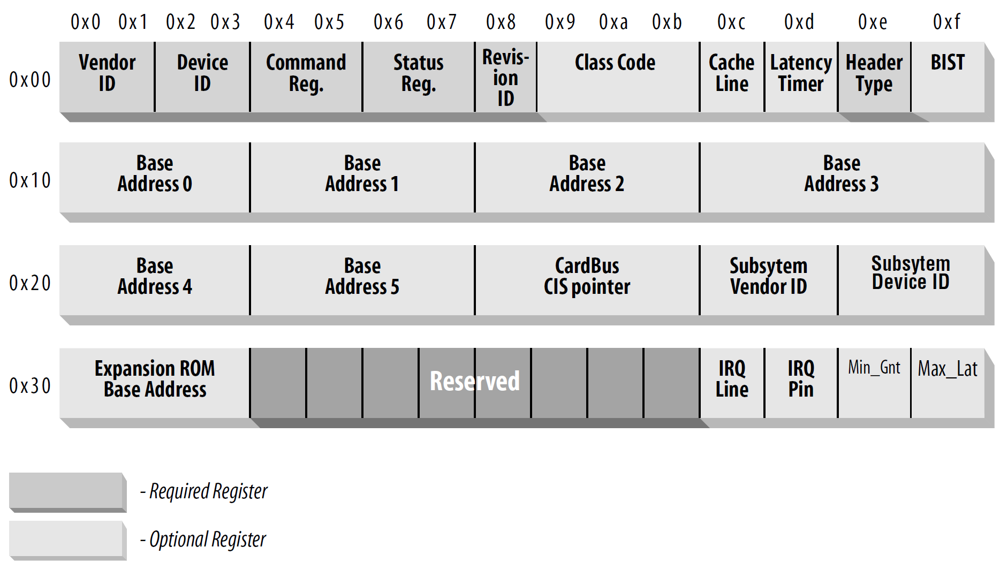
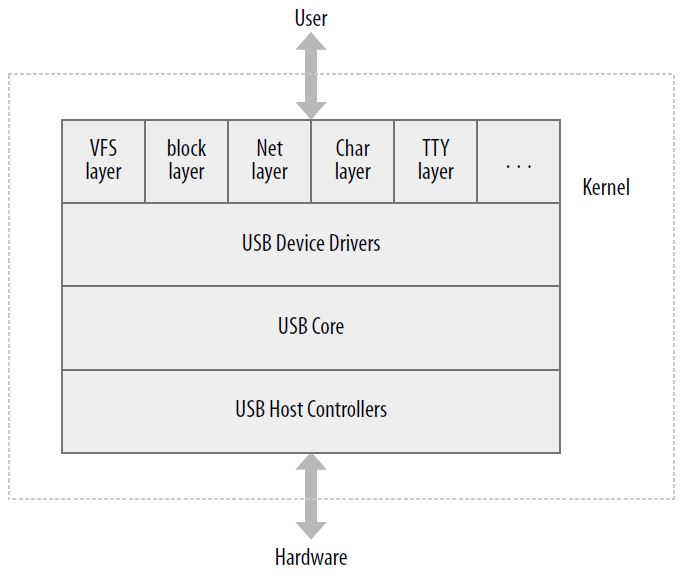
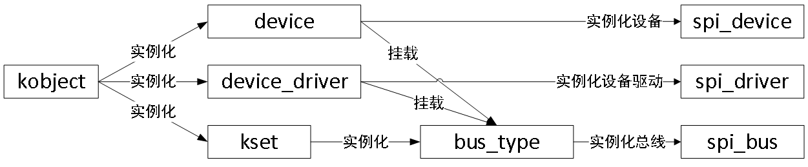
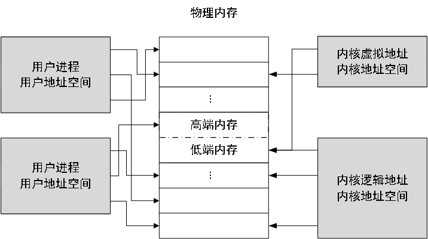

# Linux设备驱动

综合以下四本书籍的阅读笔记。开发测试平台为树莓派3B，内核版本4.19。

**Linux设备驱动程序（第三版）**

相关资源：
* [ldd3英文版PDF](https://lwn.net/Kernel/LDD3/)

> 顾名思义，本书是讲述如何编写Linux设备驱动程序的。面对层出不穷的新硬件产品，必须有人不断编写新的驱动程序以便让这些设备能够在Linux下正常工作，从这个意义上讲，讲述驱动程序的编写本身就是一件非常有意义的工作。但本书也涉及到Linux内核的工作原理，同时还讲述如何根据自己的需要和兴趣来定制Linux内核。Linux是一个开放的系统，我们希望借助本书使它能够更加开放，从而能够吸引更多的开发人员。


**嵌入式Linux设备驱动程序开发指南（原书第二版）**

相关资源：
* [github repo](https://github.com/ALIBERA/linux_book_2nd_edition)
* [BCM2835-ARM-Peripherals.pdf](BCM2835-ARM-Peripherals.pdf)
* [豆瓣](https://book.douban.com/subject/35514232/)

> 本书将告诉你如何为设备树嵌入式Linux系统开发设备驱动程序。你将学会如何编写不同类型的Linux驱动程序，以及如何使用适当的API（应用程序接口）实现与内核和用户态的交互。本书内容以实用为主，但也提供重要的理论基础知识。
> 本书编写了近30个驱动程序，并将其移植到三种不同的处理器上。你可以选择NXP i.MX7D、Microchip SAMA5D2和Broadcom BCM2837三种处理器来开发和测试这些驱动程序，本书的实验部分详细介绍了这些驱动程序的实现。在你开始阅读之前，建议你使用一个开发板，这个开发板需要有一些GPIO，以及至少一个SPI和I2C控制器。本书详细介绍了用于开发驱动程序的不同评估板的硬件配置，其中用于实现驱动程序的单板包括著名的Raspberry Pi 3 Model B。我鼓励你在开始阅读之前，先找到一块这样的单板，因为本书的内容注重实践，用单板做实验将有助于你应用贯穿全书的理论知识。
> 你将学习如何开发驱动程序，从最简单的不与任何外部硬件交互的驱动程序，到管理不同类型设备（如加速度计、DAC、ADC、RGB LED、多显LED控制器、I/O扩展器和按钮）的驱动程序。你还将开发DMA驱动程序、管理中断的驱动程序，以及通过写入/读取处理器内部寄存器来控制外部设备的驱动程序。为了简化这些驱动程序的开发，你将使用不同类型的框架：杂项框架、LED框架、UIO框架、输入框架和IIO工业框架。
> 本书是一个学习工具，可以帮助读者在没有任何领域知识的情况下开始开发驱动程序。本书的写作目的是介绍如何开发没有高度复杂性的驱动程序，这既有助于强化主要的驱动程序开发概念，也有助于读者开始开发自己的驱动程序。记住，开发驱动程序的最好方法不是从头开始写。你可以重用与Linux内核主线驱动程序类似的免费代码。本书中所写的所有驱动程序都遵循GPL许可，因此你可以在相同许可证下修改和重新发布它们。


**Linux设备驱动开发**

豆瓣：https://book.douban.com/subject/35375574/

> 本书讲解了Linux驱动开发的基础知识以及所用到的开发环境，全书分为22章，其内容涵盖了各种Linux子系统，包含内存管理、PWM、RTC、IIO和IRQ管理等，还讲解了直接内存访问和网络设备驱动程序的实用方法。在学完本书之后，读者将掌握设备驱动开发环境的概念，并可以从零开始为任何硬件设备编写驱动程序。阅读本书需要具备基本的C语言程序设计能力，且熟悉Linux基本命令。本书主要是为嵌入式工程师、Linux系统管理员、开发人员和内核黑客而设计的。无论是软件开发人员，还是系统架构师或制造商，只要愿意深入研究Linux驱动程序开发，阅读本书后都将有所收获。


**Linux设备驱动开发详解 基于最新的Linux4.0内核**

豆瓣：https://book.douban.com/subject/26600201/

> 对于嵌入式工程师来说，进入更高阶段后，学习Linux设备驱动开发无疑就是职业生涯的一次“重生”。这是因为Linux设备驱动开发不仅仅涉及操作系统的转换，开发方式的转换，更重要的是思维上的转变。对于Linux这样一个复杂系统，如何从复杂的代码中抓住设备驱动开发的关键是任何一个Linux设备驱动开发者入门时需要面对的挑战。除了知识、工具之外，往往还需要思路上的指导。本书不但帮助Linux设备驱动开发的初学者厘清必要的概念，还从具体的实例、设备驱动开发的指导原则循序渐进地引导读者渐入学习佳境。为了让读者能够达到Linux设备驱动开发的至臻境界，作者更是从软件工程的角度抽象出设备驱动开发的一般思想。毫无疑问，本书将成为读者学习Linux设备驱动开发过程中的一座“灯塔”。


# 设备驱动程序简介

设备驱动程序：使某个特定硬件响应一个定义良好的内部编程接口，这些接口完全隐藏了设备的工作细节。

设备驱动程序主要用于提供`机制`，而不是提供`策略`。编写访问硬件的驱动代码时，不要给用户强加任何特定策略。有时候也需要在驱动程序中实现一些策略，例如以字节为单位访问的IO驱动程序。
```
机制：需要提供什么功能
策略：如何使用这些功能
```

## 内核功能划分

* 进程管理
* 内存管理
* 文件系统
* 设备控制：学习的主题
* 网络功能
* ...

## 可装载模块

Linux内核可以在运行时动态的装载（insmod）或卸载（rmmod）模块。模块由目标代码组成（未链接）。Linux内核支持多种模块类型，`设备驱动程序`是其中一种。

## 设备和模块的分类

按数据的访问方式划分：
* 字符设备：以字节为单位进行数据访问。
* 块设备：以块（一般为512B）为单位进行数据访问
* 网络接口：围绕数据包的传输和接收而设计

按支持给定类型设备：
* USB模块
* 串行模块
* SCSI模块
* ...

# 构建开发环境

## 树莓派3B

> 主要参考了`嵌入式Linux设备驱动程序开发指南（原书第二版）`第1.11小节。

树莓派3B的开发环境搭建主要由以下步骤构成：
1. [系统安装，SSH/串口登录](#系统安装)
2. [编译内核](#编译内核)
3. 安装内核
4. 内核模块开发环境

### 系统安装

树莓派raspbian系统可以从[官方网站](http://downloads.raspberrypi.org/raspbian_lite/images/)下载，推荐下载2018.3.13之后的版本。树莓派安装raspbian系统可以参考博客[树莓派安装raspbian系统](https://blog.csdn.net/qq_34672033/article/details/88389951)。默认登录用户名为pi，该账户默认密码是raspberry。参考博客[树莓派3 B+ 的串口（USART）使用问题](https://www.cnblogs.com/uestc-mm/p/7204429.html)打开串口。

### 编译内核

由于树莓派3B的系统资源太少，所以选择在PC机交叉编译内核。树莓派启动之后，使用命令`uname -a`查看kernel版本号，克隆对应版本的kernel。下面是内核和工具链的仓库地址。如果GitHub太慢，可以选择GitHub的国内镜像`github.com.cnpmjs.org`。

> 2019-06-20的内核版本是4.19.y

```shell
# github
git clone --depth=1 -b rpi-4.19.y https://github.com/raspberrypi/linux linux-rpi
git clone https://github.com/raspberrypi/tools tools-rpi

# 国内镜像
git clone --depth=1 -b rpi-4.19.y https://github.com.cnpmjs.org/raspberrypi/linux linux-rpi
git clone https://github.com.cnpmjs.org/raspberrypi/tools tools-rpi
```

编译内核之前，需要安装如下软件包。

```shell
apt-get install bison flex libncurses-dev libssl-dev bc
```

使用脚本[build.sh](rpi-kernel/build.sh)一键编译内核。执行脚本之前，需要检查`KERNELDIR`和`TOOLDIR`变量的设置是否正确，`TOOLDIR`定义在脚本[setenv.sh](rpi-kernel/setenv.sh)。文件[bcm2709_pk_defconfig](rpi-kernel/bcm2709_pk_defconfig)是根据书上说明设置之后的defconfig文件，脚本编译时会使用到此文件。

### 安装内核

使用脚本[deploy.sh](rpi-kernel/deploy.sh)安装内核到树莓派。启动脚本之前，需要检查变量`HOST`和`KERNELDIR`的取值，推荐配置好SSH免密登录，不然SCP命令需要输入密码。脚本的使用方法如下：

```shell
Usage:  deploy.sh [kernel|dtb|modules|all] [help]

deploy.sh           deploy kernel
deploy.sh kernel    deploy kernel
deploy.sh dtb       deploy dtb
deploy.sh modules   deploy modules
deploy.sh all       deploy kernel & dtb & modules
deploy.sh help      print this message
```

编辑`/boot/config.txt`，加入如下内容，切换到新版本内核。系统启动成功之后，使用命令`uname -r`查看内核版本是否与内核源代码版本一致。进入内核源代码目录，使用命令`head -n 5 Makefile`可以查看内核源代码的版本。

```shell
dtparam=i2c_arm=on
dtparam=spi=on
dtoverlay=spi0=on

kernel=kernel-rpi-pk.img
device_tree=bcm2710-rpi-3-b-pk.dtb
```

### 内核模块开发环境

需要在PC机搭建交叉编译环境。考虑到Eclipse太复杂了，不推荐使用。直接`vscode remote + makefile`。[target.mk](code/target.mk)定义了一些常用的目标，如`build`、`deploy`、`i`、`u`、`clean`，同时还指定了kernel的目录。[var.mk](code/var.mk)定义了一些常用的变量，例如参与编译的目标文件、`EXTRA_CFLAGS`等等。

在源代码目录，按照如下模板编写`Makefile`即可。`KO_NAME`指定了编译成功后ko文件的名字，`MODULE_NAME`需要与C文件的名字相同。如果有多个C文件参与编译，则通过`$(KO_NAME)-objs := xxx.o`来指定。

`make i`可一键编译、卸载、并安装ko到树莓派。文件传输和命令的执行是通过SSH来完成，所以要保证树莓派连接到了局域网，开启了SSH服务，并且[target.mk](code/target.mk)指定了正确的`USER`和`HOST`。

```makefile
KO_NAME=foo
MODULE_NAME=bar
# $(KO_NAME)-objs := xxx.o

ifneq ($(KERNELRELEASE),)
# second run
include $(PWD)/../var.mk
else
# first run
include ../target.mk
endif
```

### 树莓派3B系统设置

* apt切换到国内镜像：https://mirrors.tuna.tsinghua.edu.cn/help/raspbian/

# 设备树

* [设备树标准](https://github.com/devicetree-org/devicetree-specification/releases)
* [kernel文档](https://www.kernel.org/doc/html/latest/devicetree/)

# 内核模块

以下是一个最简模块的示例代码。

```c
#include <linux/init.h>
#include <linux/module.h>

MODULE_LICENSE("Dual BSD/GPL");

static int __init hello_init(void)
{
    printk(KERN_ALERT "hello world!\n");
    return 0;
}
module_init(hello_init);

static int __exit hello_exit(void)
{
    printk(KERN_ALERT "Googbye hello world!\n");
}
module_exit(hello_exit);
```

最简单的模块包含以下内容，更多内容将在后面介绍。关于模块的编译与安装，请参考[内核模块开发环境](#内核模块开发环境)。

* MODULE_LICENSE()或其他声明
* 模块初始化函数与退出函数
* 模块在运行时只可以使用kernel提供的函数（例如printk()），不能使用C库函数。
* 加载模块的指令：insmod
* 卸载模块的指令：rmmod

## 核心模块与应用程序的对比

| | 内核模块 | 应用程序 |
| - | - | - |
| 编程模式 | 初始化函数执行完毕后就直接返回了，相当于告诉内核，我在这，我能提供某些服务。 | 一般从头到尾执行单个任务。 |
| 退出 | 必须在退出函数仔细的撤销初始化函数做的工作。 | 无需关心资源的释放，因为kernel会帮助完成资源的释放。 |
| 运行环境 | 会与内核链接起来，但不会和任何函数库链接。<br>所以模块无法使用常见的库和头文件，只能使用kernel提供的函数和头文件。 | 运行在kernel提供的进程环境中，可以使用C库函数。|
| 出错 | 模块的错误可能会导致整个系统宕机。 | 应用程序的错误一般只会对自己照成影响。|

**用户空间和内核空间**

模块运行在内核空间，而应用程序运行在用户空间。这两种模式具有不同的特权等级、不同的地址空间。当发生系统调用或中断时，会从用户空间陷入到内核空间。

**内核中的并发**

应用程序通常是顺序执行的，无需关心其他事情会改变其运行环境。而模块（内核代码）必须时刻牢记：`同一时刻，可能会有很多事情正在发生`。

原因：
1. Linux通常同时运行多个并发进程，这些进程可能同时在使用驱动程序。
2. 模块可能被中断处理程序打断。
3. 内核中存在一些其他的异步运行进程，例如定时器。
4. 在SMP系统上，可能多个CPU同时在使用模块。

对代码编写的要求：
1. Linux内核代码（包括驱动程序的代码）必须是可重入的，必须能同时运行在多个上下文。
2. 处理并发问题的同时，还要避免竞态。

**当前进程**

内核代码可以通过全局项`current`来获取当前进程，此全局指针定义在`<asm/current.h>`中。

**其他一些细节**

* 内核栈非常小，而且自己的函数和整个内核空间调用链共享栈。对于比较大的数据结构，建议动态分配。
* 有两个下划线（__）前缀的函数，通常是比较底层的实现。可以使用，后果自负。
* 内核不支持浮点运算，也不需要浮点运算。

## 编译和装载

如何编译模块并将其装载到内核。还可以参考[内核模块开发环境](#内核模块开发环境)。

**编译模块**

在构造模块之前，需要确保环境准备妥当：
1. 具备了正确版本的编译器、模块工具和其他必要的工具。具体可以看内核源代码的Documentation/Changes文件。
2. 文件系统需要有内核树，或者配置并构造内核。

关于构造系统更加详细的内容，可以参考内核源代码`Documentation/kbuild`目录下的文件。下面是一个示例`makefile`，直接执行`make`指令即可构造`hello world`模块。此makefile会被读取两次，第一次走else分支，第二次走if分支。

```makefile
# 如果已定义 KERNELRELEASE，则说明是从内核构造系统调用的，
# 因此可利用其内建语句。
ifneq($(KERNELRELEASE),)
    obj-m := hello.o
# 否则，是直接从命令行调用的，
# 这时要调用内核构造系统。
else
    KERNELDIR ?= /lib/modules/$(shell uname -r)/build
    PWD := $(shell pwd)

default:
    $(MAKE) -C $(KERNELDIR) M=$(PWD) modules
endif
```

**装载和卸载模块**

| 命令     | 说明 |
| -        | - |
| insmode  | 将模块的代码和数据装入内核，用内核的符号表解析未定义的符号。 |
| modprobe | 也用户装载模块，如果有未定义符号无法解析，insmode 会直接报错。而modprobe会搜索定义了此符号的模块并装载。 |
| rmmod    | 从内核中移除模块。如果模块正在使用，或被内核配置未禁止移除，则无法移除模块。 |
| lsmod    | 列出当前装载到内核的所有模块。有关装载模块的更多信息，可以查看`/proc/modules`文件和`/sys/module`目录。 |

**版本依赖**

模块可以和内核中的`vermagic.o`链接，此目标文件包含了大量有关内核的信息。在装载时，可用来检查模块和内核的兼容性。如果不匹配，则拒绝装载模块。如果要为特定内核版本构造模块，则需要该特定版本对应的构造系统和源代码树。可以使用条件编译，编写基于特定内核版本的代码。

一些与版本检查相关的宏：
* UTS_RELEASE   描述内核版本的字符串，例如"2.6.10"。
* LINUX_VERSION_CODE    内核版本的二进制表示，2.6.10对应的是0x02060a。
* KERNEL_VERSION(major,minor,release)   利用版本号的三个部分，创建整数版本号。

**平台依赖**

内核和模块可以针对特定的CPU平台进行特殊的优化，充分利用目标平台的特性。这需要针对目标平台定制编译后才能达到。利用`vermagic.o`，在装载模块时，内核会检查处理器的相关配置选项以确保匹配运行中的内核。如果不符合，则会拒绝装载。

如果打算编写一个通用的驱动程序，最好考虑一下，如何支持可能的不同CPU平台。

## 内核符号表

装载模块时，`insmod`会使用公共内核符号表解析未定义的符号。同时，模块也可以导出自己的符号到内核符号表，供其他的模块使用。新模块可以使用已插入模块的符号，这种技术称为叠层技术。通过叠层技术，可以将模块划分为多个层，通过简化每个层可以缩短开发时间。

使用下列宏，可以方便的将符号导出，可以有效的避免名字空间污染。符号必须在模块的全局部分导出，该符号也必须是全局的。

```c
EXPORT_SYMBOL(name);
EXPORT_SYMBOL_GPL(name);    // 只能被GPL许可证下的模块使用
```

## 预备知识

每个可装载模块都必须包含下面两行代码：
```c
#include <linux/module.h>   // 含有可装载模块需要的大量符号和函数的定义
#include <linux/init.h>     // 指定初始化和清除函数
```

模块应该指定代码所使用的许可证：
```c
MODULE_LICENSE("GPL");
```
内核能够识别的许可证有：
<table>
    <tr><th>许可证</th><th>描述</th></tr>
    <tr><td>GPL</td><td>任一版本的GNU通用公共许可证</td></tr>
    <tr><td>GPL v2</td><td>GPL版本2</td></tr>
    <tr><td>GPL and additional rights</td><td>GPL及附加权力</td></tr>
    <tr><td>Dual BSD/GPL</td><td>BSD/GPL双重许可证</td></tr>
    <tr><td>Dual MPL/GPL</td><td>MPL/GPL双重许可证</td></tr>
    <tr><td>Proprietary</td><td>专有</td></tr>
</table>

可在模块中包含的其他描述性定义：

```c
MODULE_AUTHOR(描述模块作者);
MODULE_DESCRIPTION(用来说明模块用途的简短描述);
MODULE_VERSION(代码修订号); // 有关版本字符串的创建惯例，请参考 <linux/module.h> 中的注释
MODULE_ALIAS(模块的别名);
MODULE_DEVICE_TABLE(用来告诉用户空间模块所支持的设备);
```

上述`MODULE_`声明，需要放置在全局区，习惯上放在文件的最后。

## 初始化和关闭

模块初始化函数负责注册模块所提供的任何`设施`。对于每种设施，对应有具体的内核函数用来完成注册。初始化函数的典型定义如下。

`__init`标记用来告诉内核，此函数仅在初始化期间使用。模块初始化完毕之后，此函数会被丢弃，释放内存空间。类似的标记还有`__initdata`、`__devinit`、`__devinitdata`。如果一个函数在初始化完毕之后还想使用，则不能使用`__init`标记。

```c
static int __init initialization_function(void)
{
    // 这是初始化代码
    return 0;
}
module_init(initialization_function); // 必须使用 moudle_init() 注册初始化函数
```

**清除函数**

清除函数负责在模块被移除前注销接口，并向系统返回所有资源。典型定义如下。

`__exit`标记表示函数仅用于卸载。如果模块直接内嵌到内核，或禁止卸载，此函数会被丢弃。如果模块没有注册清除函数，则禁止卸载。

```c
static void __exit cleanup_function(void)
{
    // 这是清除代码
}
module_exit(cleanup_function);
```

**初始化过程中的错误处理**

向内核注册任何设施时，都有可能会失败，所以必须要检查返回值。如果注册设施失败，模块应尽可能的向前初始化，通过降低功能来继续运转。如果遇到致命错误，初始化函数需要将已注册的设施释放，并返回一个错误码。

**模块装载竞争**

初始化函数还在运行的时候，刚刚注册好的设施可能会被其他模块调用。也就是说，在用来支持某个设施的所有内部初始化完成之前，不要注册任何设施。注册某个设施失败的时候，之前注册好的设施可能真正使用。如果要初始化失败，需要小心处理内核其他部分正在进行的操作，并等待这些操作完成。

## 模块参数

模块可以使用`module_param()`来声明参数。`module_param()`必须放在任何函数之外，通常在源文件的头部。下面是示例代码，声明了一个整型参数和一个字符串参数。参数必须要有一个默认值，如果没有指定参数，则使用默认值。

```c
#include <moduleparam.h>
static char *whom = "world";
static int  howmany = 1;
module_param(howmany, int, S_IRUGO);
module_param(whom, charp, S_IRUGP);
```

可以使用以下命令指定参数的值。

```shell
insmod modname howmany=10 whom="Mom"
```

module_param()的第一个参数是变量名称，第二个参数是变量类型，第三个参数是`sysfs`入口项的访问许可掩码。

内核支持的模块参数类型
<table>
    <tr><th>参数类型</th><th>说明</th></tr>
    <tr><td>bool</td><td>布尔值，取true或false。</td></tr>
    <tr><td>invbool</td><td>反转bool值，true变false，false变true。</td></tr>
    <tr><td>charp</td><td>字符指针值。内核会为用户提供的字符串分配内存，并相应设置指针。</td></tr>
    <tr><td>int<br>long<br>short<br>
            uint<br>ulong<br>ushort</td>
            <td>具有不同长度的基本整数值，u开头的用于无符号值。</td></tr>
</table>

可以使用`module_param_array(name,type,num,perm)`声明数组参数。name是数组名，type是数组元素的类型，num是用户提供的值的个数。

TODO:
1. 增加module_param_named、module_param_array_named的说明
2. 增加/sys/module/module_name/parameters文件夹的说明
3. module_param_cb

## 在用户空间编写驱动程序

编写一个用户进程作为驱动程序，有很多好处，但是也有很多限制，具体参考书籍。通常，用户空间驱动程序被实现为一个服务器进程，替代内核作为硬件控制的唯一代理。

# 字符设备驱动

* cdev_init
  * struct cdev
  * file_operations结构体
    * kernel space和user space交换数据
    * struct inode：表示一个唯一的文件
    * struct file：表示一个打开的文件
    * 各个成员函数的语义
* cdev_add
  * 设备号，dev_t
    * 动态申请
    * 静态申请
* 模块与内核一起构建
  * Kconfig
  * Makefile
* 设备节点
  * mknod
  * udev
* misc字符设备
  * struct miscdevice
    * name：会出现在/proc/misc，并且会自动创建设备文件/dev/name
    * minor：指定的子设备号。如果设置为MISC_DYNAMIC_MINOR则表示动态申请
    * fops
  * misc_register()
  * misc_deregister()

## 字符设备的注册

字符设备的关键是结构体`struct cdev`，无需关心结构体的内部成员。结构体可以静态分配也可以动态申请（cdev_alloc()）。

在设备的初始化函数中，需要初始化`cdev`。`cdev_init()`会将`cdev`和`file_operations`关联起来，后者实现了文件操作的函数。有关`file_operations`的更多信息请参考[一些重要的数据结构](#一些重要的数据结构)。`cdev_add()`负责将设备添加到系统中，有关`dev_t`的更多信息请参考[主设备号和次设备号](#主设备号和次设备号)。

在设备的退出函数中，需要调用`cdev_del()`删除设备。

```c
// 动态分配 cdev 结构
struct cdev * cdev_alloc(void);
// 初始化已分配到的结构
void cdev_init(struct cdev *cdev, struct file_operations *fops);
// 将设备添加到系统。该调用返回之后，设备即可使用。
int cdev_add(struct cdev *cdev, dev_t devno, unsigned int count);
// 移除一个字符设备
void cdev_del(struct cdev *cdev);
```

## 主设备号和次设备号

对字符设备的访问是通过文件系统内的设备名称进行的，简单来说是文件系统树的节点，通常位于/dev目录。可通过`ls -l`的第一个字符`c`，来识别字符设备。每个设备都有一个主设备号和次设备号。主设备号标识设备对应的驱动程序，次设备号由内核使用，用于正确确定设备文件所指的设备。

**设备号的内部表达**

在内核中，`dev_t`类型用来保存设备号，包括主设备号和次设备号。
```c
#include <linux/types.h>
MAJOR(dev_t dev);   // 获取主设备号
MINOR(dev_t dev);   // 获取次设备号
MKDEV(int major, int minor);  // 构造 dev_t
```

**分配和释放设备编号**

推荐动态分配主设备号。`Documentation/devices.txt`列出了静态分配的设备号。如果需要静态分配设备号，应该要避免已经分配的设备号。可以通过读取文件`/proc/devices`来获取设备号，然后再创建设备节点。考虑到可移植性，使用[打印设备编号](#打印设备编号)小节提到的API来打印设备编号。

> 最新的内核抛弃了devfs，而使用udev。udevd可以根据rules文件自动创建设备节点。

```c
#include <linux/fs.h>
int register_chrdev_region(dev_t first, unsigned int count, char *name);
int alloc_chrdev_region(dev_t *dev, unsigned int firstminor, unsigned int count, char *name);
void unregister_chrdev_region(dev_t first, unsigned int count);
```

## 一些重要的数据结构

* 文件操作：`struct file_operations`
* file 结构：`struct file`
* inoe 结构：`struct inode`

当向系统添加字符设备时，需要提供一个`struct file_opetations`实例，里面包含了操作字符设备的系统调用的实现。这些系统调用，一般有这两个参数：`struct file *filp`和`struct inode *inode`。

filp表示了一个打开的文件，filp的`private_data`可用来跨系统调用保存信息。

inode用来表示一个文件。与filp不同，多个打开的filp，可能对应同一个inode。inode包含了大量有关文件的信息。对于字符设备来说，以下两个字段非常有用：
```c
struct inode {
    dev_t i_rdev;        // 对表示设备文件的inode结构，该字段包含了真正的设备编号
    struct cdev *i_cdev; // inode 指向一个字符设备文件时，包含了指向 struct cdev 结构的指针
};
```

注：对于i_rdev来说，由于类型有发生变化，不建议直接操作，建议使用以下两个宏：
```c
unsigned int imajor(struct inode *inode);
unsigned int iminor(struct inode *inode);
```

## open 和 release

open方法提供给驱动程序以初始化的能力，主要完成以下工作：
* 检查设备特定的错误
* 如果时首次打开，则对其初始化
* 如有必要，更新 f_op 指针
* 分配并填写 filp->private_data

open方法的原型如下，inode参数的`i_cdev`字段，包含了先前设置的`cdev`结构。

```c
int (*open)(struct inode *inode, struct file *filp);
```

release方法与open方法正好相反。不是所有的close调用都会调用release方法，只有`filp`引用计数为零时才会调用这个方法。主要完成以下工作：
* 释放由open分配的、保存在filp->private_data中的所有内容
* 在最后一次关闭操作时关闭设备

release方法的原型：
```c
int (*release)(struct inode *inode, struct file *filp);
```

## read 和 write

read用于拷贝数据到用户空间，write用于从用户空间拷贝数据。函数原型如下：
```c
ssize_t read(struct file *filp, char __user *buff, size_t count, loff_t *offp);
ssize_t write(struct file *filp, const char __user *buff, size_t count, loff_t *offp);
```

filp是文件指针，count是请求传输的数据长度，buff是指向用户空间的缓冲区，offp指明用户在文件中进行存取操作的位置。

buff是用户空间的指针。为了安全的访问用户空间，必须使用专用的函数。

如果指针无效，会拒绝拷贝。返回值是还需要拷贝的内存数量，如果出错则返回负值。被寻址的内存空间可能不在内存中，会导致当前进程被转入睡眠状态。这就要求访问用户空间的任何函数都必须是可重入的，必须能和其他驱动程序函数并发执行。无论传输了多少数据，都应该更新offp所表示的文件位置。

```c
// 拷贝数据到用户空间
unsigned long copy_to_user(void __user *to, const void *from, unsigned long count);
// 从用户空间拷贝数据
unsigned long copy_from_user(void *to, const void __user *from, unsigned long count);
```

read方法和write方法的返回值：略。

## 字符设备编码技巧

1. 创建一个自定义的`struct xxx_dev`，里面包含了`struct cdev`和设备私有的数据。
2. 在`open`函数，使用container_of宏，从`inode->i_cdev`获取自定义设备结构体的地址。
3. 在`open`函数，将`filp->private_data`指向自定义设备结构体，其他函数则可以通过`filp`获取自定义的设备结构体。

## misc字符设备

# 调试技术

## 内核中的调试支持

一些用于调试的内核选项。
* CONFIG_DEBUG_KERNEL
* CONFIG_DEBUG_SLAB
* CONFIG_DEBUG_PAGEALLOC
* CONFIG_DEBUG_SPINLOCK
* CONFIG_DEBUG_SPINLOCK_SLEEP
* CONFIG_INIT_DEBUG
* CONFIG_DEBUG_INFO
* CONFIG_MAGIC_SYSRQ
* CONFIG_DEBUG_STACKOVERFLOW
* CONFIG_DEBUG_STACK_USAGE
* CONFIG_KALLSYMS
* CONFIG_IKCONFIG
* CONFIG_IKCONFIG_PROC
* CONFIG_ACPI_DEBUG
* CONFIG_DEBUG_DRIVER
* CONFIG_SCSI_CONSTANTS
* CONFIG_INPUT_EVBUG
* CONFIG_PROFILING

## 通过打印调试

### printk

与`printf`类似，但是`printk`可以通过宏指定日志级别。例如：

```c
printk(KERN_DEBUG"xxxx\n"); // 调试信息
printk(KERN_CRIT"xxxxx\n"); // 临界信息
```

所有的日志等级如下表所示。每个宏表示一个尖括号中的整数，数值范围是0~7。数值越小，优先级越高。

| level        | 数值 | 说明 |
| -            | - | - |
| KERN_EMERG   | 0 | 用于紧急事件消息，它们一般是系统崩溃之前提示的消息。 |
| KERN_ALERT   | 1 | 用于需要立即采取动作的情况。 |
| KERN_CRIT    | 2 | 临界状态，通常设计严重的硬件或软件操作失败。 |
| KERN_ERR     | 3 | 用于报告错误状态。 |
| KERN_WARNING | 4 | 对可能出现问题的情况进行警告，但这类情况通常不会对系统照成严重问题。 |
| KERN_NOTICE  | 5 | 有必要进行提示的正常情行。 |
| KERN_INFO    | 6 | 提示性信息。 |
| KERN_DEBUG   | 7 | 用于调试信息。 |

小于当前日志等级的日志才会打印到控制台。可以通过文件`/proc/sys/kernel/printk`查看和修改当前的日志等级。这个文件有4个值，依次为：
1. 当前的日志级别
2. 未明确指定日志级别时的默认消息级别
3. 最小允许的日志级别
4. 引导时的默认日志级别

可以使用`echo`工具修改当前的日志级别。

```shell
[root@localhost ~]# cat /proc/sys/kernel/printk
7       4       1       7
[root@localhost ~]# echo 8 > /proc/sys/kernel/printk
[root@localhost ~]# cat /proc/sys/kernel/printk
8       4       1       7
```

不推荐直接使用`printk()`，而是使用下面的宏。

```c
#define pr_emerg(fmt, ...)   printk(KERN_EMERG pr_fmt(fmt), ##__VA_ARGS__)
#define pr_alert(fmt, ...)   printk(KERN_ALERT pr_fmt(fmt), ##__VA_ARGS__)
#define pr_crit(fmt, ...)    printk(KERN_CRIT pr_fmt(fmt), ##__VA_ARGS__)
#define pr_err(fmt, ...)     printk(KERN_ERR pr_fmt(fmt), ##__VA_ARGS__)
#define pr_warning(fmt, ...) printk(KERN_WARNING pr_fmt(fmt), ##__VA_ARGS__)
#define pr_warn pr_warning
#define pr_notice(fmt, ...)  printk(KERN_NOTICE pr_fmt(fmt), ##__VA_ARGS__)
#define pr_info(fmt, ...)    printk(KERN_INFO pr_fmt(fmt), ##__VA_ARGS__)
// 需要打开宏DEBUG
#define pr_debug(fmt, ...)   printk(KERN_DEBUG pr_fmt(fmt), ##__VA_ARGS__)
```

### 重定向控制台消息

内核可以将消息发送到一个指定的虚拟控制台，使用下面的程序可以完成此问题。程序的参数是控制台的编号。如果使用虚拟机，需要进入`tty1~tty6`执行（Ctrl + Shift + F[1-6]）。

```c
/*
 *  将kernel log重定位到指定console，只支持/dev/tty[1-6]
 */
#include <stdio.h>
#include <unistd.h>
#include <sys/ioctl.h>
#include <errno.h>
#include <stdlib.h>

int main(int argc, char *argv[])
{
    char bytes[2] = {11, 0};

    if (argc == 2) {
        bytes[1] = atoi(argv[1]);
    } else {
        fprintf(stderr, "%s: need a single arg\n", argv[0]);
        exit(1);
    }
    if (ioctl(STDIN_FILENO, TIOCLINUX, bytes) < 0) {
        fprintf(stderr, "%s: ioctl(stdin, TIOCLINUX): %s\n",
                argv[0], strerror(errno));
        exit(1);
    }
    exit(0);
}
```

### 速度限制

`printk_ratelimit()`会监控控制台的消息数量，如果输出的数量超过一定的阈值，`printk_ratelimit()`将会访问0。可以通过这个函数来控制打印日志消息的速度。

```c
if (printk_ratelimit())
    printk("xxx");
```

可以通过修改以下两个文件，来定制`printk_ratelimit()`的行为。
* /proc/sys/kernel/printk_ratelimit 在重新打开消息之前应该等待的秒数
* /proc/sys/kernel/printk_ratelimit_burst 在进行速度限制之前可以接受的消息数

### 打印设备编号

使用下面的函数，可以将设备编号打印到给定的缓冲区。考虑到未来可能会使用64位的设备编号，缓冲区至少有20字节。

```c
#include <linux/kdev_t.h>
int print_dev_t(char *buffer, dev_t dev);    // 返回打印的字节数
char *format_dev_t(cahr *buffer, dev_t dev); // 返回缓冲区
```

## 通过查询调试

使用`printk`打印大量日志会使系统的性能显著下降。在多数情况下，获取相关信息的最好方法是需要的时候才去查询系统信息。本小节介绍`proc`文件系统和`ioctl`系统调用。`sysfs`将在[Linux设备模型](#Linux设备模型)介绍。

### proc文件系统

`/proc`文件系统是一种特殊的、由软件创建的文件系统，内核使用它向外界导出信息。`/proc`下面的每个文件都绑定于一个内核函数，用户读取其中的文件时，该函数动态的生成文件的内容。`/proc`文件不仅可以用户读出数据，也可以用于写入数据。本小节只介绍只读的情况。

[procfs-guide.pdf](https://www.cs.cmu.edu/afs/grand.central.org/archive/twiki/pub/Main/SumitKumar/procfs-guide.pdf)对`proc`文件系统的API进行了详细的介绍。

**在proc中实现文件**

使用`proc`文件系统需要包含头文件`linux/proc_fs.h`。为创建一个`proc`文件，需要实现一个读取文件生成数据的函数。函数的原型如下：

```c
int (*read_proc)(
    char *buf,
    char **start,
    off_t offset,
    int count,
    int *eof,
    void *data);
```

参数说明如下：
* buf 指向用来写入数据的缓冲区，缓冲区由内核分配，大小是`PAGE_SIZE`
* start 返回实际的数据写到内存页的哪个位置。此参数的用法有点复杂，可用于实现大于一个内存页的`proc`文件。
* offset 读取的位置
* count 请求读取的字节数
* eof 指向一个整型数，当没有数据可返回时，驱动程序必需设置这个参数
* data 提供给驱动程序的专用数据指针，可用于内部记录

返回值：存放到内存缓冲区的字节数

如果返回小于`PAGE_SIZE`的数据，则忽略参数`start`、`offset`、`count`、`eof`。默认从0开始写入数据。

如果返回大于`PAGE_SIZE`的数据，则需要自己申请内存，`offset`表示本次读取的偏移，`*start`指向`offset`指定的偏移量处的数据，`*eof`置1表示没有数据可供继续读取。

**创建自己的proc文件**

`create_proc_read_entry()`把`read_proc()`和一个`proc`入口项链接起来。

```c
struct proc_dir_entry *create_proc_read_entry(
    const char *name,
    mode_t mode,
    struct proc_dir_entry *base,
    read_proc_t *read_proc,
    void *data
);
```

参数说明如下：
* name 创建的文件名称
* mode 文件的权限，0表示使用系统默认值
* base 文件所在的目录。如果为NULL，则创建在/proc根目录
* read_proc
* data 内核会忽略，但是会传递给read_proc函数

在卸载模块时，使用`remove_proc_entry()`删除`proc`入口项。参数说明略。

```c
void remove_proc_entry(const char *name, struct proc_dir_entry *base);
```

`proc`有两个严重的问题，不推荐使用：
* `proc`文件的使用不会增加模块的引用计数，文件在使用时卸载模块会出问题。
  * try_module_get() / module_put() 可以解决此问题
* 使用同一名字注册两个入口项。

### seq_file接口

`seq_file`接口为大的内核虚拟文件提供了一组简单的函数。`seq_file`假定创建的虚拟文件要顺序遍历一个项目序列。每前进一步，输出该序列中的一个项目。如果`proc`文件包含大量的输出行，建议使用`seq_file`。

```c
void *start(struct seq_file *sfile, loff_t *pos);
void *next(struct seq_file *sfile, void *v, loff_t *pos); // 迭代器移动到下一个位置
void stop(struct seq_file *sfile, void *v);
int show(struct seq_file *sfile, void *v); // 为迭代器v所指向的项目建立输出
// show() 函数应该使用如下接口
int seq_printf(struct seq_file *sfile, const char *fmt, ...);
int seq_putc(struct seq_file *sfile, char c);
int seq_puts(struct seq_file *sfile, const char *s);
int seq_escape(struct seq_file *m, const char *s, const char *esc);

struct seq_operations; // 包含指向start/next/stop/show等函数的指针
int seq_open(struct file *filp, struct seq_operations *seq_ops);
```

### ioctl方法

略。详细介绍请参考第六章[ioctl](#ioctl)。

## 通过监视调试

strace指令，略。strace指令的使用方法请参考[使用strace监控系统调用](https://pkemb.com/2021/09/use-strace-monitor-syscall/)。

## 调试系统故障

主要是oops消息的解读。

## 调试器和相关工具

* gdb
* kdb内核调试器
* 用户模式的Linux虚拟机
* Linux跟踪工具包LTT
* 动态探测 Dprobes

# 并发和竞态

对共享数据的并发访问会导致竞态。

## 并发及其管理

并发的来源：
* SMP，内核代码是可抢占的
* 设备中断
* workqueue
* tasklet
* timer

为避免驱动程序产生竞态，需要遵循以下规则：
* 尽量避免资源的共享。
* 必须显式的管理对共享资源的访问，必须确保一次只有一个执行线程可以操作共享资源。
* 共享资源被其他组件引用时，必须确保自己可用。

## 信号量和互斥体

信号量用于建立临界区。当代码进入临界区时，减少信号量。如果信号量为0，则进程休眠，直到其他进程释放信号量。当代码退出临界区时，增加信号量。

初始值为1的信号量，又被称为互斥体。在任意给定时刻，只能被单个线程拥有。

**Linux信号量接口**

头文件和数据类型：
```c
#include <asm/semaphore.h>
struct semaphore
```

声明和初始化：
```c
// 按指定值初始化信号量
void sema_init(struct semaphore *sem, int val);
// 声明和初始化互斥体
DECLARE_MUTEX(name);
DECLARE_MUTEX_LOCKED(name);
// 动态分配互斥体
void init_MUTEX(struct semaphore *sem);
void init_MUTEX_LOCKED(struct semaphore *sem);
```

减少信号量的值（获取信号量）：
```c
// 减少信号量，并在必要时一直等待，不可中断。用于建立不可杀进程。
void down(struct semaphore *sem);
// down()的中断版本。被中断时，返回非0值，并且没有获取到信号量。
int down_interruptible(struct semaphore *sem);
// 尝试减少信号量，如果不可获得，则立即返回非0值。
int down_trylock(struct semaphore *sed);
```

增加信号量的值（释放信号量）：
```c
void up(struct semaphore *sem);
```

特别注意：如果在拥有一个信号量时发生错误，必须在将错误状态返回给调用者之前释放信号量。

在等待信号量时被中断，先撤销用户可见的任何修改，然后返回`-ERESTARTSYS`。如果无法撤销，则返回`-EINTR`。

**读取者写入者信号量**

对共享数据的访问分为只读和写入。我们可以接收并发读取。

头文件和数据类型：
```c
#include<linux/rwsem.h>
struct rw_semaphore
```

初始化接口：
```c
void init_rwsem(struct rw_semaphore *sem);
```

只读访问的接口：
```c
void down_read(struct rw_semaphore *sem);
// 获取信号量返回非0，其他情况返回0
int down_read_trylock(struct rw_semaphore *sem);
void up_read(struct rw_semaphore *sem);
```

写入者接口：
```c
void down_write(struct rw_semaphore *sem);
int down_write_trylock(struct rw_semaphore *sem);
void up_write(struct rw_semaphore *sem)l
// 将写入访问转换为只读访问
void downgrade_write(struct rw_semaphore *sem);
```

rwsem的特点：
* 允许一个写入者，或无数个读取者拥有
* 写入者具有更高的优先级
* 适用于很少需要写访问，且写入者只会短期拥有。

## completion

驱动编程的一个常见模型：在当前线程之外初始化一个活动，然后等待该活动结束。信号量可以完成此项工作，但是不是最适合的。

completion是一种轻量级的进制，允许一个线程告诉另外一个线程某个工作已经完成。

头文件和数据类型：
```c
#include<linux/completion.h>
struct completion
```

初始化和声明接口：
```c
void init_completion(struct completion *c);
DECLARE_COMPLETION(my_completion);
```

等待completion：
```c
// 非中断等待，可能会照成不可杀的进程
void wait_for_completion(struct completion *c);
```

触发completion事件：
```c
void complete(struct completion *c);      // 唤醒一个等待线程
void complete_all(struct completion *c);  // 唤醒所有等待线程
```

completion通常是一个单次设备，使用一次后被丢弃。小心处理，也可以被重复使用。

问题：对一个completion连续两次调用complete()会发生什么？

## 自旋锁

自旋锁只有两个状态，锁定和解锁。如果锁定成功，则代码进入临界区。如果锁定失败，则代码不断的检测并尝试锁定，直到锁可用。测试并锁定的操作必须以原子方式完成。对于不同的处理器架构，自旋锁的实现是不同的。核心概念是一样的：自旋锁在等待时，处理器不能做任何有用的工作。

自旋锁通常用于不能休眠的代码。

**自旋锁API**

```c
// 头文件
#include <linux/spinlock.h>
// 静态初始化
spinlock_t my_lock = SPIN_LOCK_UNLOCKED;
// 动态初始化
void spin_lock_init(spinklock_t *lock);
// 锁定。等待时，处理器无法做其他事情
void spin_lock(spinlock_t *lock);
// 解锁。
void spin_unlock(spinlock_t *lock);
```

**自旋和原子上下文**

在使用自旋锁时，要注意以下规则，避免系统响应时间过长，或进入死锁。
1. 任何拥有自旋锁的代码都必须是原子的，不能休眠。
2. 在拥有自旋锁时需要禁止中断（仅本地CPU）
3. 自旋锁必须在可能的最短时间内拥有。

**自旋锁函数**

```c
// 不关闭任何中断
void spin_lock(spinlock_t *lock);
// 禁止硬件中断和软件中断，中断状态保存在flags中
void spin_lock_irqsave(spinlock_t *lock, unsigned long flags);
// 禁止硬件中断和软件中断，不保存中断状态
void spin_lock_irq(spinlock_t *lock);
// 只禁止软件中断
void spin_lock_bh(spinlock_t *lock);
// 非阻塞获取，成功时返回非0
int spin_trylock(spinlock_t *lock);
int spin_trylock_bh(spinlock_t *lock);
```

当自旋锁能被运行在中断上下文的代码获得时，必须使用某个关闭中断的版本（在哪种中断上下文被获取，就要关闭哪种中断），避免系统死锁。如果只在软中断被获取，可以使用spin_lock_bh()，还能服务硬件中断。

释放自旋锁的函数严格对应于获取自旋锁的函数。

```c
void spin_unlock(spinlock_t *lock);
void spin_unlock_irqrestore(spinklock_t *lock, unsigned long flags);
void spin_unlock_irq(spinklock_t *lock);
void spin_unlock_bh(spinlock_t *lock);
```

**读取者/写入者自旋锁**

类似于读取者写入者信号量。定义：

```c
#include <linux/spinlock.h>
rwlock_t
```

声明和初始化：

```c
// 静态
rwlock_t my_rwlock = RW_LOCK_UNLOCKED;
// 动态
rwlock_t my_rwlock;
rwlock_init(&my_rwlock);
```

读取者的函数：

```c
void read_lock(rwlock_t *lock);
void read_lock_irqsave(rwlock_t *lock, unsigned long flags);
void read_lock_irq(rwlock_t *lock);
void read_lock_bh(rwlock_t *lock);

void read_unlock(rwlock_t *lock);
void read_unlock_irqrestore(rwlock_t *lock, unsigned long flags);
void read_unlock_irq(rwlock_t *lock);
void read_unlock_bh(rwlock_t *lock);
```

写入者的函数：

```c
void write_lock(rwlock_t *lock);
void write_lock_irqsave(rwlock_t *lock, unsigned long flags);
void write_lock_irq(rwlock_t *lock);
void write_lock_bh(rwlock_t *lock);

void write_unlock(rwlock_t *lock);
void write_unlock_irqrestore(rwlock_t *lock, unsigned long flags);
void write_unlock_irq(rwlock_t *lock);
void write_unlock_bh(rwlock_t *lock);
```

## 锁陷阱

关于使用锁的一些经验。

* 明确锁定模式，在`一开始`就要制定好清晰和明确的锁定规则。
* 明确锁定顺序，如果要同时获取多把锁，为避免发生死锁，需要按照固定的顺序获取锁。
  * 如果一个是局部锁，一个属于内核更中心位置的锁，则先获取局部锁。
  * 如果一个是信号量，一个是自旋锁，则先获取信号量。
  * 最好的方法是避免出现需要多个锁的情况。
* 综合权衡性能和复杂度。
  * 细粒度的锁有较高的性能，但代码复杂性较高，不利于维护。
  * 粗粒度的锁的性能较低，但是代码复杂性较低，便于维护。
  * 在初期应该使用粗粒度的锁，抑制自己过早考虑优化的欲望。
  * [lockmeter](http://oss.sgi.com/projects/lockmeter) 可度量内核花费在锁上的时间。

## 除了锁之外的办法

### 免锁算法

重构算法，从根本上避免使用锁。

例如生产者-消费者问题，可以使用环形缓冲区。当只有一个生产者写入，只有一个消费者读取时，可以保证数据一致性。要小心处理缓冲区满和缓冲区空的情况。

Linux在2.6.10，有一个通用的缓冲区实现`linux/kfifo.h`。

### 原子变量

当共享变量是一个简单的整数类型时，可以使用内核提供的`atomic_t`数据类型。特点如下：
* 保持的是一个int类型的值。
* 最大表示24位的整数
* 对该类型的操作，保证是原子的，而且速度很快。

原子变量API：
```c
void atomic_set(atomic_t *v, int i);
atomic_t v = ATOMIC_INIT(i);
int atomic_read(atomic_t *v);
void atomic_add(int i, atomic_t *v);
void atomic_sub(int i, atomic_t *v);
void atomic_inc(atomic_t *v);
void atomic_dec(atomic_t *v);
int atomic_inc_and_test(atomic_t *v);
int atomic_dec_and_test(atomic_t *v);
int atomic_sub_and_test(int i, atomic_t *v);
....
```

注意：需要多个atomic_t变量的操作，任然需要某种类型的锁。

### 位操作

原子地修改和测试单个bit的函数。这些函数使用的数据类型依赖于具体架构。

```c
void set_bit(nr, void *addr); // 设置addr指向的数据项的第nr位为1
void clear_bit(nr, void *addr);
test_bit(nr, void *addr); // 返回第nr位，非原子方式实现

// 返回nr位之前的值，并设置相应的位
int test_and_set_bit(nr, void *addr);
int test_and_clear_bit(nr, void *addr);
int test_and_change_bit(nr, void *addr);
```

### seqlock

用于保护很小、很简单、会频繁读取、写入很少且快速的资源。本质上，seqlock允许读者对资源的自由访问，但需要读者检查是否和写入者发生冲突。当冲突发生时，需要重试对资源的访问。

初始化代码：
```c
// 静态初始化
seqlock_t lock1 = SEQLOCK_UNLOCKED;
// 动态初始化
seqlock_t lock2;
seqlock_init(&lock);
```

读者在进入临界区之前，需要获取一个整数顺序值，在退出临界区时会和当前的顺序值比较。如果不相等，则必须重新读取。不能保护含有指针的数据结构。示例代码：
```c
#include <linux/seqlock.h>
unsigned int seq;
do {
    seq = read_seqbegin(&lock);
    // 完成读取工作
} while (read_seqretry(&lock, seq));
// 在中断上下文中，需要使用IRQ安全版本
unsigned int read_seqbegin_irqsave(seqlock_t *lock, unsigned long flags);
int read_seqretry_irqrestore(seqlock_t *lock, unsigned int seq, unsigned long flags);
```

写入者需要获取seqlock的自旋锁，所以自旋锁常见的限制也适用于seqlock。以下是写入者需要使用的API：
```c
// 获取
void write_seqlock(seqlock_t *lock);
void write_seqlock_irqsave(seqlock_t *lock, unsigned long flags);
void write_seqlock_irq(seqlock_t *lock);
void write_seqlock_bh(seqlock_t *lock);

// 释放
void write_sequnlock(seqlock_t *lock);
void write_sequnlock_irqrestore(seqlock_t *lock, unsigned long flags);
void write_sequnlock_irq(seqlock_t *lock);
void write_sequnlock_bh(seqlock_t *lock);
```

### 读取-复制-更新

RCU, read-copy-update。RCU发明者的[白皮书](http://www.rdrop.com/users/paulmck/rclock/intro/rclock_intro.html)。

RCU保护包含以下限定的资源：
* 经常发生读取而很少写入
* 被保护的资源通过指针访问

RCU的原理：在需要修改数据时，写入线程首先复制，然后修改副本，然后用新版本替代相关指针。当内核确认老版本没有引用时，即可释放。

RCU相关API和使用示例：略。

# 高级字符驱动程序操作

本章主要讲述了编写全功能字符设备驱动程序的几个概念，均会通过对scull驱动程序的修改来说明。
* [ioctl系统调用，设备控制的公共接口](#ioctl)
* [阻塞型IO](#阻塞型io)
* [poll和select](#poll和select)
* [异步通知](#异步通知)
* [定位设备](#定位设备)

## ioctl

设备驱动程序通常会通过ioctl执行各种类型的硬件控制。

用户空间的ioctl系统调用具有如下原型。最后的三个点不代表可变数目的参数表，表示一个可选参数，通常定义为`char *argp`。使用指针可以向ioctl传递任意数据，也可以访问任意数据。也可以不使用第三个参数，取决于命令。
```c
int ioctl(int fd, unsigned long cmd, ...);
```

驱动程序的ioctl原型如下。inode和filp与open方法的参数一样。cmd由用户层不经修改的传给驱动程序。arg是可选参数，无论用户层是指针还是整型，这里都是long。如果用户层没有传递第三个参数，则arg处于未定义状态。
```c
int (*ioctl)(struct inode *inode, struct file *filp, unsigned int cmd, unsigned long arg);
```

### 选择ioctl命令

ioctl的命令分为4个字段，分别是：
| 字段 | 说明 | 长度 |
| - | - | - |
| type | 选择一个号码，并在整个驱动程序使用 | 8bit，_IOC_TYPEBITS |
| number | 序号，顺序编号 | 8bit，_IOC_NRBITS |
| direction | 从应用程序看，数据的传输方向。可能的取值有 _IOC_NONE、_IOC_READ、_IOC_WRITE |
| size | 所涉及的用户数据大小，但内核不强制使用此字段。 | 与体系结构有关，13bit或14bit，_IOC_SIZEBITS |

ioctl命令要求在系统范围内唯一，为了方便构造命令，内核提供了以下宏：
```c
// type 和 number 字段通过参数传入
// size 字段通过对 datatype 参数取sizeof获得
_IO(type, nr);                  // 构造无参数的命令编号
_IOR(type, nr, datatype);       // 从驱动程序读取数据
_IOW(type, nr, datatype);       // 写入数据到驱动程序
_IOWR(type, nr, datatype);      // 双向传输

// 解开字段的宏
_IOC_TYPE(cmd);     // type 字段
_IOC_NR(cmd);       // number 字段
_IOC_DIR(cmd);      // direction 字段
_IOC_SIZE(cmd);     // size 字段
```

除了少量预定义命令之外，内核并未使用ioctl的cmd参数的值。

### ioctl返回值

当命令号不能匹配任何合法操作时，默认的返回值一般是`-ENVAL`（非法参数）。POSIX规定返回`-ENOTTY`，不合适的ioctl设备。返回`-ENVAL`是普遍做法。

### 预定义命令

内核可以识别少量的预定义命令。当这些指令用于我们的设备时，它们会在我们自己的文件操作被调用之前被解码。如果自己的命令与预定义命令相同，应用程序的行为将无法预测。构建指令时要避开预定义指令。

预定义指令分为三组，设备驱动开发人员只对第一组感兴趣，他的幻数是'T'。
* 可用于任何文件（普通、设备、FIFO和socket）
* 只用于普通文件
* 特定于文件系统类型

下列ioctl命令对任何文件（包括设备特定文件）都是预定义的：
* FIOCLEX：设置执行时关闭标志
* FIONCLEX：清除执行时关闭标志
* FIOASYNC：设置或复位文件异步通知
* FIOQSIZE：返回文件或目录的大小。用于设备文件时，返回ENOTTY。
* FIONBIO：设置或清除O_NONBLOCK标志。

### 使用ioctl参数

附加参数`unsigned long arg`可以解释为一个整数，也可以解释为一个指向用户空间的指针。如果解释为指针，则必需要确保指向的用户空间是合法的。所以要通过`access_ok()`函数验证地址（不传输数据）。

```c
// type: VERIFY_READ（只读）或VERIFY_WRITE（读写）
// addr：一个用户空间的地址
// size：字节数，可以从ioctl命令获取（_IOC_SIZE()宏）
// 返回值：1 成功 0 失败
int access_ok(int type, const void *addr, unsigned long size);
```

内核空间和用户空间传递数据的方法：`copy_from_user()`、`copy_to_user()`。也可使用以下经过优化的函数，用于传递1、2、4、8字节的数据：
* put_user(datum, ptr) / __put_user()
  * 把datum写入到用户空间，大小取决于ptr的类型。如果ptr是字符指针，则传递一个字节。
* get_user(local, ptr) / __get_user()
  * 从用户空间接收数据保存到变量local

### 权能与受限访问

通过设备文件的权限控制对设备的访问。一些特权操作，只能`root`用户执行。`Linux`可以通过`capability`授权普通用户进程可以执行特定特权操作。系统调用`capget()`和`capset()`管理进程的`capability`，命令`setcap`设置文件的`capability`。

`capability`将特权划分为独立的组，常见的如下表所示。有关`capability`的更多信息，可以参考手册[capabilities.7.html](https://man7.org/linux/man-pages/man7/capabilities.7.html)。

| cap | 说明 |
| - | - |
| CAP_DAC_OVERRIDE | 越过文件或目录的访问限制的能力。 |
| CAP_NET_ADMIN | 执行网络管理任务的能力，包括那些能影响网络接口的任务。 |
| CAP_SYS_MODULE | 载入或卸载内核模块的能力。 |
| CAP_SYS_RAWIO | 执行裸IO操作的能力哦。例如访问设备端口或直接与USB设备通信。 |
| CAP_SYS_ADMIN | 截获的能力，提供了访问许多系统管理操作的途径。 |
| CAP_SYS_TTY_CONFIG | 执行tty配置任务的能力。 |

在设备驱动程序中，可通过`capable()`检查进程是否有合适的CAP。

```c
#include <sys/sched.h>
int capable(int capability);

// 示例代码
if (!capable(CAP_SYS_ADMIN))
  return -EPERM;
```

### ioctl命令的实现

参考[pkchr_ioctl()](code/pkchr/pkchr.c)的实现。

### 非ioctl的设备控制

不使用ioctl，而是向设备写入控制命令，实现对设备的控制。但是给设备增加了策略限制，例如控制命令不会出现在写入设备的正常数据中。优点是仅使用cat和echo工具就可以控制设备。非常适合于不传送数据而只响应命令的设备，例如机器人。

## 阻塞型IO

当没有数据响应read方法，或没有空间响应write方法时，驱动程序应阻塞当前进程，将其置入休眠状态直到请求可继续。

### 休眠的简单介绍

休眠是进程的一种状态。对进程来说，会从运行队列中移走，并被打上特殊标记。当标记被移除时，才会在任意CPU上调度。进入休眠状态很容易，但要注意以下事项：
* 永远不要在原子上下文中进入休眠
  * 拥有自旋锁、seqlock、RCU时不能休眠
  * 禁止中断时不能休眠
  * 拥有信号量时可以休眠，但代码最好要非常短
* 唤醒时无法知道休眠了多长时间，休眠时都发生了什么。唤醒后，不能对状态做出任何假定。
* 除非知道其他地方会唤醒我们，否则不要进入休眠。

Linux通过等待队列来管理休眠的进程，等待队列是一个进程链表，包含了等待`某个特定事件`的所有进程。等待队列通过一个`等待队列头`（`wait_queue_head_t`）来管理。可通过如下方式声明并初始化等待队列头。

```c
// 静态定义并初始化
DECLARE_WAIT_QUEUE_HEAD(name);
// 动态定义
wait_queue_head_t my_queue;
init_waitqueue_head(&my_queue);
```

等待队列包含若干个`等待队列入口`（`wait_queue_t`）。可通过如下方式声明并初始化等待队列入口。
```c
// 静态，将当前进程加入等待队列入口
DEFINE_WAIT(my_wait);
// 动态
wait_queue_t my_wait;
init_wait(&my_wait);
// 将指定进程加入等待队列入口
DECLARE_WAITQUEUE(name, tsk);
```

通过下面的函数，可添加或移除等待队列入口。

```c
void add_wait_queue(wait_queue_head_t *q, wait_queue_t *wait);
void remove_wait_queue(wait_queue_head_t *q, wait_queue_t *wait);
```

### 阻塞和非阻塞型操作

用户程序可通过设置`O_NONBLOCK`位的形式，通过驱动程序是否阻塞。显示的非阻塞操作由`filp->f_flags`中的`O_NONBLOCK`标志决定。
* 阻塞操作：当操作不能继续下去时，让进程进入休眠状态，等待可以继续操作。
* 非阻塞操作：当操作不能继续下去时，直接返回错误（`-EAGAIN`）。

只有`write`、`read`、`open`受`O_NONBLOCK`标志位的影响。下表列出了三个函数在阻塞和非阻塞状态下的行为。

| 函数 | 阻塞 | 非阻塞 |
| - | - | - |
| write | 当没有空间写入时，进程阻塞。腾出部分空间后，进程唤醒，write调用成功，即使写入的数据小于要求的count。 | 直接返回`-EAGAIN`。 |
| read | 当没有数据可读时，进程阻塞。有部分数据到达后，进程唤醒，read调用成功，即使读取的数据小于要求的count。 | 直接返回`-EAGAIN`。 |
| open | 当打开设备需要较长时间的初始化时，进程阻塞。 | 当打开设备需要较长时间的初始化时，开始初始化之后，立即返回`-EAGAIN`。 |

> 1. 使用stdio处理非阻塞IO时，要时刻检查errno。否则会将错误返回当作EOF。
> 2. open支持O_NONBLOCK是可选的。

### 进入休眠wait_event

`wait_event`系列宏让`当前进程`直接进入休眠状态，直到`condition`变为真。注意，`condition`会被多次求值，所以表达式最好不要有副作用。

```c
// 非中断休眠，不会被信号打断
wait_event(queue, condition);
// 中断休眠
wait_event_interruptible(queue, condition);
wait_event_timeout(queue, condition, timeout);
wait_event_timeout_interruptible(queue, condition, timeout);
```

> `wait_event`只能让当前进程`current`进入休眠状态。如果想让多个进程进入休眠状态，则需要手工休眠。

### 手工休眠

手工休眠的步骤如下：
1. 建立并初始化一个等待队列入口
2. 等待队列入口加入等待队列头
3. 设置进程状态为`TASK_INTERRUPTIBLE（中断休眠）`或`TASK_UNINTERRUPTIBLE（不可中断休眠）`（set_current_state()）。
4. 调用`schedule()`，让出CPU。**调用之前，应再次确认等待条件**。
5. `schedule()`返回后，从等待队列移出等待队列入口
6. 设置进程状态为`TASK_RUNNING`。

其中第2、3步可通过`prepare_to_wait()`函数完成，第5、6步可通过`finish_wait()`来完成。这两个函数的定义如下。

```c
void prepare_to_wait(
     wait_queue_head_t *queue,  // 等待队列
     wait_queue_t       *wait,  // 等待队列入口
     int state)                 // 进程的新状态
                               // TASK_INTERRUPTIBLE   可中断休眠
                               // TASK_UNINTERRUPTIBLE 不可中断休眠
void finish_wait(wait_queue_head_t *queue, wait_queue_t *wait)
```

`wait_event()`宏的内部实现也是上述步骤。

```c
#define __wait_event(wq, condition)                     \
do {                                    \
    DEFINE_WAIT(__wait);                        \
                                    \
    for (;;) {                            \
        prepare_to_wait(&wq, &__wait, TASK_UNINTERRUPTIBLE);    \
        if (condition)                        \
            break;                        \
        schedule();                        \
    }                                \
    finish_wait(&wq, &__wait);                    \
} while (0)
```

### 唤醒

`wake_up`系列函数可用于唤醒指定queue上的所有进程。被唤醒的进程会对condition再次求值，如果依旧为假，会再次休眠。

```c
// 唤醒队列上所有非独占等待的进程，以及单个独占等待者
void wake_up(wait_queue_head_t *queue);
// 类似上面的函数，跳过不可中断休眠的进程
void wake_up_interruptible(wait_queue_head_t *queue);

// 唤醒nr个独占等待进程。nr=0表示唤醒所有独占等待进程
void wake_up_nr(wait_queue_head_t *queue, int nr);
void wake_up_interruptible_nr(wait_queue_head_t *queue, int nr);

// 唤醒包括独占等待的进程
void wake_up_all(wait_queue_head_t *queue);
void wake_up_interruptible_all(wait_queue_head_t *queue);
```

### 独占等待

调用`wake_up()`时，会唤醒等待队列中的所有进程。如果资源只允许被一个进程获取，那么其余的进程会再次进入休眠，极大的浪费了系统的资源。独占等待可以解决此问题。

加入独占等待选项的休眠，与普通休眠，有以下不同：
1. 等待队列入口设置了WQ_FLAG_EXCLUSIVE标志时，会被加入到等待队列的尾部。
2. wake_up唤醒某个队列上的进程时，遇到了具有WQ_FLAG_EXCLUSIVE标志的进程后，停止唤醒其他进程。

注意：在遇到WQ_FLAG_EXCLUSIVE标志之前，依旧会唤醒所有的非独占进程。

设置独占等待标志的最简单方法是调用`prepare_to_wait_exclusive()`。wake_event()及其变种无法设置独占等待。
```c
void prepare_to_wait_exclusive(
    wait_queue_head_t *head,
    wait_queue_t *wait,
    int state);
```

### 一个阻塞IO示例

建议下载源码包，同时阅读scull_p_read()和scull_p_write()。

主要注意以下要点：
1. 进入休眠时，即调用wait_event_interruptible()宏时，不要处于原子上下文。
2. read()将进程放入inq队列，但是最后唤醒outq队列。

### 旧的历史sleep_on

`sleep_on()`没有提供对竞态的任何保护。调用sleep_on()和进程真正进入休眠之间，有一段窗口期。窗口期内的唤醒将会丢失。所以不建议使用，以后会删除这两个接口。

```c
void sleep_on(wait_queue_head_t *queue);  // 当前进程无条件的休眠在给定的队列上
void interruptible_sleep_on(wait_queue_head_t *queue);
```

## poll和select

`select`、`poll`、`epoll`用于那些要使用多个输入或输出流而又不会阻塞其中任何一个流的应用程序中。这三个系统调用均需要设备驱动程序实现`poll()`方法。`poll()`方法的原型如下：

```c
unsigned int (*poll)(struct file *filp, poll_table *wait);
```

`poll()`方法的处理步骤：
1. 使用`poll_wait()`向`poll_table`添加等待队列。
    ```c
    // 向 poll_table 结构添加一个等待队列
    void poll_wait(struct file *filp, wait_queue_head_t *head, poll_table *wait);
    ```
2. 返回一个用来描述操作是否可立即无阻塞执行的位掩码。位掩码及其解释见下表。

| 位掩码 | 说明 |
| - | - |
| POLLIN     | 如果设备可以无阻塞地读取，就设置该位。|
| POLLRDNORM | 如果通常可读取的数据已经就位，就设置该位。一个可读设备返回 POLLIN \| POLLRDNORM。|
| POLLRDBAND | 可以从设备读取out-of-band的数据。设备驱动程序一般不用。|
| POLLPRI    | 可以无阻塞地读取高优先级（out-of-band）的数据。|
| POLLHUP    | 读取设备的进程到达文件尾时，驱动程序必需设置此位。select会告知设备可读。|
| POLLERR    | 设备发生了错误。poll会报告即可读也可写。因为读写都会返回错误码。|
| POLLOUT    | 如果设备可以无阻塞地写入，就设置该位。|
| POLLWRNORM | 与POLLOUT同义。|
| POLLWRBAND | 与POLLRDBAND类似。|

`poll()`方法的实现参考`pkchr_fifo`。

> pkchr_fifo 在没有进程写入的时候，读取进程会一直阻塞。 \
> 普通的fifo在没有写进程打开的时候，读进程会直接返回文件尾。这需要实现阻塞打开，防止没有写进程的情况下，读进程直接返回。

### 与read和write的交互

为了使应用程序正常工作，正确实现 read / write / poll 方法非常重要。

* read的语义：
* write的语义：
  * 永远不要让write调用在返回前等待数据的传输结束。

`fsync()`用于确保数据已经传送到设备上，此方法只有在输出缓冲区为空时才会返回。
```c
int (*fsync)(struct file *, struct dentry *, int datasync);
```

## 异步通知

通过异步通知，应用程序可以在数据可用时收到SIGIO信号，而不需要不停地使用轮询来关注数据。示例代码如下：

```c
signal(SIGIO, &input_handler);  // 设置信号处理程序
fcntl(STDIN_FILENO, F_SETOWN, getpid());  // 设置属主进程，告诉内核通知那个进程
                                          // 属主存储在 filp->f_owner
oflags = fcntl(STDIN_FILENO, F_GETFL);
fcntl(STDIN_FILENO, F_SETFL, oflags | FASYNC);  // 设置FASYNC标志，开启异步通知
```

### 从驱动程序的角度考虑

驱动程序实现异步通知的步骤：
1. F_SETOWN被调用时对 filp->f_owner赋值
2. F_SETFL设置FASYNC标志时，调用驱动程序的fasync方法。
3. 当数据到达时，给所有注册异步通知的进程发送SIGIO信号。

内核为第2、3步提供了一个通用的实现，包含一个数据结构，两个函数。
```c
struct fasync_struct;
int fasync_helper(int fd, struct file *filp, int mode, struct fasync_struct **fa);
void kill_fasync(struct fasync_struct **fa, int sig, int band);
```

`fasync()`方法中调用`fasync_helper()`方法，`write()`方法中调用`kill_fasync()`方法。具体实现参考书籍。

当文件关闭时，需要从活动的异步读取进程列表中删除该文件。没有设置FASYNC标识时也可以调用。
```c
/* 从异步通知列表中删除该 filp */
fasync(-1, filp, 0);
```

## 定位设备

`llseek()`方法实现了lseek和llseek系统调用。如果设备没有实现`llseek()`方法，内核默认通过修改filp->f_pos来实现定位。

`llseek()`原型如下，实现请参考书。
```c
loff_t (*llseek)(struct file *filp, loff_t off, int whence);
```

如果设备不支持定位（例如串口），可以在`open()`方法中调用`nonseekable_open()`，明确告诉内核不支持`llseek()`。同时将file_operations结构中的llseek设置为特殊的辅助函数no_llseek。

## 设备文件的访问控制

本小节主要介绍一些附加检查的技术。

### 独享设备

一次只允许一个进程打开设备。最好不要这样做，因为限制了用户程序的灵活。用户可能会使用多个进程打开同一个文件。

实现方法：`open()`方法维护一个available原子变量，初始值为1，表示设备可用。当打开设备时，减少值并测试，如果等于0，打开成功。否则打开失败。

具体实现参考书。

### 限制每次只由一个用户访问

单个用户可以多个进程打开文件，但是每次只允许一个用户打开设备。

实现方法：`open()`方法维护两个变量，一个打开计数，一个设备属主的UID。当打开计数为0时，直接打开设备，并记录UID。否则，对比当前进程的UID和之前记录的UID，如果不同，则拒绝打开。由于涉及到两个变量，用自旋锁保护对变量的访问。

### 替代EBUSY的阻塞型open

当设备不可用时，一般是返回`-EBUSY`。也可以实现阻塞型open。
> 使用场景没有看懂。

实现方法：当设备不可用时，将进程放入到一个等待队列中。

阻塞型open()对交互式用户来说不是很友好。

如果需要对同一个设备以不同的、不兼容的策略访问，最好为每一种访问策略实现一个设备节点。

### 在打开时复制设备

在进程打开设备时创建设备的不同私有副本。只有设备没有绑定到某个硬件对象时才能实现。如果复制的设备是由软件驱动程序创建的，称之为`虚拟设备`。

创建虚拟设备的关键是选择合适的key，不同的key，即代表不同的虚拟设备。key的来源不同，表示了不同的策略：
* 选择终端的次设备号：为每个终端复制不同的虚拟设备。
* 选择UID：为每个用户复制不同的虚拟设备。
* 选择PID：为每个访问该设备的进程复制一个虚拟设备。

代码请参考书籍。


# 时间、延迟及延缓操作

## 度量时间差

内核通过定时器中断来跟踪时间。其频率是常数`HZ`，默认值一般是50~1200。定时器中断会增加时钟滴答数`jiffies_64`，通常会使用`jiffies`变量，要么和`jiffies_64`相同，要么是`jiffies_64`的低32位。不建议直接访问`jiffies_64`，因为不能保证在所有架构上都是原子的。

**使用jiffies计数器**

`jiffies`和`jiffies_64`都应该看作只读变量。

计算未来时间戳：
```c
#include <linux/jiffies.h>
unsigned long j, stamp_1, stamp_half, stamp_n;
j       = jiffies;  // 读取当前值
stamp_1 = j + HZ;   // 未来的 1 秒
stamp_half = j + HZ/2;  // 半秒
stamp_n    = j + n * HZ / 1000;  // n 毫秒
```

比较jiffies时间戳：
```c
#include <linux/jiffies.h>
int time_after(unsigned long a, unsigned long b);   // a 代码的时间比 b 靠后，返回true
int time_before(unsigned long a, unsigned long b);  //
int time_after_eq(unsigned long a, unsigned long b);
int time_before_eq(unsigned long a, unsigned long b);
```

将jiffies转换为用户空间的时间表述方法：
```c
#include <linux/time.h>
unsigned long timespec_to_jiffies(struct timespec *value);
void jiffies_to_timespec(unsigned long jiffies, struct timespec *value);
unsigned long timeval_to_jiffies(struct timeval *value);
void jiffies_to_timeval(unsigned long jiffies, struct timeval *value);

unsigned int jiffies_to_msecs(const unsigned long j);
unsigned long msecs_to_jiffies(const unsigned int m);
```

读取64位计数器：
```c
u64 get_jiffies_64(void);
```

**处理器特定的寄存器**

绝大多数现代处理器都包含一个随时钟周期不断递增的计数寄存器，通过此寄存器可以完成高分辨率计时。在x86的平台，是TSC寄存器（timestamp count，时间戳计数器）。

Linux提供了一个平台无关的函数，用于读取时钟周期计数寄存器。如果平台没有此寄存器，则一直返回0。
```c
#include <linux/timex.h>
cycles_t get_cycles(void);
```

## 获取当前时间

将墙上时间转换为jiffies值：
```c
#include <linux/time.h>
unsigned long mktime(
    unsigned int year,
    unsigned int mon,
    unsigned int day,
    unsigned int hour,
    unsigned int min,
    unsigned int sec);
```

获取墙上时间：
```c
#include <linux/time.h>
void do_gettimeofday(struct timeval *tv);
struct timespec current_kernel_time(void);
```

## 延迟执行

将特定代码延迟一段时间后执行。根据时间的长短，可以分为：
* [长延迟](#长延迟)：长于一个时钟滴答
* [短延迟](#短延迟)：一般少于一个时钟滴答

### 长延迟

**忙等待**

实现忙等待最简单的方法是监视jiffies计数器。例如以下代码：
```c
while (time_before(jiffies, j1))
    cpu_relax();
```

不建议使用这种方法，这会严重降低系统的性能。如果在进入循环之前关闭了中断，那么jiffies的值将永远不会得到更新。

**让出处理器**

在不需要CPU时主动释放CPU：
```c
while (time_before(jiffies, t1))
    schedule();
```

让出CPU后，当前进程还在运行队列中。如果系统只有一个可运行的进程，那么此进程会不断的让出CPU-调度-让出CPU。同时不能确定下次调度此进程的时间，相比目标时间点，有可能已经过去很久了。

**超时**

利用超时等待队列来延迟。进程会在指定的队列上休眠，超时到期时返回。时间使用jiffies表示，是相对时间而不是绝对时间。
```c
long wait_event_timeout(wait_queue_head_t q, condition, long timeout);
long wait_event_interruptible(wait_queue_head_t q, condition, long timeout);
```

利用内核提供的`schedule_timeout()`函数，可以避免使用和声明多余的等待队列头。
```c
#include <linux/sched.h>
signed long schedule_timeout(signed long timeout);
```

`schedule_timeout()`要求调用者在调用之前，设置进程的状态，典型代码如下：
```c
set_current_state(TASK_INTERRUPTIBLE);
schedule_timeout(delay);
```

### 短延迟

显然，短延迟不能依赖于时钟滴答。使用以下内核函数，可以很好的实现短延迟。
```c
#include <linux/delay.h>
void ndelay(unsigned long nsecs); // 延迟纳秒
void udelay(unsigned long usecs); // 延迟微妙
void mdelay(unsigned long msecs); // 延迟毫秒
```

注意：
1. 参数不要传入太大的值，延迟时间与API要匹配。
2. 这三个函数均是忙等待函数。

实现毫秒级延迟还有其他的方法，同时不涉及忙等待：
```c
void msleep(unsigned int millisecs); // 不可中断的睡眠指定时间
unsigned long msleep_interruptible(unsigned int millisecs);
void ssleep(unsigned int seconds); // 秒级延迟
```

注意：所有的延迟方法，实际的延迟时间比指定的时间都要长。

## 内核定时器

内核定时器是一种数据结构，告诉内核在指定的时间，使用指定的参数，执行指定的函数。定时器将会在中断上下文中运行，而不是注册定时器的进程上下文。在中断上下文中有以下限制：
* 不能访问用户空间。
* current指针没有意义。
* 不能执行休眠（wait_event）或调度（schedule）。

`in_interrupt()`在中断上下文中返回非零值，`in_atomic()`在调度不被允许的时候返回非零值。调度不被允许的情况包括硬件和软件中断上下文以及拥有自旋锁的任何时间点。

定时器的一些特点：
* 任务可以将自己注册以在稍后的时间重新运行。
* 在SMP系统中，定时器会在注册它的CPU上执行。
* 定时器是竞态的来源，即使是单处理器系统。

**定时器API**

> TODO: 需要更新API

```c
#include <linux/timer.h>
struct timer_list {
    /* 外部不可访问的成员 */
    unsigned long expires;  // 期望定时器执行的 jiffies 值。
                            // 到达该值时，将执行function，并传递data作为参数
    void (*function)(unsigned long);
    unsigned long data;
};

void init_timer(struct timer_list *timer);  // 动态初始化 struct timer_list
struct timer_list TIMER_INITIALIZER(_function, _expires, _data);  // 静态初始化

void add_timer(struct timer_list *timer);
int  del_timer(struct timer_list *timer);

int  mode_timer(struct timer_lisr *timer, unsigned long expires); // 更新定时器的到期时间
int  del_timer_sync(struct timer_list *timer); // 确保返回时没有任何CPU在运行定时器函数，可在SMP系统上避免竞态。
int  timer_pending(const struct timer_list *timer); // 返回定时器是否在被调度运行。
```

**内核定时器的实现**

根据到期时间的长短，将定时器散列到不同的链表。

## tasklet

tasklet与内核定时器类似，只有一点不同：不能要求tasklet在某个给定的时间执行。调度一个tasklet，表明希望内核选择某个其后的时间来执行给定的函数。

tasklet以数据结构的形式存在，使用前必须初始化。
```c
#include <linux/interrupt.h>
struct tasklet_struct {
    /* 外部不可访问的成员 */
    void (*func)(unsigned long);
    unsigned long data;
};

void tasklet_init(struct tasklet_struct *t, void (*func)(unsigned long), unsigned long data);
DECLARE_TASKLET(name, func, data);
DECLARE_TASKLET_DISABLE(name, func, data);
// 以下API的详细语义，可以看书P203
void tasklet_disable(struct tasklet_struct *t);  // 禁用tasklet，死等直到tasklet退出运行
void tasklet_disable_nosync(struct tasklet_struct *t); // 异步禁用tasklet，不会等待tasklet退出运行
void tasklet_enable(struct tasklet_struct *t);  // 启用tasklet
void tasklet_schedule(struct tasklet_struct *t); // 调度执行 tasklet
void tasklet_hi_schedule(struct tasklet_struct *t); // 高优先级调度执行 tasklet
void tasklet_kill(struct tasklet_struct *t); // 确保tasklet不会被再次调度执行
```

tasklet的特点：
* tasklet可以在稍后被禁止或重新启用。
* tasklet可以注册自己本身。
* tasklet可以在通常的优先级或高优先级执行。
* tasklet始终会在调度自己的CPU上运行。
* 如果系统负荷不重，tasklet会立即执行。最迟不晚于下一个时钟滴答。

## 工作队列

工作队列（workqueue）类似于tasklet，都允许内核代码请求某个函数在将来的时间别调用。主要区别如下：
* tasklet运行在软件中断上下文，workqueue运行在一个特殊的内核进程上下文，
  * tasklet以原子模式运行，workqueue不必原子化。
* 工作队列函数可以休眠
* tasklet始终运行在提交的同一CPU，而这是workqueue的默认方式。

创建工作队列：
```c
// 在每个处理器上为该工作队列创建专用的线程
struct workqueue_struct *create_workqueue(const char *name);
// 只在一个处理器上创建专用的线程
struct workqueue_struct *create_singlethread_workqueue(const char *name);
```

向工作队列提交一个任务，需要填充`work_struct`结构，可通过下列宏完成：
```c
// 编译时构造
DECLARE_WORK(name void (*function)(void *), void *data);
// 运行时构造
// 如果 work_struct 没有被提交到工作队列，使用 INIT_WORK
INIT_WORK(struct work_struct *work, void (*function)(void *), void *data);
// 如果 work_struct 已经提交到工作队列，使用 PREPARE_WORK
PREPARE_WORK(struct work_struct *work, void (*function)(void *), void *data);
```

将工作提交到工作队列：
```c
// 立即添加到工作队列
int queue_work(struct workqueue_struct *queue, struct work_struct *work);
// 至少经过指定的jiffies（由delay指定）之后才会被执行
int queue_delayed_work(struct workqueue_struct *queue,
                       struct work_struct *work,
                       unsigned long delay);
```

`data`将会作为参数传递给`function()`。如有必要，工作函数可以休眠，但要考虑会不会影响同一工作队列的其他工作。工作函数不能访问用户空间。

```c
// 取消某个挂起的工作队列入口项
// 返回非零表示在工作函数运行之前取消
// 返回零表示工作函数正在某个处理器上运行
int cancel_delayed_work(struct work_struct *work);
// 确保提交的工作函数不会在系统任何地方运行
void flush_workqueue(struct workqueue_struct *queue);

// 注意以上两个函数操作的对象是不同的

// 销毁工作队列
void destroy_workqueue(struct workqueue_struct *queue);
```

### 共享队列

有时只需偶尔向队列提交工作，而创建工作队列会消耗很多资源，所以可以使用内核提供的共享的默认工作队列。

向共享队列提交工作：
```c
int schedule_work(struct work_struct *work);
// 延迟提交
int schedule_delayed_work(struct work_struct *work);
// 如果想取消提交到共享队列中的工作，可以用 cancel_delayed_work()。
```

```c
// 确保系统中任何地方都不会运行共享队列中的入口项
// 无法直到其他进程是否在使用共享队列，所以不知道此函数返回需要多长时间
void flush_shceduled_work(void);
```

# 分配内存

本章将会介绍设备驱动程序中使用内存的一些其他方法，还会介绍如何最好地利用系统内存资源。

## kmalloc函数的内幕

`kmalloc()`类似于`malloc()`函数，有如下特点：
* 可能被阻塞，否则运行很快。
* 不对获取的内存空间清零。
* 分配的区域在物理内存中也是连续的。

`kmalloc()`的原型如下：
```c
#include <linux/slab.h>
void *kmalloc(size_t size, int flags);
```

**size参数**

由于Linux的内存管理方法，`kmalloc()`只能分配一些预定义的、固定大小的字节数组。如果申请任意数量的内存，那么得到的很可能会多一些。kmalloc()能够处理的最小内存块是32或64，取决于体系结构使用的页面大小。kmalloc()能够分配的最大内存块取决于体系结构和内核配置选项。

如果想代码具有可移植性，size最好不要超过128KB。

**flags参数**

`flags`参数用于控制`kmalloc()`的行为。

| flags | 说明 |
| -- | -- |
| GFP_KERNEL | 内存分配是代表运行在内核空间的进程执行的。可能会导致进程休眠，使用GFP_KERNEL 分配内存的函数必须是可重入的 |
| GFP_ATOMIC | 用于中断上下文或其他运行于进程上下文之外的代码中分配内存，不会休眠。 |
| GFP_USER | 为用户空间页分配内存，可能会休眠。 |
| GFP_HIGHUSER | 类似于 GFP_USER，如果有高端内存，则从高端内存分配。 |
| GFP_NOIO GFP_NOFS | 类似于GFP_KERNEL，不允许执行任何文件系统调用，或禁止任何IO的初始化。主要在文件系统和虚拟内存代码中使用。可能会休眠。 |
| __GFP_DMA | 请求分配发生在可进行DMA的内存区段中。 |
| __GFP_HIGHMEM | 要分配的内存可位于高端内存。 |
| __GFP_COLD | 请求尚未使用的冷页面。 |
| __GFP_NOWARN | 内存无法分配是不产生警告。 |
| __GFP_HIGH | 高优先级请求，允许为紧急情况而消耗由内核保留的最后一些页面。 |
| __GFP_REPEAT | 分配失败时再尝试一次，但仍有可能失败。 |
| __GFP_NOFAIL | 始终不返回失败，努力满足分配请求。 |
| __GFP_NORETRY | 如果所请求的内存不可获得，就立即返回。 |

注：双下划线开头的标志，可以“或”起来使用。

**内存区段**

Linux把内核分为三个区段：可用于DMA的内存，常规内存，以及高端内存。

可用于DMA的内存指存在于特别地址范围内的内存，外设可以利用这些内存执行DMA访问。

高端内存是32位平台为了访问（相对）大量的内存而存在的一种进制。如果不首先完成一些特殊的映射，我们就无法从内核中直接访问这些内存。

如果指定了__GFP_DMA标志，则只有DMA区段会被搜索。如果不指定任何标志，则常规区段和DMA区段都会被搜索。如果指定了__GFP_HIGHMEM标志，三个区段都会被搜索。

## 后备高速缓存

后备高速缓存适用于相同大小，并且会反复分配的内存块。Linux的高速缓存有时又称为slab分配器，其类型是`kmem_cache_t`，通过下面的函数创建。
```c
kmem_cache_t *kmem_cache_create(
    const char *name,
    size_t size,
    size_t offset,
    unsigned long flags,
    void (*constructor)(void *, kmem_cache_t *, unsigned long flags),
    void (*destructor)(void *, kmem_cache_t *, unsigned long flags)
);
```
该函数创建一个高速缓存对象，其中可以容纳任意数目的内存区域，每个区域的大小都是`size`。`offect`参数是页面中第一个对象的偏移量，一般取零。

`flags`控制如何完成分配，是一个位掩码，可取的值如下：
| flags | 说明 |
| -- | -- |
| SLAB_NO_REAP | 保护高速缓存寻找内存的时候不会被减少。不建议使用。 |
| SLAB_HWCACHE_ALIGN | 要求所有数据对象跟高速缓存行对齐。对齐的填白可能浪费大量内存。 |
| SLAB_CACHE_DMA | 每个数据对象都从可用于DMA的内存区段获取。 |

`constructor()`用于初始化新分配的对象，`destructor()`用于内存空间释放给系统之前清除对象。这两个参数是可选的。在分配多个对象时，`constructor()`会被调用多次。但是`constructor()`和`destructor()`不是被立即调用，而是未来的某个时间点调用。

```c
// 从高速缓存分配内存对象，flags参数和传递给kmem_cache_create()的相同
void *kmem_cache_alloc(kmem_cache_t *cache, int flags);
// 释放一个内存对象
void kmem_cache_free(kmem_cache_t *cache, const void *obj);
// 释放高速缓存。如果失败，表明模板中发生了内存泄漏。
int kmem_cache_destroy(kmem_cache_t *cache);
```

可以从文件`/proc/slabinfo`查看高速缓存的使用情况。

### 内存池

内存池就是某种形式的后备高速缓存，试图始终保持空间的内存，以便在紧急状态下使用，适用于不允许内存分配失败的情况。内存池会分配一些空闲且不会真正得到使用的内存块，所以内存池会浪费大量的内存。不推荐使用内存池。

内存池对象的类型是`mempool_t`，相关API如下：
```c
// 创建内存池对象
mempool_t *mempool_create(
    int min_nr,  // 始终保持已分配对象的最少数目
    mempool_alloc_t *alloc_fn,
    mempool_free_t  *free_fn,
    void *pool_data
);
// alloc_fn 的原型
typedef void *(mempool_alloc_t)(int gfp_mask, void *pool_data);
// free_fn 的原型
typedef void (mempool_free_t)(void *element, void *pool_data);
// 分配对象
void *mempool_alloc(mempool_t *pool, int gfp_mask);
// 释放对象
void mempool_free(void *element, mempool_t *pool);
// 调整 mempool的大小
int mempool_resize(mempool_t *pool, int new_min_nr, int gfp_mask);
// 销毁内存池
void mempool_destroy(mempool_t *pool);
```

## get_free_page和相关函数

如果模块需要分配大块的内存，使用面向页的分配技术会更好些。

分配函数：
```c
get_zeroed_page(unsigned int flags);  // 返回指向新页面的指针并将页面清零
__get_free_page(unsigned int flags);  // 不清零页面
// 分配若干物理连续的页面，返回指向该区域第一个字节的指针
__get_free_pages(unsigned int flags, unsigned int order);
// flags参数和kmalloc()函数一样
// order，阶数，实际分配的页面数是 2^order
// order 太大可能会导致失败。order最大值取10或11
// 查看 /proc/boddyinfo 可以得知系统每个内存区段上每个阶数下可获得的数据块数目。

// 释放页面
// 释放数目和分配数目务必要相等，否则内存映射关系会被破坏，系统会出错。
void free_page(unsigned long addr);
void free_pages(unsigned long addr, unsigned long order);
```

__get_free_page()函数的优点：
* 更有效地使用了内存。kmalloc因分配粒度的原因浪费一定数量的内存。
* 分配的页面完全属于自己。

### alloc_pages接口

Linux页分配器。
```c
// nid是NUMA节点的ID号，flags是通常的GFP_标志，order是分配内存的大小
struct page *alloc_pages_node(int nid, unsigned int flags, unsigned int order);
// 在当前NUMA节点上分配内存
struct page *alloc_pages(unsigned int flags, unsigned int order);
struct page *alloc_page(unsigned int flags);

// 释放页面
void __free_page(struct page *page);
void __free_pages(struct page *page, unsigned int order);
// 帮助内存分配器优化内存的使用
void free_hot_page(struct page *page);
void free_cold_page(struct page *page);
```

## vmalloc及其辅助函数

`vmalloc()`用于分配连续的虚拟地址空间，物理地址空间上可能是不连续的。`vmalloc()`是Linux内存分配机制的基础。在大多数情况下不建议使用`vmalloc()`函数，因为获取的内存使用起来效率不高。

相关函数原型如下：
```c
#include <linux/vmalloc.h>
void *vmalloc(unsigned long size);
void vfree(void *addr);
void *ioremap(unsigned long phys_addr, unsigned long size);
void iounmap(void *addr);
```

需要注意的是，`kmalloc()`和`__get_free_pages()`返回的地址是部分虚拟，地址范围和物理地址是一一对应的，可能会有基于一个常量的偏移。而`vmalloc()`和`ioremap()`使用的地址范围是完全虚拟的，每次分配都要通过对页表的适当设置来建立（虚拟）内存区域。

`vmalloc()`分配的地址在VMALLOC_START和VMALLOC_END的范围。其地址不能再微处理器之外使用，只能在处理器的内存管理单元上才有意义。使用`vmalloc()`函数的正确使用场合是在分配一大块连续的、只在软件中存在的、用于缓冲的内存区域。`vmalloc()`不能在原子上下文中使用，内部调用了kmalloc(GFP_KERNEL)。

`ioremap()`也建立新的页表，但不实际分配内存。`ioremap()`的返回值是一个特殊的虚拟地址，可以用来访问指定的物理内存区域。为了保证可移植性，不应把返回的地址当作指向内存的指针而直接访问，应该使用`readb()`或其他IO函数。`ioremap()`更多用于映射（物理的）PCI缓冲区地址到（虚拟的）内核空间。

## per-CPU变量

当建立一个per-CPU变量时，系统中的每个处理器都会拥有该变量的特有副本。由于per-CPU变量可使用的地址空间是受限制的，所以应该保持per-CPU变量较小。优点：
* 对per-CPU变量的访问几乎不需要锁定，每个处理器在其自己的副本上工作。
* per-CPU变量可以保存在对应处理器的高速缓存中。频繁更新时有很好的性能。

编译时创建per-CPU变量及其相关的操作函数：
```c
#include <linux/percpu.h>
// 编译期间创建一个per-CPU变量。如果变量是一个数组，需要在type包含数组的维数。
DEFINE_PER_CPU(type, name);
```

当访问per-CPU变量的时候，应该避免进程被切换到另一个处理器上运行。所以应该显式地调用get_cpu_var宏访问某给定变量地当前处理器副本，结束后调用put_cpu_var。
```c
get_cpu_var(name)++; // 示例操作。get_cpu_var返回地是左值。
put_cpu_var(name);
```

如果要访问其他处理器的变量副本，可以使用`per_cpu()`宏。这时需要采用某种锁定机制来确保安全。
```c
per_cpu(variable, int cpu_id);
```

动态分配per-CPU变量：
```c
void *alloc_percpu(type);
void *__alloc_percpu(size_t size, size_t align); // 特定的对齐
void free_percpu(void *per_cpu); // 释放 per-CPU 变量
```

对动态分配的per-CPU变量通过per_cpu_ptr完成。
```c
// 返回给定cpu_id的per_cpu_var的指针
per_cpu_ptr(void *per_cpu_var, int cpu_id);
```

如果打算该变量的其他CPU版本，则可以引用该指针并进行相关操作。如果真正操作当前处理器版本，需要确保进程不会切换到其他进程运行。示例代码：
```c
int cpu = get_cpu();  // 获取对当前处理器的引用（阻塞抢占）并返回处理器ID
ptr = per_cpu_ptr(per_cpu_var, cpu);
// 使用 ptr
put_cpu();  // 返回对当前处理器的引用
```

per-CPU变量导出/导入：
```c
// 导出per-CPU变量给模块
EXPORT_PER_CPU_SYMBOL(per_cpu_var);
EXPORT_PER_CPU_SYMBOL_GPL(per_cpu_var);
// 模块导入per-CPU变量
DECLARE_PER_CPU(type, name);
```

## 获取大的缓冲区

# 与硬件通信

本章介绍驱动程序在Linux平台之上如何保持可移植性的前提下访问IO端口和IO内存。

## IO端口和IO内存

每种外设都通过读写寄存器进行控制，这些寄存器可以位于内存地址空间或IO地址空间。取决于处理器。如果寄存器位于内存地址空间，则称为IO内存；如果位于IO地址空间，则称为IO端口。IO内存通常是首先的方案，因为不需要特殊的处理器指令。

**IO寄存器和常规内存**

IO寄存器和常规内存非常类似，但是IO操作有边际效应（side effect），而内存操作没有。所以为了提升内存的访问速度，可以用多种方法优化，例如高速缓存、重新排序读写指令。但对IO操作来说，这些优化可能照成致命的错误。

> 边际效应（side effect）：写入寄存器的值可能被外设修改；从寄存器读取的值不一定是最后一次写入的值。

驱动程序在读写IO寄存器的时候，必须确保不使用高速缓存，并且不发生读或写指令的重新排序。
* 不使用高速缓存：把底层硬件配置成在访问IO区域（不管是内存还是端口）时禁止硬件缓存。
* 指令重新排序：对必须以特定顺序执行的操作之间设置内存屏障。

编译器优化引起的指令重新排序：
```c
#include <linux/kernel.h>
// 避免在屏障前后的编译器优化，但硬件能完成自己的重新排序。
void barrier(void);
```

硬件引起的指令重新排序：
```c
#include <asm/system.h>
// 硬件内存屏障
void rmb(void); // 屏障之间的读操作一定会在后来的读操作之前完成。
void read_barrier_depends(void);
void wmb(void); // 写操作
void mb(void);  // rw
// SMP版本，在单处理器系统上，会被扩展为上面那些简单的屏障调用
void smp_rmb(void);
void smp_read_barrier_depends(void);
void smp_wmb(void);
void smp_mb(void);
```

注意事项：
* 内存屏障会影响系统性能，所以应该只用于真正需要的地方。
* 使用最符号需求的内存屏障。
* 大多数处理同步的内核原语（自旋锁或atomic_t），也能作为内存屏障使用。

## 使用IO端口

本节讲解了使用IO端口的不同函数。

**IO端口分配**

```c
#include <linux/ioport.h>
// 分配从first开始的n个端口，name是设备的名称
// 所有的端口分配可从 /proc/ioports 文件得到
struct resource *request_region(unsigned long first, unsigned long n, const char *name);
// 释放IO端口
void release_region(unsigned long start, unsigned long n);
// 检查给定端口集是否可用
// 不建议使用，因为检查和其后的分配并不是原子的操作
int check_region(unsigned long first, unsigned long n);
```

**操作IO端口**

读取或写入这些端口。注意，大多数硬件都会把8位、16位和32位端口区分开来，因此C语言程序必须调用不同的函数来访问大小不同的端口。

```c
#include <asm/io.h>
unsigned inb(unsigned port); // 从端口读取一个字节
void outb(unsigned char byte, unsigned port); // 输出一个字节到端口

unsigned inw(unsigned port);
void outw(unsigned short word, unsigned port);

unsigned inl(unsigned port);
void outl(unsigned long word, unsigned port);
```

注意：没有定义64位的IO操作。即使在64位的体系架构上，端口地址空间也只使用最大32位的数据通路。

**在用户空间访问IO端口**

GNU的C库`<sys/io.h>`中定义了这些函数，如果要使用，需要满足以下条件：
* 编译程序时必须带有 -O 选项来强制展开内联函数。
* 用ioperm或iopl系统调用来获取对端口进行IO操作的权限。
  * ioperm获取对单个端口的操作权限。
  * iopl获取对整个IO空间的操作权限。
* 必须以root身份运行该程序才能调用ioperm或iopl。或者进程的祖先已经获取对端口的访问。

如果平台没有ioperm和iopl系统调用，可以使用/dev/port设备文件访问端口。注意，该设备文件的含义与平台密切相关，并且除PC平台以外，几乎没有什么用处。

**串操作**

有些处理器上实现了一次传输一个数据序列的特殊指令，序列中的数据单位可以是字节、字或双字。而且速度比一个C语言编写的循环语句快得多。

```c
// 从内存地址 addr 开始连续读/写count数目的字节，只对单一port操作
void insb(unsigned port, void *addr, unsigned long count);
void outsb(unsigned port, void *addr, unsigned long count);

void insw(unsigned port, void *addr, unsigned long count);
void outsw(unsigned port, void *addr, unsigned long count);

void insl(unsigned port, void *addr, unsigned long count);
void outsl(unsigned port, void *addr, unsigned long count);
```

串IO操作函数是直接将字节流从端口中读取或写入。所以，当端口与主机系统具有不同的字节序时，将导致不可预期的结果。需要在必要时交换字节。

**暂停式IO**

**平台相关性**

大部分与IO端口有关的源代码都是平台相关。平台相关性主要来自于：
* 数据类型
* 处理器基本结构上的差异。

具体差异细节：略。

## 使用IO内存

IO内存，映射到内存的寄存器或设备内存。如果使用IO内存来实现类似IO端口的设备寄存器，读写也有边际效应（side effect）。访问IO内存的方法和计算机体系结构、总线以及正在使用的设备有关。

根据计算机平台和总线的不同，访问IO内存：
* 通过页表：内核必须首先安排物理地址对设备驱动程序可见，即IO之前必须先调用ioremap()。
* 不通过页表：类似于IO端口，可以使用适当形式的函数读写。

强烈不建议直接使用指向IO内存的指针，而是使用包装函数访问IO内存。这些函数是安全的，而且经过优化。

**IO内存分配和映射**

在使用之前，必须首先分配IO内存区域。

```c
// 分配内存区域，所有IO内存分配情况可从/proc/iomem获得
// 从 start 开始分配 len 字节长的区域。
struct resource *request_mem_region(
       unsigned long start,
       unsigned long len,
       char *name);
// 释放IO内存区域
void release_mem_region(unsigned long start, unsigned long len);
// 检查给定的IO区域是否可用，不推荐使用。
int check_mem_region(unsigned long start, unsigned long len);
```

确保内核可以访问IO内存，即建立映射，为IO内存区域分配虚拟地址。

```c
#include <asm/io.h>
// 专门为IO内存区域分配虚拟地址
void *ioremap(unsigned long phys_addr, unsigned long size);
// 非缓存版本，绝大多数平台与ioremap()的实现一样。
void *ioremap_nocache(unsigned long phys_addr, unsigned long size);
void iounmap(void *addr);
```

**访问IO内存**

```c
#include <asm/io.h>
// addr是从ioremap()获得的地址
// 从IO内存中读取
unsigned int ioread8(void *addr);
unsigned int ioread16(void *addr);
unsigned int ioread32(void *addr);

// 写入IO内存
void iowrite8(u8 value, void *addr);
void iowrite16(u16 value, void *addr);
void iowrite32(u32 value, void *addr);

// 在给定地址上读写一系列的值
void ioread8(void *addr, void *buff, unsigned long count);
void iowrite8(void *addr, void *buff, unsigned long count);
// 其余略

//在一块IO内存上执行操作
void memset_io(void *addr, u8 value, unsigned int count);
void memcpy_fromio(void *dest, void *source, unsigned int count);
void memcpy_toio(void *dest, void *source, unsigned int count);
```

老的IO内存函数，不执行类型检查，所以不推荐使用。
```c
unsigned readb(address);
unsigned readw(address);
unsigned readl(address);
void writeb(address);
void writew(address);
void writel(address);
```

**像IO内存一样使用端口**

```c
// 重映射count个IO端口，使其看起来像IO内存
// 可在该函数的返回地址上使用ioread8及其同类函数
void *ioport_map(unsigned long port, unsigned int count);
// 取消重隐射
void ioport_unmap(void *addr);
```

# 中断

* https://www.kernel.org/doc/html/latest/core-api/genericirq.html
* 基本概念
  * 中断是一个信号，可以来自外部，也可以来自内部
  * 中断运行在中断上下文，不能访问用户进程、不能随眠
  * 硬件IRQ号
  * Linux IRQ号
* 中断处理流程
  * 顶半部：快，中断处理函数
    * 清除中断标志
    * 通知其他模块或启动底半部
  * 底半部：完成比较耗时的操作
    * tasklet
    * work queue
    * 软中断
    * threaded_irq
* 中断编程
  * 获取硬件IRQ号
    * 自动或手动探测
    * 读取寄存器
    * 通过gpio获取
    * 通过DTS指定
  * 申请/释放Linux IRQ号
    * 申请函数的各个参数说明
  * IRQ处理函数、参数与返回值
  * 使能/屏蔽中断
* 共享中断
* /proc接口
  * /proc/interrupts
  * /proc/stat的intr行
* 设备树

**设备树**

## 安装中断处理例程

可以使用`request_irq()`或`devm_request_irq()`为中断申请一个中断通道。使用完毕后通过`free_irq()`释放。`devm_request_irq()`可以不手动释放，设备驱动模型会在设备卸载时自动释放。

```c
int request_irq(
    unsigned int irq,
    irq_handler_t handler,
    unsigned long flags,
    const char *name,
    void *dev_id);
int devm_request_irq(
    struct device *dev,
    unsigned int irq,
    irq_handler_t handler,
    unsigned long irqflags,
    const char *devname,
    void *dev_id);

void free_irq(unsigned int irq, void *dev_id);
// 查询IRQ是否可用
int can_request_irq(unsigned int irq, void *dev_id);
```

函数的参数说明如下。

| 参数 | 说明 |
| - | - |
| dev | |
| irq | 要申请的硬件IRQ号 |
| handler | 中断处理函数指针，更多内容参考[实现中断处理函数](#实现中断处理函数)。 |
| flags | 中断管理的位掩码 |
| name | 用来显示在/proc/interrupters |
| dev_id | 用于共享的中断信号线，也可以用于给中断处理函数传递参数。 |

**`flags`参数**

| flags | 说明 |
| - | - |
| IRQF_SHARED | 允许在不同的设备中共享IRQ |
| IRQF_ONESHOT |  |
| IRQF_NO_THREAD | Interrupt cannot be threaded |
| IRQF_TRIGGER_RISING | 上升沿触发 |
| IRQF_TRIGGER_FALLING | 下降沿触发 |
| IRQF_TRIGGER_HIGH | 高电平触发 |
| IRQF_TRIGGER_LOW | 低电平触发 |

> 1. 2.6内核的flags与上表不同
> 2. 更多flags可以参考文件`include/linux/interrupt.h`

**获取硬件IRQ号**

硬件IRQ号取决于设备使用哪一条IRQ信号线。一般来说有如下方法：
1. 程序写死
2. 从设备的寄存器中读取，例如PCI设备
3. 探测IRQ
4. 通过gpiod获取IRQ：`int gpiod_to_irq(const struct gpio_desc *desc)`
5. 平台设备获取IRQ：`int platform_get_irq(struct platform_device *dev, unsigned int num)`

**探测IRQ**

```c
// 启动探测，返回一个位掩码，需要传递给probe_irq_off()
unsigned long probe_irq_on(void);
// 通知设备驱动产生一次中断
// 停止探测。返回0表示没有探测到，大于0表示探测到的IRQ号
// 小于0表示探测到了多个IRQ
int probe_irq_off(unsigned long)
```

## 实现中断处理函数

中断处理函数运行在中断上下文，这意味着有如下限制：
* 不能向用户空间发送或者接收数据
* 不能做任何可能发生休眠的操作。例如wait_event、不带GFP_ATOMIC标志的内存分配操作
* 不能调用`schdule()`函数

中断处理函数的功能：
1. 清除中断标志位。可能在最后执行，也可能不需要。
2. 通过等待的进程事件已经发生

中断处理函数执行的时间应该尽可能的短。一般情况下，中短处理函数只设置相关的标志位，而实际的处理放在底半部来完成。有关更多内容参考[顶半部和底半部](#顶半部和底半部)。

**中断处理函数原型**

中断处理函数的原型如下。返回值的类型是`irqreturn_t`，有3种可能的取值。第一次个参数是中断号，第二个参数是`dev_id`，来自于`request_irq()`的最后一个参数。通常使用`dev_id`来传递设备结构体的地址。

```c
// IRQ_NONE：不是此设备的中断，或中断没有被处理
// IRQ_HANDLED：中断已经被此设备处理
// IRQ_WAKE_THREAD：handler requests to wake the handler thread
irqreturn_t irq_handler_t(int irq, void *dev_id)
{
    return IRQ_NONE;
}
```

## 启用和禁用中断

有时希望禁用中断。例如必须在拥有自旋锁的时候阻塞中断，以免死锁系统。

**禁用单个中断**

```c
#include <asm/irq.h>
void disable_irq(int irq);        // 等待当前正在执行的中断处理函数完成
void disable_irq_nosync(int irq); // 不等待，直接放回
void enable_irq(int irq);
```

说明：
1. 这些函数是可嵌套的。如果调用两次`disable_irq()`，则需要执行两次`enable_irq()`
2. 这些函数会在所有的处理器禁用或启用IRQ。

**禁用所有中断**

```c
#include <asm/system.h>
// 将当前中断状态保存到flags中，然后禁用当前处理器上的中断
// flags是传值而不是指针
void local_irq_save(unsigned long flags);
// 恢复中断
void local_irq_restore(unsigned long flags);

// 不存储状态，直接禁用中断
void local_irq_disable(void);
void local_irq_enable(void);
```

> 2.6内核没有办法禁用所有处理器的中断。后续高版本内核还不清楚。

## 顶半部和底半部

中断处理函数需要很快完成，但处理一个中断可能需要很长的时间，这两个需求是冲突的。所以Linux将中断处理分为两个部分，`顶半部`和`底半部`。`顶半部`是实际响应中断的部分，即`request_irq()`注册的中断处理函数。而`底半部`是一个被顶半部调度，并在稍后更安全的时间内执行的例程。

一般来说，顶半部保存设备的数据，并调度底半部。底半部执行其他必要的操作。

底半部有多种实现方式：
* [tasklet](#tasklet)：调度非常快，处于软件中断上下文
* [工作队列](#工作队列)：调度有些延迟，运行在内核进程上下文，允许延迟

## 中断共享

通常，一个IRQ信号线只能为一个设备服务。Linux内核支持所有总线的中断共享，这样一个IRQ信号线可以服务多个设备。当然，对应的设备也要支持中断共享，设备才能正常工作。

**安装共享的处理例程**

共享中断也是通过`request_irq()`安装，但有以下不同：
* 必须指定`flags`参数中的`IRQF_SHARED`位
* `dev_id`参数必须是唯一的，不能为NULL。任何指向模块地址空间的指针都可以。

满足下面的条件之一，`request_irq()`成功：
* 中断信号线空闲
* 任何已经注册了该中断信号线的处理例程也标识了IRQ是共享的

在释放共享的中断时，必须传递`dev_id`参数给`free_irq()`，其值与传递给`request_irq()`的参数值一样。

**运行处理例程**

当中断发生时，注册在同一个中断信号线的所有处理例程都会被调用，并且会传递各自的`dev_id`。所以中断处理例程必须能够识别属于自己的中断，并在没有中断的时候快速退出。

> 显然，不能通过dev_id来识别。

```c
irqreturn_t foo_interrupt(int irq, void *dev_id)
{
    if (!is_my_device_irq) {
        // 非此设备产生的中断，快速返回
        return IRQ_NONE;
    }

    // 处理中断
    return IRQ_HANDLED;
}
```

**/proc接口和共享的中断**

共享的中断处理例程不会对`/proc/stat`有任何影响，但`/proc/interrupt`会有些许改变。例如下面的例子，中断56用于`dwc_otg`、`dwc_otg_pcd`和`dwc_otg_hcd:usb1`。

```
root@raspberrypi:~# cat /proc/interrupts
           CPU0  CPU1  CPU2  CPU3
 56:     360296     0     0     0  ARMCTRL-level  64 Edge  dwc_otg, dwc_otg_pcd, dwc_otg_hcd:usb1
```

## 中断驱动的IO

如果设备驱动与设备之间的数据传输因为某种原因被延迟的话，设备驱动就应该实现缓冲。数据缓冲有助于分离write和read调用，提高系统性能。

**写缓冲**

* write()函数将数据写入到写缓冲
* 当设备准备好之后，产生一个中断
* 底半部从写缓冲获取数据并发送到设备

> 还有很多细节需要考虑，例如
> 1. 写缓冲没有空间
> 2. 设备准备好时写缓冲没有数据
> 3. 为了提高效率，写缓冲达到一定数据量后才发送

**读缓冲**

* 当设备准备好数据之后，产生一个中断
* 底半部从设备读取数据并写入到读缓冲
* read()函数从读缓冲读取数据并传递给用户层

> 还有一些其他的细节需要考虑，例如
> 1. read()调用时读缓冲区没有数据
> 2. 底半部写数据时，读缓冲区没有空间

# 内核的数据类型

绝大多数的移植问题都和不正确的数据类型有关。坚持使用严格的数据类型，并且使用`-Wall -Wstrict-prototypes`选项编译可以防止大多数的代码缺陷。

内核使用的数据类型主要分为三类：
* C语言标志类型，例如int。
* 有确定大小的类型，例如u32。
* 用于特定内核对象的类型，例如pid_t。

## 使用标准C语言类型

标准的C语言类型在不同的平台上大小可能不一样，所以要尽量避免使用。下表列出了不同类型在不同平台上的大小。对于指针类型来说，推荐使用`unsigned long`来表示，因为指针类型和`long`的大小总是相同的。

| arch   | char | short | int | long | ptr | long-long | u8 | u16 | u32 | u64 |
| -      | - | - | - | - | - | - | - | - | - | - |
| i386   | 1 | 2 | 4 | 4 | 4 | 8 | 1 | 2 | 4 | 8 |
| armv4l | 1 | 2 | 4 | 8 | 8 | 8 | 1 | 2 | 4 | 8 |
| ia64   | 1 | 2 | 4 | 8 | 8 | 8 | 1 | 2 | 4 | 8 |
| x86_64 | 1 | 2 | 4 | 8 | 8 | 8 | 1 | 2 | 4 | 8 |

## 为数据项分配确定的空间大小

内核在`lunux/types.h`定义了如下确定空间大小的类型。

| 大小 | 无符号 | 有符号 | 用户空间使用 |
| - | - | - | - |
| 1 | u8 | s8 | __u8 |
| 2 | u16 | s16 | __u16 |
| 4 | u32 | s32 | __u32 |
| 8 | u64 | s64 | __u64 |

以上类型是linux特有的，考虑到可移植性，推荐使用C标准类型`uint8_t`、`uint32_t`等。

## 接口特定的类型

模块使用typedef自定义的数据类型，是为了防止出现移植性的问题。例如`pid_t`。主要问题是printk打印时，不好选择正确的输出格式。一种解决方法是强制转换成可能的最大类型。

## 其他有关移植性的问题

* 数据类型
* 避免使用常量，可以使用宏代替
* 每秒有`HZ`个jiffies，不一定是100个。
* 内存页的大小为`PAGE_SIZE`字节，不一定是4KB。
  * 用户空间可以用getpagesize()获取
  * get_order()获取指数，参数必须是2的幂
* `asm/byteorder.h`会根据CPU的字节序定义__LITTLE_ENDIAN或__BIG_ENDIAN
  * u32 cpu_to_le32(u32)
  * u32 le32_to_cpu(u32)
* 数据对齐
  * get_unaligned(ptr)
  * put_unaligned(val, ptr)
* 指针和错误值：很多内核接口通过把错误值编码到一个指针值中来返回错误信息
  * void *ERR_PTR(long error)   通过错误值编码返回值
  * long IS_ERR(const void *ptr)
  * long PTR_ERR(const void *ptr)   IS_ERR()返回真才使用PTR_ERR()

## 链表

# PCI驱动程序

Peripheral Component Interconnect，外围设别互联。

## PCI接口

PCI定义了计算机的各个不同的部分之间应该如何交互。本节主要介绍PCI驱动程序如何需要其硬件和获得对它的访问。

PCI架构被设计为ISA标准的替代品，主要有三个目标：
* 与外设更好的数据传输性能：使用比ISA更高的时钟频率。
* 平台无关：PCI广泛应用于IA-32、Alpha、PowerPC、SPARC64、IA-64等。
* 简化系统中增加和删除外设的工作：PCI设备可在引导阶段自动配置。

**PCI寻址**

* PCI域：16位，每个PCI域最多可以有256个PCI总线
* PCI总线：8位，每个PCI总线最多可以有32个设备
* PCI设备：5位，每个PCI设备可以有8种功能
* PCI功能编号：3位

PCI硬件地址（总线、设备、功能）存储在数据结构`struct pci_dev`中。硬件地址通常用如下的格式显示（十六进制）：
```
域:总线:设备.功能
0000:00:00.0
```

查看系统PCI设备的方法：
* lspci 指令，包含在pciutils包
* /proc/bus/pci目录：按照PCI总线划分子目录
* /sys/bus/pci/devices目录：每个设备是一个子目录，并按照`域:总线:设备.功能`命名
* /proc/bus/pci/devices 文件

每个PCI外设会响应三种外设地址空间：
* `IO端口`：由总线上的所有设备共享，通过`inb()`等函数访问，32位地址总线（4GB个端口）。
* `内存位置`：由总线上的所有设备共享，通过`readb()`等函数访问，32位或64位地址。
* `配置寄存器`：`配置事务`是地理寻址，每次只对一个槽寻址，通过调用特定的内核函数访问`配置寄存器`来执行`配置事务`。

固件在初始化引导系统时，会将不同的设备映射到不同的内存地址，映射的地址可以从配置空间中读取。映射的地址也可以通过配置事务来更改，不过可能会照成地址冲突，强烈不建议这样做。

PCI配置空间中每个PCI功能由256个字节组成，配置寄存器的布局是标准话的。从配置空间中可以读取到设备ID。更多信息请看[配置寄存器和初始化](#配置寄存器和初始化)。

**引导阶段**

PCI设备上电时，处于未激活的状态。即改设备只会对配置事务做出响应，设备上不会有内存和IO端口映射到计算机的地址空间，其他设备功能也被禁止。

PCI主板上的固件，会对每个PCI设备执行`配置事务`，将设备提供的每个地址区域映射到处理器的地址空间。驱动程序可以修改这个默认配置，不过不建议。

PCI设备相关的文件：
* /proc/bus/pci/devices：包含有十六进制的设备信息的文本文件
* /proc/bus/pci/*/*：每个二进制文件对应一个设备，配置寄存器的快照。
* /sys/bus/pci/devices：PCI设备目录包，每个设备对应一个目录，包含许多不同的文件
  * config：配置寄存器的快照
  * vendor/device/subsystem_device/subsystem_vendor/class：该PCI设备的特定值
  * irq：分配给该PCI设备的当前IRQ
  * resource：该设备所分配的当前内存资源

**配置寄存器和初始化**

每个PCI设备至少有256字节的配置寄存器，其中前64字节是标准的，其余是设备无关的。下图显示了设备无关的配置空间布局。配置寄存器分为必需和可选。必需的寄存器一定要包含有效值，可选的寄存器依赖于设备的实际功能。注意：PCI寄存器始终是小头的。



常用寄存器及其含义：
* vendor ID：16位，标识硬件制造商。制造商需要在PCI Special Interest Group申请。
* device ID：16位，由制造商选择，无需注册。vendorID和deviceID构成32位的设备签名。
* class：16位，每个外部设备属于某个类，高8位标识了基类。
* subsystem vendorID/subsystem deviceID：进一步标识设备。

PCI驱动程序用`struct pci_device_id`结构体定义该驱动程序支持的不同类型的PCI设备列表，包含以下字段：
* __u32 vendor
* __u32 device
  * PCI设备的厂商和设备ID。如果能处理任何厂商和设备，应该使用值PCI_ANY_ID。
* __u32 subvendor
* __u32 subdevice
  * 类似于 vendor / device
* __u32 class
* __u32 class_mask
  * 指定PCI设备支持一种PCI类（class）设备。如果驱动程序可以处理任何类型的子系统，这些字段应该使用值PCI_ANY_ID。
* kernel_ulong_t driver_data
  * 不是用来和设备匹配的，是用来保存PCI驱动程序用于区分不同设备的信息。

应该使用下列宏来初始化`struct pci_device_id`：
```c
// 仅和特定厂商及设备ID相匹配，subvendor和subdevice设置为PCI_ANY_ID。
PCI_DEVICE(vendor, device);
// 和特定PCI类相匹配
PCI_DEVICE_CLASS(class, class_mask);
```

使用宏定义驱动程序支持的设备类型的例子：略

**MODULE_DEVICE_TABLE**

```c
// 将pci_device_id结构体导出到用户空间
MODULE_DEVICE_TABLE(pci, pci_device_id_table);
```
该语句会创建名为`__mod_pci_device_table`的局部变量，指向数组`pci_device_id_table`。`depmod`程序会把所有模块中的`__mod_pci_device_table`添加到`/lib/modules/KENRNEL_VERSION/modules.pcimap`中。当PCI设备插入时，会在modules.pcimap文件中寻找恰当的驱动程序。

**注册PCI驱动程序**

使用结构体`struct pci_driver`向PCI核心描述PCI驱动程序，主要字段如下：
* const char *name;
  * 驱动程序的名字，在系统中必须唯一。驱动程序运行后，会出现在/sys/bus/pci/drivers/下面。
* const struct pci_device_id *id_table;
  * 指向`struct pci_device_id`表的指针。
* int (*probe)(struct pci_dev *dev, const struct pci_device_id *id);
  * 指向探测函数的指针。当PCI核心有一个它认为驱动程序需要控制的`struct pci_dev`时，会调用此函数。如果PCI驱动程序确认传递给它的`struct pci_dev`，则应该恰达的初始化设备并返回0；否则返回一个负的错误值。
* void (*remove)(struct pci_dev *dev);
  * 当`struct pci_dev`被从系统中移除，或者PCI驱动程序真在从内核中卸载，PCI核心调用该函数。
* int (*suspend)(struct pci_dev *dev, u32 state);
  * 当`struct pci_dev`被挂起时PCI核心调用此函数，挂起状态通过state变量传递。该函数可选。
* int (*resume)(struct pci_dev *dev);
  * 当`struct pci_dev`被恢复时PCI核心调用此函数。该函数可选。

正确初始化一个PCI驱动程序，至少需要4个字段：
```c
static struct pci_driver pci_driver = {
    .name = "pci_skel",
    .id_table = ids,
    .probe = probe,
    .remove = remove,
}
```

```c
// 把 pci_driver 注册到pci核心，通常在模块初始化函数调用
// 注册成功返回0，否则返回负的错误编号。
int pci_register_driver(struct pci_driver *pci_driver);
// 从pci核心卸载pci_driver，通常在模块退出函数调用
int pci_unregister_driver(struct pci_driver *pci_driver);
```

**老式PCI探测**

通过下列的函数，可以用来查找特定PCI设备。

```c
struct pci_dev *pci_get_device(
    unsigned int vendor,
    unsigned int device,
    struct pci_dev *from);
```
返回与输入参数匹配的PCI设备，并增加其引用计数。驱动程序必须调用`pci_dev_put()`函数减少引用计数。`from`参数用来得到具有同一签名的多个PCI设备，指向已经被找到的最近的一个设备。指定为NULL表示查找第一个。

```c
struct pci_dev *pci_get_subsys(
    unsigned int vendor,
    unsigned int device,
    unsigned int ss_vendor,
    unsigned int ss_device,
    struct pci_dev *from);
```
与`pci_get_device()`类似，允许在查找设备时指定子系统厂商和子设备ID。

```c
struct pci_dev *pci_get_slot(
    struct pci_bus *bus,
    unsigned int devfn);
```
在指定的PCI总线上根据设备的功能编号查找设备。

以上函数均不能在中断上下文中被调用。

**激活PCI设备**

在PCI驱动程序的`probe()`函数中，访问任何PCI设备的资源（IO区域或中断）之前，必须调用下列函数激活设备：
```c
int pci_enable_device(struct pci_dev *dev);
```

**访问配置空间**

处理器没有任何直接访问配置空间的途径，因此计算机厂商必须提供一个方法。由于各个厂商提供的方法不同，所以Linux提供了访问配置空间的标准接口。

```c
#include <linux/pci.h>
// 读取配置空间，
// where参数是从配置空间起始位置计算的字节偏移量，值通过val返回，
// 函数本身返回错误码。这三个函数返回的是处理器字节序。
int pci_read_config_byte(struct pci_dev *dev, int where, u8 *val);
int pci_read_config_word(struct pci_dev *dev, int where, u16 *val);
int pci_read_config_dword(struct pci_dev *dev, int where, u32 *val);

// 写配置空间。写入前，会将处理器字节序转换成小头。
int pci_write_config_byte(struct pci_dev *dev, int where, u8 val);
int pci_write_config_word(struct pci_dev *dev, int where, u16 val);
int pci_write_config_dword(struct pci_dev *dev, int where, u32 val);
```

上述inline函数实际上调用的是下列函数：
```c
int pci_bus_read_config_byte(struct pci_bus *bus, unsigned int devfn, int where, u8 *val);
int pci_bus_read_config_word(struct pci_bus *bus, unsigned int devfn, int where, u16 *val);
int pci_bus_read_config_dword(struct pci_bus *bus, unsigned int devfn, int where, u32 *val);

int pci_bus_write_config_byte(struct pci_bus *bus, unsigned int devfn, int where, u8 val);
int pci_bus_write_config_word(struct pci_bus *bus, unsigned int devfn, int where, u16 val);
int pci_bus_write_config_dword(struct pci_bus *bus, unsigned int devfn, int where, u32 val);
```

**访问IO和内存空间**

每个PCI设备可以实现多达6个IO区域，每个区域可以是内存也可以是IO。大多数设备在内存区域实现IO寄存器。

设备通过配置寄存器报告每个区域的大小和当前位置，不推荐直接读取配置寄存器，而是使用以下函数接口：
```c
// 返回6个PCI IO区域之一的首地址（内存地址或IO端口编号），bar = 0, 1, 2, 3, 4, 5
unsigned long pci_resource_start(struct pci_dev *dev, int bar);
// 返回第 bar 个IO区域的尾地址，最后一个可用的地址。
unsigned long pci_resource_end(struct pci_dev *dev, int bar);
// 返回和该资源的标志
unsigned long pci_resource_flags(struct pci_dev *dev, int bar);
```

与IO区域相关的资源标志如下：
* IORESOURCE_IO
* IORESOURCE_MEM
  * 如果相关的IO区域存在，将设置这些标志之一
* IORESOURCE_PREFETCH
* IORESOURCE_READONLY
  * 表明内存区域是否可预取或是写保护的。

**PCI中断**

在计算机的引导阶段，固件就为PCI设备分配了中断号。借助以下两个寄存器，可以很容易的处理PCI中断。
* 60，PCI_INTERRUPT_LINE，中断号
* 61，PCI_INTERRUPT_PIN，中断引脚，0表示设备不支持中断。

书上还有一些关于PCI中断的扩展内容，略。

**硬件抽象**

用于实现硬件抽象的机制，就是包含方法的普通结构（结构体就 + 函数指针）。

在PCI管理中，唯一依赖于硬件的操作是读取和写入配置寄存器，其他的工作都是通过直接读取和写入IO及内存地址来完成的，这些工作是由CPU直接控制的。所以，用于配置寄存器访问的相关结构仅包含两个字段：
```c
struct pci_ops {
    int (*read)(struct pci_bus *bus, unsigned int devfn, int where, int size);
    int (*write)(struct pci_bus *bus, unsigned int devfn, int where, int size);
};
```

系统中的各种PCI总线在系统引导阶段得到检测，即`struct pci_bus`项被创建并与其功能关联起来，其中包括ops字段。

## ISA回顾

## PC104和PC/104+

## 其他的PC总线

## SBus

## NuBus

## 外部总线

# USB驱动程序

USB，通用串行总线，是为了替代许多不同的低速总线。从拓扑结构看，USB是一颗由几个点对点的连接构成的树。主控制器询问设备是否有数据要传输，如果没有主控制器，设备无法传输数据。

USB协议定义了一套任何特定类型的设备都可以遵循的标准，这些不同类型称为类。如果符合此类，就不需要特殊的驱动程序。如果不符合，就需要编写针对于特定设备的特定厂商的设备驱动程序。

Linux内核支持两种USB驱动程序：
* 宿主（host）系统上的驱动程序：USB设备驱动程序
* 设备（device）上的驱动程序：USB器件驱动程序

宿主系统上的USB设备驱动程序控制插入其中的USB器件，USB器件驱动程序控制设备作为一个USB设备和主机通信。本书只介绍USB设备驱动程序如何编写，不介绍USB器件驱动程序。

USB设备驱动主要使用`USB核心`提供的接口来访问和控制USB设备，不必考虑不同USB主控制器的差异。



## USB设备基础

## USB和Sysfs

## USB urb

## 编写USB驱动程序

## 不使用urb的USB传输

# Linux设备模型

Linux设备模型提供了对系统结构的一般性抽象描述。内核使用该抽象支持了以下任务：
* 电源管理和系统关机
* 与用户空间通信
* 热拔插设备
* 设备类型
* 对象生命周期

对驱动程序来说，设备模型隐藏在交互背后，与设备模型的直接交互通常由总线级逻辑和其他内核子系统来处理。

## kobject

`kobject`是组成设备模型的基本结构，能处理如下的任务：
* 对象的引用计数，引用计数为0时，该对象即可删除
* sysfs表述
* 数据结构关联
* 热拔插事件处理

linux2.6.4中，`kobject`的定义如下。`kobject`是一个复杂结构的结论，需要一点点的去理解。

```c
#include <linux/kobject.h>
struct kobject {
    const char          * k_name;
    struct kref         kref;
    struct list_head    entry;
    struct kobject      * parent;
    struct kset         * kset;
    struct kobj_type    * ktype;
    struct sysfs_dirent * sd;
};
```

**嵌入的kobject**

`kobject`对自身并不感兴趣，它的意义在于把更高级的对象连接到设备模型上。所以`kobject`对象被嵌入到其他结构中。例如`struct cdev`的定义：

```c
struct cdev {
    struct kobject                  kobj;
    struct module                   *owner;
    const struct file_operations    *ops;
    struct list_head                list;
    dev_t                           dev;
    unsigned int                    count;
};
```

可以使用`container_of`宏，通过`kobject`结构指针获取`cdev`结构指针。

```c
struct kobject *kp = ...;
struct cdev *device = container_of(kp, struct cdev, kobj);
```

**kobject的初始化**

无论如何使用`kobject`，下面的初始化步骤都是必需的。
1. `kobject`结构体清0。一般使用memset()。
2. 调用init()函数，初始化引用计数为1
   * `void kobject_init(struct kobject *kobj)`
3. 设置`kobject`的名字，该函数可能会失败，需要检查返回值。
   * `int kobject_set_name(struct kobject *kobj, const char *format, ...)`

`kobject`的创建者需要直接或间接设置的成员有：
* ktype
* kset
* parent

**对引用计数的操作**

```c
// 增加引用计数并返回kobj
// 如果处于销毁过程中，则返回NULL
struct kobject *kobject_get(struct kobject *kobj);
// 减少引用计数
void kobject_put(struct kobject *kobj);
```

**release函数和kobject类型**

当kobject引用计数为0的时候，需要调用release函数，异步的通知驱动程序释放相关的资源。release函数的原型如下。

```c
void my_object_release(struct kobject *kobj)
{
    struct my_object *mine = container_of(kobj, struct my_object, kobj);
    // 在该对象上执行清除工作
    kfree(mine);
}
```

release函数并没有包含在kobject，而是在ktype成员中。ktype成员的类型如下：

```c
struct kobj_type {
    void (*release)(struct kobject *);
    struct sysfs_ops    * sysfs_ops;
    struct attribute    ** default_attrs;
};
```

可以同时在kobject和kset中找到ktype，会优先使用kset中的ktype。可以使用如下函数获取kobject的kobj_type。

```c
struct kobj_type *get_type(struct kobject *kobj);
```

## kobject层次结构、kset和子系统

`kobject`结构中的parent指针指向另一个`kobject`指针，这个结构表示了分层结构中的上一层的节点。对parent指针最重要的用途是在sysfs分层结构中定位对象。

### kset

**kset是嵌入相同类型结构的kobject集合**。`kobj_type`关心的是对象的类型，而`kset`关心的是对象的聚集与集合。

> 例如kobj嵌入到`struct cdev`，cdev实例化出cdev1、cdev2、cdev3。那么这些实例化cdev中包含的kobj属于同一个kset。

kset也内嵌了一个`kobject`，可以用多种处理kobj的方法处理kset。一旦将一个kset添加到系统，一定会在sysfs创建一个目录。kset的定义如下。

```c
struct kset {
    struct kobj_type        *ktype;
    struct list_head        list;
    spinlock_t              list_lock;
    struct kobject          kobj;
    struct kset_uevent_ops  *uevent_ops;
};
```

添加/删除kset中的kobj的方法如下：
1. kobj中的kset指向指定kset
2. 调用如下函数

```c
// 向kset添加kobj
int kobject_add(struct kobject *kobj); // 可能会出错
// kobject_init()和kobject_add()的组合
int kobject_register(struct kobject *kobj);

// 向kset删除kobj
int kobject_del(struct kobject *kobj);
// kobject_del() 和 kobject_put() 的组合
int kobject_unregister(struct kobject *kobj);
```

一个简单的kset分层结构。图中的kobject实际上是被嵌入到其他类型中，甚至是其他的kset。


### kset上的操作

kset拥有与kobject类似的初始化和设置接口。

```c
void kset_init(struct kset *kset);
int kset_add(struct kset *kset);
int kset_register(struct kset *kset);
void kset_unregister(struct kset *kset);
```

kset引用计数

```c
struct kset *kset_get(struct kset *kset);
void kset_put(struct kset *kset);
```

kset的名字：直接使用内嵌的kobj的名字。

kset中的ktype成员（kobj_type类型）用来描述它所包含的kobject，该成员的使用优于kobject中的ktype。

### 子系统

子系统是对整个系统中一些高级部分的表述。通常出现在sysfs的最顶层。一个子系统其实是对kset和一个信号量的封装。

```c
struct subsystem {
    struct kset kset;
    struct rw_semaphore rwsem;
};
```

subsystem相关的操作函数：略。

## 底层sysfs操作

sysfs中的每一个目录，都对应一个kobject。每个kobject都输出一个或者多个属性，在kobject对应的sysfs中表现为文件，内容由内核生成。sysfs相关的操作需要包含`linux/sysfs.h`。
* kobject_add调用将创建一个目录
* kobject的名字是sysfs中的目录名
* sysfs入口在目录中的位置对应于kobject的parent指针。
  * 如果parent为空，则设置为内嵌kset中的kobject
  * 如果parent和kset同时为空，则在顶层sysfs创建目录

**默认属性**

每个kobject包含若干个默认属性，这些属性保存在`kobj_type`结构中（ktype成员）。下面是该结构的定义。

```c
struct kobj_type {
    void (*release)(struct kobject *kobj);
    const struct sysfs_ops *sysfs_ops;
    struct attribute **default_attrs;
};
```

`default_attrs`指向了一个包含`attribute`结构数组的指针，数组的最后一个元素必需用0填充。`struct attribute`结构中的name是文件名，onwer是指向模块的指针，mode是文件的权限。

```c
struct attribute {
    const char          *name;
    struct module       *owner;
    mode_t              mode;
};
```

`sysfs_ops`负责实现这些成员。当用户读取一个属性时，kernel会调用show方法，该方法将指定的值放入缓冲区，并返回长度。注意不要越界，buf的大小是PAGE_SIZE个字节。当用户写入值时，kernel会调用store方法，该方法解析保存在缓冲区的值，并返回解析的长度。

所有的属性使用同一个`sysfs_ops`，可以通过attr参数来区分不同的属性。

```c
struct sysfs_ops {
    ssize_t (*show)(struct kobject *kobj,  struct attribute *attr, char *buf);
    ssize_t (*store)(struct kobject *kobj, struct attribute *attr, const char *buf, size_t size);
};
```

**非默认属性**

使用下面两个函数创建非默认属性。

```c
int  sysfs_create_file(struct kobject *kobj, const struct attribute *attr);
void sysfs_remove_file(struct kobject *kobj, const struct attribute *attr);
```

**二进制属性**

```c
struct bin_attribute {
    struct attribute    attr;
    size_t              size;
    void                *private;
    ssize_t (*read)(struct kobject *, struct bin_attribute *, char *, loff_t, size_t);
    ssize_t (*write)(struct kobject *, struct bin_attribute *, char *, loff_t, size_t);
    int (*mmap)(struct kobject *, struct bin_attribute *attr, struct vm_area_struct *vma);
};

int sysfs_create_bin_file(struct kobject *kobj, const struct bin_attribute *attr);
void sysfs_remove_bin_file(struct kobject *kobj, const struct bin_attribute *attr);
```

**符号链接**

在kobj下创建符号链接name，指向target。

```c
int sysfs_create_link(struct kobject *kobj, struct kobject *target, const char *name);
void sysfs_remove_link(struct kobject *kobj, const char *name);
```

## 热拔插事件的产生

当调用kobject_add()或kobject_del()时，会产生热拔插事件。kobject所属的kset的`uevent_ops`负责处理热拔插事件。`uevent_ops`的类型定义如下。

```c
struct kset_uevent_ops {
    int (* const filter)(struct kset *kset, struct kobject *kobj);
    const char *(* const name)(struct kset *kset, struct kobject *kobj);
    int (* const uevent)(struct kset *kset, struct kobject *kobj, struct kobj_uevent_env *env);
};
```

当产生热拔插事件时，会调用filter()函数，如果返回0，则不产生热拔插事件。uevent()负责生成环境变量传递到用户空间。

> 书上的内容是hotplug，但最新的kernel代码是uevent。

## 总线、设备和驱动程序

本小节介绍了非常多的数据结构，先总览关键的数据结构，再详细介绍。

* 设备驱动通过结构体`struct device_driver`描述，内嵌了kobj，成员bus指向设备驱动所属的总线。
* 设备通过结构体`struct device`描述，内嵌了kobj，成员bus指向设备所属的总线，成员driver指向设备驱动
* 总线通过结构体`struct bus_type`描述，是kset的实例化。总线上的所有设备驱动组成drivers_kset，所有的设备组成device_kset

下图列出了主要结构体之间的关系，实例化指结构体内嵌。



### 总线

总线是处理器与一个或多个设备之间的通道。在设备模型中，所有的设备都是通过总线相连，甚至是内部的虚拟“platform”总线。总线可以互相插入，例如USB控制器通常是一个PCI设备。

总线用结构体`struct bus_type`来表示，name是总线的名字，例如pci。成员`p`包含总线自己的子系统`subsys`，还有另外两个kset：drivers_kset和devices_kset，分别表示总线的驱动程序和插入总线的所有设备。

```c
#include <linux/device.h>
struct bus_type {
    const char                  *name;
    struct bus_attribute        *bus_attrs;
    struct device_attribute    *dev_attrs;
    struct driver_attribute    *drv_attrs;

    int (*match)(struct device *dev, struct device_driver *drv);
    int (*uevent)(struct device *dev, struct kobj_uevent_env *env);
    int (*probe)(struct device *dev);
    int (*remove)(struct device *dev);
    void (*shutdown)(struct device *dev);

    int (*suspend)(struct device *dev, pm_message_t state);
    int (*resume)(struct device *dev);

    const struct dev_pm_ops *pm;

    struct bus_type_private *p;
};

struct bus_type_private {
    struct kset subsys;
    struct kset *drivers_kset;
    struct kset *devices_kset;
    struct klist klist_devices;
    struct klist klist_drivers;
    struct blocking_notifier_head bus_notifier;
    unsigned int drivers_autoprobe:1;
    struct bus_type *bus;
};
```

**总线注册**

总线注册可能会失败，所以要检查返回值。`bus_type`只有name和一些必要的方法需要初始化，大多数由设备模型控制。

```c
int bus_register(struct bus_type *bus);
void bus_unregister(struct bus_type *bus);
```

**总线方法**

* int (*match)(struct device *dev, struct device_driver *drv);
  > 当总线添加一个新设备或新驱动时，此方法会被调用一次或多次。如果执行的驱动能够处理指定的设备，该函数返回非零值。
* int (*uevent)(struct device *dev, struct kobj_uevent_env *env);
  > 在为用户空间产生热拔插事件前，这个方法允许总线添加环境变量。与kset的uevent()方法相同。

**对设备和驱动程序的迭代**

迭代总线上的每一个设备/设备驱动，并执行函数fn()。如果start为NULL，则从第一个开始迭代；否则从start后的第一次开始迭代。如果fn()返回非0值，则停止迭代，这个值也会从bus_for_each函数返回。

这两个函数在工作期间，都会拥有总线子系统的读取、写入信号量。因此同时使用这两个函数会死锁。

```c
int bus_for_each_dev(struct bus_type *bus, struct device *start,
                     void *data, int (*fn)(struct device *, void *));
int bus_for_each_drv(struct bus_type *bus, struct device_driver *start,
                     void *data, int (*fn)(struct device_driver *, void *));
```

**总线属性**

```c
struct bus_attribute {
    struct attribute    attr;
    ssize_t (*show)(struct bus_type *bus, char *buf);
    ssize_t (*store)(struct bus_type *bus, const char *buf, size_t count);
};
```

静态创建`bus_attribute`的宏。

```c
#define BUS_ATTR(_name, _mode, _show, _store)    \
struct bus_attribute bus_attr_##_name = __ATTR(_name, _mode, _show, _store)
```

创建/删除自定义属性。

```c
int bus_create_file(struct bus_type *bus, struct bus_attribute *attr);
void bus_remove_file(struct bus_type *bus, struct bus_attribute *attr);
```

### 设备

每一个设备都用`struct device`结构的一个实例来表示。必需设置的成员有parent、bus_id、bus和release。

```c
struct device {
    // 该设备所属的设备，通常是某种总线或者是属主控制器
    // 如果是NULL，表示是顶层设备，这种情况非常少
    struct device        *parent;
    // 表示该设备并把它连接到结构体系的kobj
    // 一般情况下：device->kobj.parent == &device->parent->kobj
    struct kobject       kobj;
    // 在总线上唯一标识该设备的字符串，比如PCI设备的PCI ID
    char                 bus_id[BUS_ID_SIZE];
    const char           *init_name; /* initial name of the device */
    struct device_type   *type;
    unsigned             uevent_suppress:1;

    struct semaphore     sem;     /* semaphore to synchronize calls to its driver. */

    // 标识设备连接到哪一个总线
    struct bus_type      *bus;
    // 管理该设备的驱动程序
    struct device_driver *driver;
    // 设备驱动程序的私有的
    void   *driver_data;
    void   *platform_data;  /* Platform specific data, device core doesn't touch it */
    struct dev_pm_info    power;

    struct class          *class;
    dev_t                 devt;    /* dev_t, creates the sysfs "dev" */
    struct attribute_group    **groups;    /* optional groups */
    // 引用计数为0时，内核调用该方法。必需实现该方法
    void    (*release)(struct device *dev);
    /* 省略了一些成员 */
};
```

**设备注册**

设备注册完毕后，可以在`/sys/devices`目录看到注册的设备。

```c
// 初始化设备结构体并添加到系统
int device_register(struct device *dev);
// 删除设备并减少设备的引用计数
void device_unregister(struct device *dev);
```

**设备属性**

`struct device`没有默认属性，需要通过下面的接口创建或移除属性。可以通过宏`DEVICE_ATTR()`快速创建结构体`device_attribute`。

```c
int device_create_file(struct device *dev, struct device_attribute *attr);
void device_remove_file(struct device *dev, struct device_attribute *attr);

struct device_attribute {
    struct attribute    attr;
    ssize_t (*show)(struct device *dev, struct device_attribute *attr,
            char *buf);
    ssize_t (*store)(struct device *dev, struct device_attribute *attr,
             const char *buf, size_t count);
};

#define DEVICE_ATTR(_name, _mode, _show, _store) \
struct device_attribute dev_attr_##_name = __ATTR(_name, _mode, _show, _store)
```

**设备结构嵌入**

通常会在自己的设备结构体中嵌入`struct device`，并添加一些设备的自定义信息。例如：

```c
struct my_device {
    char *name;
    ...
    struct device dev;
};
// 通过标准的struct device，获取my_device的地址
#define to_my_device(dev)   container_of(dev, struct my_deivce, dev)
```

### 设备驱动程序

设备模型跟踪所有的设备，协调`驱动程序`与新设备的关系。驱动程序由如下结构定义。

```c
struct device_driver {
    const char        *name;     //驱动程序的名字，将在sysfs显示
    struct bus_type   *bus;      //驱动程序操作的总线类型

    struct module      *owner;
    const char         *mod_name;    /* used for built-in modules */

    int (*probe) (struct device *dev);  // 查询特定设备是否存在
    int (*remove) (struct device *dev); // 当设备从系统移除的时候调用
    void (*shutdown) (struct device *dev); // 当系统关机的时候调用
    int (*suspend) (struct device *dev, pm_message_t state);
    int (*resume) (struct device *dev);
    struct attribute_group **groups;

    struct pm_ops *pm;

    struct driver_private *p;
};

struct driver_private {
    struct kobject kobj;
    struct klist klist_devices;  // 当前驱动程序能操作的设备列表
    struct klist_node knode_bus;
    struct module_kobject *mkobj;
    struct device_driver *driver;
};
#define to_driver(obj) container_of(obj, struct driver_private, kobj)
```

注册设备驱动的函数如下：

```c
int driver_register(struct device_driver *drv);
void driver_unregister(struct device_driver *drv);
```

设备驱动的属性结构：

```c
struct driver_attribute {
    struct attribute attr;
    ssize_t (*show)(struct device_driver *driver, char *buf);
    ssize_t (*store)(struct device_driver *driver, const char *buf,
             size_t count);
};
```

创建属性文件：

```c
int  driver_create_file(struct device_driver *drv, struct driver_attribute *attr);
void driver_remove_file(struct device_driver *drv, struct driver_attribute *attr);
```

`struct bus_type`结构的成员`drv_attrs`，包含该总线为所有设备驱动创建的默认属性。

**驱动程序结构的嵌入**

`struct device_driver`结构一般会内嵌在自定义的设备结构体中，并且可以加入一些设备的私有信息。

## 类

类是一个设备的高层视图，它抽象出了底层的实现细节。类允许用户空间使用设备所提供的功能，而不关心设备是如何连接的，以及它们是如何工作的。类是相似设备的集合。几乎所有的类都出现在`/sys/class`目录。

**管理类**

类通过结构体`struct class`来表示。

```c
struct class {
    const char     *name;  // 显示在/sys/class中的名字
    struct module  *owner;

    struct class_attribute    *class_attrs; // 类属性
    struct device_attribute   *dev_attrs;   // 类的设备的属性
    struct kobject            *dev_kobj;
    // 添加uevent环境变量
    int (*dev_uevent)(struct device *dev, struct kobj_uevent_env *env);

    void (*class_release)(struct class *class); // 类释放时调用
    void (*dev_release)(struct device *dev);    // 删除类中的设备时调用

    int (*suspend)(struct device *dev, pm_message_t state);
    int (*resume)(struct device *dev);

    struct pm_ops *pm;
    struct class_private *p;  // 类私有数据
};

struct class_private {
    struct kset class_subsys;
    struct list_head class_devices;
    struct list_head class_interfaces;
    struct kset class_dirs;
    struct mutex class_mutex;
    struct class *class;
};
#define to_class(obj)    \
    container_of(obj, struct class_private, class_subsys.kobj)
```

注册类的函数：

```c
int  class_register(struct class *cls);
void class_unregister(struct class *cls);
```

处理类属性的函数：

```c
struct class_attribute {
    struct attribute attr;
    ssize_t (*show)(struct class *class, char *buf);
    ssize_t (*store)(struct class *class, const char *buf, size_t count);
};
#define CLASS_ATTR(_name, _mode, _show, _store)   \
struct class_attribute class_attr_##_name = __ATTR(_name, _mode, _show, _store)

int class_create_file(struct class *cls, const struct class_attribute *attr);
void class_remove_file(struct class *cls, const struct class_attribute *attr);
```

**类设备**

类存在的真正目的是给作为类成员的各个设备提供一个容器。结构体`struct device`表示类的成员。更详细的信息参考[设备](#设备)

**类接口**

设备加入或离开类时指向对应的函数。

```c
struct class_interface {
    struct list_head node;
    struct class     *class;  // 向哪一个类注册接口

    int (*add_dev)     (struct device *, struct class_interface *);
    void (*remove_dev) (struct device *, struct class_interface *);
};
// 注册接口
int class_interface_register(struct class_interface *intf);
// 移除接口
void class_interface_unregister(struct class_interface *intf);
```

# 内存映射和DMA

主要关注编写驱动程序时需要用到的虚拟内存子系统的知识。

## Linux的内存管理

主要关注Linux内存管理实现的主要特性、内核用来管理内存的数据结构。

**地址类型**

Linux是一个虚拟内存系统，与硬件使用的物理地址是不同的。

| 地址类型 | 说明 |
| - | - |
| 用户虚拟地址 | 用户空间程序所能看到的常规地址，每个进程都有自己的虚拟地址空间。32位或64位。|
| 物理地址 | 处理器和系统内存之间使用。物理地址可以是32位或64位。 |
| 总线地址 | 外围总线和内存之间使用，通常与物理地址相同，也可以不同 |
| 内核逻辑地址 | 内核的常规地址空间，映射了部分或全部物理地址。通常来说，与物理地址仅相差一个固定的偏移量。<br>例如kmalloc()的返回值。通常保存在`unsigned long`或`void *`。|
| 内核虚拟地址 | 与内核逻辑地址类似，都是内核地址到物理地址的映射。但内核虚拟地址和物理地址的映射不必是线性的和一对一的。<br>所有的内核逻辑地址都是内核虚拟地址，但内核虚拟地址不一定是内核逻辑地址。<br>例如vmalloc()的返回值。虚拟地址通常保存在指针变量中。|

**物理地址和页**

物理内存被分隔为一个个固定大小的页，内核对内存的很多操作都是基于单个页。每页的大小由常量`PAGE_SIZE`指定，通常是4096字节。每个内存地址（包括虚拟和物理）都由`页号`和`页内偏移`组成。以每页4096为例，低12位是页内偏移，剩余的高位是页号。将除去偏移量的剩余位移到右端，称该结果为`页帧号 page frame number`。宏`PAGE_SHIFT`指定了需要移动多少位，才能完成地址和页帧号的转换。

**高端与低端内存**

在32位Linux系统中，将4GB虚拟地址分割为用户空间和内核空间，典型分割是3GB+1GB。占内核地址空间最大的部分是物理内存的虚拟映射。内核对任何物理地址的访问，都必须使用内核空间的地址。所以内核能处理的最大物理内存数量，是内核空间大小减去内核代码所占的空间。

处理器厂家为他们的产品添加了`地址扩展`的特性，使得32位处理器可以在大于4GB的物理地址空间寻址。但是只有内存的低端部分拥有逻辑地址，在访问高端内存时，必须建立的虚拟映射，使该页可以在内核地址空间中被使用。所以内核数据结构倾向于放在低端内存，高端内存一般给用户程序使用。

低端内存和高端内存的定义：
* 低端内存：存在于内核空间上的逻辑地址内存
* 高端内存：不存在逻辑地址的内存，处于内核虚拟地址之上

内核可以配置低端内存和高端内存的界限，一般设置为小于1GB。

**地址类型和物理内存的关系**



**内存映射和页结构**

由于高端内存无法使用逻辑地址，所以内核处理内存的函数倾向于使用指向`struct page`结构的指针。该结构保存了内核需要知道的所有物理内存信息。对于每个物理页，都有一个对应的`struct page`结构。内核维护了一个或多个page结构数组，用来跟踪系统中的物理内存。

| 成员 | 说明 |
| - | - |
| atomic_t count; | 对该页的访问计数。当计数值为0时，该页将返回给空闲链表。 |
| void *virtual; | 页面被映射后的虚拟地址，如果未映射则为NULL。低端内存总是被映射，高端内存通常不被映射。<br>此成员可能不被编译，所以推荐使用`page_address()`宏。|
| unsigned long flags; | 描述页状态的标志。<br>PG_locked：页已经被锁住。<br>PG_reserved：禁止内存管理系统访问。|
| ... | 其他成员驱动程序不必关心。 |

用来转换page结构指针和虚拟地址的宏和函数：

```c
// 内核逻辑地址 -> page结构指针，不能操作vmalloc()的返回值和高端内存
struct page *virt_to_page(void *kaddr);

// 页帧号 -> page结构指针，推荐先用pfn_valid()检查页帧号的合法性
struct page *pfn_to_page(int pfn);

// 如果地址存在的话，返回页的虚拟地址。高端内存被映射后地址才存在。
// 大多数情况下要使用kmap()
void *page_address(struct page *page);

// 低端内存：返回页的逻辑地址；高端内存：在专用的内核地址空间创建特殊的映射
// kmap() 会维护一个计数，所以多个函数对同一个page调用也是正常的。
void *kmap(struct page *page);
// 解除由kmap()创建的映射。映射是有限的，所以不要长时间保持映射。
void kunmap(struct page *page);

// kmap()的高性能版本。拥有kmap_atomic()时，不能休眠
// KM_USER0 / KM_USER1 针对在用户空间中直接运行的代码
// KM_IRQ0 / KM_IRQ1   针对中断处理程序
void *kmap_atomic(struct page *page, enum km_type type);
void *kunmap_atomic(struct page *page, enum km_type type);
```

**页表**

多层树形结构，将虚拟地址转换为物理地址。驱动程序不需要直接处理。

**虚拟内存区**

虚拟内存区（VMA）用于管理进程地址空间中不同区域的内核数据结构。一个VMA表示在进程的虚拟内存中的一个同类区域：拥有同样权限标志位和被同样对象备份的一个连续的虚拟内存地址范围（类似与`段`）。进程的内存映射至少包含：
* 可执行代码，text
* 多个数据区：data、bss、heap、stack
* 与每个活动的内存映射对应的区域

查看文件`/proc/<pid>/maps`就能了解进程的内存区域。

```
root@localhost:~# cat /proc/1/maps
004a2000-005b1000 r-xp 00000000 b3:02 8214       /lib/systemd/systemd
005c0000-005e0000 r--p 0010e000 b3:02 8214       /lib/systemd/systemd
005e0000-005e1000 rw-p 0012e000 b3:02 8214       /lib/systemd/systemd
01c5b000-01d2c000 rw-p 00000000 00:00 0          [heap]
```

每一行的格式如下：

```
start-end perm offset major:minor inode image
```

除`image`外，每一个都与`struct vm_area_struct`结构中的一个成员相对应：

| item | 说明 |
| - | - |
| start | 起始虚拟地址 |
| end | 结束虚拟地址 |
| perm | 读、写、执行权限的位掩码。最后一个字母或者是p（私有），或者是s（共享）。|
| offset | 在映射文件中的起始位置。 |
| major, minor | 拥有映射文件的设备的主设备号和次设备号。 |
| inode | 被映射文件的索引节点号 |
| image | 被映射文件的名称 |

**vm_area_struct结构**

当用户程序调用`mmap()`映射内存时，系统通过创建一个表示该映射的VMA作为响应。支持mmap的驱动程序需要协助完成VMA的初始化。`struct vm_area_struct`的主要成员如下：

| 成员 | 说明 |
| - | - |
| unsigned long vm_start; | VMA的开始地址 |
| unsigned long vm_end; | VMA的结束地址 |
| struct file *vm_file; | 与该区域相关联的file结构指针 |
| unsigned long vm_pgoff; | 以页为单位，文件中该区域的偏移量。当映射一个文件或设备时，它是该区域中被映射的第一页在文件中的位置 |
| unsigned long vm_flags; | 描述VMA的标志。<br>VM_IO：内存映射IO区域，VMA不会包含在进程的核心转储文件中。<br>VM_RESERVED：不要将该VMA交换出去。|
| struct vm_operations_struct *vm_ops; | 内核能调用的一套函数，用来对该内存区进行操作。 |
| void *vm_private_data; | 驱动程序用来保存自身信息的成员。 |

结构体`struct vm_operations_struct`的成员如下

| 成员 | 说明 |
| - | - |
| void (*open)(struct vm_area_struct *vma); | 内核调用open()函数初始化该VMA。VMA产生一个新的引用时会调用open()。mmap()第一次创建VMA时，内核不会调用open()。|
| void (*close)(struct vm_area_struct *vma); | 销毁一个区域时，会调用close。每个VMA只能open和close一次。|
| struct page * (*nopage)<br>(struct vm_area_struct *vma, unsigned long address, int *type) | 进程访问合法的VMA页，但该页不在内存中时，则为相关VMA调用nopage。如果没有定义，则内核分配一个空页。 |
| int (*populate)<br>(struct vm_area_struct *vma, unsigned long address, unsigned long len, <br>pgprot_t prot, unsigned long pgoff, int nonblock); | 在用户空间访问页前，该函数允许内核将这些页预先装入内存。 |

**内存映射处理**

`struct mm_struct`负责整合所有的数据结构。每个进程都拥有一个`struct mm_struct`结构，其中包含了VMA链表、页表、以及其他大量内存管理信息。在task结构中能找到该结构的指针。驱动程序一般通过`current->mm`来访问。多个进程可以共享同一个`mm_struct`，Linux通过这种方式来实现线程。

## mmap设备操作

对于驱动程序来说，内存映射可以提供给用户程序直接访问设备内存的能力，能够显著的提升性能。但有以下的限制：
1. 不是所有的设置都能mmap抽象。例如串口和其他面向流的设备。
2. 被映射的区域必须是PAGE_SIZE的整数倍，物理内存的起始地址也必须是PAGE_SIZE的整数倍。

设备使用mmap的例子：
1. X服务器将图形显示映射到用户空间
2. PCI设备的控制寄存器映射到用户空间，直接访问寄存器而不是调用ioctl

`mmap`方法是`file_operations`结构的一部分，执行`mmap()`系统调用时将调用该方法。`mmap`方法的定义如下：

```c
int (*mmap) (struct file *filp, struct vm_area_struct *vma);
```

在执行mmap方法之前，内核会完成大量的工作。设备驱动程序需要完成以下动作：
1. 为VMA的地址范围建立合适的页表
2. 将`vma->vm_ops`替换为一系列的新操作

有两种建立页表的方法：
1. 使用remap_pfn_range()函数一次全部建立
2. 使用nopage方法每次建立一个页表

> mmap() 系统调用手册：https://www.man7.org/linux/man-pages/man2/mmap.2.html
> void *mmap(void *addr, size_t length, int prot, int flags, int fd, off_t offset);
> * addr 映射的目标虚拟地址。如果为NULL，则kernel会选择合适的
> * length 映射的长度
> * prot 映射内存的保护位，PROT_EXEC / PROT_READ / PROT_WRITE / PROT_NONE
> * flags MAP_SHARED / MAP_SHARED_VALIDATE / MAP_PRIVATE
> * fd 指向需要映射的文件
> * offset 需要映射的第一个字节在文件中的偏移

### 使用remap_pfn_range

`remap_pfn_range()`和`io_remap_page_range()`负责为一段物理地址建立新的页表。原型如下。返回值是0，或者是个负的错误码。

```c
int remap_pfn_range(struct vm_area_struct *vma, unsigned long phys_addr,
        unsigned long pfn, unsigned long size, pgprot_t prot);
// 当phys_addr指向IO内存时，应当使用io版本
int io_remap_page_range(struct vm_area_struct *vma, unsigned long phys_addr,
        unsigned long pfn, unsigned long size, pgprot_t prot);
```

参数的含义如下：
* vma：在一定范围内的页将被映射到该区域内。
* phys_addr：重新映射时的起始用户虚拟地址。该函数为addr ~ addr+size时间的虚拟地址建立页表
* pfn：与物理内存对于的页帧号，虚拟地址将被映射到改物理内存上。
* size：以字节为单位，重新映射的区域大小。
* prot：新VMA的保护属性。应该使用`vma->vm_page_prot`。

mmap方法的示例实现如下。

```c
// drivers/char/mem.c
static int mmap_mem(struct file *file, struct vm_area_struct *vma)
{
    size_t size = vma->vm_end - vma->vm_start;
    // vm_pgoff 等于 mmap() 系统调用的offset >> PAGE_SHIFT
    phys_addr_t offset = (phys_addr_t)vma->vm_pgoff << PAGE_SHIFT;

    // 删除了参数检查

    vma->vm_ops = &mmap_mem_ops;

    /* Remap-pfn-range will mark the range VM_IO */
    if (remap_pfn_range(vma,
                vma->vm_start,
                vma->vm_pgoff,
                size,
                vma->vm_page_prot)) {
        return -EAGAIN;
    }
    return 0;
}
```

### 使用nopage映射内存

> 4.19版本的内核没有nopage()函数。而有mremap()函数

### 重新映射特定的IO区域

将`vma->vm_pgoff << PAGE_SHIFT`解释为IO区域内的偏移。注意要检查映射的地址范围是否过大。

例如将起始于物理地址`simple_region_start`、大小为`simple_region_size`字节的区域进行映射：

```c
unsigned long off = vma->vm_pgoff << PAGE_SHIFT;
unsigned long physical = simple_region_start + off; // 映射的起始地址
unsigned long vsize = vma->vm_end - vma->vm_start;
unsigned long psize = simple_region_size - off; // 剩余的空间

if (vsize > psize)
    return -EINVAL;

remap_pfn_range(vma, vma->vm_start, physical, vsize, vma->vm_page_prot);
```

### 重新映射RAM

> 新版内核无nopage()函数，需要重新找资料。

### 重新映射内核虚拟地址

> 新版内核无nopage()函数，需要重新找资料。

## 执行直接IO访问

## 直接内存访问DMA

# 平台设备驱动

平台设备用于枚举不可探测的设备。
* struct platform_driver
  * probe / remove
* struct of_device_id

> TODO：将以下内容移动到对应的章节。本节着重介绍平台驱动的注册、dts的编写。

## pinctrl子系统

**学习参考**

* https://www.kernel.org/doc/html/latest/driver-api/pin-control.html
* http://www.wowotech.net/gpio_subsystem/pin-control-subsystem.html

**注册引脚**

* pinctrl子系统核心需要SoC实现
  * pinctrl_desc
    * pinctrl_ops
    * pinmux_ops
    * pinconf_ops
  * gpio_chip
  * irq_chip
* dts提供引脚配置节点

设备驱动从pinctrl子系统核心请求引脚复用

**dts编写**

首先需要在GPIO控制器节点定义引脚状态。以树莓派3B为例。`brcm,pins`等属性是由`pinctrl-bcm2835.c`定义。

```dts
&gpio {
    led_pins: led_pins {
        brcm,pins = <27 22 26>;
        brcm,function = <BCM2835_FSEL_GPIO_OUT>;
        brcm,pull = <BCM2835_PUD_UP BCM2835_PUD_UP BCM2835_PUD_UP>;
    };
};
```

设备驱动节点引用GPIO控制器定义的引脚状态。标准属性`pinctrl-names`定义了引脚状态的名字，标准属性`pinctrl-n`引用引脚状态。

```dts
&soc {
    ledred {
        compatible = "pk,RGBleds";
        label = "ledred";
        pinctrl-names = "default";
        pinctrl-0 = <&led_pins>;
        pinctrl-1 = <&xxxxxxxx>
        pins = <27>;
    };
};
```

**设备驱动常用接口**

```c
// 获取 pinctrl
struct pinctrl *devm_pinctrl_get(struct device *dev);
// 查找状态
struct pinctrl_state *pinctrl_lookup_state(struct pinctrl *p, char *name);
// 切换到指定状态
int pinctrl_select_state(struct pinctrl *p, struct pinctrl_state *state);
```

## gpiod接口

**获取和释放gpio描述符**

```c
// 通过 IS_ERR() 检查返回值是否出错
struct gpio_desc *devm_gpiod_get(
    struct device *dev, const char *con_id, enum gpiod_flags flags);
struct gpio_desc *devm_gpiod_get_index(
    struct device *dev, const char *con_id, unsigned int idx, enum gpiod_flags flags);
void devm_gpiod_put(struct device *dev, struct gpio_desc *desc);
```

参数说明如下：
* dev：可以从probe()函数的参数获取device结构体
* con_id：设备树中GPIO映射定义的属性名。例如属性是`led-gpios=<&gpio 26 GPIO_ACTIVE_HIGH>;`，则`con_id="led"`
* idx：同一个属性可以包含多个GPIO映射定义，通过idx来区分
* flags：可以取如下值
  * GPIOD_ASIS或0：不初始化GPIO，后续需要使用API设置GPIO的方向。
  * GPIOD_IN：GPIO设置为输入
  * GPIOD_OUT_LOW：GPIO设置为输出，初值设置为0
  * GPIOD_OUT_HIGHT：GPIO设置为输入，初值设置为1

**GPIO方向**

```c
int gpiod_get_direction(const struct gpio_desc *desc);
int gpiod_direction_input(struct gpio_desc *desc);
int gpiod_direction_output(struct gpio_desc *desc, int value);
```

**设置GPIO的值**

```c
int gpiod_get_value(const struct gpio_desc *desc);
int gpiod_set_value(const struct gpio_desc *desc, int value);
```

gpiod使用逻辑值，`value=1`表示值有效，`value=0`表示值无效。下表列出了逻辑值和pin脚电平的关系。

| value | 电平有效属性 | pin脚电平 |
| - | - | - |
| 0 | 高电平有效 | 低 |
| 1 | 高电平有效 | 高 |
| 0 | 低电平有效 | 高 |
| 1 | 低电平有效 | 低 |

**gpio映射到中断**

`int gpiod_to_irq(const struct gpio_desc *desc)`获取GPIO对应的IRQ号，返回值可以传递到`request_irq()`或`free_irq()`。如果无法完成映射，则`gpiod_to_irq()`返回一个负的错误码。此函数不会阻塞。

**GPIO设备树**

示例如下。属性`led-gpios`定义了gpio映射，可以用逗号分隔映射多个gpio。对于每一个映射，`&gpio`表示gpio控制器，SoC厂家会在dts中给出定义。`27`表示gpio号，`GPIO_ACTIVE_HIGH`表示高电平有效。

```dts
ledred {
    compatible = "pk,RGBleds";
    label = "ledred";
    led-gpios = <&gpio 27 GPIO_ACTIVE_HIGH>;
};
```

## io端口

ARM处理器主存和IO设备使用相同的地址空间，这意味着可以使用常规指令访问IO设备。但是设备驱动无法直接访问物理地址，需要重新映射。

**io端口重映射**

下面是端口重映射和解除重映射的API。推荐使用`devm_`开头的API，因为设备模型会处理好资源的释放。

```c
void __iomem *ioremap(phys_addr_t offset, size_t size);
void iounmap(void *address);

void __iomem *devm_ioremap(struct device *dev, resource_size_t offset, resource_size_t size);
void devm_iounmap(struct device *dev, void __iomem *addr);
```

**读写io端口**

```c
u8 ioread8(const volatile void __iomem *addr);
u16 ioread16(const volatile void __iomem *addr);
u32 ioread32(const volatile void __iomem *addr);

void iowrite8(u8 value, volatile void __iomem *addr);
void iowrite16(u16 value, volatile void __iomem *addr);
void iowrite32(u32 value, volatile void __iomem *addr);
```
