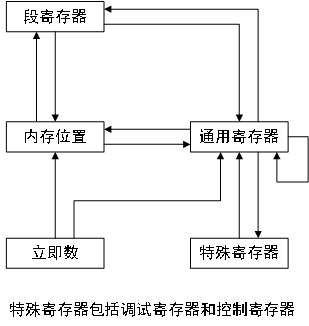
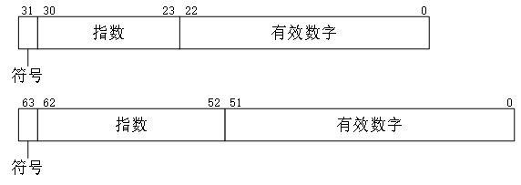
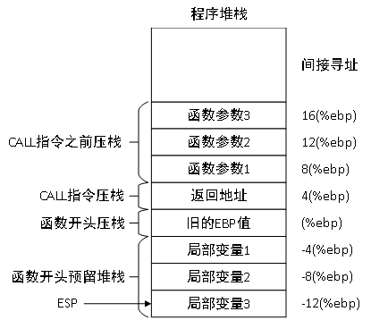
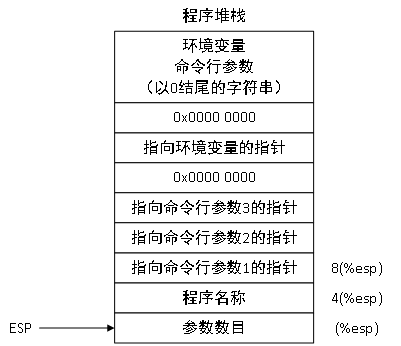

# 汇编语言程序设计

书籍简介：

书籍主页（代码下载）：[Professional Assembly Language](https://www.wiley.com/en-us/Professional+Assembly+Language-p-9780764579011)

# 第一章 什么是汇编语言

## 处理器指令

芯片内部定义的二进制代码。

## 高级语言

high-level language，使用简单的术语创建功能。高级语言分为解释型和编译型。编译型语言需要经过编译和链接之后，才能运行。而解释型语言由解释器读取并解释。相比于汇编语言，高级语言具有可移植性和标准化的特点。

## 汇编语言

为了更高的效率，汇编语言允许程序员直接使用指令码编写程序，汇编语言程序使用助记符表示指令码，汇编器负责将助记符转化为原始的指令码。汇编语言程序由三个部分组成：
* 指令，或称为操作码助记符
* 数据段：如何定义并引用数据
* 命令：伪指令，辅助编程，不产生机器码

# 第二章 IA-32 平台

了解编程的环境，有利于编写汇编语言程序。

## IA-32处理器的核心部分

处理器的主要部件有：
* [控制单元](#控制单元)
* 执行单元
* 寄存器
* 标志

### 控制单元

控制处理器在什么时候进行什么操作，主要工作是实现四个基本功能：
* 从内存获取指令
* 对指令进行解码
* 从内存获取数据
* 写回数据（如有必要）

以下高级特性可加快程序的执行速度：
* 指令预取和解码：指令放置在缓存中，加快获取指令的速度
* 分支预测
* 乱序执行：改变指令的执行顺序
* 退役

### 执行单元

执行单元用于执行指令，由一个或多个运算逻辑单元（ALU）组成。ALU被设计为处理不同数据类型的数学操作。

### 寄存器

处理器内部的存储单元，用于储存需要处理的数据。访问寄存器比访问内存快很多。寄存器分为以下类别：
* 通用寄存器，32位：EAX、EBX、ECX、EDX、EDI、ESI、ESP、EBP
* 段寄存器，16位：CS、DS、SS、ES、FS、GS
* 指令指针寄存器，跟踪要执行的下一条指令：EIP
* 控制寄存器：CR0、CR1、CR2、CR3、CR4

### 标志

即标志寄存器`EFLAGS`，可以用于确定指令是否执行成功。标志可以分为`状态标志`、`控制标志`、`系统标志`。

状态标志，表明处理器进行的数学操作的结果。

| 标志 | 位 | 名称 |
| - | - | - |
| CF | 0 | 进位标志 |
| PF | 2 | 奇偶校验标志 |
| AF | 4 | 辅助进位标志 |
| ZF | 6 | 零标志 |
| SF | 7 | 符号标志 |
| OF | 11 | 溢出标志 |

控制标志，控制处理器的特定行为。
* DF：方向标志，为1时，字符串指令自动递减内存。为0时，字符串指令自动递增内存。

系统标志用于控制操作系统级别的操作。

| 标志 | 位 | 名称 |
| - | - | - |
| TF | 8 | 陷进标志 |
| IF | 9 | 中断使能标志 |
| IOPL | 12和13 | IO特权级别标志 |
| NT | 14 | 嵌套任务标志 |
| RF | 16 | 恢复标志 |
| VM | 17 | 虚拟8086模式标志 |
| AC | 18 | 对准检查标志 |
| VIF | 19 | 虚拟中断标志 |
| VIP | 20 | 虚拟中断挂起标志 |
| ID | 21 | 识别标志 |

## IA-32的高级特性

### x87浮点单元

### 多媒体扩展

### 流化SIMD扩展

Streaming SIMD extension，SSE。

### 超线程

超线程使单一IA-32处理器能够同时处理多个程序执行线程。单个物理处理器包含两个或多个逻辑处理器，每个逻辑处理器拥有寄存器的完整集合，所有的逻辑处理器共享相同的执行单元。

## IA-32处理器系列

主要有Intel系列和AMD系列。

# 第二章（补充） ARMv8 平台

ARMv8引入的AArch64架构，以及后续的ARMv9。

## 参考资料
* [Introducing the Arm architecture](https://developer.arm.com/documentation/102404/latest)
* [AArch64 Exception model](https://developer.arm.com/documentation/102412/latest)
* [AArch64 Instruction Set Architecture](https://developer.arm.com/documentation/102374/latest/)
* [AArch64 memory management](https://developer.arm.com/documentation/101811/latest)
* [AArch64 memory model](https://developer.arm.com/documentation/102376/latest/)
* [Understanding the Armv8.x and Armv9.x extensions](https://developer.arm.com/documentation/102378/latest)
* [AArch64 self-hosted debug](https://developer.arm.com/documentation/102120/0100)
* [AArch64 external debug](https://developer.arm.com/documentation/102196/latest)

# 第三章 相关的工具

介绍创建汇编语言程序所必需的软件工具。

## 开发工具

* 汇编器：把汇编语言源代码转换为处理器的指令码。
* 链接器
* 调试器
* 编译器
* 目标代码反汇编器
* 简档器：确定函数的执行时间

## GNU汇编器

主要使用GNU工具链中的汇编器。

### 安装汇编器

GNU汇编器不在单独的包中发布，和GNU binutils包中的其他开发软件捆绑在一起。

安装方法：
* RedHat系列：yum -y install binutils
* Debian系列：apt install -y binutils
* 编译安装，源代码链接：[binutils](https://ftp.gnu.org/gnu/binutils/)。安装方法略。

### 使用汇编器

* [2.14 pdf](http://www.zap.org.au/elec2041-cdrom/gnutools/doc/gnu-assembler.pdf)
* [2.30 pdf](https://doc.ecoscentric.com/gnutools/doc/as.pdf)
* [2.36 html](https://sourceware.org/binutils/docs-2.36/as/index.html)

### 关于操作码语法

| | AT&T | Intel |
| - | - | - |
| 立即数 | $4 | 4 |
| 寄存器 | %eax | eax |
| 操作数顺序 | mnemonic	source, destination | mnemonic	destination, source |
| 数据长度 | movl $test, %eax | mov eax, dword ptr test |
| 长调用和跳转 | ljmp $section, $offset | jmp section:offset |

参考资料：
* https://csiflabs.cs.ucdavis.edu/~ssdavis/50/att-syntax.htm
* http://web.mit.edu/rhel-doc/3/rhel-as-en-3/i386-syntax.html

## GNU链接器

GNU链接器ld用于把目标代码文件链接位可执行程序文件或库文件。

使用手册：
* [2.30 pdf](https://doc.ecoscentric.com/gnutools/doc/ld.pdf)
* [2.36 html](https://sourceware.org/binutils/docs-2.36/ld/index.html)

## GNU编译器

GNU Compiler Collection，gcc。

### 下载和安装gcc

### 使用gcc

官方手册：https://gcc.gnu.org/onlinedocs/

常用选项：
* -c 只编译或汇编，不链接
* -S 只编译，不汇编
* -E 只预处理，不编译
* -o 指定输出文件名，默认输出文件名为a.out
* -g 生成调试信息
* -pg 生成gprof需要的额外代码
* -O 指定优化等级0/1/2
* -W 设置警告消息级别
* -I 指定include目录
* -L 指定库文件目录
* -l 链接指定库

## GNU调试器程序

gdb。

### 下载和按转GDB

### 使用GDB

官方手册：https://sourceware.org/gdb/current/onlinedocs/gdb.pdf

常用的交互指令：
* break 设置断点
* watch 设置监视点
* info 查看寄存器、堆栈或内存
* x 检查内存位置
* print 显示变量值
* run 开始允许程序
* list 列出指定的函数或行
* next 执行下一条指令，不会进入子函数内部
* step 执行下一条指令，进入子函数内部
* cont 从停止的位置继续执行程序
* until 运行程序，直到到达指定的行

## GNU objdump 程序

参考《程序员的自我修养——链接装载与库》。

官方手册：https://sourceware.org/binutils/docs-2.36/binutils/objdump.html

## GNU简档器程序

gprof，用于分析程序的执行。

官方手册：https://sourceware.org/binutils/docs-2.36/gprof/index.html

## 完整的汇编开发系统

推荐使用Linux操作系统，并安装上述的工具。安装过程略。

# 第4章 汇编语言程序范例

学习GNU汇编器的基本汇编语言程序模板。

## 程序的组成

汇编语言程序由不同的段组成，每个段都有不同的目的。最常见的三个段是：
* 数据段 .data
* bss段 .bss
* 文本段 .text

文本段必须要有，数据段和bss段是可选的。数据段声明带有初始值的数据元素，bss段声明使用0初始化的数据元素。

### 定义段

GNU汇编器使用`.section`命令声明段，只使用一个参数，即段的类型。一般情况下，按照.data、.bss、.text的顺序依次定义。

### 定义起始点

默认情况下，`ld`链接器使用符号`_start`作为程序的起点。也可以使用`-e`参数指定新的起始点。程序入口点需要被外部的程序引用，这使用`.global`命令完成。

汇编语言程序的模板如下：
```asm
.section .data
# initialized data here

.section .bss
# uninitialized data here

.section .text
.global _start  # 声明外部程序可以访问的程序标签
_start:
# instrction code goes here
```

## 创建简单程序

### cpuid 指令

请参考[Intel® 64 and IA-32 Architectures Software Developer’s Manual Volume 2](https://www.intel.com/content/dam/www/public/us/en/documents/manuals/64-ia-32-architectures-software-developer-instruction-set-reference-manual-325383.pdf)第290页。

### 范例程序

[code/ch4/cpuid.s](code/ch4/cpuid.s)

说明：
* 默认使用`main`作为入口点
* 在`WSL`上使用`gcc`编译失败，需要加上`-no-pie`选项，即`gcc -o cpuid cpuid.s -no-pid`。
* [code/ch4/Makefile](code/ch4/Makefile)默认使用`as`，`make USEGCC=1`则使用`gcc`。

## 调试程序

实操环节，主要掌握以下基本技能：
* 设置断点，break指令
* 运行程序，run和cont指令
* 单步运行指令，next和step指令
* 数据查看指令，info、print和x指令

## 在汇编语言中使用C库函数

程序示例：[code/ch4/cpuid2_x86.s](code/ch4/cpuid2_x86.s)

注意：
* 第5行是`.asciz`指令，会在字符串的最后加上0。
* 第16行，%edi的括号一定要加
* 这段代码只能在32位系统上运行
* 通过栈向C库函数传递参数，从右到左依次压栈
* 注意传递给链接器的`-lc`和`-dynamic-linker /lib/ld-linux.so.2`选项

# 第五章 传送数据

本章讨论如何处理数据，以及完成此任务的最佳方式。

## 定义数据元素

介绍在data段和bss段定义数据的方式。

### 数据段

数据段用来定义可读写的数据区域，指令码可以引用这些数据。定义数据需要一个`标签`和一个`指令`。`标签`是引用数据元素所使用的标记，代表一个内存位置。`汇编器指令`定义为数据元素保留多少个字节，这取决于定义的数据的类型和数量。声明命令后，必须定义一个或多个默认值。

| 指令 | 数据类型 |
| - | - |
| .ascii | 文本字符串 |
| .asciz | 以空字符结尾的文本字符串 |
| .byte | 字节值 |
| .double | 双精度浮点数 |
| .float | 单精度浮点数 |
| .int | 32位整数 |
| .long | 32位整数，和.int一样 |
| .octa | 16字节整数 |
| .quad | 8字节整数 |
| .short | 16位整数 |
| .single | 单精度浮点数 |
| .fill | 声明指定长度的内存区域 |

数据定义实例：
```asm
.section .data
ouput:
    .asciz "The Vendor ID is %s\n"  # 以\0结尾的字符串
pi:
    .float 3.1415  # 单精度浮点数
height:
    .int 54  # 32位整数
length:
    .int 62, 35, 47  # 定义多个32位整数，在内存中按照相对位置依次排列
buffer:
    .fill 128  # 申请128个字节并用0填充
```

> 注意：引用数据时的长度，和定义数据时的长度要一致，否者无法获取到正确的数据。

### 定义静态符号

`.equ`命令用于把常量值设置为可以在文本段中使用的符号，数据符号值在程序中是不能改动的。
```asm
.equ LINUX_SYS_CALL, 0x80
```

为了引用静态数据元素，需要在标签名称前面加`$`。
```asm
movl $LINUX_SYS_CALL, %eax
```

### bss段

与数据段相比，bss段只要声明所需要保留的内存数量即可，不需要声明数据类型。

| 命令 | 描述 |
| - | - |
| .comm | 声明未初始化的数据的通用内存区域 |
| .lcomm | 声明未初始化的数据的本地通用内存区域，不会从本地汇编代码之外进行访问 |

例子：
```asm
.section .bss
.lcomm buffer, 100  # 为 buffer 预留100个字节的内存区域
```

> bss段在可执行文件中不存在，但是会占用内存空间。data段即存在可执行文件中，也会占用内存。

## 传送数据元素

处理数据的第一个步骤是在内存和寄存器之间传送。

### MOV指令格式

MOV指令的基本格式：
```asm
mov source, destination
```
> GNU汇编器使用的AT&T语法，源操作数和目标操作数与Intel手册的顺序是相反的。

GNU汇编器还需要在指令中指定传送数据的长度，`mov`指令可以演变为：
* movl 传送32位
* movw 传送16位
* movb 传送8位

源操作数和目标操作数可以是内存位置、立即数、寄存器等。由于一些限制，`mov`指令的源和目标操作数的组合如下：



### 把立即数传送到寄存器和内存

立即数是在指令码语句中直接指定的，并且在运行时不能改动。立即数前需要加美元符号`$`，立即数可以是十进制或十六进制。

```asm
movl $0, %eax
movl $0x100, %ebx  # 将十六进制0x100赋值给EBX寄存器
movl $100, heigh   # 将十进制100赋值给内存位置heigh
```

### 在寄存器之间传送数据

普通寄存器（EAX、EBX、ECX、EDA、EDI、ESI、EBP和ESP）的值可以传送给内存，或接收来自内存或立即数的内容。而专用寄存器（控制、调试、段寄存器）的值只能传送给通用寄存器，或接收来自通用寄存器的内容。

> 在寄存器间传送数据要保持长度一致。

```asm
movl %eax, %ecx  # 32位数据从 EAX 寄存器传送到ECX寄存器
movw %ax, %cx    # 16位数据从 AX 寄存器传送到CX寄存器
```

### 在内存和寄存器之间传送数据

#### 把数据值从内存传送到寄存器

将`value`标签指定的`内存位置的数据值`传送到EAX，`movl`表示传送4个字节。

```asm
movl value, %eax
```

#### 把数据值从寄存器传送到内存

把`ECX`寄存器中存储的4字节数据传送给`value`标签指定的内存位置。

```asm
movl %ecx, value
```

#### 使用变址的内存位置

通过基址+偏移，引用数组中的数据。内存位置由下列因素确定：
* 基址
* 偏移地址
* 数据元素的长度
* 索引

表达式的格式：`base_address (offset_address, index, size)`。获取的数据值位于`base_address + offset_address + index * size`。如果任何值为0，则可以忽略它们，但仍需要逗号作为占位符。`offset_address`和`index`必须是寄存器。

```asm
.section .data
values:
    .int 10, 15, 20, 25, 30，35

.section .text
    movl $2, %edi
    movl values( , %edi, 4), %eax # 将数组的第3个值，即20，传送到EAX寄存器
```

> 通过更改`offset_address`或`index`的值，可以做到遍历数组。

#### 使用寄存器间接寻址

寄存器存储的是内存地址。通过内存地址获取内存位置中的数据称为间接寻址。通过在标签前面加美元符号`$`获取内存地址（仅适用`.data`段定义的标签）。

```asm
movl $value, %edi # 将value标签引用的地址传送到EDI寄存器
```

使用寄存器间接寻址内存。如果EDI没有加括号，表示把EBX寄存器的内容传送到EDI寄存器。如果加了括号，表示将EBA寄存器的内容传送到EDI指向的`内存`。可以在括号前加数字表示偏移。

```asm
movl %ebx, (%edi)
movl %ebx, 4(%edi)
movl %ebx, -4(%edi)
```

## 条件传送指令

`CMOV`指令仅在特定的条件下传送数据。相比于`JMP`指令，对程序优化可能起到一定的作用。`CMOV`指令的格式如下：

```asm
cmovx source, destination
```

其中`x`是一个或两个字母的代码，表示触发传送操作的条件。条件取决于`EFLAGS`寄存器的当前值。

| ELFAGS位 | 名称 | 描述 |
| - | - | - |
| CF | 进位（Carry）标志 | 数学表达式产生了进位或者借位 |
| OF | 溢出（Overflow）标志 | 整数值过大或者过小 |
| PF | 奇偶校验（Parity）标志 | 寄存器包含数学操作照成的错误数据 |
| SF | 符号（Sign）标志 | 指出结果为正还是负 |
| ZF | 零（Zero）标志 | 数学操作的结果为零 |

| 无符号条件传送指令 | 描述 | EFLAGS标志 |
| - | - | - |
| CMOVA / CMOVNBE | 大于 / 不小于或等于 | （CF或ZF) = 0 ，无进位或借位，结果不为0 |
| CMOVAE / CMOVNB | 大于或者等于 / 不小于 | | CF = 0，无进位或借位 |
| CMOVNC | 无进位 | CF = 0 |
| CMOVB / CMOVNAE | 小于 / 不大于或等于 | CF = 1 |
| CMOVC | 进位 | CF = 1 |
| CMOVBE / CMOVNA | 小于或者等于 / 不大于 | (CF或ZF) = 1 |
| CMOVE / CMOVZ | 等于 / 零 | ZF = 1 |
| CMOVNE / CMOVNZ | 不等于 / 不为零 | ZF = 0 |
| CMOVP / CMOVPE | 奇偶校验 / 偶校验 | PF = 1 |
| CMOVNP / CMOVPO | 非奇偶校验 / 奇校验 | PF = 0 |

| 符号条件传送指令 | 描述 | EFLAGS标志 |
| - | - | - |
| CMOVGE / CMOVNL | 大于或者等于 / 不小于 | (SF xor OF) = 0 |
| CMOVL / CMOVNGE | 小于 / 不大于或者等于 | (SF xor OF) = 1 |
| CMOVO | 溢出 | OF = 1 |
| CMOVNO | 未溢出 | OF = 0 |
| CMOVS | 带符号（负） | SF = 1 |
| CMOVNS | 无符号（非负） | SF = 0 |

示例代码：如果ECX寄存器的值大于EBX，则将ECX的值传送到EBX寄存器。

```asm
movl value, %ecx
cmp %ebx, %ecx
cmova %ecx, %ebc
```

> `CMP`指令从第二个寄存器减去第一个寄存器并设置`EFLAGS`寄存器。注意，这个顺序和Intel手册的顺序相反。

## 交换指令

交换指令用于交换数据元素的位置。如果使用`MOV`指令，则需要三条指令和一个中间寄存器，交换指令可以一步完成。

| 指令 | 指令格式 | 描述 |
| - | - | - |
| XCHG | xchg operand1, operand2 | 在两个寄存器或者寄存器和内存位置之间交换值 |
| BSWAP | bswap operand1 | 反转一个32位寄存器中的字节顺序 |
| XADD | xadd source, destination | 交换两个寄存器或者内存位置和寄存器的值，把两个值相加的结果存储在目标操作数。源操作数只能是寄存器，目标操作数可以是寄存器或内存位置。 |
| CMPXCHG | cmpxchg source, destination | if(source == eax) destination = source else eax = destination。没看懂这个指令的应用场景。|
| CMBXCHG8B | | |

交换指令的典型应用场景是排序算法，[bubble.s](code/ch05/bubble.s)是冒泡排序的实现。

## 堆栈

讲解堆栈和用于访问堆栈的指令。

### 堆栈如何工作

* 先入后出，后入先出。
* 栈底是内存区域的末尾位置，`ESP`寄存器始终指向栈顶。
* 压入数据时，`ESP`寄存器的值减少。即栈的地址向下增长。
* 只能从栈顶获取数据（某些技巧可以从中间获取）。

### 压入和弹出数据

压入和弹出的指令如下：

```asm
pushx source      # 压入栈
popx destination  # 弹出栈
```

其中`x`可以是`l`（长字，32位）或`w`（字，16位）。

`push`操作的数据元素如下：
* 16/32位寄存器
* 16/32位内存值
* 16位段寄存器
* 8/16/32位立即数

`pop`操作的数据元素如下：
* 16/32位寄存器
* 16位段寄存器
* 16/32位内存位置

> 数据元素的长度要和指令一致。一般来说，`push`和`pop`指令总是成对出现的。

### 压入和弹出所有寄存器

| 指令 | 描述 |
| - | - |
| pusha / popa | 压入或弹出所有16位通用寄存器 |
| pushad / popad | 压入或弹出所有32位通用寄存器 |
| pushf / popf | 压入或弹出EFLAGS寄存器的低16位 |
| pushfd / popfd | 压入或弹出ELFAGS寄存器的低32位 |

`pusha`的压入顺序是`DI`、`SI`、`BP`、`BX`、`DX`、`CX`、`AX`，`popa`弹出的顺序相反。`pushad`、`popad`的顺序类似。

### 手动使用ESP和EBP寄存器

在汇编语言函数中，经常会把`ESP`寄存器的值复制给`EBP`寄存器，`EBP`指针指向函数的工作堆栈空间的基址。访问存储在堆栈中的参数的指令相对于`EBP`指针引用这些参数。

## 优化内存访问

* 尽可能避免使用内存，最好把变量保存到寄存器中。
* 在内存中连续的顺序访问有利于提高缓存的命中率。
* 定义数据时对齐边界，`gas`汇编器支持`.align`命令。

# 第六章 控制执行流程

本章介绍用于进行跳转和循环的不同汇编语言指令。这两类指令都会改变指令指针。

## 指令指针

指令指针始终指向应该执行的下一条指令，它按照顺序的方式处理应用程序中编写的指令码。由于流水线、乱序引擎等技术的发明，确定`下一条指令`可能是困难的。

> 乱序执行简单来说，就是乱序引擎重排序微操作，发送给退役单元，退役单元执行并监控结果，在适当的时候发送给执行单元，然后从退役单元中删除相关微操作。

当指令指针在程序指令中移动时，`EIP`寄存器会递增，递增的长度是指令的长度。不能通过`MOV`指令更改`EIP`寄存器的值，可以通过分支指令改动。分支指令可以分为无条件分支和条件分支。

## 无条件分支

当程序遇到无条件分支指令时，指针指针自动跳转到另一个位置。无条件分支指令分为以下三种。不同的无条件分支指令有不同的特点，在不同的场合下使用。

* [跳转](#跳转)
* [调用](#调用)
* [中断](#中断)

### 跳转

跳转是汇编语言程序设计中最基本的分支类型，与C语言的`goto`语句是等同的。跳转对程序的性能有负面的影响。跳转指令的格式如下：

```asm
jmp location
```

`location`是要跳转到的程序地址，一般是汇编语言程序代码中的标签。遇到跳转指令时，指令指针寄存器`EIP`改变为紧跟在`location`后面的指令码的内存位置。在幕后，单一跳转汇编指令被分为三种情况，在编码层面是统一的，没有区别。
* 短跳转：跳转偏移量小于128字节
* 远跳转：在分段内存模式下，从一个段跳转到另一个段
* 近跳转：其余所有情况

### 调用

调用和跳转类型，调用保存发生跳转的位置，并具有在需要的时候返回这个位置的能力。汇编语言实现函数使用调用。调用指令分为两个部分，第一个是`call`指令，操作数`address`是程序代码中的标签，被转化为函数第一条指令的内存地址。第二个是`ret`指令，返回到紧跟着`call`指令后面的位置。返回地址通过堆栈来保存，当调用`call`指令时，`EIP`寄存器的值保存到堆栈，并用目标程序的地址更新`EIP`。调用完成之后，将保存到堆栈中的值恢复到`EIP`寄存器。

```asm
call address

ret
```

`call`指令的关键是如何把信息传递给函数，以及函数如何读取和存储这些信息。一般使用堆栈来保存信息，并保存函数的返回值。如[手动使用ESP和EBP寄存器](#手动使用ESP和EBP寄存器)小节所说，可以使用`EBP`间接访问堆栈。从而得到以下函数模板。更多有关函数的信息，将在第11章讨论。

```asm
function_label:
    pushl %ebp
    movl %esp, %ebp
    # some function code here
    movl %ebp, %esp
    popl %ebp
    ret
```

### 中断

中断是处理器中断当前指令码路径并切换到不同路径的方式。中断有两种方式：
* 硬件中断
* 软件中断

与函数类似，当中断发生时，当前正在执行的代码被暂停，转而去执行中断处理程序。中断处理程序执行完毕之后，返回到暂停的地方继续执行。硬件中断由硬件设备生成，是被动的、不可控的。软件中断是软件生成的，是主动的、可控的。

操作系统通过软件中断提供内核函数，从而可以使用内核提供的功能。例如Linux的0x80中断。注意，调试包含软件中断的程序是比较困难的，因为中断处理程序没有被编译到代码中。

## 条件分支

条件分支取决于执行分支时`EFLAGS`寄存器的状态，下面是`EFLAGS`寄存器与条件分支有关的位。每个条件跳转指令都检查特定的标志位以便确定是否符合进行跳转的条件。
* 进位标志（CF）
* 溢出标志（OF）
* 奇偶校验标志（PF）
* 符号标志（SF）
* 零标志（ZF）

### 条件跳转指令

条件跳转指令的格式如下，其中`xxx`是一到三个字符的条件代码，`address`是程序要跳转到的位置。

```asm
jxxx address
```

下表是所有的条件跳转指令。

| 指令 | 描述 | EFLAGS |
| -   | - | - |
| JA    | 如果大于（above），则跳转 | CF=0与ZF=0 |
| JAE   | 如果大于（above）或等于，则跳转 | CF=0 |
| JB    | 如果小于（below），则跳转 | CF = 1 |
| JBE   | 如果小于（below），或等于，则跳转 | CF=1或ZF=1 |
| JC    | 如果进位则跳转 | |
| JCXZ  | 如果CX寄存器为0则跳转 | |
| JECXZ | 如果ECX寄存器为0则跳转 | |
| JE    | 如果相等则跳转 | ZF=1 |
| JG    | 如果大于（greater），则跳转 | ZF=0与SF=OF |
| JGE   | 如果大于（greater）或等于，则跳转 | SF=OF |
| JL    | 如果小于（less），则跳转 | SF<>OF |
| JLE   | 如果小于（less）或等于，则跳转 | ZF=1|
| JNA   | 如果不大于（above），则跳转 | CF=1或ZF=1 |
| JNAE  | 如果不大于（above）或等于，则跳转 | CF=1 |
| JNB   | 如果不小于（below），则跳转 | CF=0 |
| JNBE  | 如果不小于（below）或等于，则跳转 | CF=0或ZF=0 |
| JNC   | 如果无进位，则跳转 | CF=0 |
| JNE   | 如果不等于，则跳转 | ZF=0 |
| JNG   | 如果不大于（greater），则跳转 | ZF=1或SF<>OF |
| JNGE  | 如果不大于（greater）或等于，则跳转 | SF<>OF |
| JNL   | 如果不小于（less），则跳转 | SF=OF |
| JNLE  | 如果不小于（less）或等于，则跳转 | ZF=0或SF=OF |
| JNO   | 如果不溢出，则跳转 | OF=0 |
| JNP   | 如果不奇偶校验，则跳转 | PF=0 |
| JNS   | 如果无符号，则跳转 | SF=0 |
| JNZ   | 如果非零，则跳转 | ZF=0 |
| JO    | 如果溢出，则跳转 | OF=1 |
| JP    | 如果奇偶校验，则跳转 | PF=1 |
| JPE   | 如果偶校验，则跳转 | PF=1 |
| JPO   | 如果奇校验，则跳转 | PF=0 |
| JS    | 如果带符号，则跳转 | SF=1 |
| JZ    | 如果为零，则跳转 | ZF=1 |

说明：
* 部分条件跳转指令是等价的。
* 对于无符号数，使用above/below；对于有符号数，使用greater/less。
* 条件跳转指令只支持短跳转和近跳转，不支持跨段的远跳转。远跳转需要手动编写比较和跳转代码。

### 比较指令

`cmp`指令会比较两个值，并且相应地设置`EFLAGS`寄存器。`cmp`指令的格式如下：

```asm
cmp operand1, operand2
```

> 注意，`cmp`指令用后一个数减去前一个数，但不会更改操作数的值。顺序和Intel手册是相反的。

例子：

```asm
cmp $20, %ebx    ; 比较EBX寄存器和立即数20
cmp data, %ebx   ; 比较EBX寄存器和内存data
cmp (%edi), %ebx ; 比较EBX寄存器和EDI寄存器指向的内存单元
```

### 使用标志位的范例

#### 使用零标志

如果零标志被置1（两个操作数相等），`JE`和`JZ`指令就跳转到分支。零标志可以由`cmp`或数学指令设置。

```asm
movl $10, %edi
loop:
    # some code there
    dec %edi  # EDI寄存器的值减少1
    jz out    # 如果为0则跳转到out标签
    jmp loop
out:
```

#### 使用溢出标志

溢出标志仅针对符号数字，当带符号值对于包含它的数据元素来说太大了，溢出标志被设置为1。

```asm
movb $0x7f, %bl
addb $10, %bl   # 对8位带符号数来说，值的范围是-128 ~ 127。
jb overhere
# some code here
overhere:
```

#### 使用奇偶校验标志

奇偶标志位表明数学运算答案中应该为1的位的数目。如果结果中被设置为1的位的数目是偶数，则奇偶标志位置1，否则置0。

#### 使用符号标志

符号标志使用在带符号数中，用于表示寄存器中包含的值的符号的改变（即符号发生变化时置1）。例如在遍历数组时，可以监控索引从0到-1的变化。例如：[signtest.s](code/ch06/signtest.s)。

#### 使用进位标志

进位标志用在数学表达式中，表示无符号数发生溢出（有符号数使用溢出标志）。向上溢出（结果大于可以表示的最大值）和向下溢出（结果小于0）均会设置进位标志。和溢出标志不同，`dec`和`inc`指令不影响进位标志。

```asm
movl $0xffffffff, %ebx
inc %ebx                # 进位标志不会置位

movl $0xffffffff, %ebx
addl $1, %ebx           # 进位标志置位

movl $2, %eax
subl $4, %eax           # eax = eax - 4，进位标志置位
```

以下指令可以用于设置进位标志。

| 指令 | 描述 |
| - | - |
| CLC | 清空进位标志（设置为0） |
| CMS | 对进位标志求反 |
| STC | 设置进位标志（设置为1） |

## 循环

循环操作重复地执行，直到满足特定条件。

### 循环指令

循环指令使用`ECX`寄存器作为计数器并且随着循环指令的指令自动递减`ECX`的值。递减到0时，不会设置`EFLAGS`寄存器。

| 指令 | 描述 |
| - | - |
| LOOP | 循环直到ECX寄存器为0 |
| LOOPE / LOOPZ | 循环直到ECX寄存器为0，或者没有设置ZF标志（相等/为零时循环） |
| LOOPNE / LOOPNZ | 循环直到ECX寄存器为0，或者设置ZF标志（不相等/不为零时循环） |

循环指令的格式如下。循环指令只支持8位偏移，只能进行短跳转。

```asm
loop address
```

循环开始之前，必须在`ECX`寄存器设置迭代次数。

```asm
    movl $100, %ecx
loop1:
    # some code here
    loop loop1
```

### 循环范例

```asm
# 循环指令示例
.section .data
output:
    .asciz "The value is: %d\n"
.section .text
.global main
main:
    movl $100, %ecx   # 初始化循环计数器
    movl $0, %eax
loop1:
    addl %ecx, %eax   # 将ECX的值累加到EAX
    loop loop1        # 先将ECX减1，再判断是否为0。不为0则跳转到loop1
    pushl %eax
    pushl $output
    call printf
    addl $8, %esp
    movl $1, %eax
    movl $0, %ebx
    int $0x80
```

### 防止loop灾难

`loop`指令先递减`ECX`寄存器，再检查`ECX`寄存器的值。如果`ECX`寄存器为0时执行`loop`指令，那么循环会在寄存器溢出时退出。所以，在执行`loop`指令之前，需要检查`ECX`是否为0，可以使用指令`jcxz`来完成。

```asm
# 循环指令示例
.section .data
output:
    .asciz "The value is: %d\n"
.section .text
.global main
main:
    movl $0, %ecx     # 循环计数器初始值是0
    movl $0, %eax
    jcxz done         # 如果ecx为0，则跳转到done标签
loop1:
    addl %ecx, %eax   # 将ECX的值累加到EAX
    loop loop1        # 先将ECX减1，再判断是否为0。不为0则跳转到loop1
done:
    pushl %eax
    pushl $output
    call printf
    addl $8, %esp
    movl $1, %eax
    movl $0, %ebx
    int $0x80
```

## 模仿高级条件分支

通过反汇编C语言代码，学习如何使用汇编完成条件分支。

### if语句

```asm
if:
    <计算条件>
    jxx else   # 条件为false时跳转到else分支
    <条件为true的代码>
    jmp end
else:
    <条件为false的代码>
end:
```

如果条件比较复杂，建议使用多个跳转指令，每个指令计算条件的一个部分。

### for循环

```asm
for:
    <计算条件>
    jxx forcode  # 条件为true时，跳转到循环体
    jmp end
forcode:
    <for循环体>
    <递增计数器>
    jmp for
end:
```

## 优化分支指令

分支指令可能会导致处理器的指令缓存失效，从而降低程序的性能。

### 分支预测

在遇到分支指令时，处理器的乱序引擎会预测要处理的下一条指令。

1. 无条件分支：很容易确定下一条指令。但是如果跳转距离过远，下一条指令不在缓存中，那么会清空整个缓存区并重新加载指令，严重影响性能。
2. 条件分支：用分支预测算法猜测采取的分支。分支预测算法的主要规则有：
   * 假设会采取向后分支（EIP寄存器的值减少）
   * 假设不会采取向前分支（跟在跳转指令后面的代码最可能被执行）
   * 以前曾经采用过的分支会再次采用，优先级高于前两条。

### 优化技巧

1. 消除分支
2. 编写可预测分支的代码
   1. 最可能执行的代码放在向后分支
   2. 最可能执行的代码放在向前分支的顺序语句中（紧跟着跳转指令的指令）
   ```asm
    loop:
        <可能性高的向后代码>
    jnz loop
        <可能性低一些的顺序执行代码>

    jmp end
        <可能性高一些的顺序执行代码>
    end:
        <可能性低一些的向前代码>
   ```
3. 尽可能展开小循环

# 第七章 使用数字

在汇编语言程序设计中，存储在内存或寄存器中的值可以被解释为多种不同的数据类型。在编码过程中，确保实用正确的指令、以正确的方式解释存储的数据。

## 数字数据类型

在汇编语言程序设计中，有多种表示数字的数据类型，常见的有：
* [无符号整数](#无符号整数)
* [带符号整数](#带符号整数)
* 二进制编码的十进制（BCD）
* 打包的二进制编码的十进制
* 单精度浮点数
* 双精度浮点数
* 双精度扩展浮点数

奔腾处理器SIMD扩展添加的高级数字类型：
* 64位打包整数
* 128位打包整数
* 128位打包单精度浮点数
* 128位打包双精度浮点数

下面会给出每种数据类型，并给出实用范例。

## 整数

汇编语言最基本的数字形式是整数，可以表示一个很大范围内的全部值。

### 标准整数长度

IA-32平台支持4种不同的整数长度：
* 字节，byte，8位
* 字，word，16位
* 双字，doubleword，32位
* 四字，quadword，64位

对于超过一个字节的整数，在内存中以小端格式存储，但在寄存器中以大端格式存储。内存和寄存器相互传输数据中，会自动转换成目标格式。

> 小端：低位存储在低地址。大端：高位存储在低地址。
> 假设连续的内存单元依次存储了0x12、0x34、0x56、0x78。即0x12在低地址，0x78在高地址。
> 小端解释为：0x78563412。
> 大端解释为：0x12345678。

### 无符号整数

组成整数的字节的值直接表示整数值。不同长度的无符号整数有不同的长度范围。

| 位 | 整数范围 |
| - | - |
| 8 | 0 ~ 255 |
| 16 | 0 ~ 65535 |
| 32 | 0 ~ 4294967295 |
| 64 | 0 ~ 18446744073709551615 |

### 带符号整数

有3种方法在计算机中描述负值：
* 带符号数值
  * 将组成带符号整数的位分为符号位和数值位，字节的最大有效位用于表示值的符号，正数是0，符数是1。其余位用二进制表示数字的数值。
  * 有两个0，+0 和 -0。
  * 不能按照无符号整数的方法进行加减
* 反码
  * 无符号整数的相反代码生成相应的负值。例如00000010（十进制2）的反码是11111101（十进制-2）。
  * 0 有两种表示方法
  * 无法进行标准二进制运算
* 补码
  * 反码加1即可得到补码。例如00000010（十进制2）的补码是11111110（十进制-2）。
  * 0只有一种表示。
  * 可以使用标准二进制运算。

计算机使用补码来表示带符号数。下表列出了不同长度带符号数的范围。

| 位 | 最小和最大带符号值 |
| - | - |
| 8 | -128 ~ 127 |
| 16 | -32768 ~ 32767 |
| 32 | -2147483648 ~ 2147483647 |
| 64 | -9223372036854775808 ~ 9223372036854775807 |

### 使用带符号整数

内存和寄存器只是存储二进制值。将二进制值解释成什么内容，是由程序来控制的。

### 扩展整数

将值传送给大一些的位置时（例如字传送给双字），需要扩展整数。

对于无符号整数来说，高位需要清0。使用指令`MOVZX`可以一步完成传输数据和清0。`source`可以是8为或16位的寄存器或内存位置，`destination`可以是16位或32位的寄存器。

```asm
movzx source, destination
```

考虑如下代码段，`CL`寄存器的值会传送给`EBX`寄存器的低8位，同时`EBX`寄存器的高24位会被清0。
```asm
movzx %cl, %ebx
```

对于符号整数来说，高位需要扩展为符号位的值。如果符号位是0，则高位填0；如果符号位是1，则高位填1。使用指令`MOVSX`可以完成此项工作，指令格式与`MOVZX`类似。考虑如下代码段，`BX`寄存器存储了符号数`-79`。使用指令`MOVSX`传输给`EAX`寄存器时，`EAX`寄存器的高16位会被1填充，保证`EAX`寄存器的值依旧是`-79`。
```asm
movw $-79, %bx
movsx %bx, %eax
```

### 在GNU汇编器中定义整数

汇编语言可以在指令中使用立即数，也可以在数据段中定义整数，这部分内容在[定义数据元素](#定义数据元素)一节中介绍了。考虑如下代码段，在数据段预留了32位大小的内存空间，并用初始值`0xFFFFFFFD`填充。标签`data1`既可以被解释为一个32位带符号整数`-3`，也可以被解释为两个16位带符号整数`-1`和`-3`，也可以被解释为4个8位带符号整数`-1`、`-1`、`-1`和`-3`。

```asm
.section .data
data1:
    .int -3
```

## SIMD整数

### MMX整数

### 传送MMX整数

### SSE整数

### 传送SSE整数

略。

## 二进制编码的十进制

Binary Coded Deimal, 即BCD码，经常用于简化对使用十进制数字的设备的处理，例如计时器。

### BCD是什么

按照二进制格式对十进制进行编码。每个BCD值都是一个无符号8位整数，值的范围是0~9，大于9的值被认为是非法的。包含BCD值的字节组合在一起表示十进制的数位。最低字节保存十进制的个位值，下一个较高字节保存十进制的十位值，依次类推。例如十进制214表示为BCD值`00000010 00000001 00000100`。

打包的BCD使用一个字节表示两个BCD值。例如十进制1489表示为BCD值`00010100 10001001`。但是无法表示带符号的BCD整数。

### FPU BCD值

FPU寄存器可以用于在FPU之内进行BCD数学运算操作。FPU有8个80位（10字节）寄存器（ST0 ~ ST7）。使用低位的9个字节存储打包的BCD值，最高字节的最高一位用来表示符号，0是正，1是负。最高字节的其余7位不使用。

在内存中创建80位打包的BCD值，传送给FPU寄存器后会自动转换为扩展的双精度浮点数。在FPU中，对数据进行的任何数学操作都是按照浮点格式进行的。从FPU寄存器获取结果时，浮点值被自动转换为80位打包BCD格式。

### 传送BCD值

指令`fbld`把80位打包BCD值加载到FPU寄存器中，指令`fbstp`从FPU寄存器获取这些值。格式如下，其中`source`和`destination`是80位的内存位置。

```asm
fbld source
fbstp destination
```

> FPU寄存器的行为类似于堆栈，可以把值压入和弹出FPU寄存器池。ST0引用位于堆栈顶部的寄存器。当值被压入FPU寄存器堆栈时，它被放在ST0寄存器，ST0中原来的值被加载到ST1中。

```asm
.section .data
data1:
    .byte 0x34, 0x12, 0x00, 0x00, 0x00, 0x00, 0x00, 0x00, 0x00, 0x00
data2:
    .int 2
.section .text
.global main
main:
    nop
    fbld data1   # 将80位打包BCD值加载到ST0寄存器
    fimul data2  # ST0 = ST0 * data2
    fbstp data1  # 将ST0寄存器的值存放到data1
    movl $1, %eax
    movl $0, %ebx
    int $0x80
```

## 浮点数

本节介绍浮点数是什么，演示如何在汇编语言中使用它。

### 浮点数是什么

整数不能描述所有数字关系，某些时候，需要引入小数的概念。所有的小数和整数称为`实数`。`浮点数`是为了在计算机中表示实数。

浮点数使用科学计数法表示实数。科学计数法把数字表示为系数和指数，在十进制中，指数的基数是10。例如`3.6845*10^2`，系数是`3.6845`，指数是`2`。

计算机系统使用二进制浮点数，使用二进制浮点数表示值，系数和指数都是二进制。例如数字`1.0101*2^2`表示二进制值`101.01`，转换为十进制是`1*2^2 + 0*2^1 + 1*2^0 + 0*2^-1 + 1*2^-2 = 5.25`。二进制小数可能会无限长，必须在某个位置截断这些值。编写二进制浮点数时，通常被规格化了，把小数点移动到最左侧的数位并修改指数进行补偿。例如`1101.011`被表示为`1.101011*2^3`。

### 浮点数标准格式

IEEE定义了`IEEE 754`浮点格式，用于在计算机系统中通用地表示实数。754标准将浮点数分为3个部分：
* 符号：1负值 0正值
* 有效数字：系数。系数规格化后，由1和二进制小数构成。这里只存储二进制小数。
* 指数：以补码的形式存储

754标准定义了两种长度的浮点数，32位是单精度浮点数，64位是双精度浮点数。下图显示了不同精度类型的位的布局。单精度浮点数的十进制范围是1.18*10^-38到.40*10^38。双精度浮点数的十进制范围是2.23*10^-308到1.79*10^308。




### IA-32浮点值

IA-32平台还定义了自己的80位浮点格式，称为扩展双精度浮点格式。64位作为有效数字，15位作为指数，值的范围是3.37*10^-4932到1.18*10^4932。

### 在GNU汇编器中定义浮点值

如[定义数据元素](#定义数据元素)一节所述，`.float`命令用于定义32位单精度浮点数，`.double`命令用于定义64位双精度浮点数。浮点值按照小端格式存储在内存中。数组按照命令中定义值的顺序存储。

### 传送浮点值

`FLD`指令用于把存储在内存中的单精度和双精度浮点数压入到FPU寄存器堆栈中。GNU汇编器使用`FLDS`压入单精度浮点数，`FLDL`压入双精度浮点数。

```asm
flds source # 将单精度浮点数压入到FPU寄存器堆栈，source是32位内存位置
fldl source # 将双精度浮点数压入到FPU寄存器堆栈，source是64位内存位置
```

`FST`指令用于把获取FPU寄存器堆栈中顶部的值。`FSTS`获取单精度浮点数，`FSTL`获取双精度浮点数。

```asm
fsts source # 从FPU寄存器堆栈顶部获取单精度浮点数，source是32位内存位置
fstl source # 从FPU寄存器堆栈顶部获取双精度浮点数，source是64位内存位置
```

### 使用预置的浮点值

| 指令 | 说明 |
| - | - |
| FLD1 | 把+1.0压入FPU堆栈中 |
| FLDL2T | 把10的对数（底数2）压入FPU堆栈中 |
| FLDL2E | 把e的对数（底数2）压入FPU堆栈中 |
| FLDPI | 把PI的值压入FPU堆栈中 |
| FLDLG2 | 把2的对数（底数10）压入FPU堆栈中 |
| FLDLN2 | 把2的对数（底数e）压入FPU堆栈中 |
| FLDZ | 把+0.0压入FPU堆栈中 |

> 浮点数中，+0.0和-0.0是有区别的，大多数操作被认为是相同的值。除法会产生不同的值（正无穷大和负无穷大）。

### SSE浮点数据类型

略。

### 传送SSE浮点值

略。

## 转换

略。

# 第八章 基本数学功能

本章研究汇编语言中基本`整数`数学功能。包含算数运算指令（加减乘除）、移位指令、十进制运算指令、布尔逻辑和位测试指令。

## 整数运算

整数的加法、减法、乘法和除法。

### 加法

#### ADD指令

`ADD`指令用于把两个整数相加。指令格式如下，加法结果存储在`destination`。`source`可以是立即值、内存位置或寄存器，`destination`可以是内存位置或寄存器，不能同时为寄存器。

```asm
add source, destination  # destination = source + destination
```

`ADD`可以将8位、16位或32位值相加，需要要指令尾部添加b(8位)、w(16位)或l(32位)来指定操作数长度。`ADD`指令的示例如下。

```asm
addb $10, %al   # 8位，AL = 10 + AL
addw %bx, %cx   # 16位，CX = BX + CX
addl %eax, %eax # 32位，EAX = EAX + EAX
```

> 在没有使用整个32位寄存器时，最好使用0填充目标寄存器。必要时，可以使用`MOVSX`进行符号扩展。

#### 检测进位或者溢出情况

对于无符号数，加法照成进位时（结果大于允许的最大值），进位标志（Carry）置1。对于带符号整数，出现溢出情况时（结果小于允许的最小值、大于允许的最大值），溢出标志（Overflow）置1。在不确定输入值的长度时，总应该关心进位（无符号数）或溢出（有符号数）标志。

> 进位和溢出标志的设置与加法中使用的数据长度相关联。ADDB结果超过255，进位标志置1。ADDW结果超过65535，进位标志置1。

#### ADC指令

当处理用32位寄存器无法存放的无符号或带符号数据时，可以把数据分割为多个双字数据元素，并对每个数据元素执行独立的加法。显然，需要将进位标志传递到下一对加法。可以使用`ADC`指令完成这项工作。`ADC`指令与`ADD`指令类似，但是`ADC`指令的结果包含进位标志，即`destination=source + destination + CF`。同样需要附加字符表示操作数的长度。`ADC`指令可以同时处理无符号数和带符号数。

```asm
adc source, destination
```

#### ADC使用范例

考虑`0x01B041869F`和`0x0155ACB400`相加。`0x01B041869F`存储在EAX和EBX，`0x0155ACB400`存储在ECX和EDX。最终结果存储在ECX:EDX。

```
                    EAX            EBX
0x01B041869F        0x00000001     0xB041869F
                    ECX            EDX
0x0155ACB400        0x00000001     0x55ACB400
---------------------------------------------
                    0x00000003     0x05EE3A9F
```

```asm
.section .data
data1:
    .quad 0x01B041869F
data2:
    .quad 0x0155ACB400
output:
    .asciz "The result is %qd\n"
.section .text
.global main
main:
    movl data1, %ebx     # 内存是小端存储
    movl data1 +4, %eax
    movl data2, %edx
    movl data + 2, %ecx
    addl %ebx, %edx      # 低32位相加
    adcl %eax, %ecx      # 高32位相加，需要使用adc指令，加上进位
                         # 最终结果存储在 ecx:edx
    pushl %ecx           # 内存是小端存储，栈向低地址增长
    pushl %edx           # 所以先压高位（高地址），再压低位（低地址）
    push $output
    call printf
    addl $12, %esp
    pushl $0
    call exit
```

### 减法

#### SUB指令

`SUB`与`ADD`指令类似，区别只是在与`SUB`指令计算的是减法。`destination = destination - source`。`SUB`可以同时处理无符号数和带符号数。

```asm
sub source, destination
```

`SUB`指令的示例如下。

```asm
subb $10, %al     # al = al - 10
subw $10, %ax     # ax = ax - 10
subl $10, %eax    # eax = eax - 10
```

与`SUB`指令类似的有`NEG`指令，`NEG`指令生成值的补码。相当于0减去本上，但是`NEG`指令更快。

> SUB指令在GNU汇编器的操作数顺序和Intel手册中的操作数顺序是相反的。

#### 减法操作中的进位和溢出

对于无符号数，减法的结果产生负数时，进位标志（Carry）置1。对于带符号整数，出现溢出情况时（结果小于允许的最小值、大于允许的最大值），溢出标志（Overflow）置1。在不确定输入值的长度时，总应该关心进位（无符号数）或溢出（有符号数）标志。

在8位的情况下，考虑以下两个减法。OF=0很好理解，因为计算结果没有超出8位带符号数的上限和下限。对`CF`而言，需要先转换为无符号数。`-5 - (-3)`实际上是`251 - 253`，会产生负数结果`-2`，所以`CF=0`。`-5 -3`实际上是`251 - 3`，结果是正数，所以`CF=0`。

```asm
-5 - (-3) = -2    CF=1 OF=0
-5 - 3    = -8    CF=0 OF=0
```

#### SBB指令

SBB指令在多字节减法操作中利用进位和溢出标志实现跨越数据边界的借位特性。使用方法与`ADC`指令类似。指令格式如下。

```asm
sbb source, destination
```

### 递增和递减

INC和DEC用于对无符号数进行递增和递减操作，且不会影响进位标志。所以可以用于递增或递减计数器的值。`destination`可以是8位、16位或32位寄存器或内存中的值。

```asm
inc destination
dec destination
```

### 乘法

与加法和减法不同，对于无符号和带符号整数的乘法需要使用不同的指令。

#### 使用MUL进行无符号整数乘法

`mul`指令的格式如下，源操作数可以是8位、16位或32位寄存器或内存值。需要附加字符表示操作数的长度。根据源操作数长度的不同，目标操作数是AL、AX或EAX。由于乘法可能产生很大的值，所以`MUL`的目标位置必须是源操作数的两倍长度。下表列出了无符号整数乘法的需求。

```asm
mul source
```

| 源操作数长度 | 目标操作数长度 | 目标位置 |
| - | - | - |
| 8位 | AL | AX |
| 16位 | AX | DX:AX |
| 32位 | EAX | EDX:EAX |

#### MUL指令范例

把315814和165432相乘。这两个操作数都是32位，所以结果是64位，存储在`EDX:EAX`。

```asm
.section .data
data1:
    .int 315814
data2:
    .int 165432
result:
    .quad 0
output:
    .asciz "The result is %qd\n"
.section .text
.global main
main:
    movl data1. %eax       # EAX是隐含的目标操作数
    mull data2             # EDX:EAX = data2 * eax
    movl %eax, result      # 低32位
    movl %edx, result + 4  # 高32位
    pushl %edx
    pushl %eax
    pushl $output
    call printf
    add $12, %esp
    pushl $0
    call exit
```

#### 使用IMUL进行带符号整数乘法

`imul`指令有三种不同的格式。第一种格式使用一个操作数，其行为和`mul`指令完全一样。目标操作数和目标位置的规则也是一样的。

```asm
imul source
```

第二种格式使用两个操作数，可以将结果存储在EAX之外的寄存器。source可以是16位或32位的寄存器或内存中的值，destination必须是16位或32位通用寄存器。这种格式结果最长是32位，需要检查溢出标志。

```asm
imul source, destination
```

第三种格式使用三个操作，multiplier是一个立即数，souce是16位或32位寄存器或内存中的值，destination必须是通用寄存器。这种格式执行一个值（source）和一个立即数（multiplier）的快速乘法，结果存储在目标位置（destination）。

```asm
imul multiplier, source, destination
```

#### IMUL指令范例

第一种格式和`MUL`指令类似，这里给出后两种格式的范例。

```asm
.section .data
value1:
    .int 10
value2:
    .int -35
value3:
    .int 400
.section .text
.global main
main:
    movl value1, %ebx
    movl value2, %ecx
    imull %ebx, %ecx        # ecx = ecx * ebx
    movl value3, %edx
    imull $2, %edx, %eax    # eax = edx * 2
    movl $1, %eax
    movl $0, %ebx
    int $0x80
```

#### 检查溢出

当使用带符号整数和IMUL指令时，总是要检查结果中的溢出。可以使用JO指令完成。

```asm
.section .text
.global main
main:
    movw $680, %ax
    movw $100, %cx
    imulw %cx         # DX:AX = 0x109A0, 结果导致16位寄存器溢出。CF/PF/IF/OF 会被设置
    jo over
    movl $1, %eax
    movl $0, %ebx
    int $0x80
over:
    movl $1, %eax
    movl $1, %ebx
    int $0x80
```

#### 除法

无符号整数和带符号整数使用不同的除法指令。除法的结果分为两部分，商和余数。

##### 无符号除法

`DIV`指令用于无符号整数的除法操作，指令格式如下。需要附加字符表示操作数的长度。其中`divisor`（除数）是隐含的被除数要除以的值，可以是8位、16位或32位寄存器或内存中的值。被除数存储在AX、DX:AX或EDX:EAX中。结果存储在被除数值使用的相同寄存器中，所以除法操作完成时会丢失被除数。

```asm
div divisor
```

下表列出了`div`指令操作数长度和结果的存储位置。

| 除数长度 | 被除数 | 被除数长度 | 商 | 余数 |
| - | - | - | - | - |
| 8 | AX | 16 | AL | AH |
| 16 | DX:AX | 32 | AX | DX |
| 32 | EDX:EAX | 64 | EAX | EDX |

`div`指令的示例代码如下：

```asm
.section .data
dividend:
    .quad 8335
divisor:
    .int 25
quotient:
    .int 0
remainder:
    .int 0
output:
    .asciz "The quotient is %d, and the remainder is %d\n"
.section .text
.global main
main:
    movl dividend, %eax        # 64位整数低32位
    movl dividend + 4, %edx    # 64位整数高32位
    divl divisor
    movl %eax, quotient        # 商：  EAX
    movl %edx, remainder       # 余数：EDX
    pushl quotient             # 从右往左压入参数
    pushl remainder
    pushl output
    call printf
    add $12, %esp
    pushl $0
    call exit
```

#### 带符号除法

`IDIV`指令用于带符号除法，使用方法与`DIV`指令完全一致。

```asm
idiv divisor
```

注意的两点：
* 余数的符号总是与被除数的符号相同
* 被除数的长度必须是除数长度的两倍，所以有时候必须符号扩展整数值。例如`MOVSX`指令。

> 如何符号扩展到64位整数？

#### 检查除法错误

执行除法指令前，需要检查除数是否为0。

## 移位指令

移位指令提供了执行基于2的乘方的乘法和除法操作的快速和容易的方式。二进制数字向左移1位就是乘以2，右移一位就是除以2。

### 移位乘法（左移位）

`SAL`（向左算术移位）和`SHL`（向左逻辑移位）使整数值向左移动，这两个指令的作用是相同的，并且是可以互换的。`SAL`和`SHL`有三种不同的格式，目标值可以是8位、16位或32位寄存器或内存中的值。需要在助记符的结尾附加上一个字符，表示目标值的长度。

```asm
sal destination            # 向左移动一位
sal %cl, destination       # 向左移动CL寄存器指定的位数
sal shifter, destination   # 向左移动shifter值指定的位数
```

可以对无符号数和带符号数执行向左移位指令。移位照成的空位（低位）用0填充，移出的位首先被放置在进位标志，在下一次移位操作中丢弃。

### 移位除法（右移位）

`SHR`（向右逻辑移位）指令用于无符号数，移位照成的空位（高位）用0填充，移出的位首先被放置在进位标志，在下一次移位操作中丢弃。

`SAR`（向右算术移位）指令用于带符号数，移位照成的空位（高位）用`符号位`填充，移出的位首先被放置在进位标志，在下一次移位操作中丢弃。

### 循环移位指令

溢出的位被存放在值的另一端，而不是丢弃。循环移位的指令格式与移位指令一样，有三种不同的格式。

| 指令 | 描述 |
| ROL | 向左循环移位 |
| ROR | 向右循环移位 |
| RCL | 向左循环移位，并且包含进位标志。 |
| RCR | 向右循环移位，并且包含进位标志。 |

### 循环指令总结

| 指令 | 全称 | 描述 |
| - | - | - |
| SHL | Shift Left | 向左逻辑移位 |
| SHR | Shift Right | 向右逻辑移位 |
| SAL | Shift Arithmetic Left | 向左算术移位 |
| SAR | Shift Arithmetic Left | 向右算术移位 |
| ROL | Rotate Left | 向左循环移位 |
| ROR | Rotate Right | 向右循环移位 |
| RCL | Rotate Left with carry | 向左循环移位 |
| RCR | Rotate Right with carry | 向右循环移位 |

## 十进制运算

略

## 逻辑操作

对字节值中的原始位执行各种操作。常见的有布尔逻辑和位测试。

### 布尔逻辑

| 指令 | 格式 | 说明 |
| - | - | - |
| AND | and source, destination | 按位与 |
| NOT | not source | 按位取反 |
| OR | or source, destination | 按位或 |
| XOR | xor source, destination | 按位异或 |

`source`可以是8位、16位或32位立即值、寄存器或内存中的值，`destination`可以是8位、16位或32位寄存器或内存中的值，但不能同时是内存中的值。`NOT`指令只有一个操作数。

> 清空寄存器最快的方式是自己和自己异或，例如`xor %eax, %eax`。

### 位测试

有时候需要确定某一位是否为1。`TEST`指令在8位、16位或32位值之间执行按位AND操作，并相应地设置EFLAGS寄存器，而且不修改目标寄存器地值。

```asm
test source, destination
```

示例：[cpuidtest.s](code/ch08/cpuidtest.s)

# 第九章 高级数学功能

本章介绍FPU的浮点数功能。

## FPU环境

本小节介绍FPU寄存器堆栈、控制字、状态字、标记字。

### FPU寄存器堆栈

FPU是一个自持的单元，使用与标准处理器分离的一组寄存器来处理浮点操作。附加的FPU寄存器包括8个80位数据寄存器和3个16位寄存器（控制、状态、标记）。

数据寄存器称为R0~R7，但不使用这个名称访问。它们连接成一个循环堆栈，堆栈顶部的寄存器是在FPU的`控制寄存器`中定义的，名为`ST(0)`，其余寄存器是`ST(x),x=1...7`。

当数据被加载到FPU堆栈时，堆栈顶部沿着8个寄存器向下移动。当加载了8个值之后，所有的寄存器都被使用了。如果加载第9个值，堆栈指针会绕回到第一个寄存器并替换，这会产生FPU异常。加载浮点值到寄存器堆栈的指令参考[传送浮点值](#传送浮点值)、[使用预置的浮点值](#使用预置的浮点值)。`FILD`把整数存储到堆栈寄存器。

### FPU状态寄存器

因为FPU独立于主处理器，所以一般不使用EFLAGS寄存器来表示结果和确定行为。FPU使用状态寄存器表明FPU的操作情况，一个16位的寄存器，不同的位表示了不同的状态。

| 状态位 | 描述 |
| - | - |
| 0 | 非法操作异常标志 |
| 1 | 非规格化操作数异常标志 |
| 2 | 除数为零异常标志 |
| 3 | 溢出异常标志 |
| 4 | 下溢异常标志 |
| 5 | 精度异常标志 |
| 6 | 堆栈错误 |
| 7 | 错误汇总状态 |
| 8 | 条件代码位0（C0） |
| 9 | 条件代码位1（C1） |
| 10 | 条件代码位2（C2） |
| 11-13 | 堆栈顶部指针 |
| 14 | 条件代码位3（C3） |
| 15 | FPU繁忙标志 |

说明：
1. 4个条件代码位一起使用，表示浮点操作结果的特定错误代码。
2. 堆栈顶部位用于表示哪个FPU数据寄存器被设置为ST0寄存器。

使用`FSTSW`（Store FPU status word after checking error conditions）指令可以把状态寄存器读取到一个双字内存位置或者AX寄存器中。

```asm
fstsw status
fstsw %ax
```

### 控制寄存器

控制寄存器控制FPU的浮点功能。

| 控制位 | 描述 | 说明 |
| - | - | - |
| 0 | 非法操作异常掩码 | |
| 1 | 非规格化操作数异常掩码 | |
| 2 | 除数为零异常掩码 | |
| 3 | 溢出异常掩码 | |
| 4 | 精度异常掩码 | |
| 5 | 保留 | |
| 6-7 | 精度控制，数学计算的浮点精度 | 00 单精度，24位有效位<br>01 未使用<br>10 双精度（53位有效位）<br>11 扩展双精度（64位有效位）（默认） |
| 8-9 | 舍入控制 | 00 舍入到最近值（默认）<br>01 向下舍入<br>10 向上舍入<br>11 向零舍入 |
| 12 | 无穷大控制 | |
| 13-15 | 保留 | |

`FSTCW`指令把控制寄存器的值保存到双字内存位置中，`FLDCW`把双字内存值加载到控制寄存器中。

> FSTCW Store FPU control word after checking error conditions. \
> FLDCW Load FPU control word.

### 标记寄存器

标记寄存器用于标识8个80位FPU数据寄存器中的值，每个寄存器占用两位。R0是0-1位，R1是2-3位，依次类推。寄存器值解释如下：
* 00 一个合法的扩展双精度值
* 01 零值
* 10 特殊的浮点值
* 11 无内容，空

### 使用FPU堆栈

了解如何把数据调度到堆栈中以及如何在堆栈中调度数据以便执行计算。

```asm
.section .data
value1:
    .int 40
value2:
    .float 92.4405
value3:
    .double 221.330321
.section .bss
    .lcomm int1, 4
    .lcomm control, 2
    .lcomm status, 2
    .lcomm result, 4
.section .text
.global main
main:
    finit           # 初始化FPU，控制和状态寄存器设置为默认值，数据寄存器的值不改变
    fstcw control   # 获取控制寄存器的值
    fstsw status    # 获取状态寄存器的值
    filds value1    # 把双字整数value1加载到FPU寄存器堆栈中，指令最后的s标识short
    fists int1      # 获取寄存器堆栈顶部的值，并放到目标位置
    flds  value2    # 把单精度浮点数加载到FPU寄存器堆栈中
    fldl  value3    # 把双精度浮点数加载到FPU寄存器堆栈中，现在寄存器堆栈中有三个值
    fst   %st(4)    # 把ST0寄存器的数据复制到另一个FPU寄存器（这里是ST4）。注意 %st(4) 的书写格式
    fxch  %st(1)    # 交换ST0寄存器和另一个FPU寄存器的值（这里是ST1）
    fstps result    # 弹出ST0寄存器的值到result。
                    # FST复制ST0到内存或另一个FPU寄存器，保持ST0的值不变
                    # FSTP会把值从寄存器中弹出，其余值向上移动一个位置
    movl  $1, %eax
    movl  $0, %ebx
    int   $0x80
```

### FPU寄存器堆栈指令助记

所有FPU指令都带有前缀`F`。`ST`表示`store`，从`ST0`获取数据到内存或其他FPU寄存器。`LD`表示`load`，从内存加载数据到`ST0`。

两条最基本的指令，适用于浮点数：
```asm
FST   ST0  -> 内存
FLD   内存 -> ST0
```

加上长度修饰：
```asm
FSTS
FLDS   单精度浮点数，32位

FSTL
FLDL   双精度浮点数，64位
```

整数的FPU指令：
```asm
FIST / FILD

FISTS / FILDS  short, 16位
FISTL / FILDL  long,  32位
```

从FPU寄存器弹出数据：以上带`ST`的指令，`ST`替换成`STP`。例如`FISTPL`，从ST0弹出32位整数。

指令编码总结如下：
```asm
F[I][LD/ST/STP][S/L]
```

## 基本浮点运算

| 指令 | 描述 |
| - | - |
| FADD | 浮点加法 |
| FDIV | 浮点除法 |
| FDIVR | 反向浮点除法 |
| FMUL | 浮点乘法 |
| FSUB | 浮点减法 |
| FSUBR | 反向浮点减法 |

每一个都具有单独的指令和格式，可以生成6个可能的功能。例如`FADD`可以像下面使用：
* FADD source 内存中32位或64位值和ST0寄存器相加
* FADD %st(x), %st(0)  st(x)和st(0)相加，结果存储在st(0)中
* FADD %st(0), %st(x)  st(0)和st(x)相加，结果存储在st(x)中
* FADDP %st(0), %st(x)  st(0)和st(x)相加，结果存储在st(x)中，并且弹出st(0)。st(0)的值丢弃。
* FADDP st(0)和st(1)相加，结果存储在st(1)中，并且弹出st(0)。st(0)的值丢弃。
* FIADD source 16位或32位整数和st(0)相加，结果存储到st(0)中

注意：操作数有内存位置的，需在指令末尾加上长度指示符。对浮点数，`s`表示单精度浮点数，`l`表示双精度浮点数。对整数，`s`表示16位整数，`l`表示32位整数。

在使用FPU进行复杂的数学运算时，注意以下几点：
1. 把尽可能多的值加载到FPU中总可以提高速度
2. 跟踪如何在堆栈中安排值是很重要的。新的值被加载时，原始值在FPU寄存器堆栈中向下移动。

书上的例子：略。

## 高级浮点运算

FPU提供很多对浮点数执行的高级功能。

| 指令 | 描述 |
| - | - |
| FABS | 计算ST0中的值的绝对值 |
| FCHS | 改变ST0中的值的符号 |
| FSQRT | 计算ST0中值的平方根 |
| FRNDINT | 把ST0中的值舍入到最近的整数，舍入方向取决于FPU控制寄存器 |
| FCOS | 计算ST0中的值的余弦 |
| F2XM1 | 计算2的乘方减去1，次数为ST0中的值 |
| FPATAN | 计算ST0中的值的部分反正切 |
| FPREM | 计算ST0中的值除以ST1中的值的部分余数 |
| FPREM1 | 计算ST0中的值除以ST1中的值的IEEE部分余数 |
| FPTAN | 计算ST0中的值的部分正切 |
| FSCALE | 计算ST0乘以2的ST1次乘方 |
| FSIN | 计算ST0中执行的正弦 |
| FSINCOS | 计算ST0中的值的正弦和余弦 |

| FYL2X | 计算ST1*log ST0，以2为基数 |
| FYL2XP1 | 计算ST1*log(ST0+1)，以2为基数 |

### 浮点功能

* FABS 计算ST0的绝对值
* FCHS 改变ST0的符号
* FSQRT 计算机ST0的平方根
* FRNDINT 把ST0舍入到最近的整数，舍入方向取决于FPU控制寄存器

### 部分余数

partical remainder。

除法操作的余数由被除数对除数的一系列减法决定。在每次减法迭代时，中间余数称为部分余数。当部分余数小于除数时，迭代停止。迭代次数的整数值称为商，最终的部分余数称为余数。

确定除法余数的基本方法时确定被除数和除数的除法的浮点商，然后把这个值舍入到最近的整数。那么，余数就是除数和商相乘的结果与被除数之间的差值。

FPREM默认向零舍入，FPREM1向上舍入。

### 三角函数

FSIN计算正弦，FCOS计算余弦。他们都有一个隐含操作数ST0，计算结果也是存放在ST0寄存器。FSINCOS指令同时计算正弦和余弦，把正弦值放在ST0寄存器，然后压入余弦值。即正弦值放在ST1寄存器，余弦值放在ST0寄存器。

FPTAN计算正切值，隐含的操作数是ST0。计算结果存放在ST0寄存器，然后压入值1.0。所以正切值放在ST1寄存器。

FPATAN计算角值ST1/ST0的反正切，计算结果存放在ST1，然后弹出ST0。最终结果存放在ST0。

注意，三角函数使用弧度而不是角度，需要用公式`radians=(degrees*pi)/180`将角度转换为弧度。例如下面的代码。

```asm
flds degree         # 角度值存放在ST0寄存器
fidivs val180       # 角度值除以180
fldpi               # pi存放在ST0寄存器，角度值在ST1
fmul %st(1), %st(0)
fsin
```

### 对数函数

FYL2X执行如下计算：

```math
ST(1) * log2(ST(0))
```

> 如果要计算其他底数的对数运算，可以使用换底公式。 log a(b) = log2(b) / log2(a) 。

FYL2X1执行如下计算：

```math
ST(1) * log2(ST(0) + 1.0)
```

FSCALE指令计算ST(0)乘以2的ST(1)次方。当ST(1)大于0时放大，小于0时缩小。

## 浮点条件分支

FPU使用自己的指令来比较浮点数，而不是用比较整数的CMP指令。

### FCOM指令系列

FCOM指令系列用于在FPU中比较两个浮点值。指令比较的一方是ST0寄存器，另一方要么是FPU寄存器，要么是内存中的浮点值。

| 指令 | 描述 |
| - | - |
| FCOM | 比较ST0寄存器和ST1寄存器 |
| FCOM %st(x) | 比较ST0寄存器和另一个FPU寄存器 |
| FCOM source | 比较ST0寄存器和32位或者64位的内存值 |
| FCOMP | 比较ST0寄存器和ST1寄存器，并且弹出堆栈 |
| FCOMP %st(x) | 比较ST0寄存器和另一个FPU寄存器，并且弹出堆栈 |
| FCOMP source | 比较ST0寄存器和32位或者64位的内存值，并且弹出堆栈 |
| FCOMPP | 比较ST0寄存器和ST1寄存器，并且两次弹出堆栈 |
| FSTS | 比较ST0寄存器和值0.0 |

比较的结果设置在状态寄存器的C0、C2和C3条件代码位。可能产生的值有：

| 条件 | C3 | C2 | C0 |
| - | - | - | - |
| ST0 > source | 0 | 0 | 0 |
| ST0 < source | 0 | 0 | 1 |
| ST0 = source | 1 | 0 | 0 |

必须使用FSTSW指令，把状态寄存器复制到AX寄存器或内存位置上，然后使用TEST指令比较判断。

```asm
flds value1
fcoms value2
fstsw        # 状态寄存器保存在AX寄存器
sahf         # AH寄存器的第0、2、4、6和7位分别传送到进位、奇偶校验、对准、零和符号标志
             # 不影响EFLAGS寄存器的其他位
ja greater   # 如果大于则跳转
jb lessthan  # 如果小于则跳转
             # 不跳转就是等于
```

FSTSW和SAHF指令的组合传送如下值：
* 把C0位传送到EFLAGS的进位标志（CF）
* 把C2位传送到EFLAGS的奇偶校验标志（PF） => C2位一直为0，其实没用
* 把C3位传送到EFLAGS的零标志（ZF）

> 将单精度或双精度浮点数加载到FPU后，会被转换为扩展双精度浮点数。这一处理可能导致一些舍入错误，不完全等于原值。比较浮点数完全相等不是一个很好的主意，而是要检测是否在预期值的小误差内。

### FCOMI指令系列

FCOMI指令系列执行浮点比较并且把结果存放到EFLAGS寄存器中的进位、奇偶校验和零标志。这样就不用执行FSTSW和SAHF指令。

| 指令 | 描述 |
| FCOMI | 比较ST0寄存器和ST(x)寄存器 |
| FCOMIP | 比较ST0寄存器和ST(x)寄存器，并且弹出堆栈 |
| FUCOMI | 在比较之前检查无序值。使用标记寄存器确保是合法的浮点数。 |
| FUCOMIP | 在比较之前检查无序值，并且在比较之后弹出堆栈 |

> FCOMI只能比较FPU寄存器中的两个值，不能比较FPU寄存器和内存中的值。

FCOMI指令的输出是EFLAGS寄存器，如下表所示。

| 条件 | ZF | PF | CF |
| - | - | - | - |
| ST0 > ST(x) | 0 | 0 | 0 |
| ST0 < ST(x) | 0 | 0 | 1 |
| ST0 = ST(x) | 1 | 0 | 0 |

### FCMOV指令系列

根据EFLAGS寄存器中的值，如果条件为true，就把`ST(x)`寄存器中的值传送到`ST(0)`寄存器。常见的用法是在`FCMOV`指令之前使用`FCOMI`指令。

| 指令 | 描述 |
| - | - |
| FCMOVB | 如果ST(0)小于ST(x)，则进行传送 |
| FCMOVE | 如果ST(0)等于ST(x)，则进行传送 |
| FCMOVBE | 如果ST(0)小于或者等于ST(x)，则进行传送 |
| FCMOVU | 如果ST(0)无序，则进行传送 |
| FCMOVNB | 如果ST(0)不小于ST(x)，则进行传送 |
| FCMOVNE | 如果ST(0)不等于ST(x)，则进行传送 |
| FCMOVNBE | 如果ST(0)不小于或者等于ST(x)，则进行传送 |
| FCMOVNU | 如果ST(0)非无序，则进行传送 |

指令的GNU格式如下，其中`source`是`ST(x)`寄存器，destination是`ST(0)`寄存器。
```asm
fcmovxx source, destination
```

## 保存和恢复FPU状态

FPU数据寄存器可同时用于FPU和MMX。如果在程序中同时使用了FPU和MMX，FPU数据寄存器可能被破坏。所以需要指令保存和恢复FPU处理器状态。

### 保存和恢复FPU环境

FSTENV指令用于把FPU的环境存储到一个28字节的内存块中，FLDENV指令用于把内存块的值加载回FPU环境中。下面的FPU寄存器被存储：
* 控制寄存器
* 状态寄存器
* 标记寄存器
* FPU指令指针偏移量
* FPU数据指针
* FPU最后执行的操作码

注意，使用FLDENV恢复环境后：
* FPU数据寄存器没有恢复到之前的值
* 控制寄存器的舍入位被设置为向上舍入

### 保存和恢复FPU状态

FSAVE指令把所有FPU寄存器复制到一个108字节的内存位置，然后初始化FPU状态。使用FRESTORE指令恢复所有FPU寄存器。

注意：
* 执行FSAVE后，堆栈寄存器顶部的值位于堆栈底部，堆栈底部的值位于堆栈顶部。其余寄存器的值变为初始值。
* 执行FRESTORE后，所有寄存器的值都会恢复（位置和值都不变）。

## 等待和非等待指令

大多数浮点指令在执行之前必须等待以便确保前面的指令没有抛出异常。如果出现异常，在能够执行下一条指令之前必须先处理异常。

一些指令包含非等待版本，它们不等待浮点异常的检查。这些指令允许程序保存或者复位当前的FPU状态。

| 指令 | 描述 |
| - | - |
| FNCLEX | 清空浮点异常标志 |
| FNSAVE | 把FPU状态保存到内存中 |
| FNSTCW | 保存FPU控制寄存器 |
| FNSTENV | 把FPU操作环境保存到内存中 |
| FNSTSW | 把FPU状态寄存器保存到内存或AX寄存器中 |

## 优化浮点运算

提高浮点运算的一些简单技巧：
* 确保浮点值不会上溢或下溢。
* 把精度控制设置为单精度
* 使用查找表实现简单的三角函数
* 在可能的情况下，断开依赖链。例如，不计算z=a+b+c+d，而是计算x=a+b，y=c+d，z=x+y。
* 在FPU寄存器中尽可能多的保留方程式的值
* 在处理整数和浮点值时，把整数加载到FPU寄存器中并且执行运算。
* 尽可能使用FCOMI指令，不使用FCOM指令。

# 第十章 处理字符串

本章介绍如何处理字符串，包括移动字符串、搜索字符串、比较字符串等内容。

## 传送字符串

将字符串从一个内存位置移动到另一个内存位置。显然，不能使用MOV指令。

### MOVS指令

把字符串从一个内存位置移动到另一个内存位置。有以下三种格式：
* MOVSB 传送单一字节
* MOVSW 传送一个字（2字节）
* MOVSL 传送一个双字（4字节）
> Intel文档使用MOVSD传送双字，GNU汇编器使用MOVSL。

MOVS使用隐含的源操作数ESI，指向源字符串的位置。隐含的目标操作数EDI，指向要复制到的内存位置。为了获取内存地址，可以在标签前面加`$`，或使用`LEA`指令，`LEA`指令加载一个对象的有效地址。如下所示。
```asm
movl $output, %edi
leal output, %edi
```

MOVS指令执行完毕之后，ESI和EDI寄存器会自动改变，为下一次传送做准备。DF标志为0，则ESI/EDI是自动递增；DF标志是1，则ESI/EDI是自动递减。CLD指令用于将DF标志清零；STD指令用于将DF标志置1。

> DF置1时，尽管ESI/EDI寄存器向后计数，MOVSW/MOVSL指令还是按递增的顺序获取内存位置。

示例代码：

```asm
.section .data
value1:
    .ascii "This is a test string.\n"
.section .bss
    .lcomm output, 23
.section .text
.global main
main:
    leal value1, %esi  # 加载标签value1的地址
    leal output, %edi  # 加载标签output的地址
    cld                # 清空DF标志，向上递增
    movsb              # 执行完毕后，EDI=outpu + 1
    movsw              # 执行完毕后，EDI=outpu + 1 + 2
    movsl              # 执行完毕后，EDI=outpu + 1 + 2 + 4
                       # output存储的字符串是 "This is"
    movl $1, %eax
    movl $0, %ebx
    int $0x80
```

### REP前缀

REP指令重复地执行紧跟在它后面的字符串指令，直到ECX寄存器中的值为零。

REP和MOVSB组合，可以逐字节的传送字符串，但是这样效率比较低。REP和MOVSL组合，可以逐块地传送字符串（每次4字节）。这样有两个细节要考虑，ECX的初始值是字符串长度除以4。如果字符串长度不是4的整数倍，还需要使用MOVSB传送剩余的字节。

```asm
leal string1, %esi
leal buffer,  %edi
movl length, %ecx
shrl $2, %ecx      # 向右逻辑移2位，即除以4

cld
rep movsl          # 以4字节为单位，传送字符串
movl length, %ecx
andl $3, %ecx      # 取length最低两位的值，即计算余数
rep movb           # 以字节为单位，传送剩余的字符串
```

### 其他REP指令

| 指令 | 描述 |
| - | - |
| REPE | 等于时重复 |
| REPNE | 不等于时重复 |
| REPNZ | 不为零时重复 |
| REPZ | 为零时重复 |

> REPE和REPZ是同义词，REPNE和REPNZ是同义词。

## 存储和加载字符串

把内存中的字符串值加载到寄存器中以及传送回内存位置中的指令。

### LODS指令

LODS指令用于把内存中的字符串传送到EAX寄存器中。LODS指令有如下三种形式：
* LODSB：把一个字节加载到AL寄存器中
* LODSW：把两个字节加载到AX寄存器中
* LODSL：把四个字节加载到EAX寄存器中

> Intel文档使用LODSD，而GNU汇编器使用LODSL。

LODS使用ESI寄存器作为隐含的源操作数，包含了字符串所在的内存地址。LODS指令执行完毕之后，ESI按照传送的数据的数量递增或递减，方向取决于DF标志位。

虽然LODS指令可以和REP指令组合使用，但是这样没有意义。因为EAX寄存器最多存储4个字节，可以通过单一LODSL指令完成。

### STOS指令

STOS将EAX寄存器中的字符串传送到内存位置。根据要传送的长度，STOS有三种格式：
* STOSB：存储AL寄存器中一个字节的数据
* STOSW：存储AX寄存器中两个字节的数据
* STOSL：存储EAX寄存器中四个字节的数据

STOS指令使用EDI寄存器作为隐含的目标操作数。STOS指令执行完毕之后，EDI寄存器按照传送的数据的数量递增或递减，方向取决于DF标志位。

STOS和REP组合使用，可以把一个字符串值复制到大型字符串值。即将某个缓冲区填充为重复的序列。

### 构建自己的字符串函数

LODS和STOS组合使用，可以构建处理字符串的函数。通过使ESI和EDI寄存器指向相同的字符串，LODS一次把一个字符加载到AL寄存器中，对这个字符执行某些操作，然后使用STOS指令把新的字符加载回字符串。显然，无法使用REP指令，需要构建循环。

## 比较字符串

本节介绍在汇编语言程序中用于比较字符串值的方法。

### CMPS指令

CMPS用于比较字符串的值，使用隐含的源操作数ESI和目标操作数EDI。根据DF标志位的设置，每次执行CMPS指令，ESI/EDI会自动递增或递降。CMPS有三种格式：
* CMPSB：比较字节值
* CMPSW：比较字值
* CMPSL：比较双字值

CMPS指令从源字符串减去目标字符串，并适当的设置EFLAGS寄存器的进位、符号、溢出、零、奇偶校验和辅助进位标志。然后使用一般的跳转指令跳转到分支。

### CMPS和REP一起使用

CMPS和REP结合使用，可以比较一个很长的字符串。但是REP只关心ECX寄存器的值，所以需要使用REPE、REPNE、REPZ和REPNZ指令。这些指令每次重复过程中检查零标志，如果零标志被设置，就停止重复。

```asm
leal value1, %esi
leal value2, %edi
movl length, %ecx

cld
repe cmpsb  # 字符相等时重复
je equal
    # 字符串不等
equal:
    # 字符串相等
```

### 字符串不等

字符的大小：根据ASCII值来比较字符的大小。

定义字符串的大小。

如果字符串长度相同，根据第一个不等的字符来决定字符串的大小。例如 Test < test < west。因为 T < t < w。

如果字符串长度不同，则先按照长度短一些的字符串中的字符数量进行比较。
* 短字符串 > 长字符串中相同数量的字符 => 短字符串 > 长字符串。例如 test > boomerang
* 短字符串 < 长字符串中相同数量的字符 => 短字符串 < 长字符串。例如 test < velocity
* 短字符串 = 长字符串中相同数量的字符 => 短字符串 < 长字符串。例如 test < test1

[strcomp.s](code/ch10/strcomp.s)给出了一个比较字符串大小的示例实现。注意，书第230页给出的有点点小错误，[strcomp.s](code/ch10/strcomp.s)修复了错误。
* 第一处CMPL指令，应该是`cmpl %ecx, %eax`。
* 程序将string2作为目标字符串，string1作为源字符串，`less`标签指`string2<string1`，`greater`标签指`string2>string1`。
  * less标签以退出码1退出
  * greater标签以退出码255退出

## 扫描字符串

### SCANS指令

SCAS指令系列用于扫描字符串搜索一个或者多个字符。SCAS有如下三种形式：
* SCASB：比较内存中的一个字节和AL寄存器的值
* SCASW：比较内存中的两个字节和AX寄存器的值
* SCASL：比较内存中的四个字节和EAX寄存器的值

SCAS只用EDI作为隐含的目标操作数，包含要扫描的字符串的内存地址。SCAS执行完毕之后，EDI会自动递增或递减（取决于DF标志位的值）。进行比较时，会相应的设置EFLAGS寄存器的标志位，然后可以使用标准的条件分支指令。

SCAS与REPE、REPNE结合使用，可以实现查找特定的字符或字符序列。
* REPE：扫描字符串的字符，查找不匹配搜索字符的字符
* REPNE：扫描字符串的字符，查找匹配搜索字符的字符

使用REPNE查找指令的字符时，EDI寄存器包含紧跟在定位到的字符后面的内存地址，ECX寄存器包含搜索字符距离字符串末尾的位置。

### 搜索多个字符

SCASW和SCASL可以用于搜索字符串，但是搜索的字符序列必须以适当的顺序出现在字符串中。因为每次搜索，EDI寄存器是增加2或4。

虽然SCASW和SCASL不能很好的搜索字符串，但是在数组中搜索非字符串数据还是有用的，SCASW可以用于2字节数组，SCASL可以用于4字节数组。

### 计算字符串长度

SCANS指令一个非常有用的功能是确定零结尾的字符串的长度。

```asm
    leal string1, %edi
    movl $0xffff, %ecx    # 字符串的长度最大是0xffff
    movb $0, %al
    cld
    repne scasb           # 搜索到0时停止
    jne notfound
    subw $0xffff, %cx     # 剩余的值减去最大值
    neg %cx               # 取反得到迭代次数，即字符串长度（包括最后的0）
    dec %cx               # 减1。字符串长度不包括最后的0
    # 退出
notfound:
    # xxxxxx
```

# 第十一章 使用函数

将实用程序编写成函数，可以在必要时调用，而不必反复编写。

## 定义函数

略。

## 汇编函数

### 编写函数

在汇编语言程序中创建函数需要3个步骤：
1. 定义需要的输入值
2. 定义对输入值执行的操作
3. 定义如何生成输出值并返回输出值

#### 定义输入值

程序需要以某种形式将信息传递给函数，一般有三种技术：
1. 使用寄存器
2. 使用全局变量
3. 使用堆栈

> 主程序向函数传递数据时，一定要是函数所期待的数据类型。

#### 定义函数处理

函数指令必须和主程序的其余指令分开。不同汇编器定义函数的方法不同，GNU汇编器使用如下代码定义函数：

```asm
.type func1, @function
func1:
    xxx
    xxx
    xxx
    ret
```

`func1`标签定义函数的开始，其后第一条指令是函数的开头。在函数中可以像主程序一样访问寄存器和内存。执行到`RET`指令时，函数结束。程序返回主程序，继续执行调用函数的`CALL`指令后面的指令。

#### 定义输出值

函数可能将结果返回给主程序，下面是常见的方法：
* 把结果存放在一个或多个寄存器中。
* 把结果存放在全局变量内存位置中。

### 访问函数

`CALL`指令用于把控制从主程序传递到函数。`CALL`指令使用单一操作数，其中`function`是函数的名字。在执行CALL指令之前，要把所有输入值放在真确的位置中。

```asm
call function
```

### 函数的位置

汇编语言程序无需提前声明函数，可以将函数定义在任何位置。

> C语言需要提前声明，是因为编译器需要类型信息。而汇编器和不需要。

### 使用寄存器

函数可能会更改某些寄存器的值，导致函数返回之后主程序的上下文发生了改变。所以函数在返回之前需要恢复寄存器的状态。可以使用PUSH/POP单独地保存/恢复寄存器，也可以使用PUAHS/POPA保存/恢复所有寄存器地状态。

> 如果函数使用寄存器返回值，那么此寄存器可以不用恢复。

### 使用全局数据

主程序和函数都可以访问内存，即全局变量。所以函数可以将全局变量用于任何目的，包括在主程序和函数之间传递数据。

## 按照C样式传递数据值

传参和返回值有很多种方法，为了便于维护，需要使用统一一致地方法。传递参数使用堆栈。返回32位值通过EAX寄存器，放回64位值通过EDX:EAX，返回浮点数通过st(0)。

下面介绍如何使用堆栈传递参数。

### 回顾堆栈

堆栈是程序末尾的一段保留内存，具有后进先出的特点。栈底是高地址，栈顶是低地址，即栈是向下生长的。ESP寄存器始终指向栈顶。可以使用PUSH指令压入数据（ESP减小）、POP指令弹出数据（ESP增加）。

### 在堆栈之中传递函数参数

下图是标准的程序堆栈。在调用函数之前，主程序将函数参数压入堆栈中。C样式要求参数存放到堆栈中的顺序和函数原型中的顺序相反，即右边的参数先压栈。调用CALL指令时，CALL指令会将返回地址压入堆栈中。考虑到函数代码可能会压栈，所以先将EBP压栈，保存ESP指针的值到EBP寄存器，之后可以利用EBP间接寻址访问参数。如果函数需要使用局部变量，只需减少ESP寄存器的值，为局部变量预留空间即可。函数完成之后，使用EBP寄存器还原ESP寄存器，即清空了函数的堆栈。



调用函数的标准代码。

```asm
# 原型： void function(param1, param2, param3)
pushl param3
pushl param2
pushl param1    # 压入参数
call function   # 调用函数，自动压入返回地址
addl $12, %esp  # 清空堆栈中的参数
```

函数的标准开头和结尾

```asm
function:
    pushl %ebp
    movl %esp, %ebp  # 使用EBP间接寻址
    subl $12, %esp   # 预留12字节的局部变量
    # 函数的代码，可以正常压栈、出栈，但不能更改EBP寄存器的值

    movl %ebp, %esp  # 清空函数的堆栈
    popl %ebp        # 还原EBP寄存器
    ret
```

## 使用独立的函数文件

使用C样式函数调用的好处：
* 函数是完全自含的，不需要为访问数据而定义全局内存位置
* 主程序源代码不必包含函数源代码了，函数源代码可以单独定义在一个文件。

### 创建独立的函数文件

创建函数文件与创建主程序文件类似，必须用`.global`把函数名称声明为全局标签，以便其他程序能够访问。示例代码如下。

```asm
.section .text
.type func, @function
.global func
func:
    xxx
    xxx
    ret
```

### 创建可执行文件

主程序文件和函数文件分别汇编产生`.o`文件，然后链接成最终的可执行文件。

```shell
as -g -o func.o func.s
as -g -o main.o main.s
ld -o main main.o func.o
```

### 调试独立的函数文件

编译函数文件时需要加`-g`选项，GDB才能单步执行。否则GDB不会进入函数文件单步执行，所有指令被连续处理。

注意GDB命令`n`和`s`的区别。`n`不会进入子函数，`s`进入子函数。更多GDB调试命令参考[GDB常用指令](https://pkemb.com/2021/05/gdb-command/)。

## 使用命令行参数

本节介绍如何获取操作系统传递给程序的命令行参数。

### 程序剖析

Linux下进程的内存布局，略。

### 分析堆栈

程序启动时，Linux把4种类型的信息放到程序堆栈中：
* 命令行参数的数目
* 程序的名称
* 命令行中包含的命令行参数
* 在程序启动时的所有当前Linux环境变量

程序启动时，堆栈的一般布局如下图所示。ESP指向的参数数目，然后依次是命令行参数的指针，注意，程序名称是一个特殊的命令行参数。环境变量的指针和参数的指针间隔了一个NULL指针。最后面存储了实际的命令行参数和环境变量。命令行参数和环境变量都是`字符串`，尽管可能长的像数字。



### 查看命令行参数和环境变量

打印命令行参数和环境变量的示例程序。

```asm
.section .data
output1:
    .asciz "There are %d parameters:\n"
output2:
    .asciz "%s\n"
.section .text
.global main
main:
    movl (%esp), %ecx       # 参数数量
    pushl %ecx
    pushl $output1
    call printf             # 调用printf函数，会导致ECX寄存器变为0
    addl $4, %esp
    popl %ecx               # 参数数量
    movl %esp, %ebp
    addl $4, %ebp           # 跳过参数数量
loop1:
    pushl %ecx              # 保存ECX
    pushl (%ebp)            # 将EBP指向的内存单元的值压入栈
    pushl $output2          # 内存单元的值是字符串首地址
    call printf
    addl $8, %esp
    popl %ecx               # printf会将ECX寄存器变为0，所以需要恢复ECX
    addl $4, %ebp           # 指向下一个字符串指针
    loop loop1

    addl $4, %ebp           # 忽略NULL
loop2:
    cmpl $0, (%ebp)         # 字符串指针为NULL，表示到了最后
    je end
    pushl (%ebp)
    pushl $output
    call printf
    addl $8, %esp
    addl $4, %ebp
    jmp loop2
end:
    pushl $0
    call exit
```
