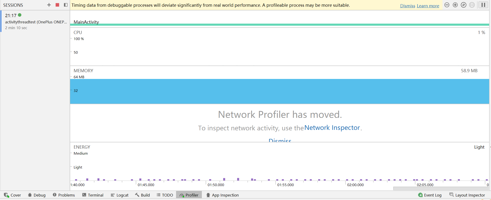
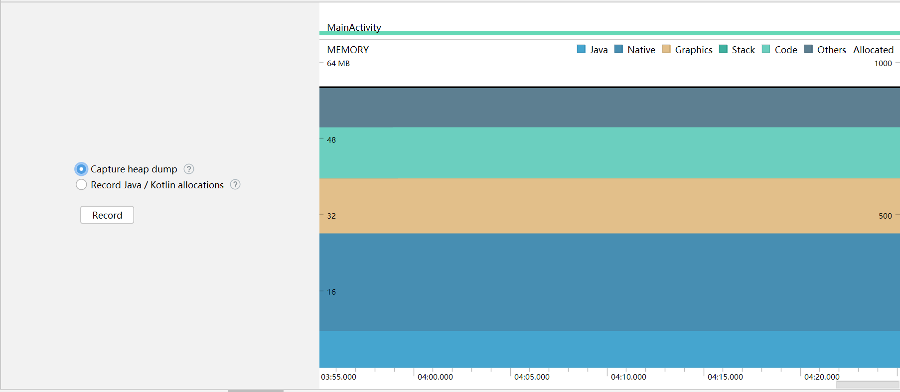

# 深入理解Android内核设计思想

# 第04章 操作系统基础

## 操作系统内存管理基础

* 虚拟内存
  * 逻辑地址
  * 线性地址
  * 物理地址
* 内存保护
* 内存分配与回收：native层与Java层
* mmap
* CoW技术

## Android中的Low Memory Killer

* Linux Kernel中的OOM Killer
  * /proc/\<pid\>/oom_score 数值越低，越晚杀死
  * /proc/\<pid\>/oom_adj   OOM权重
  * oom_score 根据 oom_adj、消耗的内存、占用的CPU时间等因素实时计算出来
  * shrinker https://tinylab.org/lwn-550463/
* Android中的OOM Killer
  * 实现了不同等级的Killer。TODO：源码分析
  * drivers/staging/android/lowmemorykiller.c
  * /sys/module/lowmemorykiller/parameters/adj
  * /sys/module/lowmemorykiller/parameters/minfree

## Android匿名共享内存

在Linux共享内存的基础之上进行的封装，并加入了更多的特性。可以将指定的物理内存分别映射到各个进程自己的虚拟地址空间中，从而便捷地实现进程间地内存共享。

* ashmem设备
  * 设备文件：/dev/ashmem
  * 设备驱动代码：drivers/staging/android/ashmem.c
  * misc字符设备，关键函数：ashmem_open()、ashmem_mmap()、ashmem_ioctl()
* 使用流程
  * 进程A打开/dev/ashmem，设置name和size，然后调用mmap()映射内存
  * 通过binder将进程A的文件描述符发送给进程B
    * binder驱动会在进程A找到文件描述符对应的`struct file`
    * 在进程B找一个空闲的文件描述符并绑定到`struct file`，然后返回B进程的文件描述符给接收者
  * 进程B调用mmap()在自己的虚拟地址空间映射同一块内存

## JNI

Java Native Interface，允许运行于JVM的Java程序去调用（反向亦然）本地代码（C、C++或汇编编写的程序）的编程框架。以下三种情况可能用到JNI：
* 实现平台相关的功能，但Java无法实现
* 复用老旧、非Java编写的库
* 高性能

实现步骤如下，demo可以参考[示例代码TestJNI](code/jni/jni.md)
1. 需要本地实现的Java方法加上`native`声明
2. javac编译
3. javah生成头文件
4. 在本地代码实现`native`方法，并编译成动态链接库
5. 在Java类中加载动态库并调用`native`方法

关于JNI的更多内容，例如JNIEnv、jni数据类型、类型签名、本地代码调用Java函数等，可以参考[官方文档](https://docs.oracle.com/javase/8/docs/technotes/guides/jni/spec/jniTOC.html)。

# 第05章 Android进程线程和程序内存优化

## Android进程和线程

* 四大组件不是进程的全部，而是进程的零件。从`AndroidManifest.xml`看，四大组件定义在application标签下面。
* 主进程由`Zygote`创建，然后会创建主线程`ActivityThread`。
* 同一个包中的组件将运行在相同的进程空间中。
* 不同包中的组件可以通过一定的方式运行在同一个进程空间中。
  * 在`AndroidManifest.xml`中，可以为`<application>`、`<activity>`、`<service>`、`<reciver>`、`<provider>`指定`android:process`属性，指明想要依存的进程环境。
* 一个Activity应用启动后至少有三个线程：一个主线程和两个Binder线程。

## Handler、MessageQueue、Runnable与Looper

Looper不断获取MessgaeQueue中的一个Messgae，然后由Handler来处理。这些对象的对应关系如下：
* 每个线程只有一个Looper
* 每个Looper只有一个MessageQueue
* 每个MessageQueue中有N个Message
* 每个Message中最多指定一个Handler来处理事件。

**Handler**

源代码：frameworks/base/core/java/android/os/Handler.java。关键成员如下。

```java
public class Handler {
    final Looper mLooper;       // 当前线程的Looper
    final MessageQueue mQueue;  // mLooper.mQueue
    final Callback mCallback;

    // 处理Message
    public void dispatchMessage(Message msg);   // 对消息进行分发
    public void handleMessage(Message msg);     // 对消息进行处理，子类需要实现

    // 发送消息
    // post系列
    final boolean post(Runnable r);
    final boolean postAtTime(Runnable r, long uptimeMillis);
    // send系列
    public final boolean sendEmptyMessage(int what);
    public final boolean sendEmptyMessageDelayed(int what, long delayMillis);
}
```

Handler主要有两个功能：
* 处理Message
* 将某个Messgae压入MessageQueue中

`Handler.dispatchMessage()`根据实际情况，调用不同的函数处理消息，按优先级排列是：
1. Message.callback -> Runnable对象
2. Handler.mCallback
3. Handler.handleMessage

**MessageQueue**

源代码：frameworks/base/core/java/android/os/MessageQueue.java。主要成员如下。

```java
public final class MessageQueue {
    // 构造函数，创建队列。会调用nativeInit()创建一个NativeMessageQueue对象
    MessageQueue(boolean quitAllowed);
    private native static long nativeInit();
    // 元素入队
    boolean enqueueMessage(Message msg, long when);
    // 元素出队
    Message next();
    // 删除元素
    void removeMessages(Handler h, int what, Object object);
    void removeMessages(Handler h, Runnable r, Object object);
    // 销毁队列
    private native static void nativeDestroy(long ptr);
}
```

**Looper**

源代码：frameworks/base/core/java/android/os/Looper.java。Looper的关键成员如下：

```java
public final class Looper {
    // 线程局部变量，存储了当前线程的Looper对象。黑魔法的关键所在。
    static final ThreadLocal<Looper> sThreadLocal = new ThreadLocal<Looper>();
    // ActivityThread线程的Looper对象
    private static Looper sMainLooper;

    // 创建Looper对象并保存到 sThreadLocal
    public static void prepare();
    private static void prepare(boolean quitAllowed);
    // ActivityThread线程专属成员函数
    public static void prepareMainLooper();

    // 获取当前线程的Looper对象
    public static @Nullable Looper myLooper();
    // 获取ActivityThread线程的Looper对象
    public static Looper getMainLooper()

    // 死循环，获取消息并处理
    public static void loop();
}
```

使用`Looper`的典型代码如下。

```java
class LooperThread extends Thread {   // Thread是Runnable对象
    public Handler mHandler;
    public void run() {
        // 1. 创建Looper对象并保存到 sThreadLocal
        Looper.prepare();
        // 2. 重写 Handler.handleMessage() 函数
        mHandler = new Handler() {
            public void handleMessage(Message msg) {
                // 处理消息的地方
            }
        };
        // 3. 开始运行Looper
        Looper.run();
    }
}
```

`Handler`有一个`mLooper`成员，但是在以上三步中，并没有看赋值。关键点就在于`Looper.sThreadLocal`。这是一个`ThreadLocal`，意味着只有本线程的代码才能够访问。在`Handler`的构造函数中，会调用`Looper.myLooper()`获取当前线程的Looper。

Looper将每个线程特有的Looper对象隐藏了起来，并提供了若干`static`函数方便开发人员调用。

## UI主线程——ActivityThread

`ActivityThread`的主要启动代码如下。与普通线程相比，差异主要在`Looper.prepareMainLooper()`。这个函数会在内部调用`Looper.prepare()`，同时将生成的线程局部变量`sThreadLocal`保存到`sMainLooper`。这样其他线程可以通过`Looper.getMainLooper()`获取`ActivityThread`线程的Looper。

```java
// 创建Looper对象并保存到sThreadLocal和sMainLooper
Looper.prepareMainLooper();
...
// 生成ActivityThread()对象，内部同时会生成 final H mH = new H()
ActivityThread thread = new ActivityThread();
thread.attach(false, startSeq);

if (sMainThreadHandler == null) {
    // 放回 mH
    sMainThreadHandler = thread.getHandler();
}
Looper.loop();
```

`Looper.loop()`的实现大致如下：

```java
public final class Looper {
    public static void loop() {
        // 获取当前线程的Looper对象
        final Looper me = myLooper();
        // 获取Looper管理的MsgQueue，这个对象在Looper的构造函数中创建
        final MessageQueue queue = me.mQueue;

        for (;;) {
            // 获取一个消息，可能会阻塞
            Message msg = queue.next();
            if (msg == null) {
                // 没有Msg，直接返回
                return;
            }
            // 调用dispatchMessage()处理Msg。msg.target实际上是一个Handler对象
            msg.target.dispatchMessage(msg);
            // 消息处理完毕，进行回收
            msg.recycleUnchecked();
        }
    }
}
```

## Thread类

线程是操作系统分配CPU资源的调度单位。从Thread类的定义看，Thread实现了Runnable，也就是说Thread是可执行代码。

```java
// libcore/ojluni/src/main/java/java/lang/Thread.java
public class Thread implements Runnable {
    ...
}

// libcore/ojluni/src/main/java/java/lang/Runnable.java
@FunctionalInterface
public interface Runnable {
    public abstract void run();
}
```

使用Thread的两种方法。

**从Thread继承**

定义一个`MyThread`继承自`Thread`，重写`run()`方法，然后调用`start()`。

```java
MyThread thr = new MyThread(...); // MyThread重写run()方法
thr.start()
```

**直接实现Runnable**

用Runnable对象构造出一个Thread对象。

```java
Thread thr = new Thread(new Runnable() {
    @Override
    public void run() {
        // code
    }
});
thr.start();
```

**Thread休眠和唤醒**

控制进程休眠和唤醒的函数有：
* `wait()`
* `notify()`
* `notifyAll()`
* `interrupt()`
* `join()`
* `sleep()`

`wait()`和`notify()`、`notifyAll()`是由`Object()`类定义的，也就是说任何类都有这三个成员函数。调用`wait()`会导致调用线程睡眠，直到其他线程调用`notify()`或`notifyAll()`，wait和notify必须使用同一个Object来调用。官方文档对`wait()`的解释如下。

> Causes the calling thread to wait until another thread calls the notify() or notifyAll() method of the object.

`interrupt()`会中断线程的执行，根据不同的情况，Thread可能会收到exception。

`join()`用来等待指定线程执行完毕。默认一直等待，也可以指定超时时间。

```java
public final void join();
public final void join(long millis, int nanos);
public final void join(long millis);

// 示例
Thread t1 = new Thread(...);
Thread t2 = new Thread(...);
t1.start();
t1.join();   // 等待t1执行完毕
t2.start();
```

`sleep()`用来睡眠指定时间。

```java
public static void sleep(long millis);
public static void sleep(long millis, int nanos);
```


## Android程序的内存管理与优化

**内存使用的限制**

进程申请的heap空间超过`dalvik.vm.heapsize`设定的值，就会触发OOM。

```shell
# Android 9.0
console:/$ getprop dalvik.vm.heapsize
256m
```

查看某个进程的内存使用情况，可以使用`dumpsys`命令。各列含义如下：
* PSS：Proportional Set Size，进程独占的内存页 + 按比例分配与其他进程共享的内存页
* Private RAM：进程独占的内存页
  * Private Dirty：必须常驻内存的页面
  * Private Clean：可能被Page Out的页面

```shell
console:/$ dumpsys meminfo 1
Applications Memory Usage (in Kilobytes):
Uptime: 208504 Realtime: 208504
                   Pss  Private  Private  SwapPss     Heap     Heap     Heap
                 Total    Dirty    Clean    Dirty     Size    Alloc     Free
                ------   ------   ------   ------   ------   ------   ------
  Native Heap      732      732        0        0        0        0        0
  Dalvik Heap        0        0        0        0        0        0        0
        Stack       20       20        0        0
    Other dev      240      192        0        0
   Other mmap      469        4       68        0
      Unknown       56       56        0        0
        TOTAL     1517     1004       68        0        0        0        0

 App Summary
                       Pss(KB)
                        ------
           Java Heap:        0
         Native Heap:      732
                Code:        0
               Stack:       20
            Graphics:        0
       Private Other:      320
              System:      445

               TOTAL:     1517       TOTAL SWAP PSS:        0
```

**Android中的内存泄露与内存监测**

在Android Studio的`Profiler`窗口下，可以为调试的APP新建一个SESSIONS，看到CPU、MEMORY、NETWORK、ENERGY的实时使用率。



点击`Memory`，则可以看到一个记录按钮，可以记录heap的转储，或`java/Kotlin`的分配情况。



记录的HEAP可以保存为`HPROF`文件，通过`hprof-conv`（在platform-tools文件夹下）工具转化为标准的`J2SE HPROF`文件后，可以用`Memory Analyzer Tool（mat）`打开。

参考：
* https://www.eclipse.org/mat/
* https://blog.csdn.net/shulianghan/article/details/106958491

# 第06章 进程间通信——Binder

`Binder`是Android系统的一种进程间通信方式。类似于网络通信，Binder客户端在与Binder服务器通信之前，需要知道Binder服务器的ID。`ServiceManager`是一个特殊的Binder服务器，其ID是0。通过ServiceManager，可以注册、查询等。

Binder涉及到Linux driver、native、framework，理解起来比较困难。

## 智能指针

智能指针是为了彻底解决使用指针的各种问题，包括没有初始化、资源泄露、反复释放、野指针等等。

```c
// 没有初始化
void *p;
/*********************/
// 资源泄露
int *p = malloc(10);
/*********************/
// 反复释放 / 野指针 1
int *p = malloc(10);
// 使用p做一些事情
free(p);
// p任然指向原来的内存块，但已经释放
// 如果再次访问，行为是未知的
free(p); // 这里会导致程序crash
/*********************/
// 野指针 2
int *p = malloc(10);
int *m = p;  // m和p指向同一个对象
free(p);
p = NULL;
// m 指向的对象已经释放了，但m不为NULL
```

观察以上示例代码，指针最主要的问题是：
* 对象在什么时候释放。
  * 当有指针指向某一个对象的时候，不能够释放；
  * 当没有指针指向对象时，必须要释放
* 释放动作需要程序员手工完成

智能指针的设计思路如下：
* 被引用的对象维护一个引用计数，当计数为0时释放
* 智能指针负责增加、减少引用计数

**强指针StrongPointer**

`sp`是一个模板类，可以指向以`LightRefBase`为基类的对象。

* sp：`system/core/libutils/include/utils/StrongPointer.h`
* 对象：以`system/core/libutils/include/utils/LightRefBase.h`为基类

强指针存在一个问题，如果两个对象互相指向对方，那么这两个对象将永远无法得到释放。

**弱指针wp**

弱指针规定：
* 强引用计数为0时，不论弱引用计数是否为0，对象都可以释放自己
* 弱指针必须升级为强指针，才能访问它所指向的目标对象

弱指针`wp`是一个模板类，可以指向以`RefBase`为基类的对象。这两个类都定义在`system/core/libutils/include/utils/RefBase.h`。

> wp的设计过于复杂，具体设计思路参考书籍。
