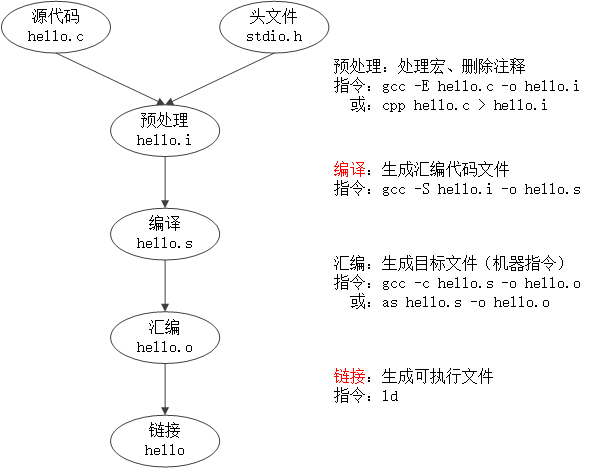
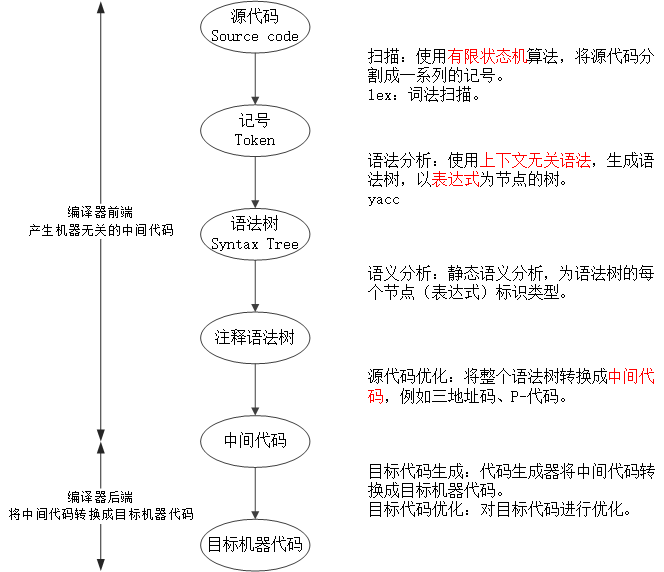

<h1 id=file_notes>
    程序员的自我修养——链接、装载与库
</h1>

<h2 id=ch_01>
    温故而知新
</h2>

* 站在程序员的角度看计算机：中央处理器CPU、内存和IO控制芯片。
* 计算机科学领域的任何问题都可以通过增加一个间接的中间层来解决。
* 操作系统：充分利用CPU。裸机、多道程序、分时系统、多任务系统。
* 虚拟内存与MMU：段页式内存管理方法。
* 多进程与多线程：创建、调度与同步（进程/线程安全）。

<h2 id=ch_02>
    编译和链接
</h2>

从源代码文件到可执行文件需要四步，本书重点介绍编译和链接两个部分。
* 预处理 Prepressing
* `编译 Compilation`
* 汇编 Assembly
* `链接 Linking`

<h3 id=compilation>编译</h3>

将高级语言翻译成机器语言。经编译产生的目标代码，其外部`符号`的地址还未确定，需要链接器`重定位`后，才能够执行。
* 扫描 Scanner
* 语法分析 Parser
* 语义分析 Semantic Analyzer
* 源代码优化 Source Code Optimizer
* 目标代码生成 Code Generator
* 目标代码优化 Final Target COde

<h3 id=linking>链接</h3>

* 符号 Symbol：在链接中，统一将函数和变量统称为符号。函数名或变量名就是`符号名`。
* 重定位 Relocation：重新计算各个符号的地址的过程。每个要被修正的地方叫一个`重定位入口`。

链接的主要过程：
* 地址和空间分配，Address and Storage Allocation
* 符号决议，Symbol Resolution
* 重定位，Relocation

静态链接的方法：
* 函数调用：调用目标函数指令的目标地址暂时搁置，待链接器确定目标函数的地址，并修改所有调用目标函数的指令。
* 变量引用：将变量的地址设置为0，待链接器确定变量的地址，并修改所有引用变量的指令。

<h2 id=ch_03>目标文件有什么</h2>

目标文件：源代码经编译后但未进行链接的中间文件
* Windows:  .o
* Linux: .obj

<h3 id=ch_3.1>目标文件(可执行文件)的格式</h3>

可执行文件、静态库(.a/.lib)、动态库(.so/.dll)以及目标文件(.o/.obj)都按照可执行文件的格式来存储。

可执行文件格式一览表：

<table>
    <tr><th>平台</th><th>格式</th><th>缩写</th></tr>
    <tr>
        <td>Windows</td>
        <td>Portable Executable</td>
        <td>PE</td>
    </tr>
    <tr>
        <td>Linux</td>
        <td>Executable Linkable Format</td>
        <td>ELF</td>
    </tr>
    <tr>
        <td>Intel/Microsoft</td>
        <td>Object Module Format</td>
        <td>OMF</td>
    </tr>
    <tr>
        <td>Unix System V Release 3</td>
        <td>Common file format</td>
        <td>COFF</td>
    </tr>
    <tr>
        <td>Unix</td>
        <td>a.out</td>
        <td></td>
    </tr>
    <tr>
        <td>MS-DOS</td>
        <td>.COM</td>
        <td></td>
    </tr>
</table>

ELF文件类型：
* 可重定位文件，`relocatable` file，例如 .o 文件。
* 可执行文件，`executable` file。
* 共享目标文件，`shared object` file，例如 .so 文件。
* 核心转储文件，core dump file。

可执行文件格式的发展：

